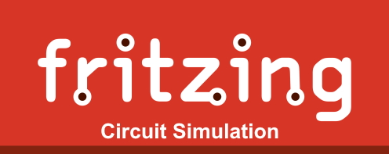
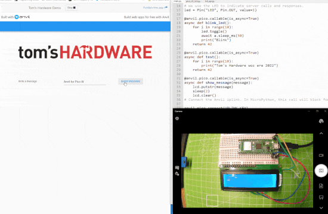
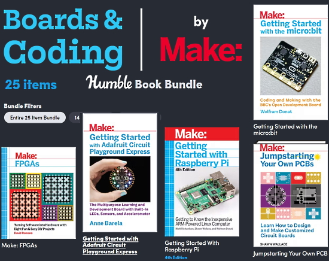
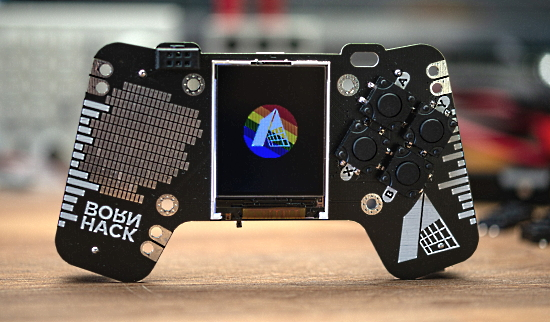
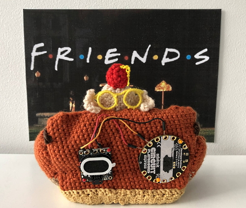
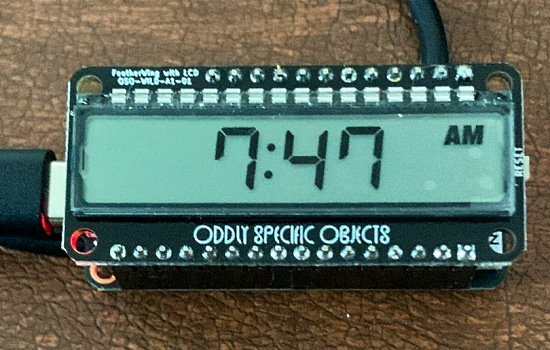
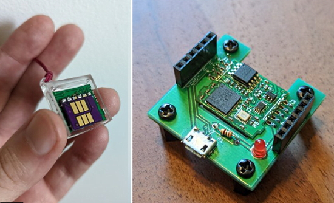
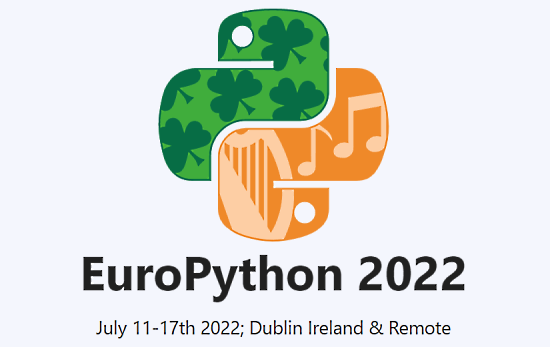
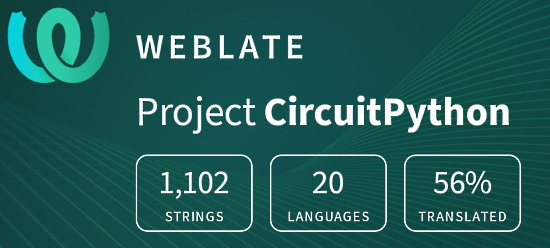

- [X] Kattni updates
- [ ] change date
- [ ] update title
- [ ] Feature story
- [ ] Update  for images
- [ ] Update ICYDNCI
- [ ] All images 550w max only
- [ ] Link "View this email in your browser."

News Sources

- [python.org](https://www.python.org/)
- [Python Insider - dev team blog](https://pythoninsider.blogspot.com/)
- [MicroPython Meetup Blog](https://melbournemicropythonmeetup.github.io/)
- [hackaday.io newest projects MicroPython](https://hackaday.io/projects?tag=micropython&sort=date) and [CircuitPython](https://hackaday.io/projects?tag=circuitpython&sort=date)
- [hackaday CircuitPython](https://hackaday.com/blog/?s=circuitpython) and [MicroPython](https://hackaday.com/blog/?s=micropython)
- [hackster.io CircuitPython](https://www.hackster.io/search?q=circuitpython&i=projects&sort_by=most_recent) and [MicroPython](https://www.hackster.io/search?q=micropython&i=projects&sort_by=most_recent)

View this email in your browser. **Warning: Flashing Imagery**

Welcome to the latest Python on Microcontrollers newsletter! 

We're on [Discord](https://discord.gg/HYqvREz), [Twitter](https://twitter.com/search?q=circuitpython&src=typed_query&f=live), and for past newsletters - [view them all here](https://www.adafruitdaily.com/category/circuitpython/). If you're reading this on the web, [subscribe here](https://www.adafruitdaily.com/). Here's the news this week:

## Headline Article

text - [site](url).

## Now you can simulate circuits with Fritzing!

After many requests and years of waiting, Fritzing finally got a simulator!

The primary purpose of the simulator is to teach electronics to beginners, and its current capabilities are very limited (only analysis of DC circuits). However, it is fully functional, easy to use, and works on the breadboard and schematic view. In addition, it performs some checks to see if any parts are working outside their specifications - [Adafruit Blog](https://blog.adafruit.com/2022/07/05/now-you-can-simulate-circuits-with-fritzing-fritzing-fritzingorg/), [announcement post](https://blog.fritzing.org/2022/06/27/Simulating-Circuits-with-Fritzing) and [download page](https://fritzing.org/download/).

## How to Run a Webserver on Raspberry Pi Pico W

The Raspberry Pi News features an article on using the new Pico W microcontroller board with WiFi as a web server. MicroPython is used to create a RESTful server to toggle an LED - [Raspberry Pi News](https://www.raspberrypi.com/news/how-to-run-a-webserver-on-raspberry-pi-pico-w/).

## Anvil Announce Secure Raspberry Pi Pico W IoT Toolkit

Anvil, a popular web applications development tool, announced a new toolkit developed for the recently released Raspberry Pi Pico W. The toolkit provides a means of communicating between a web application and a Raspberry Pi Pico W using nothing but Python. This new toolkit brings secure IoT applications for the Wi-Fi enabled Pico W, applications normally reserved for the more powerful, and hard to come by Raspberry Pi - [Tom's Hardware](https://www.tomshardware.com/news/anvil-raspberry-pi-pico-w-toolkit).

A tutorial: "How To Build a Raspberry Pi Pico W Web App With Anvil" - [Tom's Hardware](https://www.tomshardware.com/how-to/build-raspberry-pi-pico-w-web-app).

## Boards and Coding Humble Bundle

Humble Bundle, the low-cost ebook bundler, has teamed up with the makers and experts at Make: for a bundle full of how-to books and DIY guides to help you learn and get creative. Included is Make: Getting STarted with Circuit Playground Express which covers CircuitPython on this popular learning board. Pay what you wish, a portion of the profits help charity Maker Ed - [Humble Bundle](https://www.humblebundle.com/books/boards-coding-make-co-books).

## Feature

text - [site](url).

## This Week's Python Streams

Python on Hardware is all about building a cooperative ecosphere which allows contributions to be valued and to grow knowledge. Below are the streams within the last week focusing on the community.

### CircuitPython Deep Dive Stream

[This week](link), Tim streamed work on {subject}.

You can see the latest video and past videos on the Adafruit YouTube channel under the Deep Dive playlist - [YouTube](https://www.youtube.com/playlist?list=PLjF7R1fz_OOXBHlu9msoXq2jQN4JpCk8A).

### CircuitPython Parsec

John Park’s CircuitPython Parsec this week is on Pixel Framebuf - [Adafruit Blog](https://blog.adafruit.com/2022/07/08/john-parks-circuitpython-parsec-pixel-framebuf-adafruit-johnedgarpark-adafruit-circuitpython/) and [YouTube](https://youtu.be/Yt9mVLzx5s8).

Catch all the episodes in the [YouTube playlist](https://www.youtube.com/playlist?list=PLjF7R1fz_OOWFqZfqW9jlvQSIUmwn9lWr).

### The CircuitPython Show

The CircuitPython Show is an independent podcast, hosted by Paul Cutler, focusing on the people doing awesome things with CircuitPython. Each episode features Paul in conversation with a guest for a short interview – [CircuitPythonShow](https://circuitpythonshow.com/) and [Twitter](https://twitter.com/circuitpyshow).

Nicholas Tollervey joins the show in the latest episode that released Monday, July 11th. Nicholas and Paul talk about the Mu code editor, Nicholas' background in music, and the similarities in learning to code and learning to play an instrument – [Episode 13](https://circuitpythonshow.com/episodes/13).

## Project of the Week: The BornHack 2022 Game On Badge

The BornHack 2022 Game On Badge puts the focus on games. With the shape of a small controller and a color LCD screen in the middle, it’s ready for a bunch of interesting homebrew games.

This badge uses the RP2040 dual core Cortex M0+ microcontroller from Raspberry Pi and has 16MB of Quad SPI flash for code and media files. 

> The badge will have CircuitPython preloaded for a very low barrier of entry, all you need is a USB-C cable, and your favorite text editor and you are on your way to your own games.

In addition to screen and navigation buttons, there are are also a standard SAO v1.96bis connector and a Qwiic/Stemma QT connector for interfacing with modules in those eco-systems over I2C - [Adafruit Blog](https://blog.adafruit.com/2022/07/08/the-bornhack-2022-game-on-badge-circuitpython-piday-rp2040-raspberry_pi/), [GitHub](https://github.com/bornhack/badge2022) and an article on [Hackaday](https://hackaday.com/2022/07/08/badges-of-2022-bornhack/).

## News from around the web!

A crocheted Friends couch with music provided by an Adafruit Circuit Playground Express programmed in CircuitPython. An infrared remote control triggers the music - [Twitter](https://twitter.com/anu1905/status/1543982649227841538).

> Soldered up [Joey Castillo’s](https://twitter.com/josecastillo) LCD Wing, changed pin headers to socket headers on my FeatherS2, modified example code to look up NTP time, and BAM! we’re ready to play with this thing (with CircuitPython) - [Twitter](https://twitter.com/molecularist/status/1545374648002613249).

A Pico W powered weather station. 5 minute updates from the Open Wether Map API of current temp, wind speed and description - [Twitter](https://twitter.com/JohnChinner/status/1544397345483268098).

WiFi Garage Door Controller with Raspberry Pi Pico W and MicroPython - [Adafruit Blog](https://blog.adafruit.com/2022/07/08/wifi-garage-door-controller-with-raspberry-pi-pico-w-piday-raspberrypi-raspberry_pi/) and [YouTube](https://youtu.be/bIBQKl_Sots).

A design for a [HitClip cartridge](https://en.wikipedia.org/wiki/HitClips) player
- Works with all of the players the author owns
- Are easy enough to order/assemble
- Can be configured by end users

It uses a Raspberry Pi RP2040 running CircuitPython and Solder Party flexypins for programming - [Twitter](https://twitter.com/gvy_dvpont/status/1546176582854868993).

text - [site](url).

text - [site](url).

text - [site](url).

text - [site](url).

text - [site](url).

text - [site](url).

text - [site](url).

text - [site](url).

text - [site](url).

text - [site](url).

text - [site](url).

text - [site](url).

text - [site](url).

Download Vimeo video using Python - [Jakeroid's blog](https://jakeroid.com/blog/how-to-download-vimeo-video-using-python/).

text - [site](url).

text - [site](url).

PyDev of the Week:

CircuitPython Weekly Meeting for July 5, 2022 ([notes](https://github.com/adafruit/adafruit-circuitpython-weekly-meeting/blob/main/2022/2022-07-05.md)) [on YouTube](https://youtu.be/QrpmlBzY244).

**#ICYDNCI What was the most popular, most clicked link, in [last week's newsletter](https://link)? [title](url).**

## Coming Soon

text - [site](url).

text - [site](url).

## New Boards Supported by CircuitPython

The number of supported microcontrollers and Single Board Computers (SBC) grows every week. This section outlines which boards have been included in CircuitPython or added to [CircuitPython.org](https://circuitpython.org/).

This week, there were (#/no) new boards added!

- [Board name](url)
- [Board name](url)
- [Board name](url)

*Note: For non-Adafruit boards, please use the support forums of the board manufacturer for assistance, as Adafruit does not have the hardware to assist in troubleshooting.*

Looking to add a new board to CircuitPython? It's highly encouraged! Adafruit has four guides to help you do so:

- [How to Add a New Board to CircuitPython](https://learn.adafruit.com/how-to-add-a-new-board-to-circuitpython/overview)
- [How to add a New Board to the circuitpython.org website](https://learn.adafruit.com/how-to-add-a-new-board-to-the-circuitpython-org-website)
- [Adding a Single Board Computer to PlatformDetect for Blinka](https://learn.adafruit.com/adding-a-single-board-computer-to-platformdetect-for-blinka)
- [Adding a Single Board Computer to Blinka](https://learn.adafruit.com/adding-a-single-board-computer-to-blinka)

## New Learn Guides!

[LO-LA59 Droid](https://learn.adafruit.com/lola-droid) from [Noe and Pedro](https://learn.adafruit.com/u/pixil3d)

[Getting Started with Microsoft Azure and CircuitPython](https://learn.adafruit.com/getting-started-with-microsoft-azure-and-circuitpython) from [Liz Clark](https://learn.adafruit.com/u/BlitzCityDIY)

[GitHub Actions Status Tower Light](https://learn.adafruit.com/github-actions-status-tower-light) from [Kattni](https://learn.adafruit.com/u/kattni)

## CircuitPython Libraries!

CircuitPython support for hardware continues to grow. We are adding support for new sensors and breakouts all the time, as well as improving on the drivers we already have. As we add more libraries and update current ones, you can keep up with all the changes right here!

For the latest libraries, download the [Adafruit CircuitPython Library Bundle](https://circuitpython.org/libraries). For the latest community contributed libraries, download the [CircuitPython Community Bundle](https://github.com/adafruit/CircuitPython_Community_Bundle/releases).

If you'd like to contribute, CircuitPython libraries are a great place to start. Have an idea for a new driver? File an issue on [CircuitPython](https://github.com/adafruit/circuitpython/issues)! Have you written a library you'd like to make available? Submit it to the [CircuitPython Community Bundle](https://github.com/adafruit/CircuitPython_Community_Bundle). Interested in helping with current libraries? Check out the [CircuitPython.org Contributing page](https://circuitpython.org/contributing). We've included open pull requests and issues from the libraries, and details about repo-level issues that need to be addressed. We have a guide on [contributing to CircuitPython with Git and GitHub](https://learn.adafruit.com/contribute-to-circuitpython-with-git-and-github) if you need help getting started. You can also find us in the #circuitpython channels on the [Adafruit Discord](https://adafru.it/discord).

You can check out this [list of all the Adafruit CircuitPython libraries and drivers available](https://github.com/adafruit/Adafruit_CircuitPython_Bundle/blob/master/circuitpython_library_list.md). 

The current number of CircuitPython libraries is **357**!

**Updated Libraries!**

Here's this week's updated CircuitPython libraries:

 * [Adafruit_CircuitPython_Requests](https://github.com/adafruit/Adafruit_CircuitPython_Requests)
 * [Adafruit_CircuitPython_Thermistor](https://github.com/adafruit/Adafruit_CircuitPython_Thermistor)
 * [Adafruit_CircuitPython_Wiznet5k](https://github.com/adafruit/Adafruit_CircuitPython_Wiznet5k)
 * [Adafruit_CircuitPython_Display_Shapes](https://github.com/adafruit/Adafruit_CircuitPython_Display_Shapes)
 * [Adafruit_CircuitPython_BME680](https://github.com/adafruit/Adafruit_CircuitPython_BME680)
 * [Adafruit_CircuitPython_VEML7700](https://github.com/adafruit/Adafruit_CircuitPython_VEML7700)
 * [Adafruit_CircuitPython_INA219](https://github.com/adafruit/Adafruit_CircuitPython_INA219)
 * [Adafruit_CircuitPython_RFM9x](https://github.com/adafruit/Adafruit_CircuitPython_RFM9x)
 * [Adafruit_CircuitPython_SHT31D](https://github.com/adafruit/Adafruit_CircuitPython_SHT31D)
 * [Adafruit_CircuitPython_Dash_Display](https://github.com/adafruit/Adafruit_CircuitPython_Dash_Display)
 * [Adafruit_CircuitPython_OAuth2](https://github.com/adafruit/Adafruit_CircuitPython_OAuth2)
 * [Adafruit_CircuitPython_HTTPServer](https://github.com/adafruit/Adafruit_CircuitPython_HTTPServer)
 * [Adafruit_CircuitPython_ADT7410](https://github.com/adafruit/Adafruit_CircuitPython_ADT7410)
 * [Adafruit_CircuitPython_DymoScale](https://github.com/adafruit/Adafruit_CircuitPython_DymoScale)

## What’s the team up to this week?

What is the team up to this week? Let’s check in!

**Dan**

I'm continuing on plain ESP32 support for CircuitPython, and am currently debugging uploads from Thonny and other upload-over-serial file managers.

**Jeff**

text

**Kattni**

This week I published two guides: [Create an Excellent GitHub Profile with Markdown](https://learn.adafruit.com/excellent-github-profile) and [GitHub Actions Status Tower Light](https://learn.adafruit.com/github-actions-status-tower-light). 

The Create an Excellent GitHub Profile with Markdown guide covers everything you need to know to get from start to finish creating a GitHub profile that is both memorable and representative of you. Even if you're brand new to GitHub, this guide has you covered. Check it out!

The GitHub Actions Status Tower Light guide shows you how to use a USB-controlled tower light to keep track of your latest GitHub Actions run on any repo you customise the code to query. Gone are the days of keeping endless tabs open to keep up with your Actions statuses. Let the light do the work for you!

**Melissa**

I'm back this week and and have caught up on my messages. After I finished that, I started familiarizing myself with the Web Workflow that Scott has been working on and looking into an issue where the ESP Web Tool was writing to the ESP32-C3, but the written image wasn't working.

**Tim**

I did get done was on the Game & Watch Octopus game for PyGamer. The components that control the more complex behaviors in the game are complete now and the most basic game mode has been implemented. The remaining programming work is to finish up the second game mode and verify that my implementation is matching the original as best as possible, then work on the guide that will cover the process of making the game. 

**Scott**

This week I'm wrapping up WebSocket support in CircuitPython. WebSockets allow browsers to have a serial connection over the network. I've got it sending and receiving characters from a test page. I need to enhance the page a little to better handle control characters and make input simpler. Once I'm happy with it, I'll be making a PR. I'm excited to see what folks do with it.

This week I am working on the food scale project with the NAU7802. I was able to code up a UI with CircuitPython that uses two alphanumeric displays and two LED buttons. You can scroll through a menu of modes, show the weight in grams or ounces, zero out the NAU7802, fully calibrate the scale and show the current offset value. During calibration mode, you press one of the buttons to advance to the next step. Since it involves clearing the scale and placing an item with a known weight on it, I didn't want to rely on hardcoded delays. I think that this could be a good example for folks who want to build projects that need calibration or resets.

## Upcoming events!

The next MicroPython Meetup in Melbourne will be on July 27th – [Meetup](https://www.meetup.com/MicroPython-Meetup/). See the [slides](https://docs.google.com/presentation/d/e/2PACX-1vSeLbsVQnmWOr72b94Juo_Y5k_czxQuYFU_UqAkIX4tdXxYfizIqaAlxETmv-2oMTHKx_SV_Xv2669r/pub?start=false&loop=false&delayms=3000&slide=id.p) of the June 22nd meeting.

SciPy 2022, the 21st annual Scientific Computing with Python conference, will be held in Austin, Texas, USA from July 11-17, 2022. The annual SciPy Conference brings together attendees from industry, academia, and government to showcase their latest projects, learn from skilled users and developers, and collaborate on code development. The full program will consist of 2 days tutorials (July 11-12), 3 days of talks (July 13-15) and 2 days of developer sprints (July 16-17) - [SciPy 2022](https://www.scipy2022.scipy.org/).

EuroPython 2022 will be held on 11th-17th July 2022 and it will be both in person and virtual. The in-person conference will be held at [The Convention Centre](https://www.theccd.ie/) Dublin (The CCD) in Dublin, Ireland - [EuroPython 2022](https://ep2022.europython.eu/).

PyOhio is a non-profit annual Python community conference usually held in Columbus, OH. It is being held online starting Saturday, July 30, 2022. It is free to attend and welcomes anyone with an interest in Python. Content ranges from beginner to advanced and is intended to be relevant to all types of Python users: students, software professionals, scientists, hobbyists, and anyone looking to learn more - [PyOhio](https://www.pyohio.org/2022/).

**Send Your Events In**

As for other events, with the COVID pandemic, most in-person events are postponed or held online. If you know of virtual events or upcoming events, please let us know on Twitter with hashtag #CircuitPython or email to cpnews(at)adafruit(dot)com.

## Latest releases

CircuitPython's stable release is [#.#.#](https://github.com/adafruit/circuitpython/releases/latest) and its unstable release is [#.#.#-##.#](https://github.com/adafruit/circuitpython/releases). New to CircuitPython? Start with our [Welcome to CircuitPython Guide](https://learn.adafruit.com/welcome-to-circuitpython).

[2022####](https://github.com/adafruit/Adafruit_CircuitPython_Bundle/releases/latest) is the latest CircuitPython library bundle.

[v#.#.#](https://micropython.org/download) is the latest MicroPython release. Documentation for it is [here](http://docs.micropython.org/en/latest/pyboard/).

[#.#.#](https://www.python.org/downloads/) is the latest Python release. The latest pre-release version is [#.#.#](https://www.python.org/download/pre-releases/).

[#,### Stars](https://github.com/adafruit/circuitpython/stargazers) Like CircuitPython? [Star it on GitHub!](https://github.com/adafruit/circuitpython)

## Call for help -- Translating CircuitPython is now easier than ever!

One important feature of CircuitPython is translated control and error messages. With the help of fellow open source project [Weblate](https://weblate.org/), we're making it even easier to add or improve translations. 

Sign in with an existing account such as GitHub, Google or Facebook and start contributing through a simple web interface. No forks or pull requests needed! As always, if you run into trouble join us on [Discord](https://adafru.it/discord), we're here to help.

## jobs.adafruit.com - Find a dream job, find great candidates!

[jobs.adafruit.com](https://jobs.adafruit.com/) has returned and folks are posting their skills (including CircuitPython) and companies are looking for talented makers to join their companies - from Digi-Key, to Hackaday, Micro Center, Raspberry Pi and more.

**Job of the Week**

text - [Adafruit Jobs Board](https://jobs.adafruit.com/).

## NUMBER thanks!

The Adafruit Discord community, where we do all our CircuitPython development in the open, reached over NUMBER humans - thank you!  Adafruit believes Discord offers a unique way for Python on hardware folks to connect. Join today at [https://adafru.it/discord](https://adafru.it/discord).

## ICYMI - In case you missed it

Python on hardware is the Adafruit Python video-newsletter-podcast! The news comes from the Python community, Discord, Adafruit communities and more and is broadcast on ASK an ENGINEER Wednesdays. The complete Python on Hardware weekly videocast [playlist is here](https://www.youtube.com/playlist?list=PLjF7R1fz_OOXRMjM7Sm0J2Xt6H81TdDev). The video podcast is on [iTunes](https://itunes.apple.com/us/podcast/python-on-hardware/id1451685192?mt=2), [YouTube](http://adafru.it/pohepisodes), [IGTV (Instagram TV](https://www.instagram.com/adafruit/channel/)), and [XML](https://itunes.apple.com/us/podcast/python-on-hardware/id1451685192?mt=2).

[The weekly community chat on Adafruit Discord server CircuitPython channel - Audio / Podcast edition](https://itunes.apple.com/us/podcast/circuitpython-weekly-meeting/id1451685016) - Audio from the Discord chat space for CircuitPython, meetings are usually Mondays at 2pm ET, this is the audio version on [iTunes](https://itunes.apple.com/us/podcast/circuitpython-weekly-meeting/id1451685016), Pocket Casts, [Spotify](https://adafru.it/spotify), and [XML feed](https://adafruit-podcasts.s3.amazonaws.com/circuitpython_weekly_meeting/audio-podcast.xml).

## Codecademy "Learn Hardware Programming with CircuitPython"

Codecademy, an online interactive learning platform used by more than 45 million people, has teamed up with Adafruit to create a coding course, “Learn Hardware Programming with CircuitPython”. The course is now available in the [Codecademy catalog](https://www.codecademy.com/learn/learn-circuitpython?utm_source=adafruit&utm_medium=partners&utm_campaign=circuitplayground&utm_content=pythononhardwarenewsletter).

## Contribute!

The CircuitPython Weekly Newsletter is a CircuitPython community-run newsletter emailed every Tuesday. The complete [archives are here](https://www.adafruitdaily.com/category/circuitpython/). It highlights the latest CircuitPython related news from around the web including Python and MicroPython developments. To contribute, edit next week's draft [on GitHub](https://github.com/adafruit/circuitpython-weekly-newsletter/tree/gh-pages/_drafts) and [submit a pull request](https://help.github.com/articles/editing-files-in-your-repository/) with the changes. You may also tag your information on Twitter with #CircuitPython. 

Join the Adafruit [Discord](https://adafru.it/discord) or [post to the forum](https://forums.adafruit.com/viewforum.php?f=60) if you have questions.
