- [X] Kattni updates
- [ ] change date
- [ ] update title
- [ ] Feature story
- [ ] Update  for images
- [ ] Update ICYDNCI
- [ ] All images 550w max only
- [ ] Link "View this email in your browser."

News Sources

- [python.org](https://www.python.org/)
- [Python Insider - dev team blog](https://pythoninsider.blogspot.com/)
- [MicroPython Meetup Blog](https://melbournemicropythonmeetup.github.io/)
- [hackaday.io newest projects MicroPython](https://hackaday.io/projects?tag=micropython&sort=date) and [CircuitPython](https://hackaday.io/projects?tag=circuitpython&sort=date)
- [hackaday CircuitPython](https://hackaday.com/blog/?s=circuitpython) and [MicroPython](https://hackaday.com/blog/?s=micropython)
- [hackster.io CircuitPython](https://www.hackster.io/search?q=circuitpython&i=projects&sort_by=most_recent) and [MicroPython](https://www.hackster.io/search?q=micropython&i=projects&sort_by=most_recent)

View this email in your browser. **Warning: Flashing Imagery**

Welcome to the latest Python on Microcontrollers newsletter! 

We're on [Discord](https://discord.gg/HYqvREz), [Twitter](https://twitter.com/search?q=circuitpython&src=typed_query&f=live), and for past newsletters - [view them all here](https://www.adafruitdaily.com/category/circuitpython/). If you're reading this on the web, [subscribe here](https://www.adafruitdaily.com/). Here's the news this week:

## A New Version of CircuitPython 7 is Released

CircuitPython 7.3.2 is the latest bugfix revision of CircuitPython, and is a new stable release - [GitHub](https://github.com/adafruit/circuitpython/releases).

Notable changes to 7.3.2 since 7.3.1:

- Adafruit MatrixPortal: restore `traceback`, which allows `asyncio` use.
- Always release displays during deep sleep.
- Update frozen libraries: fixes issues due to older libraries on certain AirLift boards.

## 35,000 thanks!

The Adafruit Discord community, where we do all our CircuitPython development in the open, reached over 35,000 humans - thank you!  Adafruit believes Discord offers a unique way for Python on hardware folks to connect. Join today at [https://adafru.it/discord](https://adafru.it/discord).

## CircuitPython Day 2022 is August 19th!

Friday August 19 (8/19/2022) is CircuitPython Day 2022, being designated the snakiest day this year! The day highlights all things CircuitPython and Python on Hardware.

Below is the latest on events that are developing. Firm times and additional events will be posted in subsequent posts.

Special events will be held during the day – the following is a summary of events known to date:

- A panel discussion with Kattni, Jeff, Dan, and Tim. Hosted by Paul Cutler. More details coming soon!
- A chat with Jeff, Dan and Kattni. This will be the third year in a row that Jeff, Dan and Kattni will sit down and chat about their involvement and latest favorite contribution to CircuitPython.
- Special Edition CircuitPython Themed Show and Tell, hosted by Liz Clark. Details are still being solidified, but start prepping your CircuitPython related projects if you’re interested in participating!

Foamyguy CircuitPython Day Game Jam Stream:

> On CircuitPython Day, I’ll be combining 2 of my favorite things, CircuitPython and Games. I will stream the making of a CircuitPython game jam game. My goal will be to make a basic but playable and fun game within the time constraints of a few hours, and I’ll be streaming the process. After the stream, I will publish the code to the game so folks can play on their own CircuitPython devices.

11:00 AM EDT/5:00 PM CEST Reimagining IoT Deployments with CircuitPython

Adafruit’s CircuitPython has helped open up the IoT and place it within reach of developers of all types. Join us on CircuitPython Day as we look at:

- Getting Started with CircuitPython and Wireless IoT
- Walking Through a Real World CircuitPython-based IoT Project
- Remotely Updating CircuitPython Firmware with Cellular IoT(!?!)
    
Register for this particular event [here](https://register.blues.io/reimagining_iot_deployments_circuitpython).

Working with CircuitPython? Tag your projects #CircuitPythonDay2022 on social media and Adafruit will look to highlight them.

Have you events you’d like to have folks attend or have projects in the works? Email your thoughts to circuitpythonday(at)adafruit(dot)com - [Adafruit Blog](https://blog.adafruit.com/2022/07/20/announcing-circuitpython-day-2022-on-august-19th-circuitpythonday2022-circuitpython-python-copy/).

## Inside the Effort to Refine Python

[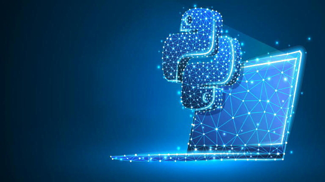](https://www.msn.com/en-us/news/technology/inside-the-effort-to-refine-one-of-the-world-s-most-popular-programming-languages/ar-AAZTHTq)

The Python Steering Council attempts to reflect the decisions of the community, weighing up all the advantages and disadvantages of each proposal.

See this article discussing the process and methodology - [TechRadar](https://www.msn.com/en-us/news/technology/inside-the-effort-to-refine-one-of-the-world-s-most-popular-programming-languages/ar-AAZTHTq).

## A Raspberry Pi Pico W Silicon-Level Teardown

[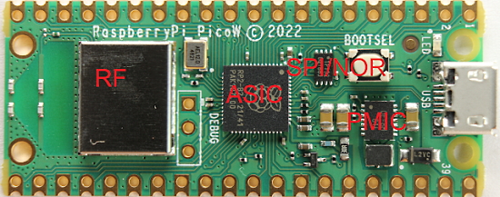](https://electronupdate.blogspot.com/2022/07/raspberry-pi-pico-w-silicon-level.html)

A good assembly to tear down on the Raspberry Pi Pico W, as it shows the typical types of integrated circuits found on a modern circuit board and some state-of-the-art packaging technologies - [YouTube](https://www.youtube.com/watch?v=dWJE1ALMlBw) and an article - [electronupdate](https://electronupdate.blogspot.com/2022/07/raspberry-pi-pico-w-silicon-level.html).

## How to Support Open Source Software and Stay Sane

How to support open-source software and stay sane. Nature explores how to support open-source software and stay sane. Releasing lab-built open-source software often involves a mountain of unforeseen work for the developers - [Adafruit Blog](https://blog.adafruit.com/2022/07/21/how-to-support-open-source-software-and-stay-sane-opensource-software-natureportfolio/) and [Nature](https://www.nature.com/articles/d41586-019-02046-0).

## Join the Online Color-Changing LED Community with Raspberry Pi Pico W

In the latest issue of HackSpace magazine, out now, they demonstrate how to add some light to electronics with the new Raspberry Pi Pico W using NeoPixels, re. WS2812B RGB smart LEDs - [Raspberry Pi News](https://www.raspberrypi.com/news/join-the-online-colour-changing-led-community-with-pico-w/).

You can check out more about HackSpace Magazine in Issue 57 (free PDF available as well as print versions) - [HackSpace Magazine](https://hackspace.raspberrypi.com/issues/57)

## This Week's Python Streams

Python on Hardware is all about building a cooperative ecosphere which allows contributions to be valued and to grow knowledge. Below are the streams within the last week focusing on the community.

### CircuitPython Deep Dive Stream

[This week](https://youtu.be/NmlNbmELQ8c), Tim streamed work on CircuitPython powered Hack Tablet.

You can see the latest video and past videos on the Adafruit YouTube channel under the Deep Dive playlist - [YouTube](https://www.youtube.com/playlist?list=PLjF7R1fz_OOXBHlu9msoXq2jQN4JpCk8A).

### CircuitPython Parsec

John Park’s CircuitPython Parsec this week was on the tio serial i/o tool - [Adafruit Blog](https://blog.adafruit.com/2022/07/22/john-parks-circuitpython-parsec-tio-serial-i-o-tool-johnedgarpark-adafruit-circuitpython/) and [YouTube](https://youtu.be/gAs45AOycrg).

Catch all the episodes in the [YouTube playlist](https://www.youtube.com/playlist?list=PLjF7R1fz_OOWFqZfqW9jlvQSIUmwn9lWr).

### The CircuitPython Show

The CircuitPython Show is an independent podcast, hosted by Paul Cutler, focusing on the people doing awesome things with CircuitPython. Each episode features Paul in conversation with a guest for a short interview – [CircuitPythonShow](https://circuitpythonshow.com/) and [Twitter](https://twitter.com/circuitpyshow).

Kevin Matocha joins the show in the latest episode and showcases some of his projects, including the HackTablet – [Show List](https://circuitpythonshow.com/episodes/all).

## Project of the Week: Driving A DC Motor With CircuitPython Tutorial

[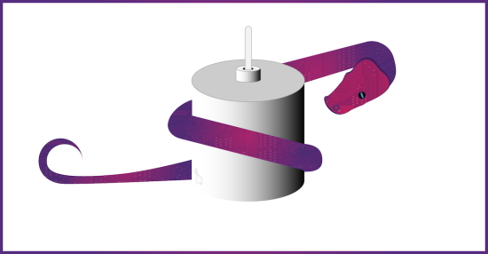](https://www.woolseyworkshop.com/2022/07/25/driving-a-dc-motor-with-circuitpython/)

Woolsey Workshop released the new Driving A DC Motor With CircuitPython tutorial.  It uses the [Adafruit_CircuitPython_Motor library](https://github.com/adafruit/Adafruit_CircuitPython_Motor) to control two motors connected to an [Adafruit DRV8833 DC/Stepper Motor Driver Breakout Board](https://www.adafruit.com/product/3297).  Various demonstration example routines are provided, from performing basic operations to using a potentiometer to control the speed of a motor.  It also explains how to detect and report faults occurring on the motor driver board. - [Woolsey Workshop](uhttps://www.woolseyworkshop.com/2022/07/25/driving-a-dc-motor-with-circuitpython/).

## News from around the web!

[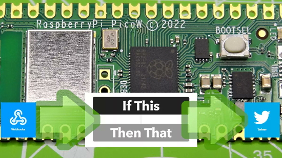](https://www.tomshardware.com/how-to/connect-raspberry-pi-pico-w-to-twitter-via-ifttt)

How to Connect Your Raspberry Pi Pico W to Twitter via IFTTT, and send sensor data to Twitter with MicroPython - [Tom's Hardware](https://www.tomshardware.com/how-to/connect-raspberry-pi-pico-w-to-twitter-via-ifttt) via [Twitter](https://twitter.com/biglesp/status/1551189106817900545).

[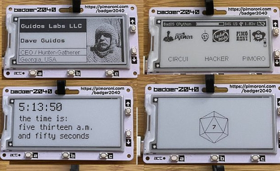](https://github.com/GuidosLabs/BadOS)

BadOS is a Badge Operating System for the Pimoroni Badger2040 Electronic Badge Using CircuitPython - [GitHub](https://github.com/GuidosLabs/BadOS) via [Twitter](https://twitter.com/daveguidos/status/1549479570264539136).

[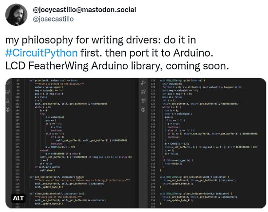](https://twitter.com/josecastillo/status/1549801050714120196)

Maker Joey Castillo writes: "My philosophy for writing (hardware) drivers: do it in CircuitPython first. Then port it to Arduino. In Arduino you can get closer to bare metal, but CircuitPython is very easy to code in; the iteration cycle is just super fast because you save your code and it's immediately running on the device" - [Twitter](https://twitter.com/josecastillo/status/1549801050714120196).

[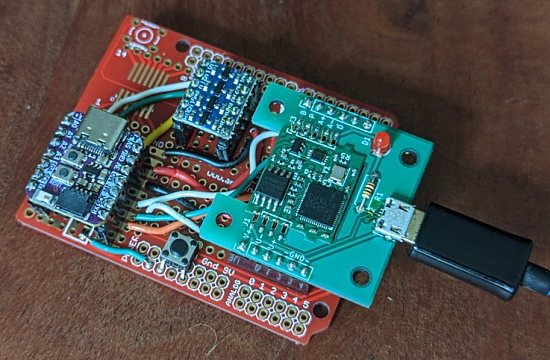](https://twitter.com/gvy_dvpont/status/1550472886250622979)

> Tryna get better at automating things, so I put together this li'l monster to program/smoke test the DIY HitClips. A Python script on the 'puter transfers all the code over USB and coordinates testing with a CircuitPython ESP32-S3 running a tiny web server - [Twitter](https://twitter.com/gvy_dvpont/status/1550472886250622979).

[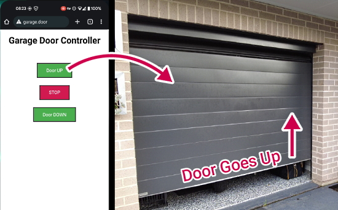](https://core-electronics.com.au/projects/wifi-garage-door-controller-with-raspberry-pi-pico-w-smart-home-project/)

A WiFi Garage Door Controller with Raspberry Pi Pico W - [Core Electronics](https://core-electronics.com.au/projects/wifi-garage-door-controller-with-raspberry-pi-pico-w-smart-home-project/) and [YouTube](https://youtu.be/bIBQKl_Sots), via [Hackaday](https://hackaday.com/2022/07/19/iot-garage-door-opener-makes-for-excellent-beginner-iot-project/).

SmallPi packs a Raspberry Pi Zero W, display, battery and more into a compact cuboid. Built using off-the-shelf add-on boards including the [Adafruit 1.3" TFT Bonnet](https://www.adafruit.com/product/4506), this compact portable squeezes a lot of functionality into a very small space - [Reddit](https://www.reddit.com/r/cyberDeck/comments/w4lx23/my_smallpi_so_small_its_hard_to_take_pictures_in/) via [hackster.io](https://www.hackster.io/news/funcron-s-smallpi-packs-a-raspberry-pi-zero-w-display-battery-and-more-into-a-compact-cuboid-151271b48b60).

Work on MicroPython libraries for M5Stack M5Stick C components - [Twitter](https://twitter.com/us1ni/status/1550032215547027457) and [GitHub](https://github.com/usini/stickc_micropython).

A Raspberry Pi Pico W rover robot with a Pimoroni Inventor 2040W and lasers with MicroPython, in progress - [Twitter](https://twitter.com/kevsmac/status/1550167543834361857).

[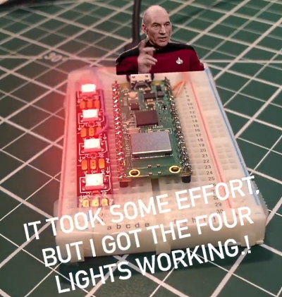](https://twitter.com/TinkeringRocks/status/1549286087566041088)

"There are 4 Lights!" NeoPixel IoT lights with Pi Pico W and MicroPython - [Twitter](https://twitter.com/TinkeringRocks/status/1549286087566041088).

[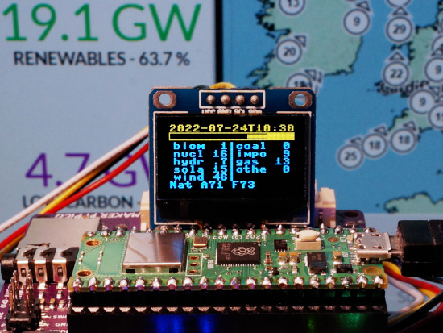](https://www.instructables.com/Electricity-Carbon-Intensity-Display-Using-Pi-Pico/)

A MicroPython program displaying [Carbon Intensity](https://www.nationalgrideso.com/future-energy/net-zero-explained/what-carbon-intensity) for electricity generation using the new Pi Pico W attached to a Cytron Maker Pi Pico Base and an SSD1306 display - [Instructables](https://www.instructables.com/Electricity-Carbon-Intensity-Display-Using-Pi-Pico/).

text - [site](url).

text - [site](url).

text - [site](url).

text - [site](url).

[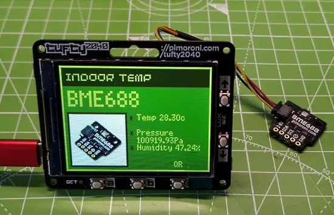](https://www.tomshardware.com/reviews/pimoroni-tufty-2040)

Pimoroni Tufty 2040 Review: Color LCDbadge with Pi inside. Make a full-color badge or display live sensor data, using an RP2040 chip - [Tom's Hardware](https://www.tomshardware.com/reviews/pimoroni-tufty-2040).

Pretty Maps in Python - [Mark's Blog](https://tech.marksblogg.com/pretty-maps-in-python.html).

[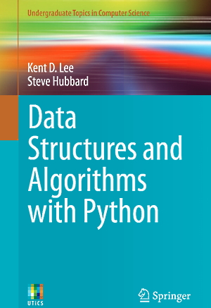](https://github.com/aibooks14/DSWA/blob/main/Data%20Structures%20%26%20Algorithms%20With%20Python.pdf)

Book: Data Structures and Algorithms in Python - [GitHub](https://github.com/aibooks14/DSWA/blob/main/Data%20Structures%20%26%20Algorithms%20With%20Python.pdf).

[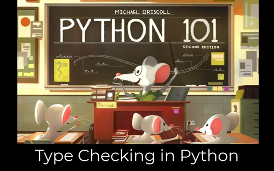](https://www.blog.pythonlibrary.org/2022/07/21/python-101-type-hinting-in-python-video/)

Python 101 - Type Hinting in Python - [Mouse vs Python](https://www.blog.pythonlibrary.org/2022/07/21/python-101-type-hinting-in-python-video/).

Convert a Python dictionary to JSON - [Twitter](https://twitter.com/m_adipola/status/1550427957776117760).

[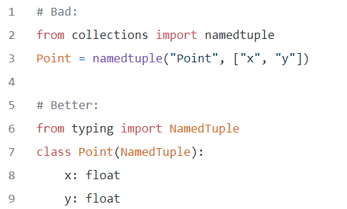](https://python.plainenglish.io/its-time-to-say-goodbye-to-these-obsolete-python-libraries-7c02aa77d84a)

It’s time to say goodbye to these obsolete Python libraries - [Pythin in Plain English](https://python.plainenglish.io/its-time-to-say-goodbye-to-these-obsolete-python-libraries-7c02aa77d84a).

PyDev of the Week:

CircuitPython Weekly Meeting for 

#ICYDNCI What was the most popular, most clicked link, in [last week's newsletter](https://www.adafruitdaily.com/2022/07/19/python-on-microcontrollers-newsletter-python-powered-lightsabers-custom-python-silicon-more-python-circuitpython-micropython-thepsf-raspberry_pi/)? [PyFive ASIC](https://www.hackster.io/mwelling/pyfive-a43a61).

## Coming Soon

text - [site](url).

text - [site](url).

## New Boards Supported by CircuitPython

The number of supported microcontrollers and Single Board Computers (SBC) grows every week. This section outlines which boards have been included in CircuitPython or added to [CircuitPython.org](https://circuitpython.org/).

This week, there were no new boards added but several are in progress.

*Note: For non-Adafruit boards, please use the support forums of the board manufacturer for assistance, as Adafruit does not have the hardware to assist in troubleshooting.*

Looking to add a new board to CircuitPython? It's highly encouraged! Adafruit has four guides to help you do so:

- [How to Add a New Board to CircuitPython](https://learn.adafruit.com/how-to-add-a-new-board-to-circuitpython/overview)
- [How to add a New Board to the circuitpython.org website](https://learn.adafruit.com/how-to-add-a-new-board-to-the-circuitpython-org-website)
- [Adding a Single Board Computer to PlatformDetect for Blinka](https://learn.adafruit.com/adding-a-single-board-computer-to-platformdetect-for-blinka)
- [Adding a Single Board Computer to Blinka](https://learn.adafruit.com/adding-a-single-board-computer-to-blinka)

## New Learn Guides!

[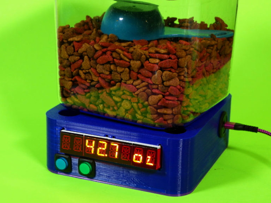](https://learn.adafruit.com/guides/latest)

[NAU7802 Pet Food Scale](https://learn.adafruit.com/nau7802-pet-food-scale) from [Liz Clark](https://learn.adafruit.com/u/BlitzCityDIY)

## CircuitPython Libraries!

CircuitPython support for hardware continues to grow. We are adding support for new sensors and breakouts all the time, as well as improving on the drivers we already have. As we add more libraries and update current ones, you can keep up with all the changes right here!

For the latest libraries, download the [Adafruit CircuitPython Library Bundle](https://circuitpython.org/libraries). For the latest community contributed libraries, download the [CircuitPython Community Bundle](https://github.com/adafruit/CircuitPython_Community_Bundle/releases).

If you'd like to contribute, CircuitPython libraries are a great place to start. Have an idea for a new driver? File an issue on [CircuitPython](https://github.com/adafruit/circuitpython/issues)! Have you written a library you'd like to make available? Submit it to the [CircuitPython Community Bundle](https://github.com/adafruit/CircuitPython_Community_Bundle). Interested in helping with current libraries? Check out the [CircuitPython.org Contributing page](https://circuitpython.org/contributing). We've included open pull requests and issues from the libraries, and details about repo-level issues that need to be addressed. We have a guide on [contributing to CircuitPython with Git and GitHub](https://learn.adafruit.com/contribute-to-circuitpython-with-git-and-github) if you need help getting started. You can also find us in the #circuitpython channels on the [Adafruit Discord](https://adafru.it/discord).

You can check out this [list of all the Adafruit CircuitPython libraries and drivers available](https://github.com/adafruit/Adafruit_CircuitPython_Bundle/blob/master/circuitpython_library_list.md). 

The current number of CircuitPython libraries is **359**!

**Updated Libraries!**

Here's this week's updated CircuitPython libraries:

 * [Adafruit_CircuitPython_SHT31D](https://github.com/adafruit/Adafruit_CircuitPython_SHT31D)
 * [Adafruit_CircuitPython_AdafruitIO](https://github.com/adafruit/Adafruit_CircuitPython_AdafruitIO)
 * [Adafruit_CircuitPython_hashlib](https://github.com/adafruit/Adafruit_CircuitPython_hashlib)
 * [Adafruit_CircuitPython_Hue](https://github.com/adafruit/Adafruit_CircuitPython_Hue)
 * [Adafruit_CircuitPython_SGP30](https://github.com/adafruit/Adafruit_CircuitPython_SGP30)
 * [Adafruit_CircuitPython_PortalBase](https://github.com/adafruit/Adafruit_CircuitPython_PortalBase)
 * [Adafruit_Python_PlatformDetect](https://github.com/adafruit/Adafruit_Python_PlatformDetect)
 * [CircuitPython_Community_Bundle](https://github.com/adafruit/CircuitPython_Community_Bundle)

## What’s the team up to this week?

What is the team up to this week? Let’s check in!

**Dan**

I released CircuitPython 7.3.2 this week. Itupdates ESP32SPI-related frozen libraries and fixes one minor MatrixPortal issue.

I'm continuing to debug ESP32SPI-related issues, which manifest with a variety of symptoms.

**Jeff**

I've been working on adding support for the original Adafruit Feather ESP32 in CircuitPython. It mostly differs from the more recent "version 2" by not having "PSRAM". This has proven not to be the easy task I hoped it would be, but hopefully with time the reason it's being tricky will come to light.

**Kattni**

I've still been working through WipperSnapper pages. Three out of four board guides are done, and the fourth one is close!

In CircuitPython news, I've been working on CircuitPython Day planning. CircuitPython Day is August 19, 2022 this year. We're still in the planning stages, but we're slowly solidifying the details. Check out what we have so far [here](https://blog.adafruit.com/2022/07/20/announcing-circuitpython-day-2022-on-august-19th-circuitpythonday2022-circuitpython-python-copy/). You can keep an eye on that post for updates, as well as the latest blog posts that will come with each update. If you have any ideas, suggestions or interest in participating, please reach out via email at [circuitpythonday@adafruit.com](mailto:circuitpythonday@adafruit.com)!

**Melissa**

This past week I have been working with the [Edge Impulse Studio](https://www.edgeimpulse.com/) software to see how it could help us with some upcoming machine learning projects.

I also had the chance to reacquaint myself with the code.circuitpython.org code that I had worked on in order to take a look at refactoring it a bit to add some more features.

**Tim**

This week I got the Hack Tablet ESP32-S3 building successfully and installed on the device. I created a multi-touch example with some colorful circles to show off the snappy capacitive touch screen. I also continued work on the Octopus game guide pages, and did some preliminary testing on some flip clock sprite assets for a new project.

**Scott**

text

**Liz**

This past week I wrapped up the [NAU7802 Pet Food Scale guide](https://learn.adafruit.com/nau7802-pet-food-scale). I'm excited about the calibration functionality and hope folks will find the code to be helpful for their own projects that require calibration for sensors. This project will also be used for another Learn Guide with Microsoft Azure that will be released soon.

I'm starting to work on a new project with the Ruiz brothers that involves AdafruitIO. We're going to build two displays with analog servos that "talk" to each other over AdafruitIO. You'll be able to position a servo on one display, it will send the message to IO, and then the second display will receive the message and update its servo position and vice versa. I have a proof of concept working right now with a QT Py ESP32-S2 and a Feather ESP32-S2 changing each other's onboard NeoPixel colors.

## Upcoming events!

The next MicroPython Meetup in Melbourne will be on July 27th – [Meetup](https://www.meetup.com/MicroPython-Meetup/). See the [slides](https://docs.google.com/presentation/d/e/2PACX-1vSeLbsVQnmWOr72b94Juo_Y5k_czxQuYFU_UqAkIX4tdXxYfizIqaAlxETmv-2oMTHKx_SV_Xv2669r/pub?start=false&loop=false&delayms=3000&slide=id.p) of the June 22nd meeting.

PyOhio is a non-profit annual Python community conference usually held in Columbus, OH. It is being held online starting Saturday, July 30, 2022. It is free to attend and welcomes anyone with an interest in Python. Content ranges from beginner to advanced and is intended to be relevant to all types of Python users: students, software professionals, scientists, hobbyists, and anyone looking to learn more - [PyOhio](https://www.pyohio.org/2022/).

Kiwi PyCon is the Python community gathered to meet and to mingle, to share experiences, to learn from each other, and to build lasting relationships. Friday the 19th to Sunday the 21st of August, 2022 all over New Zealand and beyond - [Kiwi PyCon 2022](https://kiwipycon.nz/).

PyCon UK will be returning to Cardiff City Hall from Friday 16th to Sunday 18th September 2022 - [PyCon  UK](https://2022.pyconuk.org/).

After two years in remote mode, Hackaday is very excited to announce that this year’s Hackaday Supercon will be coming back, live! Nov. 4th, 5th, and 6th in sunny Pasadena, CA for three days of hacks, talks, and socializing with the Hackaday community - [Call for proposals](https://docs.google.com/forms/d/e/1FAIpQLSffBmw2vNLZyzdKnPJhKF6u7nvYnjTZQ-lynOhhr8_S8fAd3w/viewform) and [Hackaday](https://hackaday.com/2022/07/18/the-2022-hackaday-supercon-is-on-and-the-call-for-proposals-is-open/).

**Send Your Events In**

As for other events, with the COVID pandemic, most in-person events are postponed or held online. If you know of virtual events or upcoming events, please let us know on Twitter with hashtag #CircuitPython or email to cpnews(at)adafruit(dot)com.

## Latest releases

CircuitPython's stable release is [#.#.#](https://github.com/adafruit/circuitpython/releases/latest) and its unstable release is [#.#.#-##.#](https://github.com/adafruit/circuitpython/releases). New to CircuitPython? Start with our [Welcome to CircuitPython Guide](https://learn.adafruit.com/welcome-to-circuitpython).

[2022####](https://github.com/adafruit/Adafruit_CircuitPython_Bundle/releases/latest) is the latest CircuitPython library bundle.

[v#.#.#](https://micropython.org/download) is the latest MicroPython release. Documentation for it is [here](http://docs.micropython.org/en/latest/pyboard/).

[#.#.#](https://www.python.org/downloads/) is the latest Python release. The latest pre-release version is [#.#.#](https://www.python.org/download/pre-releases/).

[#,### Stars](https://github.com/adafruit/circuitpython/stargazers) Like CircuitPython? [Star it on GitHub!](https://github.com/adafruit/circuitpython)

## Call for help -- Translating CircuitPython is now easier than ever!

[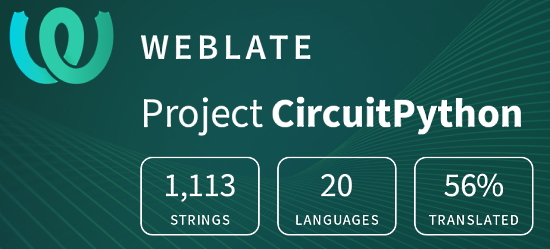](https://hosted.weblate.org/engage/circuitpython/)

One important feature of CircuitPython is translated control and error messages. With the help of fellow open source project [Weblate](https://weblate.org/), we're making it even easier to add or improve translations. 

Sign in with an existing account such as GitHub, Google or Facebook and start contributing through a simple web interface. No forks or pull requests needed! As always, if you run into trouble join us on [Discord](https://adafru.it/discord), we're here to help.

## jobs.adafruit.com - Find a dream job, find great candidates!

[jobs.adafruit.com](https://jobs.adafruit.com/) has returned and folks are posting their skills (including CircuitPython) and companies are looking for talented makers to join their companies - from Digi-Key, to Hackaday, Micro Center, Raspberry Pi and more.

**Job of the Week**

Linux System Administrator with Maker Skills - Pratt Institute - [Adafruit Jobs Board](https://jobs.adafruit.com/job/system-administrator-71101/).

## ICYMI - In case you missed it

Python on hardware is the Adafruit Python video-newsletter-podcast! The news comes from the Python community, Discord, Adafruit communities and more and is broadcast on ASK an ENGINEER Wednesdays. The complete Python on Hardware weekly videocast [playlist is here](https://www.youtube.com/playlist?list=PLjF7R1fz_OOXRMjM7Sm0J2Xt6H81TdDev). The video podcast is on [iTunes](https://itunes.apple.com/us/podcast/python-on-hardware/id1451685192?mt=2), [YouTube](http://adafru.it/pohepisodes), [IGTV (Instagram TV](https://www.instagram.com/adafruit/channel/)), and [XML](https://itunes.apple.com/us/podcast/python-on-hardware/id1451685192?mt=2).

[The weekly community chat on Adafruit Discord server CircuitPython channel - Audio / Podcast edition](https://itunes.apple.com/us/podcast/circuitpython-weekly-meeting/id1451685016) - Audio from the Discord chat space for CircuitPython, meetings are usually Mondays at 2pm ET, this is the audio version on [iTunes](https://itunes.apple.com/us/podcast/circuitpython-weekly-meeting/id1451685016), Pocket Casts, [Spotify](https://adafru.it/spotify), and [XML feed](https://adafruit-podcasts.s3.amazonaws.com/circuitpython_weekly_meeting/audio-podcast.xml).

## Codecademy "Learn Hardware Programming with CircuitPython"

Codecademy, an online interactive learning platform used by more than 45 million people, has teamed up with Adafruit to create a coding course, “Learn Hardware Programming with CircuitPython”. The course is now available in the [Codecademy catalog](https://www.codecademy.com/learn/learn-circuitpython?utm_source=adafruit&utm_medium=partners&utm_campaign=circuitplayground&utm_content=pythononhardwarenewsletter).

## Contribute!

The CircuitPython Weekly Newsletter is a CircuitPython community-run newsletter emailed every Tuesday. The complete [archives are here](https://www.adafruitdaily.com/category/circuitpython/). It highlights the latest CircuitPython related news from around the web including Python and MicroPython developments. To contribute, edit next week's draft [on GitHub](https://github.com/adafruit/circuitpython-weekly-newsletter/tree/gh-pages/_drafts) and [submit a pull request](https://help.github.com/articles/editing-files-in-your-repository/) with the changes. You may also tag your information on Twitter with #CircuitPython. 

Join the Adafruit [Discord](https://adafru.it/discord) or [post to the forum](https://forums.adafruit.com/viewforum.php?f=60) if you have questions.
