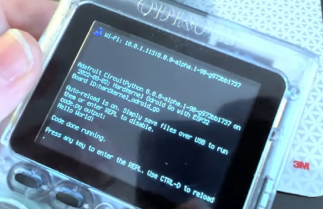
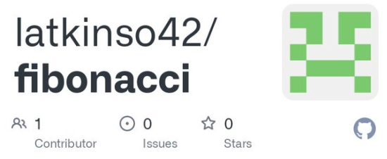
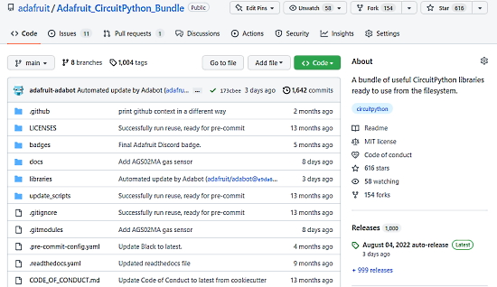
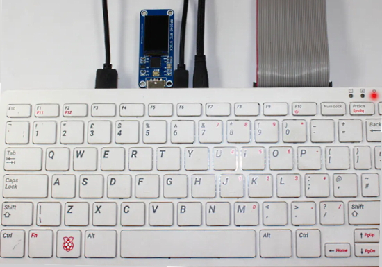
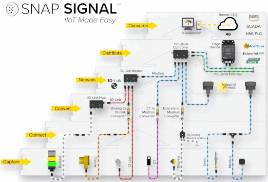
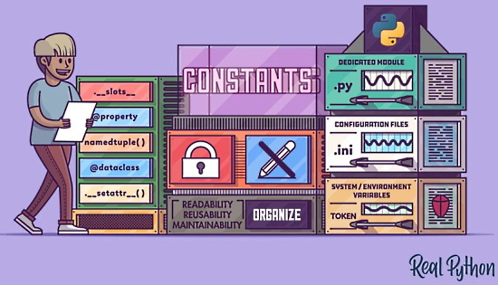

- [ ] Kattni updates
- [ ] change date
- [ ] update title
- [ ] Feature story
- [ ] Update  for images
- [ ] Update ICYDNCI
- [ ] All images 550w max only
- [ ] Link "View this email in your browser."

News Sources

- [python.org](https://www.python.org/)
- [Python Insider - dev team blog](https://pythoninsider.blogspot.com/)
- [MicroPython Meetup Blog](https://melbournemicropythonmeetup.github.io/)
- [hackaday.io newest projects MicroPython](https://hackaday.io/projects?tag=micropython&sort=date) and [CircuitPython](https://hackaday.io/projects?tag=circuitpython&sort=date)
- [hackaday CircuitPython](https://hackaday.com/blog/?s=circuitpython) and [MicroPython](https://hackaday.com/blog/?s=micropython)
- [hackster.io CircuitPython](https://www.hackster.io/search?q=circuitpython&i=projects&sort_by=most_recent) and [MicroPython](https://www.hackster.io/search?q=micropython&i=projects&sort_by=most_recent)

View this email in your browser. **Warning: Flashing Imagery**

Welcome to the latest Python on Microcontrollers newsletter! 

We're on [Discord](https://discord.gg/HYqvREz), [Twitter](https://twitter.com/search?q=circuitpython&src=typed_query&f=live), and for past newsletters - [view them all here](https://www.adafruitdaily.com/category/circuitpython/). If you're reading this on the web, [subscribe here](https://www.adafruitdaily.com/). Here's the news this week:

## Web Workflow Added for ESP32 Programming in CircuitPython

Of all the great microcontrollers on the market today, ESP32 (the original, no suffix) had been left out of CircuitPython due to not having native USB, allowing it to act like a flash drive for code. Scott and Dan just merged in Web (WiFi) Workflow for CircuitPython 8.0.0 alpha and ESP32 which means that it’s now incredibly easy to start working with chips like the ESP32 which have excellent WiFi networking but do not have USB mass-storage - [Adafruit Blog](https://blog.adafruit.com/2022/08/07/a-first-test-of-circuitpython-on-esp32-web-workflow/).

Now when we visit the IP address displayed on the odroid’s screen, it will let us immediately go to the built-in serial console that is also web-compatible! Any repl commands are echoed on the display as well. Next up will be uploading files – [Video](https://youtu.be/ezOkfYve1ow).

## CircuitPython Day 2022 - August 19th

Friday August 19 (8/19/2022) is CircuitPython Day 2022, being designated the snakiest day this year! The day highlights all things CircuitPython and Python on Hardware.

Below is the latest on events:

**Celebrating Code & Community: A CircuitPython Day Panel Discussion**

Panelists take a look back at CircuitPython’s accomplishments over the past year, look forward to what is to come, community Q&A, and more. 
Hosted by: Paul Cutler

**CircuitPython Day Chat with Kattni, Jeff and Dan**

Kattni, Jeff and Dan get together for the third year in a row to talk about what was the most interesting thing each of them has done with CircuitPython over the last year.

**Special Edition CircuitPython-Themed Show & Tell**

Liz Clark hosts a special edition of Show & Tell that focuses on CircuitPython-themed projects.

**CircuitPython 8 Preview**

Scott will cover all of the changes upcoming in CircuitPython 8

**CURRENT SCHEDULE – all times are US Eastern:**

* 11:00 ET – Celebrating Code & Community: A CircuitPython Day Panel Discussion
* 13:00 ET – CircuitPython Project Build with Maker Melissa
* 14:00 ET – Special Edition CircuitPython Themed Show and Tell
* 15:30 ET – CircuitPython 8 Preview
* 16:00 ET – CircuitPython Day Chat with Kattni, Jeff and Dan
* 18:00 ET – Foamyguy CircuitPython Day Game Jam Stream
* 11:00 AM EDT/17:00 PM CEST Reimagining IoT Deployments with CircuitPython

Adafruit’s CircuitPython has helped open up the IoT and place it within reach of developers of all types. Join Blues Wireless on CircuitPython Day as they look at:

* Getting Started with CircuitPython and Wireless IoT
* Walking Through a Real World CircuitPython-based IoT Project
* Remotely Updating CircuitPython Firmware with Cellular IoT(!?!)

Register for this particular event [here](https://register.blues.io/reimagining_iot_deployments_circuitpython).

Working with CircuitPython? Tag your projects #CircuitPythonDay2022 on social media and Adafruit will look to highlight them - [Adafruit Blog](https://blog.adafruit.com/2022/08/04/announcing-circuitpython-day-2022-on-august-19th-circuitpythonday2022-circuitpython-python-copy-copy-copy/).

## The Fibonacci Adventure in Extending CircuitPython

Before actually contributing to CircuitPython, Lee Atkinson thought to try a toy extension. A non-hardware related Fibonacci Generator for the RaspberryPi Pico. The process is excellent at learning the methodologies on how to add to CircuitPython - [GitHub](https://github.com/latkinso42/fibonacci/blob/Main/FibonacciStoryFULL.md).
  
## 1,000 CircuitPython Library Bundle Releases

Woohoo! we were just going to download the library bundle for a project and noticed....we have reached [1000 releases](https://github.com/adafruit/Adafruit_CircuitPython_Bundle)! We do a library bundle release nightly on every detected change - e.g. new version - of a submodule-d CircuitPython library. Psst! Did you know we have reached [300 official adafruit-written CircuitPython libraries](https://blog.adafruit.com/2022/08/01/milestone-300-adafruit-provided-open-source-circuitpython-libraries-available-circuitpython-opensource-adafruit/)? 

Anyways, the bundle is great if you want to make sure you have all the latest libraries, it's also used by tools like [BundleFly](https://blog.adafruit.com/2021/05/03/what-is-bundlefly/) and [PyLeap](https://blog.adafruit.com/2022/01/04/pyleap-is-officially-available-in-the-app-store/) to get all the dependancies you need to make your project go.

## Feature

text - [site](url).

## This Week's Python Streams

Python on Hardware is all about building a cooperative ecosphere which allows contributions to be valued and to grow knowledge. Below are the streams within the last week focusing on the community.

### CircuitPython Deep Dive Stream

[This week](link), Tim streamed work on {subject}.

You can see the latest video and past videos on the Adafruit YouTube channel under the Deep Dive playlist - [YouTube](https://www.youtube.com/playlist?list=PLjF7R1fz_OOXBHlu9msoXq2jQN4JpCk8A).

### CircuitPython Parsec

John Park’s CircuitPython Parsec is off this week. Catch all the episodes in the [YouTube playlist](https://www.youtube.com/playlist?list=PLjF7R1fz_OOWFqZfqW9jlvQSIUmwn9lWr).

### The CircuitPython Show

The CircuitPython Show is an independent podcast, hosted by Paul Cutler, focusing on the people doing awesome things with CircuitPython. Each episode features Paul in conversation with a guest for a short minute interview – [CircuitPythonShow](https://circuitpythonshow.com/) and [Twitter](https://twitter.com/circuitpyshow).

Joshua Lowe guests in the newest episode released August 8th. Josh shares his project EduBlocks, which helps new programmers bridge the gap between Scratch and Python. – [Show List](https://circuitpythonshow.com/episodes/all).

## Project of the Week

text - [site](url).

## News from around the web!

text - [site](url).

text - [site](url).

Creating a Real-time clock on EncroPi using MicroPython - [Adafruit Blog](https://blog.adafruit.com/2022/08/05/creating-a-real-time-clock-on-encropi-using-micropython-raspberry_pi-piday-raspberrypi/) and [hackster.io](https://www.hackster.io/kamaluddinkhan/creating-a-real-time-clock-on-encropi-using-micropython-176fe4).

The Snap DXM Controller can be programmed using action rules, read/write maps, a ScriptBasic program, or a MicroPython program - [Digi-Key](https://www.digikey.com/en/product-highlight/b/banner-engineering/snapsignal-iiot-made-easy) and [Banner](https://info.bannerengineering.com/cs/groups/public/documents/literature/b_51151351.pdf) (PDF).

text - [site](url).

text - [site](url).

text - [site](url).

text - [site](url).

text - [site](url).

text - [site](url).

text - [site](url).

text - [site](url).

text - [site](url).

text - [site](url).

text - [site](url).

text - [site](url).

text - [site](url).

lowbar is a blazing fast module with zero dependencies for displaying a progress bar in the terminal. It's extremely simple with a low amount of code - [GitHub](https://github.com/AnnikaV9/lowbar).

Choose the Right Python Concurrency API - [SuperFastPython](https://superfastpython.com/python-concurrency-choose-api/).

Python Constants: Improve Your Code's Maintainability - [Real Python](https://realpython.com/python-constants/).

PyDev of the Week:

CircuitPython Weekly Meeting for 

**#ICYDNCI What was the most popular, most clicked link, in [last week's newsletter](https://link)? [title](url).**

## Coming Soon

text - [site](url).

text - [site](url).

## New Boards Supported by CircuitPython

The number of supported microcontrollers and Single Board Computers (SBC) grows every week. This section outlines which boards have been included in CircuitPython or added to [CircuitPython.org](https://circuitpython.org/).

This week, there were (#/no) new boards added!

- [Board name](url)
- [Board name](url)
- [Board name](url)

*Note: For non-Adafruit boards, please use the support forums of the board manufacturer for assistance, as Adafruit does not have the hardware to assist in troubleshooting.*

Looking to add a new board to CircuitPython? It's highly encouraged! Adafruit has four guides to help you do so:

- [How to Add a New Board to CircuitPython](https://learn.adafruit.com/how-to-add-a-new-board-to-circuitpython/overview)
- [How to add a New Board to the circuitpython.org website](https://learn.adafruit.com/how-to-add-a-new-board-to-the-circuitpython-org-website)
- [Adding a Single Board Computer to PlatformDetect for Blinka](https://learn.adafruit.com/adding-a-single-board-computer-to-platformdetect-for-blinka)
- [Adding a Single Board Computer to Blinka](https://learn.adafruit.com/adding-a-single-board-computer-to-blinka)

## New Learn Guides!

[title](url) from [name](url)

[title](url) from [name](url)

[title](url) from [name](url)

## Updated Learn Guides!

[title](url) from [name](url)

## CircuitPython Libraries!

CircuitPython support for hardware continues to grow. We are adding support for new sensors and breakouts all the time, as well as improving on the drivers we already have. As we add more libraries and update current ones, you can keep up with all the changes right here!

For the latest libraries, download the [Adafruit CircuitPython Library Bundle](https://circuitpython.org/libraries). For the latest community contributed libraries, download the [CircuitPython Community Bundle](https://github.com/adafruit/CircuitPython_Community_Bundle/releases).

If you'd like to contribute, CircuitPython libraries are a great place to start. Have an idea for a new driver? File an issue on [CircuitPython](https://github.com/adafruit/circuitpython/issues)! Have you written a library you'd like to make available? Submit it to the [CircuitPython Community Bundle](https://github.com/adafruit/CircuitPython_Community_Bundle). Interested in helping with current libraries? Check out the [CircuitPython.org Contributing page](https://circuitpython.org/contributing). We've included open pull requests and issues from the libraries, and details about repo-level issues that need to be addressed. We have a guide on [contributing to CircuitPython with Git and GitHub](https://learn.adafruit.com/contribute-to-circuitpython-with-git-and-github) if you need help getting started. You can also find us in the #circuitpython channels on the [Adafruit Discord](https://adafru.it/discord).

You can check out this [list of all the Adafruit CircuitPython libraries and drivers available](https://github.com/adafruit/Adafruit_CircuitPython_Bundle/blob/master/circuitpython_library_list.md). 

The current number of Adafruit and community contributed CircuitPython libraries is **###**!

**New Libraries!**

Here's this week's new CircuitPython libraries:

* [library](url)

**Updated Libraries!**

Here's this week's updated CircuitPython libraries:

* [library](url)

## What’s the team up to this week?

What is the team up to this week? Let’s check in!

**Dan**

I'm continuing to work on the plain ESP32 port. I got the port working on ESP32 boards with no PSRAM, and am now incorporating changes Scott made to determine flash and PSRAM pin assignments at run-time.

Once I finish on the ESP32, I will go back to addressing issues we want to fix for the 8.0.0 release.

**Jeff**

I've gotten quite far with the new camera module for the Espressif port. It works on boards with ESP32, ESP32-S2, and ESP32-S3 microcontrollers. However, some more features need to be added before it's at parity with the previous code.

**Kattni**

This week I published the [Adafruit PCF8574 I2C Expander](https://learn.adafruit.com/adafruit-pcf8574) guide. It has everything you need to get started with this breakout, including examples in CircuitPython and Arduino. If you picked up one of these expanders, check out the guide!

I also put together the video content schedule for CircuitPython Day! Keep an eye out for that on the Adafruit blog.

**Melissa**

This past week I was out sick for a couple of days, but for the days I was able to work, I was able to finish refactoring the code structure of the [code.circuitpython.org](https://code.circuitpython.org) website. After that was made live, I started refactoring the UI enough to start adding Web Workflow functionality.

**Tim**

I tested a fix for Ethernet connections with the Wiznet5k library. I investigated a difference around the tuple constructor having different behavior in CPython and CircuitPython / Micropython. I continued work on the Octopus guide, and made some final cleanups to a few of the sprite assets. I did the drawing for the initial selections for the Hack Tablet giveaway this week. The remaining winners will be selected 8/26.

**Scott**

This week I added two more ESP32 boards to CircuitPython and fixed some issues with them. I enabled the web workflow on the Feather ESP32 v2 as well. After that, I've been refining the title bar to add info about the running Python code, exceptions and the BLE workflow state. It adds a bit of code to the smallest builds so my next task is to figure out how to make it all fit.

**Liz**

This past week I worked on the (CircuitPython MIDI to CV Skull project)[https://learn.adafruit.com/circuitpython-midi-to-cv-skull]. It's a fun little project that helps to integrate MIDI into your Eurorack or CV controlled synth setup. Big shout out to (Thea)[https://thea.codes/] and her (CircuitPython Winterbloom Eurorack modules)[https://winterbloom.com/about]. Her work is a huge inspiration for a lot of the music tech CircuitPython projects I've worked on.

Next up I'll be working on some new product documentation and a fun collab with the Ruiz brothers.

## Upcoming events!

The next MicroPython Meetup in Melbourne will be on July 27th – [Meetup](https://www.meetup.com/MicroPython-Meetup/). See the [slides](https://docs.google.com/presentation/d/e/2PACX-1vSeLbsVQnmWOr72b94Juo_Y5k_czxQuYFU_UqAkIX4tdXxYfizIqaAlxETmv-2oMTHKx_SV_Xv2669r/pub?start=false&loop=false&delayms=3000&slide=id.p) of the June 22nd meeting.

PyOhio is a non-profit annual Python community conference usually held in Columbus, OH. It is being held online starting Saturday, July 30, 2022. It is free to attend and welcomes anyone with an interest in Python. Content ranges from beginner to advanced and is intended to be relevant to all types of Python users: students, software professionals, scientists, hobbyists, and anyone looking to learn more - [PyOhio](https://www.pyohio.org/2022/).

Kiwi PyCon is the Python community gathered to meet and to mingle, to share experiences, to learn from each other, and to build lasting relationships. Friday the 19th to Sunday the 21st of August, 2022 all over New Zealand and beyond - [Kiwi PyCon 2022](https://kiwipycon.nz/).

PyCon UK will be returning to Cardiff City Hall from Friday 16th to Sunday 18th September 2022 - [PyCon  UK](https://2022.pyconuk.org/).

After two years in remote mode, Hackaday is very excited to announce that this year’s Hackaday Supercon will be coming back, live! Nov. 4th, 5th, and 6th in sunny Pasadena, CA for three days of hacks, talks, and socializing with the Hackaday community - [Call for proposals](https://docs.google.com/forms/d/e/1FAIpQLSffBmw2vNLZyzdKnPJhKF6u7nvYnjTZQ-lynOhhr8_S8fAd3w/viewform) and [Hackaday](https://hackaday.com/2022/07/18/the-2022-hackaday-supercon-is-on-and-the-call-for-proposals-is-open/).

**Send Your Events In**

As for other events, with the COVID pandemic, most in-person events are postponed or held online. If you know of virtual events or upcoming events, please let us know on Twitter with hashtag #CircuitPython or email to cpnews(at)adafruit(dot)com.

## Latest releases

CircuitPython's stable release is [#.#.#](https://github.com/adafruit/circuitpython/releases/latest) and its unstable release is [#.#.#-##.#](https://github.com/adafruit/circuitpython/releases). New to CircuitPython? Start with our [Welcome to CircuitPython Guide](https://learn.adafruit.com/welcome-to-circuitpython).

[2022####](https://github.com/adafruit/Adafruit_CircuitPython_Bundle/releases/latest) is the latest CircuitPython library bundle.

[v#.#.#](https://micropython.org/download) is the latest MicroPython release. Documentation for it is [here](http://docs.micropython.org/en/latest/pyboard/).

[#.#.#](https://www.python.org/downloads/) is the latest Python release. The latest pre-release version is [#.#.#](https://www.python.org/download/pre-releases/).

[#,### Stars](https://github.com/adafruit/circuitpython/stargazers) Like CircuitPython? [Star it on GitHub!](https://github.com/adafruit/circuitpython)

## Call for help -- Translating CircuitPython is now easier than ever!

One important feature of CircuitPython is translated control and error messages. With the help of fellow open source project [Weblate](https://weblate.org/), we're making it even easier to add or improve translations. 

Sign in with an existing account such as GitHub, Google or Facebook and start contributing through a simple web interface. No forks or pull requests needed! As always, if you run into trouble join us on [Discord](https://adafru.it/discord), we're here to help.

## jobs.adafruit.com - Find a dream job, find great candidates!

[jobs.adafruit.com](https://jobs.adafruit.com/) has returned and folks are posting their skills (including CircuitPython) and companies are looking for talented makers to join their companies - from Digi-Key, to Hackaday, Micro Center, Raspberry Pi and more.

**Job of the Week**

text - [Adafruit Jobs Board](https://jobs.adafruit.com/).

## NUMBER thanks!

The Adafruit Discord community, where we do all our CircuitPython development in the open, reached over NUMBER humans - thank you!  Adafruit believes Discord offers a unique way for Python on hardware folks to connect. Join today at [https://adafru.it/discord](https://adafru.it/discord).

## ICYMI - In case you missed it

Python on hardware is the Adafruit Python video-newsletter-podcast! The news comes from the Python community, Discord, Adafruit communities and more and is broadcast on ASK an ENGINEER Wednesdays. The complete Python on Hardware weekly videocast [playlist is here](https://www.youtube.com/playlist?list=PLjF7R1fz_OOXRMjM7Sm0J2Xt6H81TdDev). The video podcast is on [iTunes](https://itunes.apple.com/us/podcast/python-on-hardware/id1451685192?mt=2), [YouTube](http://adafru.it/pohepisodes), [IGTV (Instagram TV](https://www.instagram.com/adafruit/channel/)), and [XML](https://itunes.apple.com/us/podcast/python-on-hardware/id1451685192?mt=2).

[The weekly community chat on Adafruit Discord server CircuitPython channel - Audio / Podcast edition](https://itunes.apple.com/us/podcast/circuitpython-weekly-meeting/id1451685016) - Audio from the Discord chat space for CircuitPython, meetings are usually Mondays at 2pm ET, this is the audio version on [iTunes](https://itunes.apple.com/us/podcast/circuitpython-weekly-meeting/id1451685016), Pocket Casts, [Spotify](https://adafru.it/spotify), and [XML feed](https://adafruit-podcasts.s3.amazonaws.com/circuitpython_weekly_meeting/audio-podcast.xml).

## Codecademy "Learn Hardware Programming with CircuitPython"

Codecademy, an online interactive learning platform used by more than 45 million people, has teamed up with Adafruit to create a coding course, “Learn Hardware Programming with CircuitPython”. The course is now available in the [Codecademy catalog](https://www.codecademy.com/learn/learn-circuitpython?utm_source=adafruit&utm_medium=partners&utm_campaign=circuitplayground&utm_content=pythononhardwarenewsletter).

## Contribute!

The CircuitPython Weekly Newsletter is a CircuitPython community-run newsletter emailed every Tuesday. The complete [archives are here](https://www.adafruitdaily.com/category/circuitpython/). It highlights the latest CircuitPython related news from around the web including Python and MicroPython developments. To contribute, edit next week's draft [on GitHub](https://github.com/adafruit/circuitpython-weekly-newsletter/tree/gh-pages/_drafts) and [submit a pull request](https://help.github.com/articles/editing-files-in-your-repository/) with the changes. You may also tag your information on Twitter with #CircuitPython. 

Join the Adafruit [Discord](https://adafru.it/discord) or [post to the forum](https://forums.adafruit.com/viewforum.php?f=60) if you have questions.
