- [ ] Kattni updates
- [ ] change date
- [ ] update title
- [ ] Feature story
- [ ] Update  for images
- [ ] Update ICYDNCI
- [ ] All images 550w max only
- [ ] Link "View this email in your browser."

News Sources

- [python.org](https://www.python.org/)
- [Python Insider - dev team blog](https://pythoninsider.blogspot.com/)
- [MicroPython Meetup Blog](https://melbournemicropythonmeetup.github.io/)
- [hackaday.io newest projects MicroPython](https://hackaday.io/projects?tag=micropython&sort=date) and [CircuitPython](https://hackaday.io/projects?tag=circuitpython&sort=date)
- [hackaday CircuitPython](https://hackaday.com/blog/?s=circuitpython) and [MicroPython](https://hackaday.com/blog/?s=micropython)
- [hackster.io CircuitPython](https://www.hackster.io/search?q=circuitpython&i=projects&sort_by=most_recent) and [MicroPython](https://www.hackster.io/search?q=micropython&i=projects&sort_by=most_recent)

View this email in your browser. **Warning: Flashing Imagery**

Welcome to the latest Python on Microcontrollers newsletter! 

We're on [Discord](https://discord.gg/HYqvREz), [Twitter](https://twitter.com/search?q=circuitpython&src=typed_query&f=live), and for past newsletters - [view them all here](https://www.adafruitdaily.com/category/circuitpython/). If you're reading this on the web, [subscribe here](https://www.adafruitdaily.com/). Here's the news this week:

## CircuitPython 8.0.0 Beta 0 Released! 

[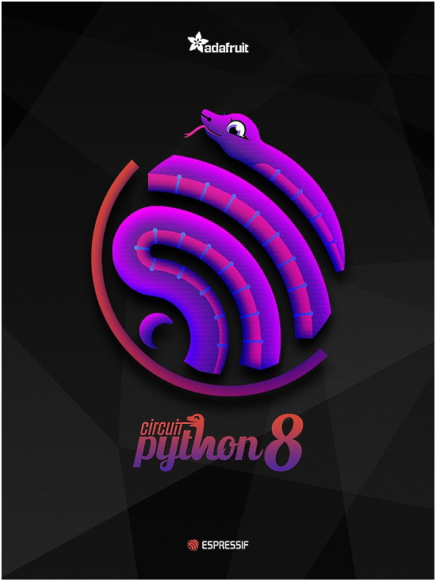](https://blog.adafruit.com/2022/08/18/circuitpython-8-0-0-beta-0-released/)

CircuitPython 8.0.0-beta.0, a beta release for 8.0.0, is now out. It is relatively stable, but there will be further additions and fixes before final release - [Adafruit Blog](https://blog.adafruit.com/2022/08/18/circuitpython-8-0-0-beta-0-released/) and [GitHub](https://github.com/adafruit/circuitpython/releases/tag/8.0.0-beta.0).

**Notable changes to 8.0.0 since 7.3.0**

* Added WiFi workflow with browser-based device discovery, filesystem browsing, upload, download, file editing, serial/REPL connection.
* Added a one-line status bar, which displays connection status, last exception, and version on a terminal window title or on the top line of an attached display. Support for status bar display is also being added to the Mu and Thonny editors.
* `.env` file in CIRCUITPY specifies WiFi connection parameters, BLE name, and other startup values.
* Revised Espressif camera support, now available on ESP32, ESP32-S2, and ESP32-S3.
* Added `TileGrid.contains()`.
* `AnalogIn` values are full range from 0 to 65535, instead of having zeros on low-order bits.
* `OneWire` is only in `onewireio`, and is no longer in busio or bitbangio.
* `gamepadshift` has been removed: use `keypad.ShiftRegisterKeys` instead.
* `dotenv` support: `os.getenv()` values can be set in the `.env` file.
* `PulseOut` no longer accepts a `PWMOut`. Use a `Pin` instead.
* `i2ctarget.I2CTarget` is the new name for `i2cperipheral.I2CPeripheral`. Accept both for now. `I2CPeripheral` will be removed in 9.0.0.
* Auto-brightness support in `displayio` and `framebufferio` has been removed. It was never implemented completely.
* Restored `rainbowio` and `onewireio` to a number of boards.
* Print out whole-number floats exactly and correctly.
* Enabled `collections.deque` on most builds.

**Download from circuitpython.org**

Firmware downloads are available from the [downloads page](https://circuitpython.org/downloads) on [circuitpython.org](https://circuitpython.org/). The site makes it easy to select the correct file and language for your board.

## Feature

text - [site](url).

## Cheat Sheets

One of the more popular things this newsletter links to are cheat sheets - pages to help folks with some part of programming or operating systems. Here are several found over the last week:

[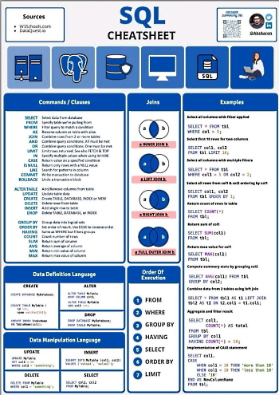](https://twitter.com/haneeni61853819/status/1560085069158563840)

SQL CheetSheet - [Twitter](https://twitter.com/haneeni61853819/status/1560085069158563840).

[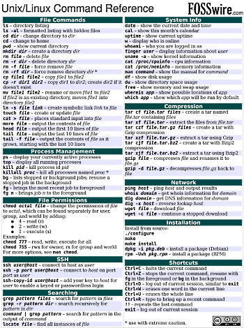](https://twitter.com/Shubham_pen/status/1559551805884809216)

UNIX/Linux Command Cheat Sheet - [Twitter via fosswire.com](https://twitter.com/Shubham_pen/status/1559551805884809216).

[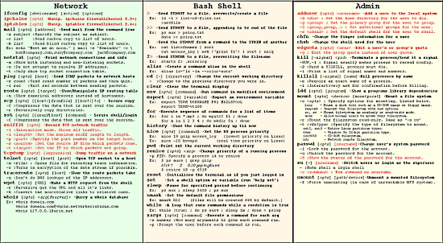](https://twitter.com/Manish_kumar3_1/status/1560911743265562624)

Best of Linux Commands Cheat Sheet - [Twitter](https://twitter.com/Manish_kumar3_1/status/1560911743265562624).

## CircuitPython Adds RP2040 I2C Target Support

[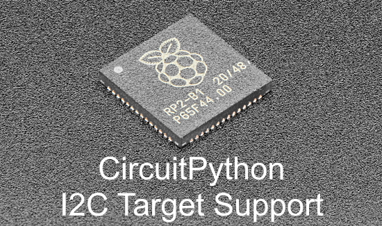](https://github.com/adafruit/circuitpython/pull/6758)

I2C Target Support had been added to CircuitPython for the RP2040 microcontroller in a recent GitHub pull request - [GitHub](https://github.com/adafruit/circuitpython/pull/6758).

## Python 3.11.0rc1 is Now Available

The first release candidate of Python 3.11 is now out for the community to review - [Python Blog](https://blog.python.org/2022/08/python-3110rc1-is-now-available.html).

> "This release, **3.11.0rc1**, is the penultimate release preview.  Entering the release candidate phase, only reviewed code changes which are clear bug fixes are allowed between this release candidate and the final release. The second candidate and the last planned release preview is currently planned for Monday, 2022-09-05 while the official release is planned for Monday, 2022-10-03."

## This Week's Python Streams

Python on Hardware is all about building a cooperative ecosphere which allows contributions to be valued and to grow knowledge. Below are the streams within the last week focusing on the community.

### CircuitPython Deep Dive Stream

[This past week](https://youtu.be/TwABjr9Lj_E), Tim had a GameJam Stream for CircuitPython Day 2022.

You can see the latest video and past videos on the Adafruit YouTube channel under the Deep Dive playlist - [YouTube](https://www.youtube.com/playlist?list=PLjF7R1fz_OOXBHlu9msoXq2jQN4JpCk8A).

### CircuitPython Parsec

John Park’s CircuitPython Parsec this week is on {subject} - [Adafruit Blog](link) and [YouTube](link).

Catch all the episodes in the [YouTube playlist](https://www.youtube.com/playlist?list=PLjF7R1fz_OOWFqZfqW9jlvQSIUmwn9lWr).

### The CircuitPython Show

The CircuitPython Show is an independent podcast, hosted by Paul Cutler, focusing on the people doing awesome things with CircuitPython. Each episode features Paul in conversation with a guest for a short interview – [CircuitPythonShow](https://circuitpythonshow.com/) and [Twitter](https://twitter.com/circuitpyshow).

The latest episode was released August 22nd and features Brent Rubell of Adafruit.  He and Paul talk the Internet of Things, Wippersnapper firmware, and share a few of their favorite newsletters. – [Show List](https://circuitpythonshow.com/episodes/all).

## Projects of the Week: CircuitPython Day 2022

The following projects were posted during Fridau August 19th for CircuitPython Day 2022.

[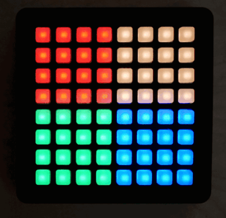](https://hackaday.io/project/185177-griddly)

Griddly is a design for Parkinson's with a Grid and CircuitPython - [hackaday.io](https://hackaday.io/project/185177-griddly).

> I started with an 8x8 NeoTrellis grid with from Adafruit. The silicon rubber buttons have a great tactile feel and the RGB LEDs enable an interesting visual experience. In addition, the NeoTrellis is built for Adafruit’s Feather form factor, including the Feather M4 which is powerful and is compatible with CircuitPython. Great for quick development and iteration.

>  Here's my animatronic Racacoonie. (H̶̵̶e̶̵̶ ̶̵̶c̶̵̶a̶̵̶n̶̵̶ ̶̵̶c̶̵̶o̶̵̶n̶̵̶t̶̵̶r̶̵̶o̶̵̶l̶̵̶ ̶̵̶m̶̵̶e̶̵̶ I can control him with an app, or by automatic gaze tracking if I'm in front of a camera). It's a stuffed raccoon, 3 servo motors held together w/ 12 gauge floral wire, and the Seeedstudio XIAO nRF board for Bluetooth control. Also used the floral wire to build a li'l harness. Code is CircuitPython - [Twitter](https://twitter.com/gvy_dvpont/status/1560717877098995712).
 

> Happy CircuitPythonDay2022!!! I want talk about Scientific CircuitPython. It's going to be a weird path, but through CircuitPython, I have a sensor that identifies when a bedroom door is open or closed based on air pressure differential between two rooms - [Twitter](https://twitter.com/keithTheEE/status/1560723167466905600).

## News from around the web!

[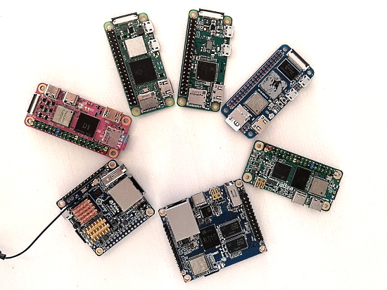](https://bret.dk/pi-zero-showdown/)

The Great Pi Zero Showdown compares single board computers (SBC) based on a number of factors - [Bret's Tech](https://bret.dk/pi-zero-showdown/) via [Twitter](https://twitter.com/bretweber/status/1561416565454737408).

* Raspberry Pi Zero W	BCM2835 ARMv7 @ 1.00GHz (1 Core)
* Raspberry Pi Zero 2 W	RP3A0-AU ARMv7 Cortex-A53 @ 1.00GHz (4 Cores)
* Radxa Zero	S905Y2 ARMv8 Cortex-A55 @ 1.91GHz (4 Cores)
* BananaPi M2 Zero	H3 ARMv7 Cortex-A7 @ 1.01GHz (4 Cores)
* MangoPi MQ Pro	D1 RISCV64 @ 1.00GHz (1 Core)
* Orange Pi Zero LTS	H2+ ARMv7 Cortex-A7 @ 1.20GHz (4 Cores)
* Orange Pi Zero 2	H616 ARMv8 Cortex-A53 @ 1.5GHz (4 Cores)

[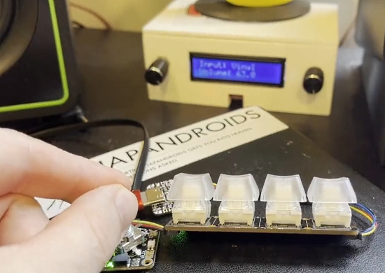](https://twitter.com/prcutler/status/1559998718639734784)

CircuitPython code was used to control a home theater receiver Zone2 using serial over WiFi. It uses an Adafruit QT Py ESP32-S2, 1x4 Neokey to select inputs and a rotary encoder for volume - [Twitter](https://twitter.com/prcutler/status/1559998718639734784).

[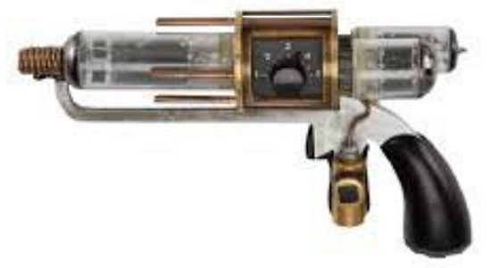](https://hackaday.io/project/184727-warehouse-13-tesla-gun)

Warehouse 13 Tesla Gun prop with Raspberry Pi Pico and CircuitPython - [hackaday.io](https://hackaday.io/project/184727-warehouse-13-tesla-gun) and [YouTube](https://youtu.be/dYXrynfmBcY).

[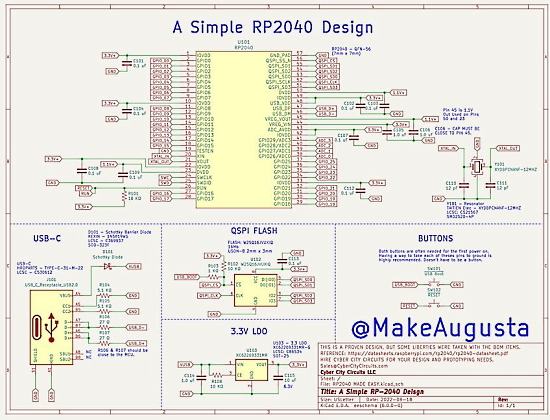](https://twitter.com/MakeAugusta/status/1560687196298002433)

A simple RP2040 hardware design - [Twitter](https://twitter.com/MakeAugusta/status/1560687196298002433).

Simone Salerno posts "tinyml is coming to MicroPython and CircuitPython" - [Twitter](https://twitter.com/EloquentArduino/status/1561333632370970630).

Your MicroPython board can be your tinkering peripheral - [Hackaday](https://hackaday.com/2022/08/10/your-micropython-board-can-be-your-tinkering-peripheral/).

[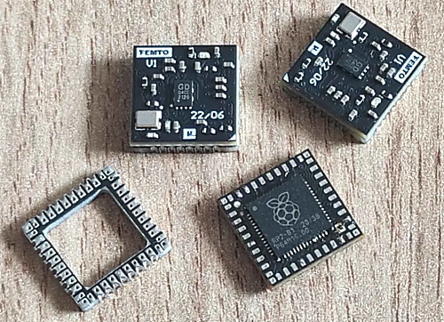](https://www.cnx-software.com/2022/08/22/femto-tiny-raspberry-pi-rp2040-module/)

Femto is a tiny 12x12mm Raspberry Pi RP2040 module - [CNX Software](https://www.cnx-software.com/2022/08/22/femto-tiny-raspberry-pi-rp2040-module/).

text - [site](url).

text - [site](url).

text - [site](url).

text - [site](url).

text - [site](url).

text - [site](url).

text - [site](url).

[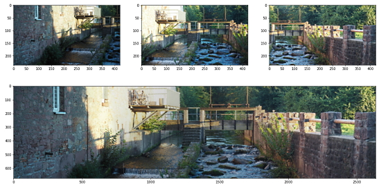](https://github.com/lukasalexanderweber/stitching)

stitching - a Python package for fast and robust Image Stitching. Based on opencv's stitching module and inspired by the stitching_detailed.py Python command line tool - [GitHub](https://github.com/lukasalexanderweber/stitching).

[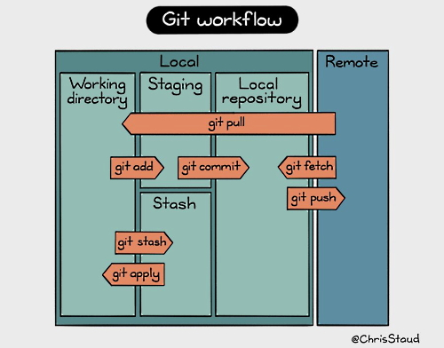](https://twitter.com/ChrisStaud/status/1554091413272494080)

Git Workflow chart - [Twitter](https://twitter.com/ChrisStaud/status/1554091413272494080).

You Should Be Using Python's Walrus Operator - Here's Why - [Martin Heinz](https://martinheinz.dev/blog/79).

text - [site](url).

PyDev of the Week:

CircuitPython Weekly Meeting for 

**#ICYDNCI What was the most popular, most clicked link, in [last week's newsletter](https://link)? [title](url).**

## Coming Soon

[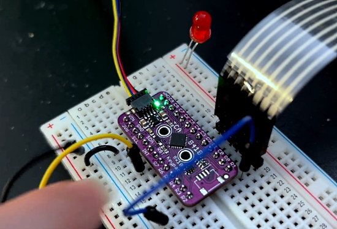](https://twitter.com/adafruit/status/1559917816513531904)

Adafruit has been testing it's new TCA8418 breakout board. This chip can do 8x10 keypad matrices and handles a queue of 10 events over I2C with an IRQ line. There will be CircuitPython and Arduino libraries - [Twitter](https://twitter.com/adafruit/status/1559917816513531904).

[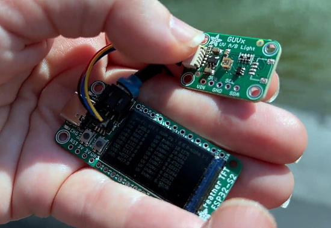](https://twitter.com/adafruit/status/1561370361119535104)

Testing out the GUVB-C31SM UV sensor. A summer afternoon in NYC is the best time to test a UV sensor. Thanks to the giant, free, UV lamp the sky, we can test out a new STEMMA QT breakout for the GUVB-C31SM - [Twitter](https://twitter.com/adafruit/status/1561370361119535104).

[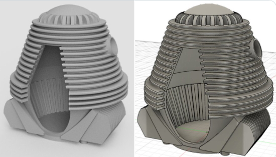](https://twitter.com/kevsmac/status/1559639515312148481)

The Pimoroni Enviro enclosure - It can hold a Raspberry Pi Pico W, Adafruit Feather Huzzah, or an Enviro Indoor with a battery pack - [Twitter](https://twitter.com/kevsmac/status/1559639515312148481).

text - [site](url).

## New Boards Supported by CircuitPython

The number of supported microcontrollers and Single Board Computers (SBC) grows every week. This section outlines which boards have been included in CircuitPython or added to [CircuitPython.org](https://circuitpython.org/).

This week, there were (#/no) new boards added!

- [Board name](url)
- [Board name](url)
- [Board name](url)

*Note: For non-Adafruit boards, please use the support forums of the board manufacturer for assistance, as Adafruit does not have the hardware to assist in troubleshooting.*

Looking to add a new board to CircuitPython? It's highly encouraged! Adafruit has four guides to help you do so:

- [How to Add a New Board to CircuitPython](https://learn.adafruit.com/how-to-add-a-new-board-to-circuitpython/overview)
- [How to add a New Board to the circuitpython.org website](https://learn.adafruit.com/how-to-add-a-new-board-to-the-circuitpython-org-website)
- [Adding a Single Board Computer to PlatformDetect for Blinka](https://learn.adafruit.com/adding-a-single-board-computer-to-platformdetect-for-blinka)
- [Adding a Single Board Computer to Blinka](https://learn.adafruit.com/adding-a-single-board-computer-to-blinka)

## New Learn Guides!

[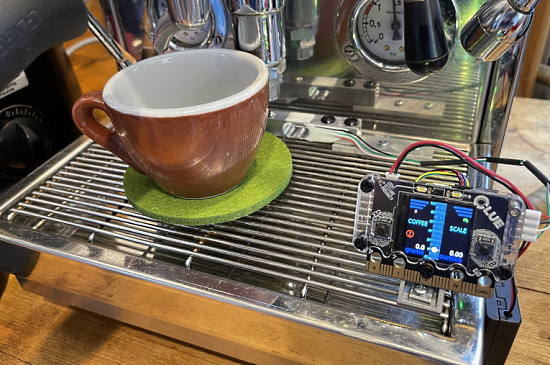](https://learn.adafruit.com/guides/latest)

[title](url) from [name](url)

[title](url) from [name](url)

[title](url) from [name](url)

## Updated Learn Guides!

[title](url) from [name](url)

## CircuitPython Libraries!

CircuitPython support for hardware continues to grow. We are adding support for new sensors and breakouts all the time, as well as improving on the drivers we already have. As we add more libraries and update current ones, you can keep up with all the changes right here!

For the latest libraries, download the [Adafruit CircuitPython Library Bundle](https://circuitpython.org/libraries). For the latest community contributed libraries, download the [CircuitPython Community Bundle](https://github.com/adafruit/CircuitPython_Community_Bundle/releases).

If you'd like to contribute, CircuitPython libraries are a great place to start. Have an idea for a new driver? File an issue on [CircuitPython](https://github.com/adafruit/circuitpython/issues)! Have you written a library you'd like to make available? Submit it to the [CircuitPython Community Bundle](https://github.com/adafruit/CircuitPython_Community_Bundle). Interested in helping with current libraries? Check out the [CircuitPython.org Contributing page](https://circuitpython.org/contributing). We've included open pull requests and issues from the libraries, and details about repo-level issues that need to be addressed. We have a guide on [contributing to CircuitPython with Git and GitHub](https://learn.adafruit.com/contribute-to-circuitpython-with-git-and-github) if you need help getting started. You can also find us in the #circuitpython channels on the [Adafruit Discord](https://adafru.it/discord).

You can check out this [list of all the Adafruit CircuitPython libraries and drivers available](https://github.com/adafruit/Adafruit_CircuitPython_Bundle/blob/master/circuitpython_library_list.md). 

The current number of CircuitPython libraries is **###**!

**New Libraries!**

Here's this week's new CircuitPython libraries:

* [library](url)

**Updated Libraries!**

Here's this week's updated CircuitPython libraries:

* [library](url)

## What’s the team up to this week?

What is the team up to this week? Let’s check in!

**Dan**

I fixed yet more issues for CircuitPython 8.0.0 this week, most notably getting touchio to work on ESP32. I also prepared for and released 8.0.0-beta.0. The last 8.0.0 release was 8.0.0-alpha.1 over two months ago. Since then there were about 146 pull requests, so the release notes were voluminous.

**Kattni**

This week I published the [ESP32-S3 TFT Feather guide](https://learn.adafruit.com/adafruit-esp32-s3-tft-feather). This massive guide is chock full of everything you need to get started with your new Feather. There's still more in the works, so keep an eye out for that guide to be updated soon!

**ADDING CP DAY EXPERIENCE HERE FOLLOWING CP DAY.**

**Melissa**

This past week I did a ton of work on the [CircuitPython Code Editor](https://code.circuitpython.org/). I merged the changes in that I had been working on for the past few weeks and found some JavaScript security issues on the live site that weren't present when running it from localhost on my computer. After looking at some potential solutions, I ended up creating a small JavaScript file that runs on the device and bootstraps in the entire Editor on to there. The little script worked so well that there were surprisingly few changes required to the site to get this working. If you'd like to try this out, just grab the Absolute Newest build for your ESP32 based board from [https://circuitpython.org/downloads/](https://circuitpython.org/downloads/) (assuming Web Workflow has been enabled), configure it according to the [docs](https://docs.circuitpython.org/en/latest/docs/workflows.html#web), and then browse to [http://circuitpython.local/code/](http://circuitpython.local/code/).

**Tim**

This week I finished the remaining pages on the Octopus guide and submitted it for review. I worked on github actions tasks that will measure the mpy filesize and post comments on PRs to help us better understand the size of our libraries. The initially proposed actions are submitted now as a PR to the cookie cutter repo for review and discussion. I prepared for CircuitPython day panel and game jam streams. I tinkered with PIL and am beginning to figure out how to manipulate perspective for regions of images, this will ultimately lead to a way to make customizable flip clock sprites for use with displayio.

**Scott**

This was my last week before I take 12 weeks to care for my kiddo. (Yay paternity leave!) My main goal was to wrap up outstanding web workflow changes and work with Melissa on integrating the web workflow into code.circuitpython.org. Due to browser restrictions, we weren't able to get code.circuitpython.org working. However, the devices themselves now have a http://circuitpython.local/code/ page that loads the full code.cp.org experience when online. Thanks to Melissa for her hard work getting that going.

The main thing I did was to add one final API piece for moving/renaming files through the REST API. RetiredWizard was super helpful in testing it. I also added the ability to upload a complete directory. I fixed an issue on the S2 where the code wouldn't start up, it'd just crash. Thanks to everyone for testing and reviews. Thanks to Dan for releasing CircuitPython 8.0.0-beta.0!

Thanks to Kattni for orchestrating an awesome CircuitPython Day 2022.

Thank you all. I'll be back to working on CP on November 14th.

**Liz**

I've been working on a third CircuitPython and Microsoft Azure project. This time I used IoT Hub with multiple ESP32-S2 devices running CircuitPython connected and sending telemetry. A Raspberry Pi is pulling the feeds from IoT Hub and displaying them on a monitor using the [Blinka_Displayio_PyGameDisplay library](https://github.com/FoamyGuy/Blinka_Displayio_PyGameDisplay). 

## Upcoming events!

The next MicroPython Meetup in Melbourne will be on August 24th – [Meetup](https://www.meetup.com/MicroPython-Meetup/). See the [slides](https://docs.google.com/presentation/d/e/2PACX-1vTX8zFXGxgalaJpXkY-NspjncnAuSiqjuzTUWIKtaNDRybb_hPz5dhBtaQA0aS5C4sb8l9xdWZoV1Ft/pub?slide=id.p) of the July 27th meeting.

[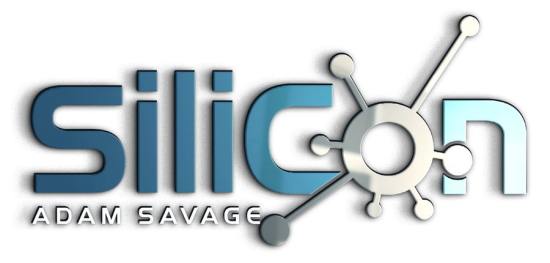](https://www.siliconsj.com/)

Silicon Valley’s Premier Comic Con Returns! Featuring The Best In Pop Culture, Tech, Science, Makers, Artists, Cosplay, Gaming, Comic Creators, Authors & More! August 27-28, 2022 San Jose McEnery Convention Center - [SiliCon](https://www.siliconsj.com/).

Use code **ADAFRUIT** in step 2 of [checkout online](https://purchase.growtix.com/eh/SiliCon_with_Adam_Savage_2022) for 15% off a 2 day ticket. 

[Virtual Maker Workshops](https://www.siliconsj.com/virtual-workshops/)

PyCon UK will be returning to Cardiff City Hall from Friday 16th to Sunday 18th September 2022 - [PyCon  UK](https://2022.pyconuk.org/).

After two years in remote mode, Hackaday is very excited to announce that this year’s Hackaday Supercon will be coming back, live! Nov. 4th, 5th, and 6th in sunny Pasadena, CA for three days of hacks, talks, and socializing with the Hackaday community - [Call for proposals](https://docs.google.com/forms/d/e/1FAIpQLSffBmw2vNLZyzdKnPJhKF6u7nvYnjTZQ-lynOhhr8_S8fAd3w/viewform) and [Hackaday](https://hackaday.com/2022/07/18/the-2022-hackaday-supercon-is-on-and-the-call-for-proposals-is-open/).

PyCon US 2023 will be April 19-17, 2023, again in Salt Lake City, Utah US - [PyCon US 2023](https://pycon.blogspot.com/2020/12/announcing-pycon-us-20222023.html).

**Send Your Events In**

As for other events, with the COVID pandemic, most in-person events are postponed or held online. If you know of virtual events or upcoming events, please let us know on Twitter with hashtag #CircuitPython or email to cpnews(at)adafruit(dot)com.

## Latest releases

CircuitPython's stable release is [#.#.#](https://github.com/adafruit/circuitpython/releases/latest) and its unstable release is [#.#.#-##.#](https://github.com/adafruit/circuitpython/releases). New to CircuitPython? Start with our [Welcome to CircuitPython Guide](https://learn.adafruit.com/welcome-to-circuitpython).

[2022####](https://github.com/adafruit/Adafruit_CircuitPython_Bundle/releases/latest) is the latest CircuitPython library bundle.

[v#.#.#](https://micropython.org/download) is the latest MicroPython release. Documentation for it is [here](http://docs.micropython.org/en/latest/pyboard/).

[#.#.#](https://www.python.org/downloads/) is the latest Python release. The latest pre-release version is [#.#.#](https://www.python.org/download/pre-releases/).

[#,### Stars](https://github.com/adafruit/circuitpython/stargazers) Like CircuitPython? [Star it on GitHub!](https://github.com/adafruit/circuitpython)

## Call for help -- Translating CircuitPython is now easier than ever!

[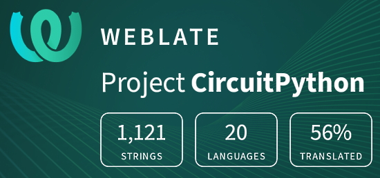](https://hosted.weblate.org/engage/circuitpython/)

One important feature of CircuitPython is translated control and error messages. With the help of fellow open source project [Weblate](https://weblate.org/), we're making it even easier to add or improve translations. 

Sign in with an existing account such as GitHub, Google or Facebook and start contributing through a simple web interface. No forks or pull requests needed! As always, if you run into trouble join us on [Discord](https://adafru.it/discord), we're here to help.

## jobs.adafruit.com - Find a dream job, find great candidates!

[jobs.adafruit.com](https://jobs.adafruit.com/) has returned and folks are posting their skills (including CircuitPython) and companies are looking for talented makers to join their companies - from Digi-Key, to Hackaday, Micro Center, Raspberry Pi and more.

**Job of the Week**

GPS tracker with Pager - Personal Project - personal project - [Adafruit Jobs Board]([https://jobs.adafruit.com/](https://jobs.adafruit.com/job/gps-tracker-with-pager-personal-project/)).

## 35,376 thanks!

The Adafruit Discord community, where we do all our CircuitPython development in the open, reached over 35,376 humans - thank you!  Adafruit believes Discord offers a unique way for Python on hardware folks to connect. Join today at [https://adafru.it/discord](https://adafru.it/discord).

## ICYMI - In case you missed it

Python on hardware is the Adafruit Python video-newsletter-podcast! The news comes from the Python community, Discord, Adafruit communities and more and is broadcast on ASK an ENGINEER Wednesdays. The complete Python on Hardware weekly videocast [playlist is here](https://www.youtube.com/playlist?list=PLjF7R1fz_OOXRMjM7Sm0J2Xt6H81TdDev). The video podcast is on [iTunes](https://itunes.apple.com/us/podcast/python-on-hardware/id1451685192?mt=2), [YouTube](http://adafru.it/pohepisodes), [IGTV (Instagram TV](https://www.instagram.com/adafruit/channel/)), and [XML](https://itunes.apple.com/us/podcast/python-on-hardware/id1451685192?mt=2).

[The weekly community chat on Adafruit Discord server CircuitPython channel - Audio / Podcast edition](https://itunes.apple.com/us/podcast/circuitpython-weekly-meeting/id1451685016) - Audio from the Discord chat space for CircuitPython, meetings are usually Mondays at 2pm ET, this is the audio version on [iTunes](https://itunes.apple.com/us/podcast/circuitpython-weekly-meeting/id1451685016), Pocket Casts, [Spotify](https://adafru.it/spotify), and [XML feed](https://adafruit-podcasts.s3.amazonaws.com/circuitpython_weekly_meeting/audio-podcast.xml).

## Codecademy "Learn Hardware Programming with CircuitPython"

Codecademy, an online interactive learning platform used by more than 45 million people, has teamed up with Adafruit to create a coding course, “Learn Hardware Programming with CircuitPython”. The course is now available in the [Codecademy catalog](https://www.codecademy.com/learn/learn-circuitpython?utm_source=adafruit&utm_medium=partners&utm_campaign=circuitplayground&utm_content=pythononhardwarenewsletter).

## Contribute!

The CircuitPython Weekly Newsletter is a CircuitPython community-run newsletter emailed every Tuesday. The complete [archives are here](https://www.adafruitdaily.com/category/circuitpython/). It highlights the latest CircuitPython related news from around the web including Python and MicroPython developments. To contribute, edit next week's draft [on GitHub](https://github.com/adafruit/circuitpython-weekly-newsletter/tree/gh-pages/_drafts) and [submit a pull request](https://help.github.com/articles/editing-files-in-your-repository/) with the changes. You may also tag your information on Twitter with #CircuitPython. 

Join the Adafruit [Discord](https://adafru.it/discord) or [post to the forum](https://forums.adafruit.com/viewforum.php?f=60) if you have questions.
