- [ ] Kattni updates
- [ ] change date
- [ ] update title
- [ ] Feature story
- [ ] Update  for images
- [ ] Update ICYDNCI
- [ ] All images 550w max only
- [ ] Link "View this email in your browser."

News Sources

- [python.org](https://www.python.org/)
- [Python Insider - dev team blog](https://pythoninsider.blogspot.com/)
- [MicroPython Meetup Blog](https://melbournemicropythonmeetup.github.io/)
- [hackaday.io newest projects MicroPython](https://hackaday.io/projects?tag=micropython&sort=date) and [CircuitPython](https://hackaday.io/projects?tag=circuitpython&sort=date)
- [hackaday CircuitPython](https://hackaday.com/blog/?s=circuitpython) and [MicroPython](https://hackaday.com/blog/?s=micropython)
- [hackster.io CircuitPython](https://www.hackster.io/search?q=circuitpython&i=projects&sort_by=most_recent) and [MicroPython](https://www.hackster.io/search?q=micropython&i=projects&sort_by=most_recent)

View this email in your browser. **Warning: Flashing Imagery**

Welcome to the latest Python on Microcontrollers newsletter! 

We're on [Discord](https://discord.gg/HYqvREz), [Twitter](https://twitter.com/search?q=circuitpython&src=typed_query&f=live), and for past newsletters - [view them all here](https://www.adafruitdaily.com/category/circuitpython/). If you're reading this on the web, [subscribe here](https://www.adafruitdaily.com/). Here's the news this week:

## Headline

text - [site](url).

## Diode: Build and Program Projects in the Browser

[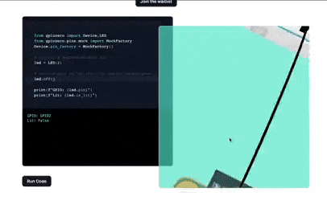](https://www.withdiode.com/)

Diode makes it easy to build, program, and run hardware projects in the browser. Save time and money waiting on parts, shorten feedback loops, and build hardware better. The syntax is Python. You can play with a very limited demo now - [Diode](https://www.withdiode.com/) via [Twitter](https://twitter.com/KennethCassel/status/1568327236662734848).

## Arduino IDE 2.0 Was Finally Released

[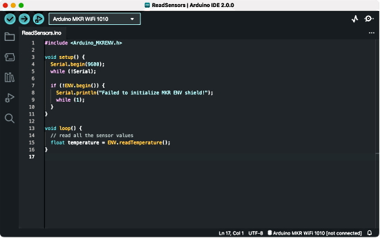](https://blog.adafruit.com/2022/09/14/arduino-ide-2-0-is-finally-released-arduino-arduino/)

After a lengthy testing period, Arduino announced that Arduino IDE 2.0 has moved to stable and is [available for download](https://www.arduino.cc/en/software). It has a modern editor and provides a better overall user experience thanks to a responsive interface and faster compilation time - [Arduino](https://blog.arduino.cc/2022/09/14/its-here-please-welcome-arduino-ide-2-0/) and [Adafruit Blog](https://blog.adafruit.com/2022/09/14/arduino-ide-2-0-is-finally-released-arduino-arduino/).

## Feature

text - [site](url).

## Help with Python F-Strings

[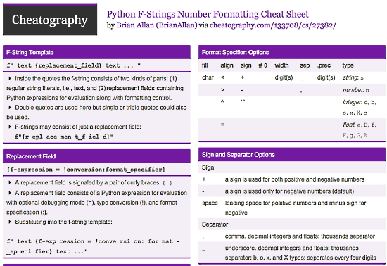](https://cheatography.com/brianallan/cheat-sheets/python-f-strings-number-formatting/pdf/)

Help with Python F-Strings, a four page concise guide - [Cheatography](https://cheatography.com/brianallan/cheat-sheets/python-f-strings-number-formatting/pdf/) and [page](https://cheatography.com/brianallan/cheat-sheets/python-f-strings-number-formatting/).

## The CircuitPython Community Help Desk Returns September 29

The CircuitPython Community Help Desk returns on Thursday, September 29th from 7pm EDT to 9pm EDT.  Developers will be on hand to help you get ready for [Hacktoberfest 2022](https://hacktoberfest.com/). Volunteers will help get you registered for Hacktoberfest, help with your development environment, and share how to participate in Hacktoberfest by contributing to CircuitPython and its libraries.  Help will be available in the Adafruit Discord in both voice and chat.

## This Week's Python Streams

Python on Hardware is all about building a cooperative ecosphere which allows contributions to be valued and to grow knowledge. Below are the streams within the last week focusing on the community.

### CircuitPython Deep Dive Stream

[This week](link), Tim streamed work on {subject}.

You can see the latest video and past videos on the Adafruit YouTube channel under the Deep Dive playlist - [YouTube](https://www.youtube.com/playlist?list=PLjF7R1fz_OOXBHlu9msoXq2jQN4JpCk8A).

### CircuitPython Parsec

John Park’s CircuitPython Parsec this week is on {subject} - [Adafruit Blog](link) and [YouTube](link).

Catch all the episodes in the [YouTube playlist](https://www.youtube.com/playlist?list=PLjF7R1fz_OOWFqZfqW9jlvQSIUmwn9lWr).

### The CircuitPython Show

The CircuitPython Show is an independent podcast hosted by Paul Cutler, focusing on the people doing awesome things with CircuitPython. Each episode features Paul in conversation with a guest for a short interview – [CircuitPythonShow](https://circuitpythonshow.com/) and [Twitter](https://twitter.com/circuitpyshow).

The latest episode was released September 19th with guest Thea Flowers.  Thea shares how she discovered CircuitPython, her synthesizer company Winterbloom, and how her products use CircuitPython. – [Show List](https://circuitpythonshow.com/episodes/all).

## Maker Becky Stern has a new Electronic Video Series for Digi-Key

Former Adafruit Director of Wearable Electronics Becky Stern has a new video series that she’s doing for [Digi-Key](https://www.digikey.com/). Becky has always done an outstanding job of explaining what can be intimidating technically in an entertaining and digestible way (like her [Adafruit Learning System guides](https://learn.adafruit.com/search?q=becky)).

If this first installment of the series ([playlist in progress](https://www.youtube.com/watch?v=i7LFZxQcCQo&list=PLEBQazB0HUyTF7kB7v1S77F9QK0gT--Kt)), an [introduction to LEDs](https://youtu.be/i7LFZxQcCQo), is any indication, this series looks to deliver more of her welcome brand of accessible tech education. 

Check out the [first video](https://youtu.be/i7LFZxQcCQo) and an article on [BoingBoing](https://boingboing.net/2022/09/15/new-electronics-video-series-from-well-known-maker-becky-stern.html) - [Adafruit Blog](https://blog.adafruit.com/2022/09/15/maker-becky-stern-does-new-electronic-video-series-for-digi-key-making-digikey-bekathwia/).

## GitHub Markdown Syntax

GitHub uses a syntax called Markdown to format text. As many Python folks use GitHub, here's a handy reference to how Markdown encodes the typical document formats inclusing bold/italic/lists and much more - [Twitter](https://twitter.com/pradumna_saraf/status/1568063868571684864).

## Project of the Week: Electronic MasterMind Game

[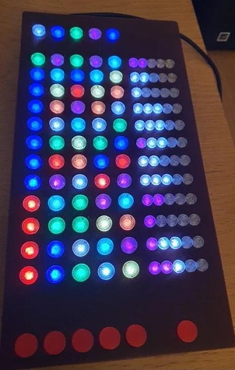](https://www.instructables.com/Electronic-MasterMind-Game/)

An electronic version of the classic 70’s Super Master Mind board game. The object is to guess the code that has been selected by the computer in as few moves as possible using clues given at each turn. It uses a Rasberry Pi Zero WH, an Adafruit 16x32 LED Matrix Panel (6mm pitch), an Adafruit Matrix Hat (or Bonnet) and Python - [Instructables](https://www.instructables.com/Electronic-MasterMind-Game/).

## News from around the web!

[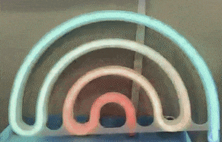](https://twitter.com/prcutler/status/1569845435677741060)

Paul Cutler builds the NeoPixel Rainbow designed by the Ruiz Brothers and programmed by Rose Hooper. Based on the Adafruit Learning System Guide [here](https://twitter.com/prcutler/status/1569845435677741060) - [Twitter](https://twitter.com/prcutler/status/1569845435677741060).

[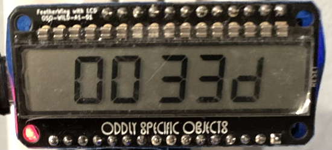](https://twitter.com/molecularist/status/1569767831738224647)

A countdown timer to NHL Bruins season opener. It uses an Unexpected Maker Feather S2, Jose Castillo LCD wing, and CircuitPython - [Twitter](https://twitter.com/molecularist/status/1569767831738224647).

[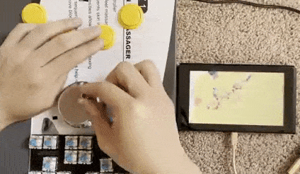](https://twitter.com/River___Wang/status/1571188799706726401)

A keyboard and large knob controller powered by CircuitPython - [Twitter](https://twitter.com/River___Wang/status/1571188799706726401).

[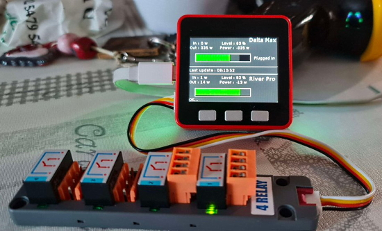](https://twitter.com/BeBoXoS/status/1569940531966345216)

Monitoring of 2 batteries with an Eco Flow Delta Max & River pro with one M5Stack Fire, 4 relays and MicroPython - [Twitter](https://twitter.com/BeBoXoS/status/1569940531966345216).

[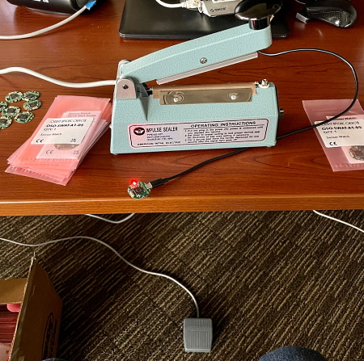](https://twitter.com/josecastillo/status/1570818984655847426)

Joey Castillo automates shipping the Sensor Watch with a CircuitPython-powered foot pedal that presses the Enter key when it is tapped - [Twitter](https://twitter.com/josecastillo/status/1570818984655847426).

A doorbell notifier powered by Raspberry Pi Pico W, MicroPython and Telegram - [GitHub](https://github.com/Mauker1/PicoDoorBell).

[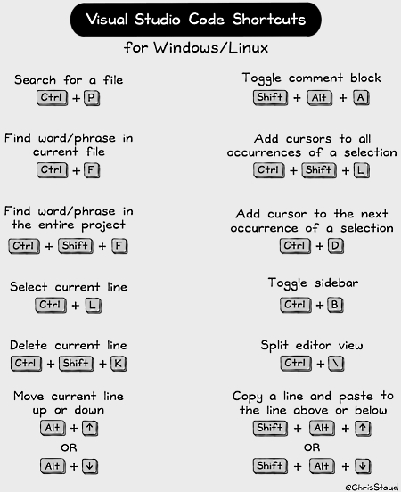](https://twitter.com/ChrisStaud/status/1569924470512533504)

[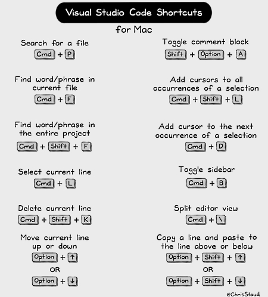](https://twitter.com/ChrisStaud/status/1569924470512533504)

Visual Studio Code Shortcuts Cheatsheet — For Mac, Linux, & Windows - [Twitter Thread](https://twitter.com/ChrisStaud/status/1569924470512533504).

[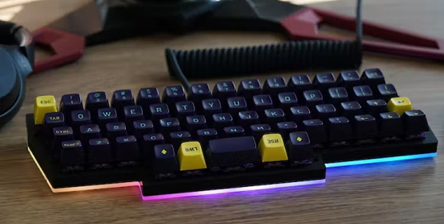](https://www.hackster.io/sonalpinto/purple-owl-a-60-keyboard-powered-by-seeed-xiao-rp2040-f73604)

Purple Owl is a 60% hotswap mechanical keyboard with underglow RGB powered by a tiny Seeed XIAO RP2040 and KMK (CircuitPython) Firmware - [hackster.io](https://www.hackster.io/sonalpinto/purple-owl-a-60-keyboard-powered-by-seeed-xiao-rp2040-f73604).

text - [site](url).

text - [site](url).

text - [site](url).

text - [site](url).

text - [site](url).

text - [site](url).

text - [site](url).

[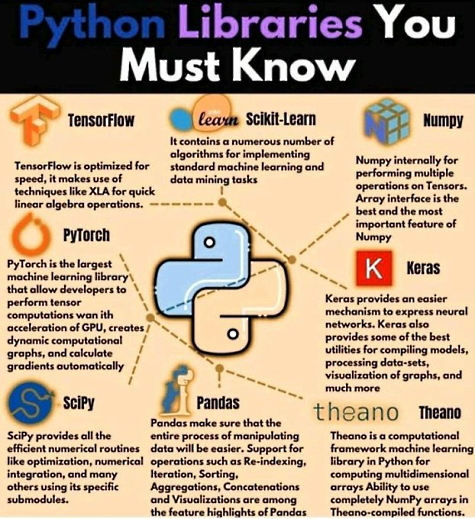](https://twitter.com/Manish_kumar3_1/status/1569881645112774656)

Python Libraries you Must Know - [Twitter](https://twitter.com/Manish_kumar3_1/status/1569881645112774656).

[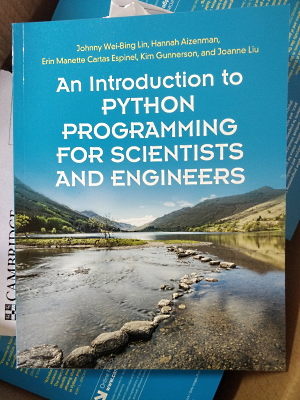](https://www.cambridge.org/highereducation/books/an-introduction-to-python-programming-for-scientists-and-engineers/271C02A02E8B775066316E92A68E187A#overview)

New book: An Introduction to Python Programming for Scientists and Engineers - [Cambridge](https://www.cambridge.org/highereducation/books/an-introduction-to-python-programming-for-scientists-and-engineers/271C02A02E8B775066316E92A68E187A#overview) via [Twitter](https://twitter.com/story645/status/1569401232275423238).

[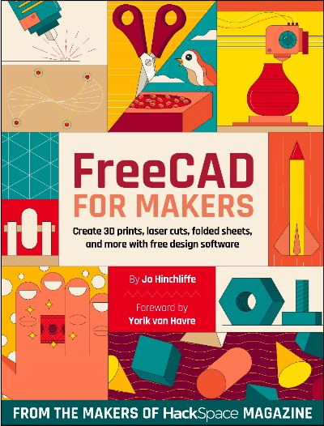](https://hackspace.raspberrypi.com/books/freecad)

A new book, for free from HackSpace Magazine (PDF): FreeCAD is the number one free software 3D design program, and this PDF guide is the best way to get started with it. We’ll take you from absolute beginnner to advanced user, going from the basics of drawing a line and making it 3D all the way to parametric design, importing objects from photographs, designing for sheet metal, and loads more - [HackSpace Magazine](https://hackspace.raspberrypi.com/books/freecad).

PyDev of the Week:

CircuitPython Weekly Meeting for 

#ICYDNCI What was the most popular, most clicked link, in [last week's newsletter](https://www.adafruitdaily.com/2022/09/13/python-on-microcontrollers-newsletter-new-raspberry-pi-os-steam-powered-pico-and-more-circuitpython-micropython-thepsf-raspberry_pi/)? [The Official Raspberry Pi Handbook 2023 (book and free PDF)](https://magpi.raspberrypi.com/books/handbook-2023).

## New

[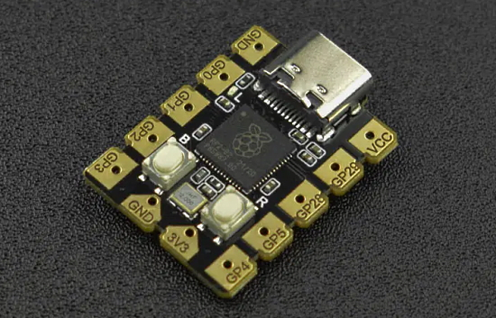](https://www.cnx-software.com/2022/09/16/beetle-rp2040-tiny-raspberry-pi-rp2040-board-easily-solderable-pads/)

DFRobot Beetle RP2040 joins other miniature Raspberry Pi RP2040 developments boards such as Pimoroni Tiny 2040 & Adafruit QT Py RP2040, but with only eight GPIOs accessible through larger pads that are easier to solder - [cnx-software](https://www.cnx-software.com/2022/09/16/beetle-rp2040-tiny-raspberry-pi-rp2040-board-easily-solderable-pads/).

[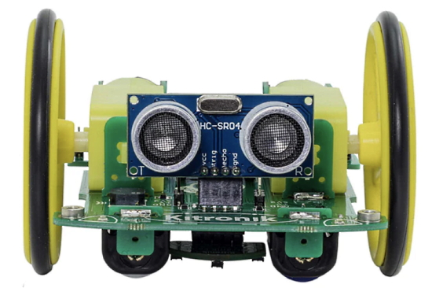](https://magpi.raspberrypi.com/articles/autonomous-robotics-platform-for-raspberry-pi-pico-review)

Autonomous Robotics Platform for Raspberry Pi Pico by Kitronik review (it's [programmed in Python](https://github.com/KitronikLtd/Kitronik-Pico-Autonomous-Robotics-Platform-MicroPython)) - [The MagPi](https://magpi.raspberrypi.com/articles/autonomous-robotics-platform-for-raspberry-pi-pico-review).

text - [site](url).

## New Boards Supported by CircuitPython

The number of supported microcontrollers and Single Board Computers (SBC) grows every week. This section outlines which boards have been included in CircuitPython or added to [CircuitPython.org](https://circuitpython.org/).

This week, there were (#/no) new boards added!

- [Board name](url)
- [Board name](url)
- [Board name](url)

*Note: For non-Adafruit boards, please use the support forums of the board manufacturer for assistance, as Adafruit does not have the hardware to assist in troubleshooting.*

Looking to add a new board to CircuitPython? It's highly encouraged! Adafruit has four guides to help you do so:

- [How to Add a New Board to CircuitPython](https://learn.adafruit.com/how-to-add-a-new-board-to-circuitpython/overview)
- [How to add a New Board to the circuitpython.org website](https://learn.adafruit.com/how-to-add-a-new-board-to-the-circuitpython-org-website)
- [Adding a Single Board Computer to PlatformDetect for Blinka](https://learn.adafruit.com/adding-a-single-board-computer-to-platformdetect-for-blinka)
- [Adding a Single Board Computer to Blinka](https://learn.adafruit.com/adding-a-single-board-computer-to-blinka)

## New Learn Guides!

[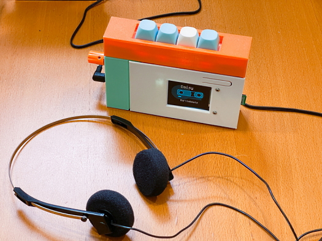](https://learn.adafruit.com/guides/latest)

[title](url) from [name](url)

[title](url) from [name](url)

[title](url) from [name](url)

## Updated Learn Guides!

[title](url) from [name](url)

## CircuitPython Libraries!

CircuitPython support for hardware continues to grow. We are adding support for new sensors and breakouts all the time, as well as improving on the drivers we already have. As we add more libraries and update current ones, you can keep up with all the changes right here!

For the latest libraries, download the [Adafruit CircuitPython Library Bundle](https://circuitpython.org/libraries). For the latest community contributed libraries, download the [CircuitPython Community Bundle](https://github.com/adafruit/CircuitPython_Community_Bundle/releases).

If you'd like to contribute, CircuitPython libraries are a great place to start. Have an idea for a new driver? File an issue on [CircuitPython](https://github.com/adafruit/circuitpython/issues)! Have you written a library you'd like to make available? Submit it to the [CircuitPython Community Bundle](https://github.com/adafruit/CircuitPython_Community_Bundle). Interested in helping with current libraries? Check out the [CircuitPython.org Contributing page](https://circuitpython.org/contributing). We've included open pull requests and issues from the libraries, and details about repo-level issues that need to be addressed. We have a guide on [contributing to CircuitPython with Git and GitHub](https://learn.adafruit.com/contribute-to-circuitpython-with-git-and-github) if you need help getting started. You can also find us in the #circuitpython channels on the [Adafruit Discord](https://adafru.it/discord).

You can check out this [list of all the Adafruit CircuitPython libraries and drivers available](https://github.com/adafruit/Adafruit_CircuitPython_Bundle/blob/master/circuitpython_library_list.md). 

The current number of CircuitPython libraries is **###**!

**New Libraries!**

Here's this week's new CircuitPython libraries:

* [library](url)

**Updated Libraries!**

Here's this week's updated CircuitPython libraries:

* [library](url)

## What’s the team up to this week?

What is the team up to this week? Let’s check in!

**Dan**

I've just added the ability to preserve the state of specified pins when entering deep sleep in CircuitPython. This is currently implemented on Espressif boards only.

I'm continuing to investigate and fix bugs for the 8.0.0 release.

**Kattni**

This week I published the [WiFi Mailbox Notifier guide](https://learn.adafruit.com/wifi-mailbox-notifier/overview)! This guide uses a CircuitPython, a Feather ESP32 V2, WiFi, and Adafruit IO to put together a project to install in your mailbox, that will email you every time the mailbox door is opened. The guide includes how to identify reed switch terminals (they can be very confusing!), soldering and assembly instructions, code walkthrough, Adafruit IO set up, installation and usage, and power analysis to verify your board is definitely entering deep sleep. The guide is great for the project, but also for the extra included info! Feel free to check it out!

**Melissa**

This past week I worked on adding a lot of improvements to the [CircuitPython Code Editor](https://code.circuitpython.org/). These improvements included some code restructuring, bug fixes, an improved loading animation with a spinning Blinka, folder uploading and downloading into a zipped file, updating to the latest CodeMirror editor component, changing the filename color based on whether changes are saved, and showing more files and details. I'm hoping to get this project to a good stopping point very soon and will probably be getting to some move thorough testing in about a week.

**Tim**

This week I worked on "finishing touches" for the flip clock widget library. The core functionality is done and working but I've been adding docstrings and type annotations as well as more thorough example scripts. The last piece remaining that needs cleanup, docstrings, and type annotations is the PIL based script that runs on the PC to generate the sprite sheets. Once that one is finished up I'll make the PR to add this library to the bundle.

**Jeff**

I published a new guide this week: [Commodore Keyboard to USB HID with CircuitPython](https://learn.adafruit.com/commodore-keyboard-to-usb-hid-with-circuitpython/overview) -- In this guide, you will learn how to adapt a matrix-style keyboard from an iconic computer brand to a modern computer using CircuitPython and the KB2040 board.

**Liz**

This past week I wrote a [guide on plugging the new nOOds flexible LED filaments into CV (control voltage) synths](https://learn.adafruit.com/noods-led-synth-cv-visualizers). The nOOds light up depending on the voltage and waveform coming out of your synth. I'm hoping this will inspire folks to get creative with these new LEDs. If you want more info on them, be sure to check out [Phil B's amazing 
Überguide](https://learn.adafruit.com/noods-uberguide) that he did for them.

I also added a [page to the MacroPad guide](https://learn.adafruit.com/adafruit-macropad-rp2040/attaching-external-hardware) on using external hardware with the board, such as a STEMMA board. The MacroPad has a STEMMA port on the side so there's a lot of possibilities for adding sensors to your macro keyboard setup.

## Upcoming events!

The next MicroPython Meetup in Melbourne will be on September 28th – [Meetup](https://www.meetup.com/MicroPython-Meetup/). See the [slides](https://docs.google.com/presentation/d/e/2PACX-1vQnoz0AsGaxVf8iaqzYszFUnKqRZTUplnzwJoTtqKBmNYIuo5NL-M1bT5Zoz9ajyHwNxIrWi4zNudUF/pub?start=false&loop=false&delayms=3000&slide=id.p) of the August 24th meeting.

After two years in remote mode, Hackaday is very excited to announce that this year’s Hackaday Supercon will be coming back, live! Nov. 4th, 5th, and 6th in sunny Pasadena, CA for three days of hacks, talks, and socializing with the Hackaday community - [Call for proposals](https://docs.google.com/forms/d/e/1FAIpQLSffBmw2vNLZyzdKnPJhKF6u7nvYnjTZQ-lynOhhr8_S8fAd3w/viewform) and [Hackaday](https://hackaday.com/2022/07/18/the-2022-hackaday-supercon-is-on-and-the-call-for-proposals-is-open/).

RISC-V Global Summit, December 12-15, 2022 San Jose, California US - [Linux Foundation](https://events.linuxfoundation.org/riscv-summit/), [YouTube](https://youtu.be/VecaMNCuuF0) via [Twitter](https://twitter.com/risc_v/status/1564719040588926979).

PyCon US 2023 will be April 19-17, 2023, again in Salt Lake City, Utah US - [PyCon US 2023](https://pycon.blogspot.com/2020/12/announcing-pycon-us-20222023.html).

**Send Your Events In**

As for other events, with the COVID pandemic, most in-person events are postponed or held online. If you know of virtual events or upcoming events, please let us know on Twitter with hashtag #CircuitPython or email to cpnews(at)adafruit(dot)com.

## Latest releases

CircuitPython's stable release is [#.#.#](https://github.com/adafruit/circuitpython/releases/latest) and its unstable release is [#.#.#-##.#](https://github.com/adafruit/circuitpython/releases). New to CircuitPython? Start with our [Welcome to CircuitPython Guide](https://learn.adafruit.com/welcome-to-circuitpython).

[2022####](https://github.com/adafruit/Adafruit_CircuitPython_Bundle/releases/latest) is the latest CircuitPython library bundle.

[v#.#.#](https://micropython.org/download) is the latest MicroPython release. Documentation for it is [here](http://docs.micropython.org/en/latest/pyboard/).

[#.#.#](https://www.python.org/downloads/) is the latest Python release. The latest pre-release version is [#.#.#](https://www.python.org/download/pre-releases/).

[#,### Stars](https://github.com/adafruit/circuitpython/stargazers) Like CircuitPython? [Star it on GitHub!](https://github.com/adafruit/circuitpython)

## Call for help -- Translating CircuitPython is now easier than ever!

One important feature of CircuitPython is translated control and error messages. With the help of fellow open source project [Weblate](https://weblate.org/), we're making it even easier to add or improve translations. 

Sign in with an existing account such as GitHub, Google or Facebook and start contributing through a simple web interface. No forks or pull requests needed! As always, if you run into trouble join us on [Discord](https://adafru.it/discord), we're here to help.

## jobs.adafruit.com - Find a dream job, find great candidates!

[jobs.adafruit.com](https://jobs.adafruit.com/) has returned and folks are posting their skills (including CircuitPython) and companies are looking for talented makers to join their companies - from Digi-Key, to Hackaday, Micro Center, Raspberry Pi and more.

## 35,530 thanks!

The Adafruit Discord community, where we do all our CircuitPython development in the open, reached over 35,530 humans - thank you!  Adafruit believes Discord offers a unique way for Python on hardware folks to connect. Join today at [https://adafru.it/discord](https://adafru.it/discord).

## ICYMI - In case you missed it

Python on hardware is the Adafruit Python video-newsletter-podcast! The news comes from the Python community, Discord, Adafruit communities and more and is broadcast on ASK an ENGINEER Wednesdays. The complete Python on Hardware weekly videocast [playlist is here](https://www.youtube.com/playlist?list=PLjF7R1fz_OOXRMjM7Sm0J2Xt6H81TdDev). The video podcast is on [iTunes](https://itunes.apple.com/us/podcast/python-on-hardware/id1451685192?mt=2), [YouTube](http://adafru.it/pohepisodes), [IGTV (Instagram TV](https://www.instagram.com/adafruit/channel/)), and [XML](https://itunes.apple.com/us/podcast/python-on-hardware/id1451685192?mt=2).

[The weekly community chat on Adafruit Discord server CircuitPython channel - Audio / Podcast edition](https://itunes.apple.com/us/podcast/circuitpython-weekly-meeting/id1451685016) - Audio from the Discord chat space for CircuitPython, meetings are usually Mondays at 2pm ET, this is the audio version on [iTunes](https://itunes.apple.com/us/podcast/circuitpython-weekly-meeting/id1451685016), Pocket Casts, [Spotify](https://adafru.it/spotify), and [XML feed](https://adafruit-podcasts.s3.amazonaws.com/circuitpython_weekly_meeting/audio-podcast.xml).

## Codecademy "Learn Hardware Programming with CircuitPython"

Codecademy, an online interactive learning platform used by more than 45 million people, has teamed up with Adafruit to create a coding course, “Learn Hardware Programming with CircuitPython”. The course is now available in the [Codecademy catalog](https://www.codecademy.com/learn/learn-circuitpython?utm_source=adafruit&utm_medium=partners&utm_campaign=circuitplayground&utm_content=pythononhardwarenewsletter).

## Contribute!

The CircuitPython Weekly Newsletter is a CircuitPython community-run newsletter emailed every Tuesday. The complete [archives are here](https://www.adafruitdaily.com/category/circuitpython/). It highlights the latest CircuitPython related news from around the web including Python and MicroPython developments. To contribute, edit next week's draft [on GitHub](https://github.com/adafruit/circuitpython-weekly-newsletter/tree/gh-pages/_drafts) and [submit a pull request](https://help.github.com/articles/editing-files-in-your-repository/) with the changes. You may also tag your information on Twitter with #CircuitPython. 

Join the Adafruit [Discord](https://adafru.it/discord) or [post to the forum](https://forums.adafruit.com/viewforum.php?f=60) if you have questions.
