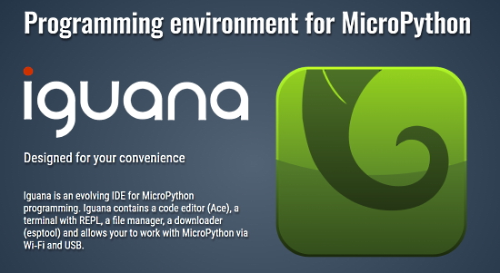
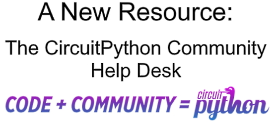
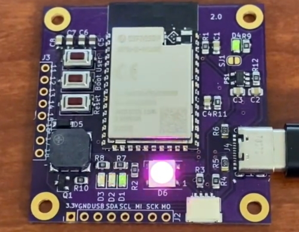
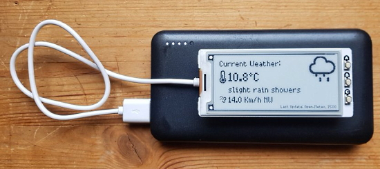
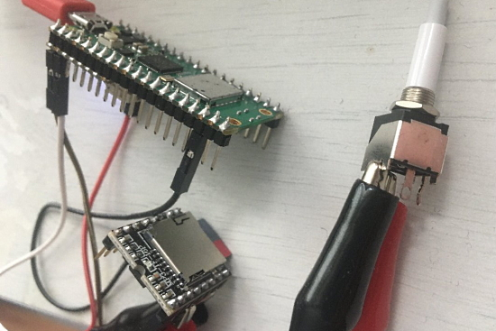
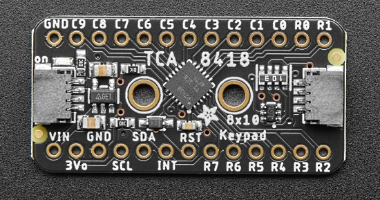

- [ ] Kattni updates
- [ ] change date
- [ ] update title
- [ ] Feature story
- [ ] Update  for images
- [ ] Update ICYDNCI
- [ ] All images 550w max only
- [ ] Link "View this email in your browser."

News Sources

- [python.org](https://www.python.org/)
- [Python Insider - dev team blog](https://pythoninsider.blogspot.com/)
- [MicroPython Meetup Blog](https://melbournemicropythonmeetup.github.io/)
- [hackaday.io newest projects MicroPython](https://hackaday.io/projects?tag=micropython&sort=date) and [CircuitPython](https://hackaday.io/projects?tag=circuitpython&sort=date)
- [hackaday CircuitPython](https://hackaday.com/blog/?s=circuitpython) and [MicroPython](https://hackaday.com/blog/?s=micropython)
- [hackster.io CircuitPython](https://www.hackster.io/search?q=circuitpython&i=projects&sort_by=most_recent) and [MicroPython](https://www.hackster.io/search?q=micropython&i=projects&sort_by=most_recent)

View this email in your browser. **Warning: Flashing Imagery**

Welcome to the latest Python on Microcontrollers newsletter! 

We're on [Discord](https://discord.gg/HYqvREz), [Twitter](https://twitter.com/search?q=circuitpython&src=typed_query&f=live), and for past newsletters - [view them all here](https://www.adafruitdaily.com/category/circuitpython/). If you're reading this on the web, [subscribe here](https://www.adafruitdaily.com/). Here's the news this week:

## Headline

text - [site](url).

## Feature

text - [site](url).

## Feature

text - [site](url).

## Iguana - a Programming environment for MicroPython

Iguana is an evolving IDE for MicroPython programming on Windows. Iguana contains a code editor (Ace), a terminal with REPL, a file manager, a downloader (esptool) and allows your to work with MicroPython via Wi‑Fi and USB - [robostart.ru](https://robostart.ru/iguana/en/) and [MicroPython Forum](https://github.com/orgs/micropython/discussions/9333).

## Two New Features Added to the CircuitPython Online IDE

Two features that River Wang has promised for the [CircuitPython Online IDE](https://urfdvw.github.io/CircuitPython-online-IDE/) have been added. One is the file modification indicator. The other is the serial mode indicator showing whether the microcontroller is in REPL or running script - [Twitter](https://twitter.com/River___Wang/status/1571994968339746819) and the [CircuitPython Online IDE](https://urfdvw.github.io/CircuitPython-online-IDE/).

## Feature

text - [site](url).

## This Week's Python Streams

Python on Hardware is all about building a cooperative ecosphere which allows contributions to be valued and to grow knowledge. Below are the streams within the last week focusing on the community.

### CircuitPython Deep Dive Stream

[This week](link), Tim streamed work on {subject}.

You can see the latest video and past videos on the Adafruit YouTube channel under the Deep Dive playlist - [YouTube](https://www.youtube.com/playlist?list=PLjF7R1fz_OOXBHlu9msoXq2jQN4JpCk8A).

### CircuitPython Parsec

John Park’s CircuitPython Parsec this week is on {subject} - [Adafruit Blog](link) and [YouTube](link).

Catch all the episodes in the [YouTube playlist](https://www.youtube.com/playlist?list=PLjF7R1fz_OOWFqZfqW9jlvQSIUmwn9lWr).

### The CircuitPython Show

The CircuitPython Show is an independent podcast hosted by Paul Cutler, focusing on the people doing awesome things with CircuitPython. Each episode features Paul in conversation with a guest for a short interview – [CircuitPythonShow](https://circuitpythonshow.com/) and [Twitter](https://twitter.com/circuitpyshow).

The show is off this week. Last week featured Thea Flowers of Winterbloom and next week Bradán Lane joins the show and shares his CircuitPython powered products, including the JoyPad and LumosRing. – [Show List](https://circuitpythonshow.com/episodes/all).

## The CircuitPython Community Help Desk Returns September 29

The CircuitPython Community Help Desk returns on Thursday, September 29th from 7pm EDT to 9pm EDT. Developers will be on hand to help you get ready for [Hacktoberfest 2022](https://hacktoberfest.com/). Volunteers will help get you registered for Hacktoberfest, help with your development environment, and share how to participate in Hacktoberfest by contributing to CircuitPython and its libraries.  Help will be available in the Adafruit Discord in both voice and chat.

Hacktoberfest help is available throughout October in the Adafruit Discord in the #circuitpython-dev channel in the Hacktoberfest 2022 thread.  The Community Help Desk will also return on October 29th to help wrap up Hacktoberfest.

CircuitPython community members Paul Cutler and Tod Kurt have started a new podcast, The Bootloader. Each episode they both share three interesting things form the maker and tech scenes.  In the first spisode they talk about a couple CircuitPython projects, 3D printing, and more. - [The Bootloader website](https://thebootloader.net) and [Twitter](https://twitter.com/thebootloader).

## Project of the Week

text - [site](url).

## News from around the web!

Measuring the power usage of NeoPixels on a Circuit Playground Bluefruit and the RGB LEDs on a [Blinkyparts Rainbow Unicorn](https://shop.blinkyparts.com/en/Rainbow-Unicorn-Simple-kit-for-a-fantastic-badge/blink232242) using the Nordic Power Profiler Kit II - [Instructables](https://www.instructables.com/RGB-LED-Current-Measurement-With-Nordic-Power-Prof/)

text - [site](url).

text - [site](url).

Mark Komus has a version of CircuitPython installed and running on a custom built ESP-based board. "I have an idea for an in home sensor / alarm I can use this for (which was the secondary purpose when designing it - after learning)" - [Twitter](https://twitter.com/MarkKomus/status/1572034052651356161).

text - [site](url).

text - [site](url).

text - [site](url).

> "Given the impending demise of the #DarkSky API I started looking for alternatives and had a play with [Open-Meteo](https://t.co/bnAyLXVjMw), a nice and easy to use Open Source weather API. In this test my Raspberry Pi Pico W updates its Pimoroni Inky Pack every 10 minutes in 
MicroPython" - [Twitter](https://twitter.com/AxWax/status/1572224695298101251).

An MP3 player with Raspberry Pi Pico W and MicroPython - [Twitter](https://twitter.com/thebotmakes/status/1572198855180951558).

text - [site](url).

text - [site](url).

text - [site](url).

text - [site](url).

text - [site](url).

text - [site](url).

text - [site](url).

text - [site](url).

text - [site](url).

PyDev of the Week:

CircuitPython Weekly Meeting for 

**#ICYDNCI What was the most popular, most clicked link, in [last week's newsletter](https://link)? [title](url).**

## New

The Bee S3. An Ultra Low Power ESP32-S3 Board. Supports Arduino, MicroPython and CircuitPython with many example sketches - [Tindie](https://www.tindie.com/products/smartbee/bee-s3-esp32-s3/).

text - [site](url).

## New Boards Supported by CircuitPython

The number of supported microcontrollers and Single Board Computers (SBC) grows every week. This section outlines which boards have been included in CircuitPython or added to [CircuitPython.org](https://circuitpython.org/).

This week, there were (#/no) new boards added!

- [Board name](url)
- [Board name](url)
- [Board name](url)

*Note: For non-Adafruit boards, please use the support forums of the board manufacturer for assistance, as Adafruit does not have the hardware to assist in troubleshooting.*

Looking to add a new board to CircuitPython? It's highly encouraged! Adafruit has four guides to help you do so:

- [How to Add a New Board to CircuitPython](https://learn.adafruit.com/how-to-add-a-new-board-to-circuitpython/overview)
- [How to add a New Board to the circuitpython.org website](https://learn.adafruit.com/how-to-add-a-new-board-to-the-circuitpython-org-website)
- [Adding a Single Board Computer to PlatformDetect for Blinka](https://learn.adafruit.com/adding-a-single-board-computer-to-platformdetect-for-blinka)
- [Adding a Single Board Computer to Blinka](https://learn.adafruit.com/adding-a-single-board-computer-to-blinka)

## New Learn Guides!

[title](url) from [name](url)

[title](url) from [name](url)

[title](url) from [name](url)

## Updated Learn Guides!

[title](url) from [name](url)

## CircuitPython Libraries!

CircuitPython support for hardware continues to grow. We are adding support for new sensors and breakouts all the time, as well as improving on the drivers we already have. As we add more libraries and update current ones, you can keep up with all the changes right here!

For the latest libraries, download the [Adafruit CircuitPython Library Bundle](https://circuitpython.org/libraries). For the latest community contributed libraries, download the [CircuitPython Community Bundle](https://github.com/adafruit/CircuitPython_Community_Bundle/releases).

If you'd like to contribute, CircuitPython libraries are a great place to start. Have an idea for a new driver? File an issue on [CircuitPython](https://github.com/adafruit/circuitpython/issues)! Have you written a library you'd like to make available? Submit it to the [CircuitPython Community Bundle](https://github.com/adafruit/CircuitPython_Community_Bundle). Interested in helping with current libraries? Check out the [CircuitPython.org Contributing page](https://circuitpython.org/contributing). We've included open pull requests and issues from the libraries, and details about repo-level issues that need to be addressed. We have a guide on [contributing to CircuitPython with Git and GitHub](https://learn.adafruit.com/contribute-to-circuitpython-with-git-and-github) if you need help getting started. You can also find us in the #circuitpython channels on the [Adafruit Discord](https://adafru.it/discord).

You can check out this [list of all the Adafruit CircuitPython libraries and drivers available](https://github.com/adafruit/Adafruit_CircuitPython_Bundle/blob/master/circuitpython_library_list.md). 

The current number of CircuitPython libraries is **###**!

**New Libraries!**

Here's this week's new CircuitPython libraries:

* [library](url)

**Updated Libraries!**

Here's this week's updated CircuitPython libraries:

* [library](url)

## What’s the team up to this week?

What is the team up to this week? Let’s check in!

**Dan**

Kattni, Jeff, and I went over the issue list and PR list to triage what we really want to add or fix for CircuitPython 8.0.0. We reduced the number of issues, and assigned some to specific folks.

I am working on fixing some status bar glitches. This week I shepherded some PR's through from outside contributors that add new features we are very pleased to have.

Last week I added individual pin control during deep sleep on Espressif boards. I now need to investigate why the deep sleep power consumption is not as low on some boards as we might expect, and whether that can be fixed.

**Kattni**

This week I am working on a few things. I've been testing the MCP9600 on various microcontrollers, along with Carter who tested on Raspberry Pi, to be able to add more details to the guide on frequency settings. Found another place lacking documentation, and will get that updated as well. I started the guide for the LTR-329 and LTR-303 light sensor breakout boards, recently added to the shop. And finally, I'm working on the STEMMA QT revision guide update for the Quad Alphanumeric 14-segment backpack. 

**Melissa**

This past week, I've continued working on the [CircuitPython Code Editor](https://code.circuitpython.org/). Now that web workflow is complete, I've been working to fix up Bluetooth and have been adding a USB workflow. At this point, I have the connection and serial terminal parts of the USB workflow working nicely, but I'm waiting until USB is complete before pushing the changes live.

**Tim**

This week I added docstrings and typing information to the PIL script that generates flip clock animation sprites. It turned out some of the variables for size and color were not functioning properly when used from the command line, so I discovered a few issues causing that and fixed them. For testing I generated some much smaller flip tiles with only 5 animation frames instead of 10, which made the spritesheets small enough that they can be used on a PyPortal which has less RAM than the ESP32-S2 which can run with the larger spritesheets. I also added the option to have a horizontal line in the middle of your tiles if you want. 

**Jeff**

I've been hard at work on support for the wireless module in the Raspberry Pi Pico W. Today I got to the point where it works well enough to start sharing it with others to get feedback. Here's the pull request: https://github.com/adafruit/circuitpython/pull/6933 -- check out my segment on last week's Show & Tell on youtube for a rundown of what works so far!

**Liz**

This week I worked on two new product guides: [the 24LC32 I2C EEPROM Breakout](https://learn.adafruit.com/adafruit-24lc32-i2c-eeprom-breakout-32kbit-4-kb) and [the TCA8418 Keypad Matrix and GPIO Expander](https://learn.adafruit.com/adafruit-tca8418-keypad-matrix-and-gpio-expander-breakout). Both breakouts are STEMMA QT compatible and have CircuitPython libraries. I adapted [one of the Arduino examples to CircuitPython](https://github.com/adafruit/Adafruit_CircuitPython_TCA8418/blob/main/examples/tca8418_3x4_noOLED.py) for the guide to use a 3x4 numpad, so check that out if you've been curious about keypad matrixes. 

## Upcoming events!

The next MicroPython Meetup in Melbourne will be on September 28th – [Meetup](https://www.meetup.com/MicroPython-Meetup/). See the [slides](https://docs.google.com/presentation/d/e/2PACX-1vQnoz0AsGaxVf8iaqzYszFUnKqRZTUplnzwJoTtqKBmNYIuo5NL-M1bT5Zoz9ajyHwNxIrWi4zNudUF/pub?start=false&loop=false&delayms=3000&slide=id.p) of the August 24th meeting.

After two years in remote mode, Hackaday is very excited to announce that this year’s Hackaday Supercon will be coming back, live! Nov. 4th, 5th, and 6th in sunny Pasadena, CA for three days of hacks, talks, and socializing with the Hackaday community - [Call for proposals](https://docs.google.com/forms/d/e/1FAIpQLSffBmw2vNLZyzdKnPJhKF6u7nvYnjTZQ-lynOhhr8_S8fAd3w/viewform) and [Hackaday](https://hackaday.com/2022/07/18/the-2022-hackaday-supercon-is-on-and-the-call-for-proposals-is-open/).

RISC-V Global Summit, December 12-15, 2022 San Jose, California US - [Linux Foundation](https://events.linuxfoundation.org/riscv-summit/), [YouTube](https://youtu.be/VecaMNCuuF0) via [Twitter](https://twitter.com/risc_v/status/1564719040588926979).

PyCon US 2023 will be April 19-17, 2023, again in Salt Lake City, Utah US - [PyCon US 2023](https://pycon.blogspot.com/2020/12/announcing-pycon-us-20222023.html).

**Send Your Events In**

As for other events, with the COVID pandemic, most in-person events are postponed or held online. If you know of virtual events or upcoming events, please let us know on Twitter with hashtag #CircuitPython or email to cpnews(at)adafruit(dot)com.

## Latest releases

CircuitPython's stable release is [#.#.#](https://github.com/adafruit/circuitpython/releases/latest) and its unstable release is [#.#.#-##.#](https://github.com/adafruit/circuitpython/releases). New to CircuitPython? Start with our [Welcome to CircuitPython Guide](https://learn.adafruit.com/welcome-to-circuitpython).

[2022####](https://github.com/adafruit/Adafruit_CircuitPython_Bundle/releases/latest) is the latest CircuitPython library bundle.

[v#.#.#](https://micropython.org/download) is the latest MicroPython release. Documentation for it is [here](http://docs.micropython.org/en/latest/pyboard/).

[#.#.#](https://www.python.org/downloads/) is the latest Python release. The latest pre-release version is [#.#.#](https://www.python.org/download/pre-releases/).

[#,### Stars](https://github.com/adafruit/circuitpython/stargazers) Like CircuitPython? [Star it on GitHub!](https://github.com/adafruit/circuitpython)

## Call for help -- Translating CircuitPython is now easier than ever!

One important feature of CircuitPython is translated control and error messages. With the help of fellow open source project [Weblate](https://weblate.org/), we're making it even easier to add or improve translations. 

Sign in with an existing account such as GitHub, Google or Facebook and start contributing through a simple web interface. No forks or pull requests needed! As always, if you run into trouble join us on [Discord](https://adafru.it/discord), we're here to help.

## jobs.adafruit.com - Find a dream job, find great candidates!

[jobs.adafruit.com](https://jobs.adafruit.com/) has returned and folks are posting their skills (including CircuitPython) and companies are looking for talented makers to join their companies - from Digi-Key, to Hackaday, Micro Center, Raspberry Pi and more.

## 35,558 thanks!

The Adafruit Discord community, where we do all our CircuitPython development in the open, reached over 35,558 humans - thank you!  Adafruit believes Discord offers a unique way for Python on hardware folks to connect. Join today at [https://adafru.it/discord](https://adafru.it/discord).

## ICYMI - In case you missed it

Python on hardware is the Adafruit Python video-newsletter-podcast! The news comes from the Python community, Discord, Adafruit communities and more and is broadcast on ASK an ENGINEER Wednesdays. The complete Python on Hardware weekly videocast [playlist is here](https://www.youtube.com/playlist?list=PLjF7R1fz_OOXRMjM7Sm0J2Xt6H81TdDev). The video podcast is on [iTunes](https://itunes.apple.com/us/podcast/python-on-hardware/id1451685192?mt=2), [YouTube](http://adafru.it/pohepisodes), [IGTV (Instagram TV](https://www.instagram.com/adafruit/channel/)), and [XML](https://itunes.apple.com/us/podcast/python-on-hardware/id1451685192?mt=2).

[The weekly community chat on Adafruit Discord server CircuitPython channel - Audio / Podcast edition](https://itunes.apple.com/us/podcast/circuitpython-weekly-meeting/id1451685016) - Audio from the Discord chat space for CircuitPython, meetings are usually Mondays at 2pm ET, this is the audio version on [iTunes](https://itunes.apple.com/us/podcast/circuitpython-weekly-meeting/id1451685016), Pocket Casts, [Spotify](https://adafru.it/spotify), and [XML feed](https://adafruit-podcasts.s3.amazonaws.com/circuitpython_weekly_meeting/audio-podcast.xml).

## Codecademy "Learn Hardware Programming with CircuitPython"

Codecademy, an online interactive learning platform used by more than 45 million people, has teamed up with Adafruit to create a coding course, “Learn Hardware Programming with CircuitPython”. The course is now available in the [Codecademy catalog](https://www.codecademy.com/learn/learn-circuitpython?utm_source=adafruit&utm_medium=partners&utm_campaign=circuitplayground&utm_content=pythononhardwarenewsletter).

## Contribute!

The CircuitPython Weekly Newsletter is a CircuitPython community-run newsletter emailed every Tuesday. The complete [archives are here](https://www.adafruitdaily.com/category/circuitpython/). It highlights the latest CircuitPython related news from around the web including Python and MicroPython developments. To contribute, edit next week's draft [on GitHub](https://github.com/adafruit/circuitpython-weekly-newsletter/tree/gh-pages/_drafts) and [submit a pull request](https://help.github.com/articles/editing-files-in-your-repository/) with the changes. You may also tag your information on Twitter with #CircuitPython. 

Join the Adafruit [Discord](https://adafru.it/discord) or [post to the forum](https://forums.adafruit.com/viewforum.php?f=60) if you have questions.
