- [ ] Kattni updates
- [ ] change date
- [ ] update title
- [ ] Feature story
- [ ] Update  for images
- [ ] Update ICYDNCI
- [ ] All images 550w max only
- [ ] Link "View this email in your browser."

View this email in your browser. **Warning: Flashing Imagery**

Welcome to the latest Python on Microcontrollers newsletter! The long awaited CircuitPython support for the Raspberry Pi Pico W is arriving in the latest beta releases. Projects are already taking advantage and expect a new beta soon with even more capability. Linux hits version 6 with more Arm support. A whole host of projects that will astound you this issue also. Please enjoy the newsletter - *Ed.*

We're on [Discord](https://discord.gg/HYqvREz), [Twitter](https://twitter.com/search?q=circuitpython&src=typed_query&f=live), and for past newsletters - [view them all here](https://www.adafruitdaily.com/category/circuitpython/). If you're reading this on the web, [subscribe here](https://www.adafruitdaily.com/). Here's the news this week:

## CircuitPython Support for Raspberry Pi Pico W Hits Version 8-beta.1

Work on the CircuitPython support for Raspberry Pi Pico W has reached the point where it has been released on circuitpython.org. While not feature complete in CircuitPython 8.0.0-beta.1, it is useable for several types of WiFi use. It is currently being actively worked on by Adafruit - [circuitpython.org](https://circuitpython.org/board/raspberry_pi_pico_w/).

Liz posts about trying out WiFi on Pico W - [Twitter](https://twitter.com/BlitzCityDIY/status/1578188289097764865).

## Linux 6.0 Arrives Supporting Newer Cchips, Core Fixes, and More

A stable version of Linux 6.0 is out, with 15,000 non-merge commits and a notable version number for the kernel. And while major Linux releases only happen when the prior number’s dot numbers start looking too big—”there is literally no other reason“ — there are a lot of notable things rolled into this release. 

Lenovo’s ThinkPad X13s, based on an ARM-powered Qualcomm Snapdragon chip, get some early support in 6.0. ARM support is something Linux founder Linus Torvalds is eager to see and believes that more people using Linux on ARM devices leads to more bug reports, more patches, and more enthusiasm - [Adafruit Blog](https://blog.adafruit.com/2022/10/04/linux-6-0-arrives-supporting-newer-chips-core-fixes-and-more-linux-arstechnica/) and [Ars Technica](https://arstechnica.com/gadgets/2022/10/linux-6-0-arrives-with-support-for-newer-chips-core-fixes-and-oddities/).

## Anne Barela on the Alpenglow Solder Sesh Videocast

[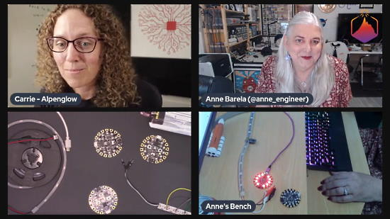](https://www.youtube.com/watch?v=vKHaoLdtFCE)

Anne Barela, a member of the CircuitPython Team at Adafruit *(and your newsletter editor)* appeared on the Alpenglow Industries Solder Sesh #45 on October 6th. Anne and Alpenglow founder Carrie discussed CircuitPython, Circuit Playground boards, and much more - [YouTube](https://www.youtube.com/watch?v=vKHaoLdtFCE).

## Making a Talking Macintosh with CircuitPython

[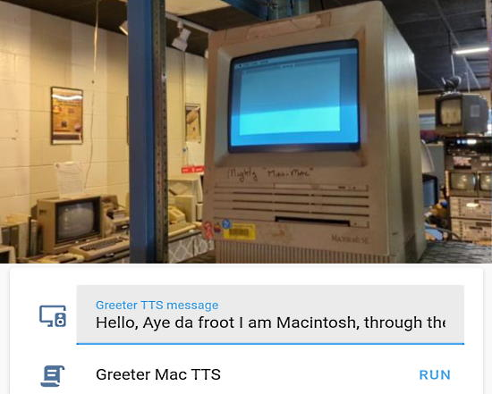](https://gist.github.com/matt-desmarais/20e785dca34181b88d8d4f8b32ad5827)

A talking Mac SE! It is set to speak any message it receives using a USB wombat and Adafruit Metro ESP32-S2. It is controlled through Home Assistant using MQTT, using CircuitPython. "My friend set the Mac up to boot to the speech program so it's going to be part of our tour." - [Discord](https://ptb.discord.com/channels/327254708534116352/334905778857050125/1028374598724620389) and [GitHub](https://gist.github.com/matt-desmarais/20e785dca34181b88d8d4f8b32ad5827).

## This Week's Python Streams

Python on Hardware is all about building a cooperative ecosphere which allows contributions to be valued and to grow knowledge. Below are the streams within the last week focusing on the community.

### CircuitPython Deep Dive Stream

[This week](https://youtu.be/CfBYoHYcpBQ), Tim streamed work on debugging an issue with BitmapLabels and Blinka_DisplayIO.

You can see the latest video and past videos on the Adafruit YouTube channel under the Deep Dive playlist - [YouTube](https://www.youtube.com/playlist?list=PLjF7R1fz_OOXBHlu9msoXq2jQN4JpCk8A).

### CircuitPython Parsec

John Park’s CircuitPython Parsec this week is on Boot_Out.txt - [Adafruit Blog](https://blog.adafruit.com/2022/10/10/john-parks-circuitpython-parsec-boot_out-txt-adafruit-johnedgarpark-adafruit-circuitpython/) and [YouTube](https://youtu.be/k6CZ0JdkZeo).

Catch all the episodes in the [YouTube playlist](https://www.youtube.com/playlist?list=PLjF7R1fz_OOWFqZfqW9jlvQSIUmwn9lWr).

### The CircuitPython Show

The CircuitPython Show is an independent podcast hosted by Paul Cutler, focusing on the people doing awesome things with CircuitPython. Each episode features Paul in conversation with a guest for a short interview – [CircuitPythonShow](https://circuitpythonshow.com/) and [Twitter](https://twitter.com/circuitpyshow).

The show is off this week.  Last week featured Bradán Lane, who shared how he uses CircuitPython to create a number of products, including the JoyPad and LumosRing.  In the next episode coming this Monday, Jim Mussared, a MicroPython maintainer, joins the show – [Show List](https://circuitpythonshow.com/episodes/all).

## Project of the Week: Tiny Orb

Tiny Orb is done! A tiny 4x4 NeoPixel ball by GeekMomProjects is a marvel of compactness. It uses a SeeedStudio Xiao board running CircuitPython. A 5x5 ball is promised next - [Twitter Thread](https://twitter.com/GeekMomProjects/status/1577136595068588032) and [GitHub](https://github.com/geekmomprojects/CubeSphere).

## News from around the web!

[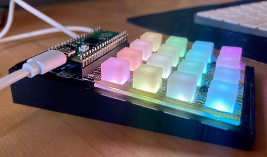](https://blog.adafruit.com/2022/10/05/a-raspberry-pi-pico-dd-keyboard-circuitpython-raspberrypi-keyboard-tomshardware-raspberry_pi/)

A Raspberry Pi Pico D&D keyboard with Raspberry Pi Pico and CircuitPython- [Adafruit Blog](https://blog.adafruit.com/2022/10/05/a-raspberry-pi-pico-dd-keyboard-circuitpython-raspberrypi-keyboard-tomshardware-raspberry_pi/), [YouTube](https://youtu.be/cdB_y9KhCgY) and [Tom's Hardware](https://www.tomshardware.com/news/raspberry-pi-pico-adds-ambience-to-tabletop-adventures).

LoRa point to point communications with CircuitPython on MaPIE LoRa RP2040 boards - [Leon Anavi](https://www.anavi.org/article/249/).

[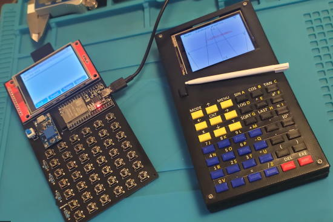](https://hackaday.io/project/187213-galdeano-handheld-computer)

Galdeano is a Python handheld computer with a complete keyboard and a symbolic math engine inside - [hackaday.io](https://hackaday.io/project/187213-galdeano-handheld-computer).

A list of text-only news sites. Handy when looking for information for display by microcontrollers - [Greycoder](https://greycoder.com/a-list-of-text-only-new-sites/).

Using a Feather ESP32-S2 with an RGB matrix display and FeatherWing with CircuitPython - [Twitter](https://twitter.com/TreasureDev/status/1579307736717664257).

Raspberry Pi was at Maker Faire Rome and posted using MicroPython on a Pico W lighting NeoPixels - [Twitter](https://twitter.com/Raspberry_Pi/status/1578410577378131968).

Updated: CircuitPython School Video: Build a DJ Board with CircuitPython audiomixer - [YouTube](https://www.youtube.com/watch?v=ZJdLcgdAh1k).

A "Ghost Detector" in time for Halloween with micro:bit and MicroPython - [Twitter](https://twitter.com/deejaygraham/status/1578431530241622016).

A new video on the micro:bit Python editor - [YouTube](https://www.youtube.com/watch?v=mREwMW69qKc).

> Starting to think about future CircuitPython camera support. This is a test of a green screen filter for WeatherLars on an Adafruit PyPortal using the PaletteFilter library. It is also available in the Community Bundle - [Twitter](https://twitter.com/CedarGroveMakr/status/1578527113829048320) and [GitHub](https://github.com/CedarGroveStudios/CircuitPython_PaletteFilter).

[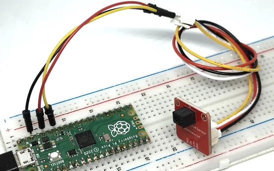](https://peppe8o.com/raspberry-pi-pico-ir-reflective-sensor/)

IR reflective sensor and Raspberry PI Pico: RPR-220 with MicroPython - [peppe80](https://peppe8o.com/raspberry-pi-pico-ir-reflective-sensor/).

PythonBytes Episode #304: Build your own text adventure language in Python - [PythonBytes](https://pythonbytes.fm/episodes/show/304/build-your-own-text-adventure-language-in-python).

[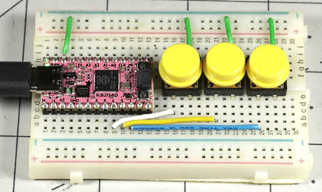](https://embeddedcomputing.com/technology/open-source/easily-create-a-custom-macro-interface-with-the-raspberry-pi-rp2040)

Easily Create a Custom Macro Interface with the Raspberry Pi RP2040. Uses an Adafruit KB2040 and CircuitPython - [Embedded Computing Design](https://embeddedcomputing.com/technology/open-source/easily-create-a-custom-macro-interface-with-the-raspberry-pi-rp2040).

[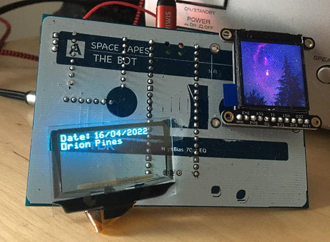](https://twitter.com/thebotmakes/status/1578056913316716544)

> Almost finished, but if I'm not going to post this in World Space Week when am I? This uses APOD data: Music is MIDI data generated from the picture using Python, processed in Live Runs on a Raspberry Pi Pico programmed in MicroPython - [Twitter](https://twitter.com/thebotmakes/status/1578056913316716544).

[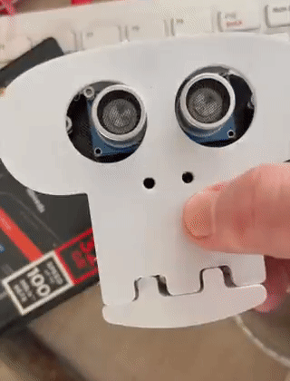](https://twitter.com/kevsmac/status/1578768637015429120)

A 3D printed animated skeleton with MicroPython - [Guide](https://www.kevsrobots.com/blog/spooky-scary-skeleton.html) and [Twitter](https://twitter.com/kevsmac/status/1578768637015429120).

[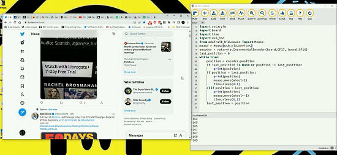](https://twitter.com/biglesp/status/1578704794675740673)

A rotary encoder based scroll wheel with CircuitPython - [Twitter](https://twitter.com/biglesp/status/1578704794675740673).

[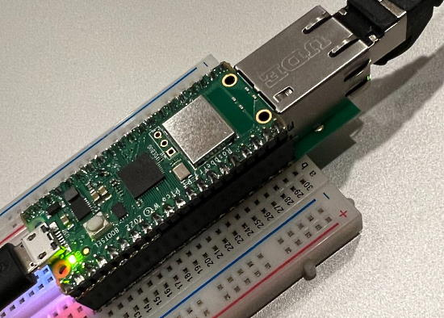](https://twitter.com/anecdat/status/1578618663028273155)

Making a WiFi + Ethernet project with Raspberry Pi Pico W, a Wiznet W5100S Ethernet Hat and CircuitPython 8 beta - [Twitter](https://twitter.com/anecdat/status/1578618663028273155) and [GitHub](https://gist.github.com/anecdata/75ab1f977782008d33b5b3c6201e6dc1).

Using a Raspberry Pi Pico W to log data from BME280 and ENS160 sensors to Adafruit IO with CircuitPython - [Twitter](https://twitter.com/BlitzCityDIY/status/1579146569055891457).

[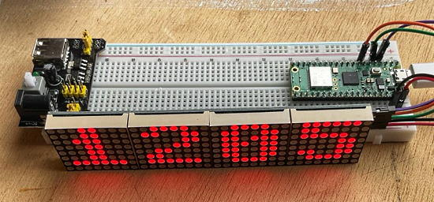](https://twitter.com/CraftyOldGit/status/1578341956484300802)

An LED matrix clock coded in MicroPython on a Raspberry Pi Pico W getting the time from the internet - [Twitter](https://twitter.com/CraftyOldGit/status/1578341956484300802).

Remove Image Background using Python - [Twitter](https://twitter.com/clcoding/status/1578192383144910848) and [YouTube](https://www.youtube.com/watch?v=RkdFkhfMK2k).

[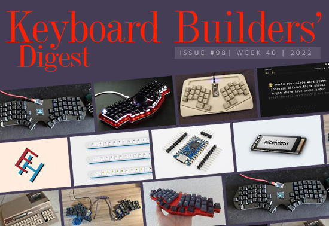](https://kbd.news/issue/98/)

Issue #98 of Keyboard Builders' Digest, a weekly round-up of DIY keyboard related news and tips, is out - [kbd.net](https://kbd.news/issue/98/).

[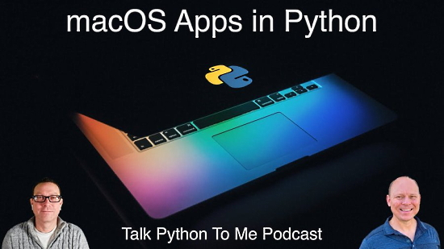](https://blog.adafruit.com/2022/10/05/building-macos-apps-with-python-python-mac-apple-talkpython/)

Building macOS Apps with Python - [Adafruit Blog](https://blog.adafruit.com/2022/10/05/building-macos-apps-with-python-python-mac-apple-talkpython/) and [YouTube](https://youtu.be/ndFFgJhrUhQ).

13 free Python PDF books - [Twitter](https://twitter.com/clcoding/status/1578072143140556800).

PyDev of the Week: NAME on [Mouse vs Python](https://www.blog.pythonlibrary.org/2022/10/10/pydev-of-the-week-sybren-stuvel/): Sybren Stüvel

The CircuitPython Weekly Meeting will be held on October 11th due to a US holiday October 10th.

#ICYDNCI What was the most popular, most clicked link, in [last week's newsletter](https://www.adafruitdaily.com/2022/10/04/python-on-microcontrollers-newsletter-circuitpython-8-beta-1-hacktoberfest-and-much-more-circuitpython-micropython-thepsf-raspberry_pi/)? [You Can't Buy a Raspberry Pi — Why?](https://www.youtube.com/watch?v=Krpac-MaD5s).

## New

[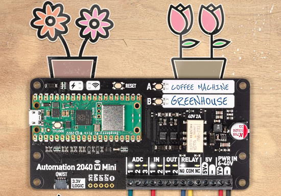](https://shop.pimoroni.com/products/automation-2040-w-mini?variant=40336518086739)

The Pimoroni Automation 2040 W Mini is a compact Pico W / RP2040 powered monitoring and automation board. It has a host of useful features for controlling other bits of electronic and industrial kit - analog channels, powered outputs, buffered inputs and a relay. Perfect for controlling fans, pumps, solenoids, chunky motors, electronic locks or static LED lighting (up to 40V). Programmable in MicroPython and C/C++ - [Pimoroni](https://shop.pimoroni.com/products/automation-2040-w-mini?variant=40336518086739).

ANAVI Macro Pad 10 & Knob boards use SeeedStudio Xiao RP2040 and CircuitPython via KMK firmware - [CrowdSupply](https://www.crowdsupply.com/anavi-technology/anavi-macro-pad-10) via [Twitter](https://twitter.com/rareblog/status/1579395291341471744).

Banana Pi posts a video asking if a BPI-PicoW-S3 install and using the Mu editor with CircuitPython is better than with a Raspberry Pi Pico W - [YouTube](https://www.youtube.com/watch?v=K2_YXf0Eovc).

## New Boards Supported by CircuitPython

The number of supported microcontrollers and Single Board Computers (SBC) grows every week. This section outlines which boards have been included in CircuitPython or added to [CircuitPython.org](https://circuitpython.org/).

This week, there are eight new boards!

- [STM32F446RE Nucleo](https://circuitpython.org/board/nucleo_f446re/)
- [Challenger RP2040 WiFi/BLE](https://circuitpython.org/board/challenger_rp2040_wifi_ble/)
- [Challenger RP2040 SubGHz](https://circuitpython.org/board/challenger_rp2040_subghz/)
- [Lichee RV Dock D1](https://circuitpython.org/blinka/lichee_rv_dock_d1/)
- [Orange Pi 4](https://circuitpython.org/blinka/orange_pi_4/)
- [Orange Pi 4 LTS](https://circuitpython.org/blinka/orange_pi_4_lts/)
- [SIMATIC IOT2050](https://circuitpython.org/blinka/siemens_simatic_iot2050/)
- [SIMATIC IOT2050 Advance](https://circuitpython.org/blinka/siemens_simatic_iot2050_advance/)

*Note: For non-Adafruit boards, please use the support forums of the board manufacturer for assistance, as Adafruit does not have the hardware to assist in troubleshooting.*

Looking to add a new board to CircuitPython? It's highly encouraged! Adafruit has four guides to help you do so:

- [How to Add a New Board to CircuitPython](https://learn.adafruit.com/how-to-add-a-new-board-to-circuitpython/overview)
- [How to add a New Board to the circuitpython.org website](https://learn.adafruit.com/how-to-add-a-new-board-to-the-circuitpython-org-website)
- [Adding a Single Board Computer to PlatformDetect for Blinka](https://learn.adafruit.com/adding-a-single-board-computer-to-platformdetect-for-blinka)
- [Adding a Single Board Computer to Blinka](https://learn.adafruit.com/adding-a-single-board-computer-to-blinka)

## New Learn Guides!

[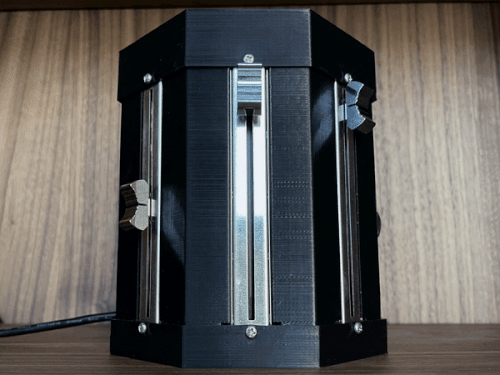](https://learn.adafruit.com/guides/latest)

[Darth Faders](https://learn.adafruit.com/darth-faders) from [John Park](https://learn.adafruit.com/u/johnpark)

[Cheekmate - a Wireless Haptic Communication System](https://learn.adafruit.com/cheekmate-wireless-haptic-communication)

## Updated Learn Guides!

[Arduino to CircuitPython](https://learn.adafruit.com/arduino-to-circuitpython)

## CircuitPython Libraries!

CircuitPython support for hardware continues to grow. We are adding support for new sensors and breakouts all the time, as well as improving on the drivers we already have. As we add more libraries and update current ones, you can keep up with all the changes right here!

For the latest libraries, download the [Adafruit CircuitPython Library Bundle](https://circuitpython.org/libraries). For the latest community contributed libraries, download the [CircuitPython Community Bundle](https://github.com/adafruit/CircuitPython_Community_Bundle/releases).

If you'd like to contribute, CircuitPython libraries are a great place to start. Have an idea for a new driver? File an issue on [CircuitPython](https://github.com/adafruit/circuitpython/issues)! Have you written a library you'd like to make available? Submit it to the [CircuitPython Community Bundle](https://github.com/adafruit/CircuitPython_Community_Bundle). Interested in helping with current libraries? Check out the [CircuitPython.org Contributing page](https://circuitpython.org/contributing). We've included open pull requests and issues from the libraries, and details about repo-level issues that need to be addressed. We have a guide on [contributing to CircuitPython with Git and GitHub](https://learn.adafruit.com/contribute-to-circuitpython-with-git-and-github) if you need help getting started. You can also find us in the #circuitpython channels on the [Adafruit Discord](https://adafru.it/discord).

You can check out this [list of all the Adafruit CircuitPython libraries and drivers available](https://github.com/adafruit/Adafruit_CircuitPython_Bundle/blob/master/circuitpython_library_list.md). 

The current number of CircuitPython libraries is **339**!

* **New Libraries**
  * [Adafruit_CircuitPython_DisplayIO_FlipClock](https://github.com/adafruit/Adafruit_CircuitPython_DisplayIO_FlipClock)

* **Updated Libraries**
  * [Adafruit_CircuitPython_ESP_ATcontrol](https://github.com/adafruit/Adafruit_CircuitPython_ESP_ATcontrol)
  * [Adafruit_CircuitPython_INA260](https://github.com/adafruit/Adafruit_CircuitPython_INA260)
  * [Adafruit_CircuitPython_LIS331](https://github.com/adafruit/Adafruit_CircuitPython_LIS331)
  * [Adafruit_CircuitPython_Colorsys](https://github.com/adafruit/Adafruit_CircuitPython_Colorsys)
  * [Adafruit_CircuitPython_turtle](https://github.com/adafruit/Adafruit_CircuitPython_turtle)
  * [Adafruit_CircuitPython_SI5351](https://github.com/adafruit/Adafruit_CircuitPython_SI5351)
  * [Adafruit_CircuitPython_RA8875](https://github.com/adafruit/Adafruit_CircuitPython_RA8875)
  * [Adafruit_CircuitPython_VL53L0X](https://github.com/adafruit/Adafruit_CircuitPython_VL53L0X)
  * [Adafruit_CircuitPython_PIOASM](https://github.com/adafruit/Adafruit_CircuitPython_PIOASM)
  * [Adafruit_CircuitPython_LTR329_LTR303](https://github.com/adafruit/Adafruit_CircuitPython_LTR329_LTR303)
  * [Adafruit_CircuitPython_NTP](https://github.com/adafruit/Adafruit_CircuitPython_NTP)
  * [Adafruit_CircuitPython_Fingerprint](https://github.com/adafruit/Adafruit_CircuitPython_Fingerprint)
  * [Adafruit_CircuitPython_Display_Shapes](https://github.com/adafruit/Adafruit_CircuitPython_Display_Shapes)
  * [Adafruit_CircuitPython_TCA8418](https://github.com/adafruit/Adafruit_CircuitPython_TCA8418)
  * [Adafruit_CircuitPython_SI1145](https://github.com/adafruit/Adafruit_CircuitPython_SI1145)
  * [Adafruit_CircuitPython_Simple_Text_Display](https://github.com/adafruit/Adafruit_CircuitPython_Simple_Text_Display)
  * [Adafruit_CircuitPython_GPS](https://github.com/adafruit/Adafruit_CircuitPython_GPS)
  * [Adafruit_CircuitPython_SSD1306](https://github.com/adafruit/Adafruit_CircuitPython_SSD1306)
  * [Adafruit_Blinka_bleio](https://github.com/adafruit/Adafruit_Blinka_bleio)
  * [Adafruit_Python_PlatformDetect](https://github.com/adafruit/Adafruit_Python_PlatformDetect)

## What’s the team up to this week?

What is the team up to this week? Let’s check in!

**Dan**

I released CircuitPython 8.0.0-beta.1 on October 1. Given the speed with which Jeff is improving the Pico W WiFi implementation, I expect to do another beta release soon.

I improved dotenv parsing, to make it match the CPython version more closely. I also added a test, which Jeff improved to run automatically.

The Module Support Matrix in the ReadTheDocs documentation for CircuitPython lists which native modules are available on which boards. It was missing a few modules, and I added those: `_asyncio`, `array`, `builtins`, `collections`, `io`, `select`, and `sys`, all of which link to the appropriate documentation.

I am now investigating some Espressif WiFi problems, aided by a lot of testing from the community.

**Kattni**

This week I continued on the LTR-329 and LTR-303 guide. There was a fix to both the Arduino and CircuitPython libraries that came in with good timing, as I had not yet started those sections of the guide. 

I also tested issue #6676 on the CircuitPython core. This was an issue someone experienced regarding running `TimeAlarm` and `PinAlarm` together. Turns out the issue was never with running them together, but with a particular way `PinAlarm` expects to be set up. I closed that issue as resolved and created a new issue regarding the actual problem.

**Melissa**

This past week I decided to take a break from working on the [CircuitPython Code Editor](https://code.circuitpython.org/) and turn my attention back to Raspberry Pi OS Bullseye and Picamera2 now that a newer version of Raspberry Pi OS has come out with it included. My goal was to update the [Running TensorFlow Lite Object Recognition on the Raspberry Pi 4](https://learn.adafruit.com/running-tensorflow-lite-on-the-raspberry-pi-4) guide, but it ended up being quite a rabbit hole. I was able to mostly get the code updated to work in the desktop environment, but with lots of testing, it doesn't appear to currently run on Raspberry Pi OS lite. I will keep working on a few other things before getting back to the Code editor.

**Liz**

This past week I worked on a [CircuitPython Controller for Trombone Champ](https://learn.adafruit.com/circuitpython-trombone-champ-controller). Trombone Champ is a fun rhythm game similar to Guitar Hero but featuring a trombone. A lot of folks have been making custom controllers, so we thought it'd be fun to make a CircuitPython one using a NeoSlider and an arcade button with a QT Py RP2040. 

I also worked on adapting the [Easy No-Soldering Bluetooth Controlled Room Lights](https://learn.adafruit.com/easy-no-solder-bluetooth-controlled-room-lights/overview) project for the [CLUE and imported the project into PyLeap](https://learn.adafruit.com/pyleap-ble-controlled-neopixels-with-clue) and wrote up a guide for it. The project uses the Bluefruit Connect app to control a strip of NeoPixels by using the controller and color wheel modules to change the color or animation. For the CLUE, I added that the animation name or RGB color code is displayed on the screen.

## Upcoming events!

The next MicroPython Meetup in Melbourne will be on September 28th – [Meetup](https://www.meetup.com/MicroPython-Meetup/). See the [slides](https://docs.google.com/presentation/d/e/2PACX-1vQnoz0AsGaxVf8iaqzYszFUnKqRZTUplnzwJoTtqKBmNYIuo5NL-M1bT5Zoz9ajyHwNxIrWi4zNudUF/pub?start=false&loop=false&delayms=3000&slide=id.p) of the August 24th meeting.

[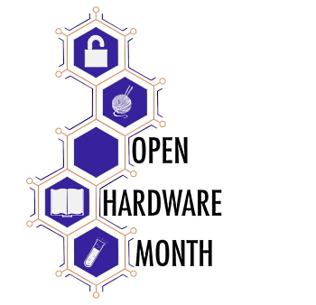](https://ohm.oshwa.org/)

October is Open Hardware Month – OSHWA.

[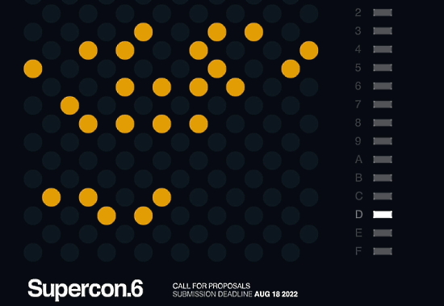](https://hackaday.com/2022/07/18/the-2022-hackaday-supercon-is-on-and-the-call-for-proposals-is-open/)

After two years in remote mode, Hackaday is very excited to announce that this year’s Hackaday Supercon will be coming back, live! Nov. 4th, 5th, and 6th in sunny Pasadena, CA for three days of hacks, talks, and socializing with the Hackaday community - [Call for proposals](https://docs.google.com/forms/d/e/1FAIpQLSffBmw2vNLZyzdKnPJhKF6u7nvYnjTZQ-lynOhhr8_S8fAd3w/viewform) and [Hackaday](https://hackaday.com/2022/07/18/the-2022-hackaday-supercon-is-on-and-the-call-for-proposals-is-open/).

RISC-V Global Summit, December 12-15, 2022 San Jose, California US - [Linux Foundation](https://events.linuxfoundation.org/riscv-summit/), [YouTube](https://youtu.be/VecaMNCuuF0) via [Twitter](https://twitter.com/risc_v/status/1564719040588926979).

PyCon US 2023 will be April 19-17, 2023, again in Salt Lake City, Utah US - [PyCon US 2023](https://pycon.blogspot.com/2020/12/announcing-pycon-us-20222023.html).

**Send Your Events In**

As for other events, with the COVID pandemic, most in-person events are postponed or held online. If you know of virtual events or upcoming events, please let us know on Twitter with hashtag #CircuitPython or email to cpnews(at)adafruit(dot)com.

## Latest releases

CircuitPython's stable release is [7.3.3](https://github.com/adafruit/circuitpython/releases/latest) and its unstable release is [8.0.0-beta.1](https://github.com/adafruit/circuitpython/releases). New to CircuitPython? Start with our [Welcome to CircuitPython Guide](https://learn.adafruit.com/welcome-to-circuitpython).

[20221010](https://github.com/adafruit/Adafruit_CircuitPython_Bundle/releases/latest) is the latest CircuitPython library bundle.

[v1.19.1](https://micropython.org/download) is the latest MicroPython release. Documentation for it is [here](http://docs.micropython.org/en/latest/pyboard/).

[3.10.7](https://www.python.org/downloads/) is the latest Python release. The latest pre-release version is [3.11.0rc2](https://www.python.org/download/pre-releases/).

[3,209 Stars](https://github.com/adafruit/circuitpython/stargazers) Like CircuitPython? [Star it on GitHub!](https://github.com/adafruit/circuitpython)

## Call for help -- Translating CircuitPython is now easier than ever!

One important feature of CircuitPython is translated control and error messages. With the help of fellow open source project [Weblate](https://weblate.org/), we're making it even easier to add or improve translations. 

Sign in with an existing account such as GitHub, Google or Facebook and start contributing through a simple web interface. No forks or pull requests needed! As always, if you run into trouble join us on [Discord](https://adafru.it/discord), we're here to help.

## jobs.adafruit.com - Find a dream job, find great candidates!

[jobs.adafruit.com](https://jobs.adafruit.com/) has returned and folks are posting their skills (including CircuitPython) and companies are looking for talented makers to join their companies - from Digi-Key, to Hackaday, Micro Center, Raspberry Pi and more.

**Job of the Week**

Wearable Medical Device Development - Medical Device Development - [Adafruit Jobs Board](https://jobs.adafruit.com/job/wearable-medical-device-development/).

## 35,637 thanks!

The Adafruit Discord community, where we do all our CircuitPython development in the open, reached over 35,637 humans - thank you!  Adafruit believes Discord offers a unique way for Python on hardware folks to connect. Join today at [https://adafru.it/discord](https://adafru.it/discord).

## ICYMI - In case you missed it

Python on hardware is the Adafruit Python video-newsletter-podcast! The news comes from the Python community, Discord, Adafruit communities and more and is broadcast on ASK an ENGINEER Wednesdays. The complete Python on Hardware weekly videocast [playlist is here](https://www.youtube.com/playlist?list=PLjF7R1fz_OOXRMjM7Sm0J2Xt6H81TdDev). The video podcast is on [iTunes](https://itunes.apple.com/us/podcast/python-on-hardware/id1451685192?mt=2), [YouTube](http://adafru.it/pohepisodes), [IGTV (Instagram TV](https://www.instagram.com/adafruit/channel/)), and [XML](https://itunes.apple.com/us/podcast/python-on-hardware/id1451685192?mt=2).

[The weekly community chat on Adafruit Discord server CircuitPython channel - Audio / Podcast edition](https://itunes.apple.com/us/podcast/circuitpython-weekly-meeting/id1451685016) - Audio from the Discord chat space for CircuitPython, meetings are usually Mondays at 2pm ET, this is the audio version on [iTunes](https://itunes.apple.com/us/podcast/circuitpython-weekly-meeting/id1451685016), Pocket Casts, [Spotify](https://adafru.it/spotify), and [XML feed](https://adafruit-podcasts.s3.amazonaws.com/circuitpython_weekly_meeting/audio-podcast.xml).

## Codecademy "Learn Hardware Programming with CircuitPython"

Codecademy, an online interactive learning platform used by more than 45 million people, has teamed up with Adafruit to create a coding course, “Learn Hardware Programming with CircuitPython”. The course is now available in the [Codecademy catalog](https://www.codecademy.com/learn/learn-circuitpython?utm_source=adafruit&utm_medium=partners&utm_campaign=circuitplayground&utm_content=pythononhardwarenewsletter).

## Contribute!

The CircuitPython Weekly Newsletter is a CircuitPython community-run newsletter emailed every Tuesday. The complete [archives are here](https://www.adafruitdaily.com/category/circuitpython/). It highlights the latest CircuitPython related news from around the web including Python and MicroPython developments. To contribute, edit next week's draft [on GitHub](https://github.com/adafruit/circuitpython-weekly-newsletter/tree/gh-pages/_drafts) and [submit a pull request](https://help.github.com/articles/editing-files-in-your-repository/) with the changes. You may also tag your information on Twitter with #CircuitPython. 

Join the Adafruit [Discord](https://adafru.it/discord) or [post to the forum](https://forums.adafruit.com/viewforum.php?f=60) if you have questions.
