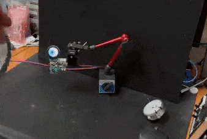
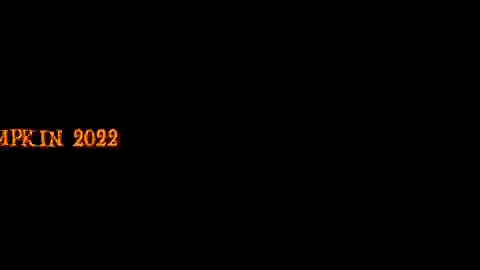
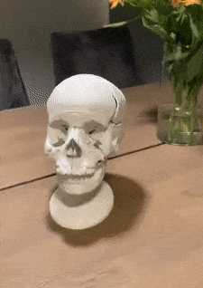
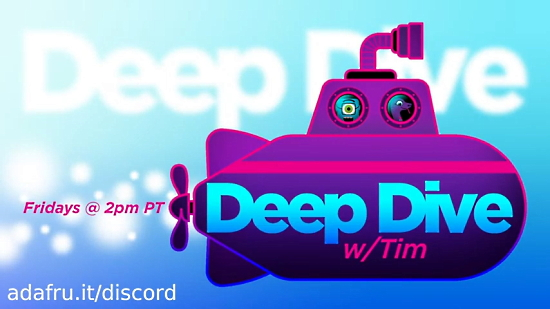
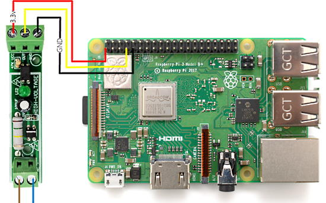
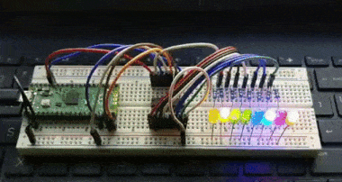
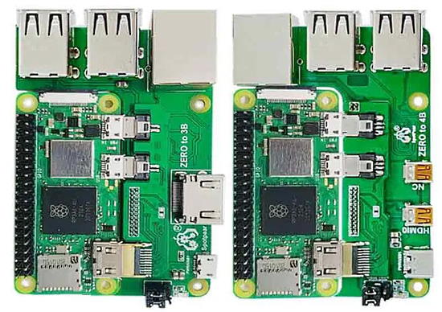
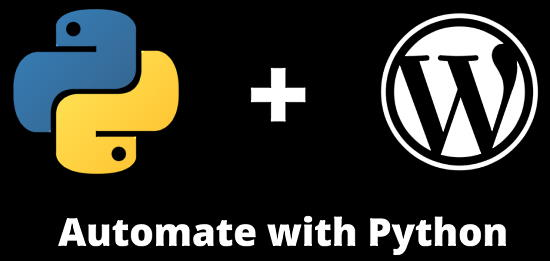
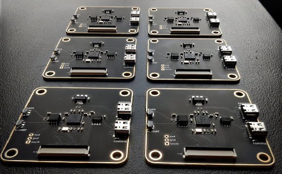
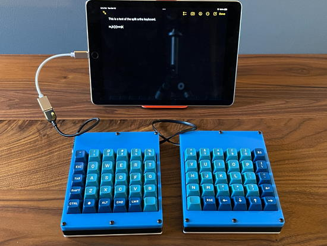

- [ ] Kattni updates
- [ ] change date
- [ ] update title
- [ ] Feature story
- [ ] Update  for images
- [ ] Update ICYDNCI
- [ ] All images 550w max only
- [ ] Link "View this email in your browser."

News Sources

- [python.org](https://www.python.org/)
- [Python Insider - dev team blog](https://pythoninsider.blogspot.com/)
- [MicroPython Meetup Blog](https://melbournemicropythonmeetup.github.io/)
- [hackaday.io newest projects MicroPython](https://hackaday.io/projects?tag=micropython&sort=date) and [CircuitPython](https://hackaday.io/projects?tag=circuitpython&sort=date)
- [hackaday CircuitPython](https://hackaday.com/blog/?s=circuitpython) and [MicroPython](https://hackaday.com/blog/?s=micropython)
- [hackster.io CircuitPython](https://www.hackster.io/search?q=circuitpython&i=projects&sort_by=most_recent) and [MicroPython](https://www.hackster.io/search?q=micropython&i=projects&sort_by=most_recent)
- [https://opensource.com/tags/python](https://opensource.com/tags/python)

View this email in your browser. **Warning: Flashing Imagery**

Welcome to the latest Python on Microcontrollers newsletter!  - *Ed.*

We're on [Discord](https://discord.gg/HYqvREz), [Twitter](https://twitter.com/search?q=circuitpython&src=typed_query&f=live), and for past newsletters - [view them all here](https://www.adafruitdaily.com/category/circuitpython/). If you're reading this on the web, [subscribe here](https://www.adafruitdaily.com/). Here's the news this week:

## Halloween Round-Up

This Halloween (October 31st) has seen a bonanza of maker projects and so many of them used Python, MicroPython or CircuitPython. It appears using Python and current hardware is making it easier for people to make creastive, feature-rich projects.

A CircuitPython eyeball working with the $10 I2C Person Sensor from Pete Warden's Useful Sensors and an Adafruit QTPy RP2040 - [Twitter](https://twitter.com/todbot/status/1584662808691896320) annd [GitHub](https://github.com/todbot/circuitpython-tricks/blob/main/larger-tricks/eyeballs/qteye_person_sensor.py).

A Guy Fawkes Noods Pumpkin using an Adafruit Feather ESP32-S2 + M4 Express w/Propmaker Featherwing programmed in CircuitPython. Uses a 3W LED inside and Adafruit N00ds LED strings outside - [GitHub](https://github.com/DJDevon3/My_Circuit_Python_Projects/blob/main/Boards/espressif/Adafruit%20Feather%20ESP32-S2/Guy%20Fawkes%20Pumpkin%202022/README.md).

The Computer Science Foundations class at Mountain Vista HS uses Adafruit Circuit Playgrounds to light up pumpkin creations - [Twitter](https://twitter.com/melynnTchCS/status/1585330034037792768).

A motion activated animatronic skull without any visible sensors. It’s got a Raspberry Pi Pico running CircuitPython for PWM MP3 audio - [Twitter](https://twitter.com/SimenZhor/status/1584939478443266049).

Countdown to Halloween with Raspberry Pi Pico or any RP2040, 2 8x8 LED matrix, jumper wire, battery pack, breadboard and MicroPython - [GurgleApps](https://gurgleapps.com/learn/projects/8x8-led-matrix-halloween-jack-o-lantern-pumpkin-project-with-a-pico) and [GitHub](https://github.com/gurgleapps/pico-pumpkin) via [Twitter](https://twitter.com/GurgleApps/status/1585600094551916544).

## CircuitPython 8.0.0 Beta 4 Released

CircuitPython 8.0.0-beta.4 was just released. It is relatively stable, but there will be further additions and fixes before final release - [Adafruit Blog](https://blog.adafruit.com/2022/10/30/circuitpython-8-0-0-beta-4-released/).

WARNING: The flash partitioning for 2MB and 4MB flash ESP32 and ESP32-C3 boards has changed since 8.0.0-beta.2. When you load 8.0.0-beta.3 or later over beta.2 (or vice versa), on these boards, CIRCUITPY will be erased and reformatted. Also: The flash partitioning for the Raspberry Pi Pico W has changed since 8.0.0-beta.1. When you load 8.0.0-beta.2 or later over beta.1 (or vice versa), on the Pico W, CIRCUITPY will be erased and reformatted.

**Notable changes since 8.0.0-beta.3**

* ESP32-C3 builds now work again.
* Raspberry Pi Pico W can act as a server, and can use static IP addresses.

## macOS Ventura Released, Breaks UF2 File Copy

macOS Ventura has introduced a regression bug in copying UF2 files to microcontroller boards. At present, copying with Finder results in a cryptic error. In the Terminal, you can use cp -X at the moment. A number of maker companies are jointly reaching out to Apple to seek a fix. Raspberry Pi has stated they'll make a blog post about the issue and current status on November 1st.

## OSHWA Announces New Board Members

The Open Source Hardware Association (OSHWA) has announced their 2022-2024 board members. Congrats to Thea Flowers, David Slik, Jinger Zeng, Oluwatobi Oyinlola, and Michael Weinberg - [OSHWA](https://www.oshwa.org/2022/10/27/2022-2024-new-board-members/).

## Ubuntu Including More Support For RISC-V

Ubuntu is now rolling out development previews of Ubuntu for RISC-V single board computers. This past week, the [Mango Pi MQ Pro D1](https://jamesachambers.com/mangopi-mq-pro-d1-ubuntu-preview/) and [SiPeed LicheeRV](https://liliputing.com/now-you-can-run-ubuntu-on-a-risc-v-computer-that-costs-less-than-20/) received software. Ubuntu notes that not all RISC-V hardware has the power to run a graphical user interface - [Ubuntu Wiki](https://wiki.ubuntu.com/RISC-V).

## Learn to Program in Python with Raspberry Pi Online Courses

If you’re new to teaching programming or looking to build or refresh your programming knowledge, the Raspberry Pi Founndation has a free resource. Their [‘Learn to program in Python’](https://www.raspberrypi.org/courses/learn-python) online course pathway is for educators who want to develop their understanding of the text-based language Python. Each course is packed with information and activities to help you apply what you learn in your classroom teaching - [Raspberry Pi](https://www.raspberrypi.org/blog/learn-to-program-in-python-online-courses-for-teachers/).

## This Week's Python Streams

Python on Hardware is all about building a cooperative ecosphere which allows contributions to be valued and to grow knowledge. Below are the streams within the last week focusing on the community.

### CircuitPython Deep Dive Stream

[This week](https://youtu.be/pv8_P88u1lI), Tim streamed work on Pico W Trivia Game improvement and Core documentation.

You can see the latest video and past videos on the Adafruit YouTube channel under the Deep Dive playlist - [YouTube](https://www.youtube.com/playlist?list=PLjF7R1fz_OOXBHlu9msoXq2jQN4JpCk8A).

### CircuitPython Parsec

John Park’s CircuitPython Parsec this week is on {subject} - [Adafruit Blog](link) and [YouTube](link).

Catch all the episodes in the [YouTube playlist](https://www.youtube.com/playlist?list=PLjF7R1fz_OOWFqZfqW9jlvQSIUmwn9lWr).

### The CircuitPython Show

The CircuitPython Show is an independent podcast hosted by Paul Cutler, focusing on the people doing awesome things with CircuitPython. Each episode features Paul in conversation with a guest for a short interview – [CircuitPythonShow](https://circuitpythonshow.com/) and [Twitter](https://twitter.com/circuitpyshow).

Paul takes the podcast on the road in the latest episode and drives two hours east to Altoona, Wisconsin where he meets up with Jason Pecor and the River Prairie Trolls – [Show List](https://circuitpythonshow.com/episodes/all).

## Project of the Week: Barcodes in Python and CircuitPython

A Code128 barcode generation library in Python (using PIL) and CircuitPython on a 01Studio Lab nRF52840 board (using displayio) - [Twitter](https://twitter.com/Kongduino/status/1584220958809739265) and [GitHub](https://github.com/Kongduino/Code128_Python).

> The library auto-detects whether it needs Code128B (uppercase and lowercase), C (only numbers), or A (uppercase). You pass it a string, the thickness of each module in pixels, and the height of the bars. It does the rest.

## News from around the web!

Text on a 20x2 VFD display from the 1990s. CircuitPython code on a Raspberry Pi Pico W - [Twitter](https://twitter.com/biglesp/status/1585707488376070145).

Py-Opto-Docker is a Python to MQTT for a Raspberry Pi and opto isolator attached to a 240v PIR sensor - [GitHub](https://github.com/lwsrbrts/Py-Opto-Docker).

LED control using a Raspberry Pi Pico and a 74HC595 shift register with MicroPython - [Twitter](https://twitter.com/judenkereuwem/status/1585137797106585600).

Adapters convert a Raspberry Pi Zero 2 W into Raspberry Pi 3 or 4 form factors - [CNX Software](https://www.cnx-software.com/2022/10/25/adapters-convert-raspberry-pi-zero-2-w-into-raspberry-pi-3-or-4/) and a review - [bret.dk](https://bret.dk/raspberry-pi-zero-to-pi-3-adapter-review/).

text - [site](url).

text - [site](url).

text - [site](url).

text - [site](url).

text - [site](url).

text - [site](url).

text - [site](url).

text - [site](url).

text - [site](url).

text - [site](url).

text - [site](url).

text - [site](url).

text - [site](url).

text - [site](url).

How to Generate WordPress Posts Automatically with Python - [FreeCodeCamp](https://www.freecodecamp.org/news/how-to-generate-wordpress-posts-automatically/).

PyDev of the Week: NAME on [Mouse vs Python]()

CircuitPython Weekly Meeting for DATE ([notes]()) [on YouTube]()

**#ICYDNCI What was the most popular, most clicked link, in [last week's newsletter](https://link)? [title](url).**

## New and Coming Soon

Experimental Raspberry Pi RP2040 boards with Patrick Yang's CH340N. It will be running MicroPython - [Twitter](https://twitter.com/mariusheier/status/1585046813375344640).

text - [site](url).

## New Boards Supported by CircuitPython

The number of supported microcontrollers and Single Board Computers (SBC) grows every week. This section outlines which boards have been included in CircuitPython or added to [CircuitPython.org](https://circuitpython.org/).

This week, there were (#/no) new boards added!

- [Board name](url)
- [Board name](url)
- [Board name](url)

*Note: For non-Adafruit boards, please use the support forums of the board manufacturer for assistance, as Adafruit does not have the hardware to assist in troubleshooting.*

Looking to add a new board to CircuitPython? It's highly encouraged! Adafruit has four guides to help you do so:

- [How to Add a New Board to CircuitPython](https://learn.adafruit.com/how-to-add-a-new-board-to-circuitpython/overview)
- [How to add a New Board to the circuitpython.org website](https://learn.adafruit.com/how-to-add-a-new-board-to-the-circuitpython-org-website)
- [Adding a Single Board Computer to PlatformDetect for Blinka](https://learn.adafruit.com/adding-a-single-board-computer-to-platformdetect-for-blinka)
- [Adding a Single Board Computer to Blinka](https://learn.adafruit.com/adding-a-single-board-computer-to-blinka)

## New Learn Guides!

[title](url) from [name](url)

[title](url) from [name](url)

[title](url) from [name](url)

## Updated Learn Guides!

[title](url) from [name](url)

## CircuitPython Libraries!

CircuitPython support for hardware continues to grow. We are adding support for new sensors and breakouts all the time, as well as improving on the drivers we already have. As we add more libraries and update current ones, you can keep up with all the changes right here!

For the latest libraries, download the [Adafruit CircuitPython Library Bundle](https://circuitpython.org/libraries). For the latest community contributed libraries, download the [CircuitPython Community Bundle](https://github.com/adafruit/CircuitPython_Community_Bundle/releases).

If you'd like to contribute, CircuitPython libraries are a great place to start. Have an idea for a new driver? File an issue on [CircuitPython](https://github.com/adafruit/circuitpython/issues)! Have you written a library you'd like to make available? Submit it to the [CircuitPython Community Bundle](https://github.com/adafruit/CircuitPython_Community_Bundle). Interested in helping with current libraries? Check out the [CircuitPython.org Contributing page](https://circuitpython.org/contributing). We've included open pull requests and issues from the libraries, and details about repo-level issues that need to be addressed. We have a guide on [contributing to CircuitPython with Git and GitHub](https://learn.adafruit.com/contribute-to-circuitpython-with-git-and-github) if you need help getting started. You can also find us in the #circuitpython channels on the [Adafruit Discord](https://adafru.it/discord).

You can check out this [list of all the Adafruit CircuitPython libraries and drivers available](https://github.com/adafruit/Adafruit_CircuitPython_Bundle/blob/master/circuitpython_library_list.md). 

The current number of CircuitPython libraries is **###**!

**New Libraries!**

Here's this week's new CircuitPython libraries:

* [library](url)

**Updated Libraries!**

Here's this week's updated CircuitPython libraries:

* [library](url)

## What’s the team up to this week?

What is the team up to this week? Let’s check in!

**Dan**

text - [site](url).

**Kattni**

text - [site](url).

**Melissa**

text - [site](url).

**Tim**

text - [site](url).

**Scott**

text - [site](url).

**Liz**

text - [site](url).

## Upcoming events!

The next MicroPython Meetup in Melbourne will be on November 23rd – [Meetup](https://www.meetup.com/MicroPython-Meetup/). See the [slides](https://www.youtube.com/watch?v=xIVE4KeflFY) of the October 28th meeting.

After two years in remote mode, Hackaday is very excited to announce that this year’s Hackaday Supercon will be coming back, live! Nov. 4th, 5th, and 6th in sunny Pasadena, CA for three days of hacks, talks, and socializing with the Hackaday community - [Call for proposals](https://docs.google.com/forms/d/e/1FAIpQLSffBmw2vNLZyzdKnPJhKF6u7nvYnjTZQ-lynOhhr8_S8fAd3w/viewform) and [Hackaday](https://hackaday.com/2022/07/18/the-2022-hackaday-supercon-is-on-and-the-call-for-proposals-is-open/).

RISC-V Global Summit, December 12-15, 2022 San Jose, California US - [Linux Foundation](https://events.linuxfoundation.org/riscv-summit/), [YouTube](https://youtu.be/VecaMNCuuF0) via [Twitter](https://twitter.com/risc_v/status/1564719040588926979).

PyCon US 2023 will be April 19-17, 2023, again in Salt Lake City, Utah US - [PyCon US 2023](https://pycon.blogspot.com/2020/12/announcing-pycon-us-20222023.html).

**Send Your Events In**

As for other events, with the COVID pandemic, most in-person events are postponed or held online. If you know of virtual events or upcoming events, please let us know on Twitter with hashtag #CircuitPython or email to cpnews(at)adafruit(dot)com.

## Latest releases

CircuitPython's stable release is [#.#.#](https://github.com/adafruit/circuitpython/releases/latest) and its unstable release is [#.#.#-##.#](https://github.com/adafruit/circuitpython/releases). New to CircuitPython? Start with our [Welcome to CircuitPython Guide](https://learn.adafruit.com/welcome-to-circuitpython).

[2022####](https://github.com/adafruit/Adafruit_CircuitPython_Bundle/releases/latest) is the latest CircuitPython library bundle.

[v#.#.#](https://micropython.org/download) is the latest MicroPython release. Documentation for it is [here](http://docs.micropython.org/en/latest/pyboard/).

[#.#.#](https://www.python.org/downloads/) is the latest Python release. The latest pre-release version is [#.#.#](https://www.python.org/download/pre-releases/).

[#,### Stars](https://github.com/adafruit/circuitpython/stargazers) Like CircuitPython? [Star it on GitHub!](https://github.com/adafruit/circuitpython)

## Call for help -- Translating CircuitPython is now easier than ever!

One important feature of CircuitPython is translated control and error messages. With the help of fellow open source project [Weblate](https://weblate.org/), we're making it even easier to add or improve translations. 

Sign in with an existing account such as GitHub, Google or Facebook and start contributing through a simple web interface. No forks or pull requests needed! As always, if you run into trouble join us on [Discord](https://adafru.it/discord), we're here to help.

## jobs.adafruit.com - Find a dream job, find great candidates!

[jobs.adafruit.com](https://jobs.adafruit.com/) has returned and folks are posting their skills (including CircuitPython) and companies are looking for talented makers to join their companies - from Digi-Key, to Hackaday, Micro Center, Raspberry Pi and more.

**Job of the Week**

text - [Adafruit Jobs Board](https://jobs.adafruit.com/).

## NUMBER thanks!

The Adafruit Discord community, where we do all our CircuitPython development in the open, reached over NUMBER humans - thank you!  Adafruit believes Discord offers a unique way for Python on hardware folks to connect. Join today at [https://adafru.it/discord](https://adafru.it/discord).

## ICYMI - In case you missed it

Python on hardware is the Adafruit Python video-newsletter-podcast! The news comes from the Python community, Discord, Adafruit communities and more and is broadcast on ASK an ENGINEER Wednesdays. The complete Python on Hardware weekly videocast [playlist is here](https://www.youtube.com/playlist?list=PLjF7R1fz_OOXRMjM7Sm0J2Xt6H81TdDev). The video podcast is on [iTunes](https://itunes.apple.com/us/podcast/python-on-hardware/id1451685192?mt=2), [YouTube](http://adafru.it/pohepisodes), [IGTV (Instagram TV](https://www.instagram.com/adafruit/channel/)), and [XML](https://itunes.apple.com/us/podcast/python-on-hardware/id1451685192?mt=2).

[The weekly community chat on Adafruit Discord server CircuitPython channel - Audio / Podcast edition](https://itunes.apple.com/us/podcast/circuitpython-weekly-meeting/id1451685016) - Audio from the Discord chat space for CircuitPython, meetings are usually Mondays at 2pm ET, this is the audio version on [iTunes](https://itunes.apple.com/us/podcast/circuitpython-weekly-meeting/id1451685016), Pocket Casts, [Spotify](https://adafru.it/spotify), and [XML feed](https://adafruit-podcasts.s3.amazonaws.com/circuitpython_weekly_meeting/audio-podcast.xml).

## Codecademy "Learn Hardware Programming with CircuitPython"

Codecademy, an online interactive learning platform used by more than 45 million people, has teamed up with Adafruit to create a coding course, “Learn Hardware Programming with CircuitPython”. The course is now available in the [Codecademy catalog](https://www.codecademy.com/learn/learn-circuitpython?utm_source=adafruit&utm_medium=partners&utm_campaign=circuitplayground&utm_content=pythononhardwarenewsletter).

## Contribute!

The CircuitPython Weekly Newsletter is a CircuitPython community-run newsletter emailed every Tuesday. The complete [archives are here](https://www.adafruitdaily.com/category/circuitpython/). It highlights the latest CircuitPython related news from around the web including Python and MicroPython developments. To contribute, edit next week's draft [on GitHub](https://github.com/adafruit/circuitpython-weekly-newsletter/tree/gh-pages/_drafts) and [submit a pull request](https://help.github.com/articles/editing-files-in-your-repository/) with the changes. You may also tag your information on Twitter with #CircuitPython. 

Join the Adafruit [Discord](https://adafru.it/discord) or [post to the forum](https://forums.adafruit.com/viewforum.php?f=60) if you have questions.
