View this email in your browser. **Warning: Flashing Imagery**

Welcome to the latest Python on Microcontrollers newsletter! The US Thanksgiving holiday has come and gone this week and many folks have taken a break away. It is hoped that some people worked on home projects this weekend. It appears so on Mastodon, as the number of items grows. There were some major milestones reached this week with this newsletter growing to over 10,000 subscribers - thank you! Also on the Adafruit Discord, the number of members exceeded 36,000 - fantastic! It's great when like minded folks can share their work and knowledge. Hoping for a wonderful week for all. - *Ed.*

We're on [Discord](https://discord.gg/HYqvREz), [Twitter](https://twitter.com/search?q=circuitpython&src=typed_query&f=live), and for past newsletters - [view them all here](https://www.adafruitdaily.com/category/circuitpython/). If you're reading this on the web, [subscribe here](https://www.adafruitdaily.com/). Here's the news this week:

## 10,024 Newsletter Subscribers!

On November 22nd, the Python on Microcontrollers Newsletter exceeded 10,000 subscribers today! Thank you! Our goal is for this weekly newsletter to be the best source for weekly updates in the Python on hardware space. It's our readership who inspire us. Keep making! - [Adafruit Blog](https://blog.adafruit.com/2022/11/22/the-python-on-microcontrollers-newsletter-reaches-10000-subscribers-python-circuitpython-micropython-adafruit/).

## Discord 36,000 Subscribers

The Adafruit Discord community, where we do all our CircuitPython development in the open, reached over 36,000 humans - thank you!  Adafruit believes Discord offers a unique way for Python on hardware folks to connect. Join today at [https://adafru.it/discord](https://adafru.it/discord). - [Adafruit Blog](https://blog.adafruit.com/2022/11/28/celebrating-over-36000-members-in-the-adafruit-discord-community-adafruit-discord/).

## What is a Real-Time Operating System (RTOS)?

A real-time operating system (RTOS) is an operating system (OS, often a lightweight OS) that runs multi-threaded applications and can meet real-time deadlines. Some microcontrollers use RTOS behind the scenes to run code and to do things like radio. Shawn Hymel explains all the details in this article and video - [maker.io](https://www.digikey.com/en/maker/projects/what-is-a-realtime-operating-system-rtos/28d8087f53844decafa5000d89608016) and [YouTube](https://youtu.be/F321087yYy4).

## Open Source & Saying "No"

[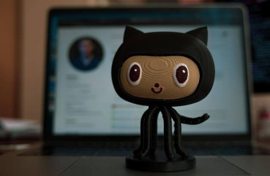](https://connortumbleson.com/2022/11/28/open-source-saying-no/)

From an Open Source maintainer, it's extremely important to say "no" to requests/features that bloat a library too much. Many times it is played out is something like this:

* Talented contributor Z delivers feature X to project Y.
* Project Y accepts it.
* Feature X has an issue in latest release.
* Project Y didn't start that feature so asks contributor Z for some help.
* Contributor Z is not around and the fix is taken in by the project.

So a project shouldn't think about the short term benefit of a new feature, but understand the long term implication of supporting such feature - [Connor Tumbleson](https://connortumbleson.com/2022/11/28/open-source-saying-no/).

## Raspberry Pi Pico: Now Also Made in Kenya

[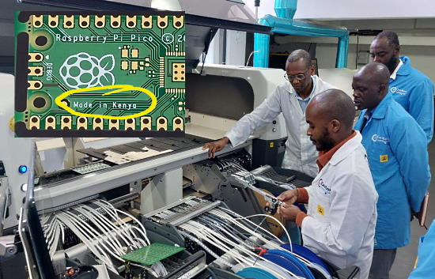](https://twitter.com/benliquidkenya/status/1595384609893765121)

The first pieces of the first run of production of Rasberry Pi Raspberry Pi Pico, manufactured in Kenya - [Twitter](https://twitter.com/benliquidkenya/status/1595384609893765121).

## Seeing Python on Hardware Content on Mastodon

*Ed:* It was pleasant today typing #circuitpython in the Mastodon search box and seeing posts from a multitude of servers plus a follow icon so I could subscribe to that hashtag. If you are on Mastodon, here is a list of hashtags you may wish to follow:

* #MicroPython
* #CircuitPython
* #RaspberryPi
* #Python (although this could be a large number of posts as it is very general)
* #PythonOnHardware

We're promoting the latter as encompasing using any flavor of Python on hardware. Using multiple tags would be best. An article from this week: How to follow a hashtag on Mastodon - [Nerds Chalk](https://nerdschalk.com/how-to-follow-a-hashtag-on-mastodon/).

Here are the official accounts you may want to follow. Content may not be as copious as the hashtags as they are very new:

* @circuitpython@fosstodon.org
* @micropython@fosstodon.org

## This Week's Python Streams

Python on Hardware is all about building a cooperative ecosphere which allows contributions to be valued and to grow knowledge. Below are the streams within the last week focusing on the community.

### CircuitPython Deep Dive Stream

[This week](https://youtu.be/T9rXZB3ujJM), Tim streamed work on PixelMap and core displayio changes.

You can see the latest video and past videos on the Adafruit YouTube channel under the Deep Dive playlist - [YouTube](https://www.youtube.com/playlist?list=PLjF7R1fz_OOXBHlu9msoXq2jQN4JpCk8A).

### CircuitPython Parsec

John Park’s CircuitPython Parsec covers Incremental Iteration - [YouTube](https://youtu.be/TXkzABAgFqA) and [Adafruit Blog](https://blog.adafruit.com/2022/11/28/john-parks-circuitpython-parsec-incremental-iteration-adafruit-johnedgarpark-adafruit-circuitpython/).

Catch all the episodes in the [YouTube playlist](https://www.youtube.com/playlist?list=PLjF7R1fz_OOWFqZfqW9jlvQSIUmwn9lWr).

### The CircuitPython Show

The CircuitPython Show is an independent podcast hosted by Paul Cutler, focusing on the people doing awesome things with CircuitPython. Each episode features Paul in conversation with a guest for a short interview – [CircuitPythonShow](https://circuitpythonshow.com/) and [Twitter](https://twitter.com/circuitpyshow).

The latest episode was released November 28th and features Mark Komus. Mark discusses his Monster Eyes project, contributing to CircuitPython's core, and more – [Show List](https://circuitpythonshow.com/episodes/all).

## Project of the Week

[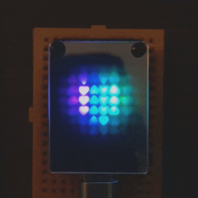](https://mastodon.social/@geekmomprojects/109412139876669042)

Getting CircuitPython up on the Lolin ESP32 C3 Mini, running a webserver, and displaying graphics on the 8x8 LED matrix - [Mastodon thread](https://mastodon.social/@geekmomprojects/109412139876669042).

## News from around the web!

[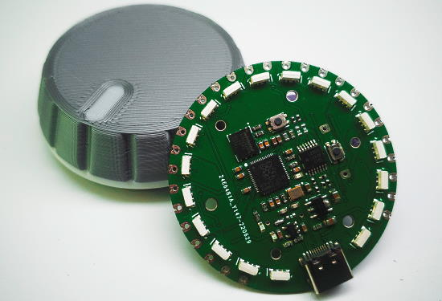](https://github.com/ahmsville/Magnetic_rotary_encoding/tree/master/PICO%20DEV%20M3)

The Pico Dev M3 is a development board based on Raspberry Pi's RP2040 microcontroller chip, the board is also a high-resolution magnetic rotary encoder when paired with a few 3D printed parts, which makes this the perfect board for applications and projects that can benefit from having a rotary encoder, a good example is making macro pads, and other similar secondary controllers. Programmable in MicroPython & C++ - [GitHub](https://github.com/ahmsville/Magnetic_rotary_encoding/tree/master/PICO%20DEV%20M3) via [hackster.io on Mastodon](https://octodon.social/@hackster_io@noc.social/109399746953017508).

[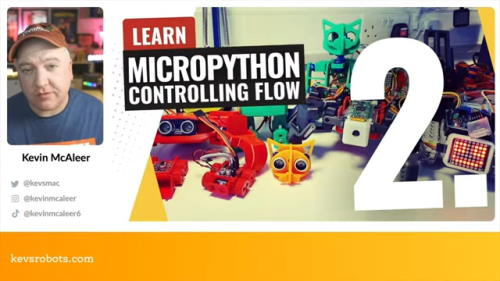](https://youtu.be/ghAnP18sbl8)

Learn MicroPython - Part 2 Controlling the Flow - [YouTube](https://youtu.be/ghAnP18sbl8) via [Twitter](https://twitter.com/kevsmac/status/1596724094309117954?t=H_Lb63eGlCKgxJ_NuRFvkA&s=03).

[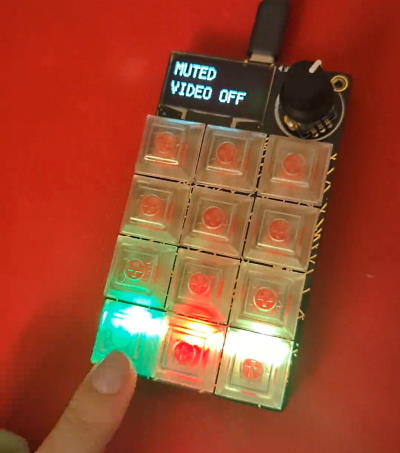](https://hachyderm.io/@Tali/109414002122446764)

Using an Adafruit MacroPad to toggle Zoom video/audio and floating meeting controls and navigate between desktops by turning the encoder - [Mastodon](https://hachyderm.io/@Tali/109414002122446764) and [GitHub](https://github.com/therzka/macropad_things/blob/master/code.py).

[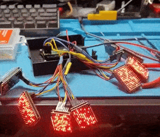](https://twitter.com/basementhacker/status/1595939011171942400)

Making a miniature [Connection Machine](https://en.wikipedia.org/wiki/Connection_Machine) with CircuitPython and Raspberry Pi Pico - [Twitter](https://twitter.com/basementhacker/status/1595939011171942400).

[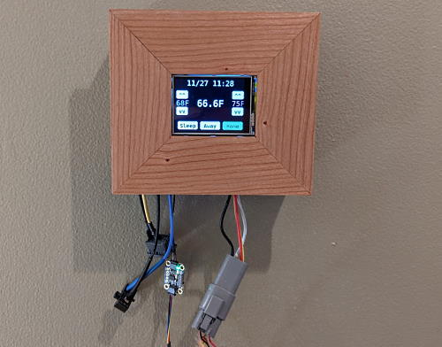](https://mastodon.social/@rtwfroody/109417720213946745)

Thermostat v2 prototype up and running with a nice faceplate. Simple control of a Mitsubishi heatpump using CircuitPython on an Unexpected Maker Feather S3 - [Mastodon](https://mastodon.social/@rtwfroody/109417720213946745).

[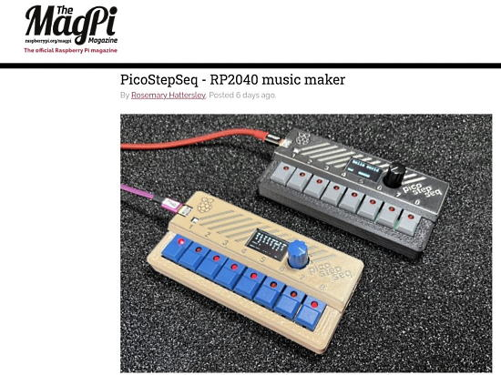](https://magpi.raspberrypi.com/articles/picostepseq-rp2040-music-maker)

Tod's PicoStepSeq sequencer made with RP2040 and CircuitPython is featured in the MagPi Magazine - [MagPi](https://magpi.raspberrypi.com/articles/picostepseq-rp2040-music-maker) via [Mastodon](https://mastodon.social/@todbot/109395390768152890).

Raspberry Pi Pico onboard weather station linked via MQTT and influx database showing the results on Pi Zero e-ink display. MicroPython on the Pico and Python on the Pi Zero - [Twitter](https://twitter.com/Davided19279031/status/1595066187783839746).

[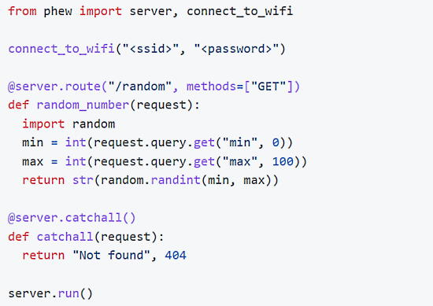](https://github.com/pimoroni/phew)

Pimoroni Phew! v0.0.3 is now available in the Thonny and UPIP package managers for MicroPython. This is great if you want to host a web server on the Pico W (with easy access point creation) - [GitHub](https://github.com/pimoroni/phew).

A fish lamp using NeoPixels and CircuitPython - [Twitter](https://twitter.com/caitlinsdad/status/1595622181483970560?t=93onS5cI8s8lvLMrbJbB6g&s=03).

[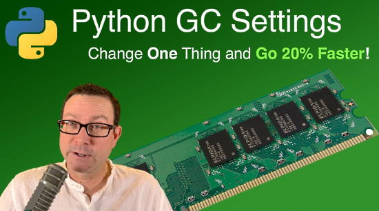](https://mkennedy.codes/posts/python-gc-settings-change-this-and-make-your-app-go-20pc-faster/)

20% faster Python with a single garbage collection (GC) tweak - [mkennedy.codes](https://mkennedy.codes/posts/python-gc-settings-change-this-and-make-your-app-go-20pc-faster/).

Kevin writes: "This weekend I discovered Punpedia, which is like Wikipedia but for Puns... so I'm building an API to deliver puns to Pico W Projects, most likely the Pimoroni Inky Frame... API to be hosted on the shiny new RPi 4 that I unboxed on yesterday's Livestream, running Python" - [Twitter](https://twitter.com/kevsmac/status/1597190626784645122).

[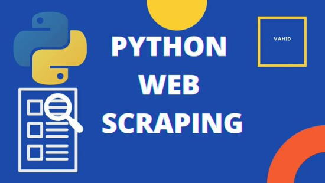](https://twitter.com/Python_Dv/status/1594530840872042496)

Python Web scraping to CSV file - [Pythonology on YouTube](https://youtu.be/RvCBzhhydNk) via [Twitter](https://twitter.com/Python_Dv/status/1594530840872042496).

15 Python Projects in Under 15 Minutes (Code Included) - [morioh.com](https://morioh.com/p/f42a6c5426a7?f=5c21fb01c16e2556b555ab32).

[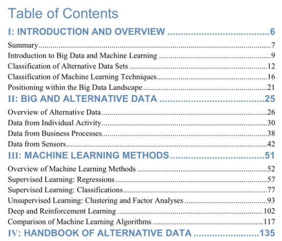](https://www.cfasociety.org/cleveland/Lists/Events%20Calendar/Attachments/1045/BIG-Data_AI-JPMmay2017.pdf)

J.P.Morgan’s Comprehensive 280-page Guide to Machine Learning (with Python code for popular ML algorithms) - [JP Morgan](https://www.cfasociety.org/cleveland/Lists/Events%20Calendar/Attachments/1045/BIG-Data_AI-JPMmay2017.pdf) (large PDF) via [Twitter](https://twitter.com/KirkDBorne/status/1594547974117416963).

PyDev of the Week: Yeray Diaz on [Mouse vs Python](https://www.blog.pythonlibrary.org/2022/11/28/pydev-of-the-week-yeray-diaz/).

CircuitPython Weekly Meeting for November 28, 2022 ([notes](https://github.com/adafruit/adafruit-circuitpython-weekly-meeting/blob/main/2022/2022-11-28.md)) [on YouTube](https://youtu.be/F3GtdEkjWpI).

#ICYDNCI What was the most popular, most clicked link, in [last week's newsletter](https://www.adafruitdaily.com/2022/11/22/python-on-microcontrollers-newsletter-mu-1-2-0-released-wsl-out-of-beta-and-so-much-more-circuitpython-micropython-thepsf-raspberry_pi/)? [Mu version 1.2.0 released](https://github.com/mu-editor/mu/releases/tag/v1.2.0).

## Coming Soon

[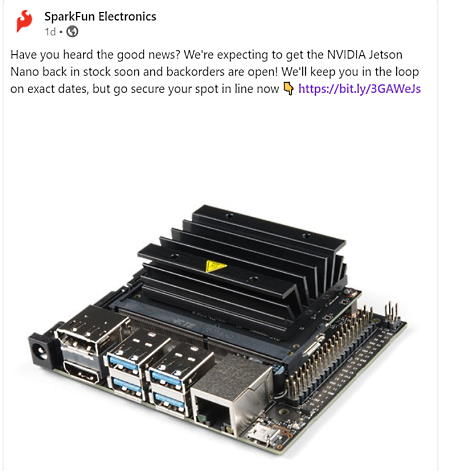](https://developer.nvidia.com/blog/sharpen-your-edge-ai-and-robotics-skills-with-the-nvidia-jetson-nano-developer-kit/)

NVIDIA Jetson Nano Developer Kit (V3) - [NVIDIA](https://developer.nvidia.com/blog/sharpen-your-edge-ai-and-robotics-skills-with-the-nvidia-jetson-nano-developer-kit/), [SparkFun](https://www.sparkfun.com/products/16271) and [Arrow](https://www.arrow.com/en/products/945-13450-0000-100/nvidia).

Raspberry Pi CM4 carrier board with PoE, NVMe, TPM, and more. Ivan is currently doing additional testing and preparing the boards for shipment to beta testers - [Twitter](https://twitter.com/Merocle/status/1597300037645922305).

## New Boards Supported by CircuitPython

The number of supported microcontrollers and Single Board Computers (SBC) grows every week. This section outlines which boards have been included in CircuitPython or added to [CircuitPython.org](https://circuitpython.org/).

This week, there were no new boards added, but several are in process.

*Note: For non-Adafruit boards, please use the support forums of the board manufacturer for assistance, as Adafruit does not have the hardware to assist in troubleshooting.*

Looking to add a new board to CircuitPython? It's highly encouraged! Adafruit has four guides to help you do so:

- [How to Add a New Board to CircuitPython](https://learn.adafruit.com/how-to-add-a-new-board-to-circuitpython/overview)
- [How to add a New Board to the circuitpython.org website](https://learn.adafruit.com/how-to-add-a-new-board-to-the-circuitpython-org-website)
- [Adding a Single Board Computer to PlatformDetect for Blinka](https://learn.adafruit.com/adding-a-single-board-computer-to-platformdetect-for-blinka)
- [Adding a Single Board Computer to Blinka](https://learn.adafruit.com/adding-a-single-board-computer-to-blinka)

## New Learn Guides!

[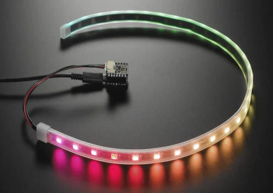](https://learn.adafruit.com/guides/latest)

[Adafruit NeoPixel Driver BFF](https://learn.adafruit.com/adafruit-neopixel-driver-bff) from [Liz Clark](https://learn.adafruit.com/u/BlitzCityDIY)

## CircuitPython Libraries!

CircuitPython support for hardware continues to grow. We are adding support for new sensors and breakouts all the time, as well as improving on the drivers we already have. As we add more libraries and update current ones, you can keep up with all the changes right here!

For the latest libraries, download the [Adafruit CircuitPython Library Bundle](https://circuitpython.org/libraries). For the latest community contributed libraries, download the [CircuitPython Community Bundle](https://github.com/adafruit/CircuitPython_Community_Bundle/releases).

If you'd like to contribute, CircuitPython libraries are a great place to start. Have an idea for a new driver? File an issue on [CircuitPython](https://github.com/adafruit/circuitpython/issues)! Have you written a library you'd like to make available? Submit it to the [CircuitPython Community Bundle](https://github.com/adafruit/CircuitPython_Community_Bundle). Interested in helping with current libraries? Check out the [CircuitPython.org Contributing page](https://circuitpython.org/contributing). We've included open pull requests and issues from the libraries, and details about repo-level issues that need to be addressed. We have a guide on [contributing to CircuitPython with Git and GitHub](https://learn.adafruit.com/contribute-to-circuitpython-with-git-and-github) if you need help getting started. You can also find us in the #circuitpython channels on the [Adafruit Discord](https://adafru.it/discord).

You can check out this [list of all the Adafruit CircuitPython libraries and drivers available](https://github.com/adafruit/Adafruit_CircuitPython_Bundle/blob/master/circuitpython_library_list.md). 

The current number of CircuitPython libraries is **393**!

**Updated Libraries!**

Here's this week's updated CircuitPython libraries:

  * [Adafruit_CircuitPython_NeoPixel](https://github.com/adafruit/Adafruit_CircuitPython_NeoPixel)
  * [Adafruit_CircuitPython_Requests](https://github.com/adafruit/Adafruit_CircuitPython_Requests)
  * [Adafruit_CircuitPython_HTTPServer](https://github.com/adafruit/Adafruit_CircuitPython_HTTPServer)
  * [Adafruit_CircuitPython_MCP4728](https://github.com/adafruit/Adafruit_CircuitPython_MCP4728)
  * [Adafruit_Blinka](https://github.com/adafruit/Adafruit_Blinka)
  * [Adafruit_Python_PlatformDetect](https://github.com/adafruit/Adafruit_Python_PlatformDetect)

**Library PyPI Weekly Download Stats**

* **Total Library Stats**
  * 183107 PyPI downloads over 323 libraries

* **Top 10 Libraries by PyPI Downloads**
  * adafruit-circuitpython-busdevice: 17346
  * adafruit-circuitpython-requests: 16968
  * adafruit-circuitpython-typing: 16379
  * adafruit-circuitpython-register: 1985
  * adafruit-circuitpython-neopixel: 1081
  * adafruit-circuitpython-dht: 1051
  * adafruit-circuitpython-ssd1306: 925
  * adafruit-circuitpython-esp32spi: 918
  * adafruit-circuitpython-display-text: 903
  * adafruit-circuitpython-motor: 884

## What’s the team up to this week?

What is the team up to this week? Let’s check in!

**Dan**

I'm checking and fixing yet more issues for the CircuitPython 8.0.0 release. I haven't been able to replicate the some of the problems described in the last few issues I took on. But in the process of testing, I've found related bugs or problems, so  I've been fixing those instead :).

**Kattni**

This week I worked with Liz on some projects we're working on together. She wrote and collaborated on the code for my next project, the Holiday Countdown Timer using the quad alphanumeric backpacks with STEMMA QT. This no-solder project will include a 3D printed case. It's a short week this week, so I'll be starting on that next week.

**Melissa**

This past week I got back to working on [code.circuitpython.org](https://code.circuitpython.org) and fixed some bugs. I’m currently working on updating the USB workflow with an API function that allows you to select a folder and perform file operations similar to the Web Workflow.

**Tim**

This week I've been working on displayio API changes in the core and integrating the usage of a new core PixelMap class that makes animations more effecient.

**Scott**

This week I've been diving into web workflow on Pico W. I got web workflow going and then moved onto getting the MDNS portion working. MDNS allows CP devices to respond to circuitpython.local and cpy-MAC.local. I got it working before Thanksgiving break and will propose a pull request for it next week.

**Liz**

I wrote a guide for the [NeoPixel Driver BFF](https://learn.adafruit.com/adafruit-neopixel-driver-bff). The board allows you to easily drive a strip a NeoPixels with a QT Py or Xiao form factor board. Up next, I'll be working on a guide for the 5x5 NeoPixel Grid BFF. That board has a 5x5 grid of NeoPixels that attaches to a QT Py or Xiao board. I'm excited to see how folks use it.

I've been working with Kattni on some upcoming project code. I've been using the Mastodon API with CircuitPython on a Pico W to send and receive data from Mastodon. I also wrote code to use three daisy chained alphanumeric displays as a scrolling countdown clock.

## Upcoming events!

The next MicroPython Meetup in Melbourne will be on December 28th – [Meetup](https://www.meetup.com/MicroPython-Meetup/). Slides from the last meeting are [here](https://docs.google.com/presentation/d/e/2PACX-1vQnJM1r7vFuRMq9bzHWXKyjvnmQsDRB30OMVE5Ujcgv75_NGg3prgQ_QzAtVyJoQEdM-x5HvgSrFXS9/pub?slide=id.p).

RISC-V Global Summit, December 12-15, 2022 San Jose, California US - [Linux Foundation](https://events.linuxfoundation.org/riscv-summit/), [YouTube](https://youtu.be/VecaMNCuuF0) via [Twitter](https://twitter.com/risc_v/status/1564719040588926979).

FOSDEM is a free event for software developers to meet, share ideas and collaborate. Every year, thousands of developers of free and open source software from all over the world gather at the event in Brussels. February 4-5, 2023 in Brussels, Belgium - [Fosdem](https://fosdem.org/2023/).

PyCon US 2023 will be April 19-17, 2023, again in Salt Lake City, Utah USA - [PyCon US 2023](https://us.pycon.org/2023/).

**Send Your Events In**

As for other events, with the COVID pandemic, most in-person events are postponed or held online. If you know of virtual events or upcoming events, please let us know on Twitter with hashtag #CircuitPython or email to cpnews(at)adafruit(dot)com.

## Latest releases

CircuitPython's stable release is [7.3.3](https://github.com/adafruit/circuitpython/releases/latest) and its unstable release is [8.0.0-beta.4](https://github.com/adafruit/circuitpython/releases). New to CircuitPython? Start with our [Welcome to CircuitPython Guide](https://learn.adafruit.com/welcome-to-circuitpython).

[20221123](https://github.com/adafruit/Adafruit_CircuitPython_Bundle/releases/latest) is the latest CircuitPython library bundle.

[v1.19.1](https://micropython.org/download) is the latest MicroPython release. Documentation for it is [here](http://docs.micropython.org/en/latest/pyboard/).

[3.11.0](https://www.python.org/downloads/) is the latest Python release. The latest pre-release version is [3.12.0a2](https://www.python.org/download/pre-releases/).

[3,292 Stars](https://github.com/adafruit/circuitpython/stargazers) Like CircuitPython? [Star it on GitHub!](https://github.com/adafruit/circuitpython)

## Call for help -- Translating CircuitPython is now easier than ever!

One important feature of CircuitPython is translated control and error messages. With the help of fellow open source project [Weblate](https://weblate.org/), we're making it even easier to add or improve translations. 

Sign in with an existing account such as GitHub, Google or Facebook and start contributing through a simple web interface. No forks or pull requests needed! As always, if you run into trouble join us on [Discord](https://adafru.it/discord), we're here to help.

## jobs.adafruit.com - Find a dream job, find great candidates!

[jobs.adafruit.com](https://jobs.adafruit.com/) has returned and folks are posting their skills (including CircuitPython) and companies are looking for talented makers to join their companies - from Digi-Key, to Hackaday, Micro Center, Raspberry Pi and more.

## ICYMI - In case you missed it

Python on hardware is the Adafruit Python video-newsletter-podcast! The news comes from the Python community, Discord, Adafruit communities and more and is broadcast on ASK an ENGINEER Wednesdays. The complete Python on Hardware weekly videocast [playlist is here](https://www.youtube.com/playlist?list=PLjF7R1fz_OOXRMjM7Sm0J2Xt6H81TdDev). The video podcast is on [iTunes](https://itunes.apple.com/us/podcast/python-on-hardware/id1451685192?mt=2), [YouTube](http://adafru.it/pohepisodes), [IGTV (Instagram TV](https://www.instagram.com/adafruit/channel/)), and [XML](https://itunes.apple.com/us/podcast/python-on-hardware/id1451685192?mt=2).

[The weekly community chat on Adafruit Discord server CircuitPython channel - Audio / Podcast edition](https://itunes.apple.com/us/podcast/circuitpython-weekly-meeting/id1451685016) - Audio from the Discord chat space for CircuitPython, meetings are usually Mondays at 2pm ET, this is the audio version on [iTunes](https://itunes.apple.com/us/podcast/circuitpython-weekly-meeting/id1451685016), Pocket Casts, [Spotify](https://adafru.it/spotify), and [XML feed](https://adafruit-podcasts.s3.amazonaws.com/circuitpython_weekly_meeting/audio-podcast.xml).

## Codecademy "Learn Hardware Programming with CircuitPython"

Codecademy, an online interactive learning platform used by more than 45 million people, has teamed up with Adafruit to create a coding course, “Learn Hardware Programming with CircuitPython”. The course is now available in the [Codecademy catalog](https://www.codecademy.com/learn/learn-circuitpython?utm_source=adafruit&utm_medium=partners&utm_campaign=circuitplayground&utm_content=pythononhardwarenewsletter).

## Contribute!

The CircuitPython Weekly Newsletter is a CircuitPython community-run newsletter emailed every Tuesday. The complete [archives are here](https://www.adafruitdaily.com/category/circuitpython/). It highlights the latest CircuitPython related news from around the web including Python and MicroPython developments. To contribute, edit next week's draft [on GitHub](https://github.com/adafruit/circuitpython-weekly-newsletter/tree/gh-pages/_drafts) and [submit a pull request](https://help.github.com/articles/editing-files-in-your-repository/) with the changes. You may also tag your information on Twitter with #CircuitPython. 

Join the Adafruit [Discord](https://adafru.it/discord) or [post to the forum](https://forums.adafruit.com/viewforum.php?f=60) if you have questions.
