- [X] Kattni updates
- [ ] change date
- [ ] update title
- [ ] Feature story
- [ ] Update  for images
- [ ] Update ICYDNCI
- [ ] All images 550w max only
- [ ] Link "View this email in your browser."

View this email in your browser. **Warning: Flashing Imagery**

Welcome to the latest Python on Microcontrollers newsletter! A great deal is happening in the community this week! The CircuitPython team is eager to get version 8.0.0 released and has resolved many issues. Another beta is likely later this week. Espressif also has a major update to their software for ESP processors which has breaking changes. The supply of Raspberry Pi single board computers is going to get better, first with some to be released immediately with supplies getting better in 2023. Some fabulous projects and happenings in the community to browse and so much more this week - *Ed.*

We're on [Discord](https://discord.gg/HYqvREz), [Twitter](https://twitter.com/search?q=circuitpython&src=typed_query&f=live), and for past newsletters - [view them all here](https://www.adafruitdaily.com/category/circuitpython/). If you're reading this on the web, [subscribe here](https://www.adafruitdaily.com/). Here's the news this week:

## CircuitPython 8.0.0 Beta 5 Released

CircuitPython 8.0.0-beta.5 has been released. It is relatively stable, but there will be further additions, fixes, and changes before final release - [Adafruit Blog](https://blog.adafruit.com/2022/12/07/circuitpython-8-0-0-beta-5-released/) and [GitHub](https://github.com/adafruit/circuitpython/releases/tag/8.0.0-beta.5).

WARNING: The flash partitioning for 2MB and 4MB flash ESP32 and ESP32-C3 boards has changed since 8.0.0-beta.2. When you load 8.0.0-beta.3 or later over beta.2 (or vice versa), on these boards, CIRCUITPY will be erased and reformatted.

WARNING: The flash partitioning for the Raspberry Pi Pico W has changed since 8.0.0-beta.1. When you load 8.0.0-beta.2 or later over beta.1 (or vice versa), on the Pico W, CIRCUITPY will be erased and reformatted.

**Notable changes to 8.0.0 since 7.3.0**

* Added WiFi workflow with browser-based device discovery, filesystem browsing, upload, download, file editing, serial/REPL connection (available on Espressif and, as of 8.0.0-beta.5, Pi Pico W).
* Added a one-line status bar, which displays connection status, last exception, and version on a terminal window title or on the top line of an attached display. Mu 1.2.0 and Thonny 4.0.x and later are able to suppress status bar information in the REPL output.
* `.env` file in CIRCUITPY specifies WiFI connection parameters, BLE name, and other startup values.
* `dotenv` support: `os.getenv()` values are set by values in `.env` file. Values can be fetched from other `dotenv`-format files.
* WiFi functionality implemented on the Raspberry Pi Pico W.
* Revised Espressif camera support, now available on ESP32, ESP32-S2, and ESP32-S3.
* Bulk analog input: `analogbufio` (available only on RP2040 for now).
* Pin state can be preserved during deep sleep (available only on Espressif for now).
* Allow setting USB VID, PID, manufacturer, and product ids at runtime.
* Enabled `collections.deque` on most builds.
* `MP3Decoder` and `WaveFile` can now take a filename instead of an open file.
* `AnalogIn` values are full range from 0 to 65535, instead of having zeros on low-order bits.
* In-place firmware update (`dualbank`) capability may be disabled in favor of a larger CIRCUITPY drive.
* Added `TileGrid.contains()`.
* Added `os.utime()`.
* Added `coproc` module, for running programs on an on-chip co-processor. Currently available for the RISC-V core on the ESP32-S2 and ESP32-S3.
* A serial “break” on the USB or UART REPL serial connection will cause a `KeyboardInterrupt`, like ctrl-C. The advantage over ctrl-C is that the break interrupts even if the input buffer is full.
* Add `hidden` property to `vectorio` shapes.
* Add native `\_pixelmap.PixelMap` support, for speed.
* Chained exceptions are now implemented.

## Raspberry Pi Supply Chain Update – it’s good news!

For the first time in a couple of years of semiconductor supply chain hell, Raspberry Pi has got some good news. There are some supplies being released to retain channels and availability will improve in the first half of the year with the second half of 2023 bring back significant stock - [Raspberry Pi](https://www.raspberrypi.com/news/supply-chain-update-its-good-news/).

## Video Interview - Guido van Rossum: Python and the Future of Programming

A recent interview by Lex Fridman: "Guido van Rossum: Python and the Future of Programming" - [YouTube](https://www.youtube.com/watch?v=-DVyjdw4t9I).

## Korg Synthesizer Uses Raspberry Pi

[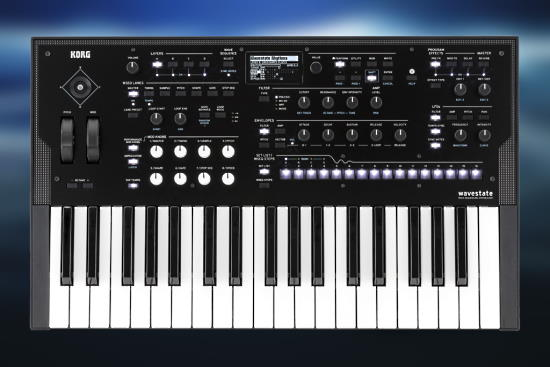](https://www.synthanatomy.com/2020/02/meet-the-lead-developer-of-the-korg-wavestate-synthesizer.html)

With the Wavestate Synthesizer, Korg showed a spiritual successor to the legendary Wavestation Synthesizer from 1990 at NAMM last month. According to information from [Sonicstate.com](https://www.facebook.com/wwwsonicstate/videos/168415567941175/?__tn__=%2Cd%2CP-R&eid=ARBhJpMlyMqwqz9cH1Vl9eWe0XM7qsYukJLOXERmdDpb4gXcpU2dUW84P4rzLoRwtP3KiKjcZXCTyj_4), the WT hardware is based on a Raspberry Pi. This [video](https://www.facebook.com/wwwsonicstate/videos/168415567941175/?__tn__=%2Cd%2CP-R&eid=ARBhJpMlyMqwqz9cH1Vl9eWe0XM7qsYukJLOXERmdDpb4gXcpU2dUW84P4rzLoRwtP3KiKjcZXCTyj_4) shows it more precisely- [Synth Anatomy](https://www.synthanatomy.com/2020/02/meet-the-lead-developer-of-the-korg-wavestate-synthesizer.html).

## Tutorial Pages by Joey Castillo on Adafruit User Pages

Adafruit Learn User Pages is the new way to add your own content for making using the same technology as the Adafruit Learning System, free. Joey Castillo has written two tutorial pages this week - [Mastodon](https://mastodon.social/@joeycastillo/109495971703593547).

Build a NeoPixel-powered Christmas tree with an Adafruit LCD FeatherWing, and implement a one-button UI for scheduling it to turn on and off. Also use CircuitPython's deep sleep feature to save as much power as possible when the tree is in its off state - [Adafruit User Pages](https://learn.adafruit.com/u/joeycastillo/neopixel-christmas-tree-with-deep-sleep-and-lcd-featherwing).

Using a Nordic Power Profiler to measure current consumption in different phases of operation in the above project - [Adafruit User Pages](https://learn.adafruit.com/u/joeycastillo/epilogue-measuring-deep-sleep-current-consumption).

## Espressif's ESP-IDF 5.0 Is a "Major Update," Brings Breaking Changes for Those Migrating

[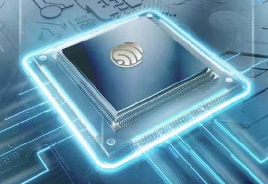](https://www.hackster.io/news/espressif-s-esp-idf-5-0-is-a-major-update-brings-breaking-changes-for-those-migrating-faa1f1b9ce19)

Espressif's ESP-IDF 5.0, a "Major Update," is out and it brings breaking changes for those migrating from earlier versions. It brings a range of bug-fixes and new chip support, but deprecations and deletions mean caution is required before upgrading - [hackster.io](https://www.hackster.io/news/espressif-s-esp-idf-5-0-is-a-major-update-brings-breaking-changes-for-those-migrating-faa1f1b9ce19).

## This Week's Python Streams

Python on Hardware is all about building a cooperative ecosphere which allows contributions to be valued and to grow knowledge. Below are the streams within the last week focusing on the community.

### CircuitPython Deep Dive Stream

[This week](https://youtu.be/7uajgFGenDQ), Tim streamed work on Blinka_Displayio API Updates.

You can see the latest video and past videos on the Adafruit YouTube channel under the Deep Dive playlist - [YouTube](https://www.youtube.com/playlist?list=PLjF7R1fz_OOXBHlu9msoXq2jQN4JpCk8A).

### CircuitPython Parsec

John Park’s CircuitPython Parsec this week is on Timing with Ticks - [Adafruit Blog](https://blog.adafruit.com/2022/12/08/john-parks-circuitpython-parsec-timing-with-ticks-adafruit-johnedgarpark-adafruit-circuitpython/) and [YouTube](https://youtu.be/LvNKa_eQDTk).

Catch all the episodes in the [YouTube playlist](https://www.youtube.com/playlist?list=PLjF7R1fz_OOWFqZfqW9jlvQSIUmwn9lWr).

### The CircuitPython Show

The CircuitPython Show is an independent podcast hosted by Paul Cutler, focusing on the people doing awesome things with CircuitPython. Each episode features Paul in conversation with a guest for a short interview – [CircuitPythonShow](https://circuitpythonshow.com/) and [Twitter](https://twitter.com/circuitpyshow).

In the latest episode, Alec Delaney joines the show and shares how CircuitPython uses continuous integration for development and its benefits – [Show List](https://circuitpythonshow.com/episodes/all).

## Project of the Week: A Rainbow Weather Station

[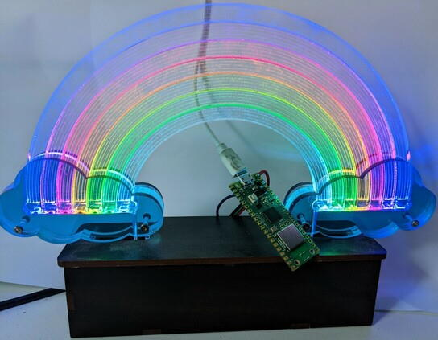](https://octodon.social/@geekmomprojects@mastodon.social/109469372026308425)

Porting a weather rainbow project from ESP8266/Arduino to Raspberry Pi Pico with CircuitPython. "It's so nice to be able to store WiFi and OpenWeatherMap info/credentials in an editable text file rather than messing around with the Arduino WiFi manager libraries. Also much easier to parse the weather data in Python" - [Mastodon](https://octodon.social/@geekmomprojects@mastodon.social/109469372026308425).

## News from around the web!

[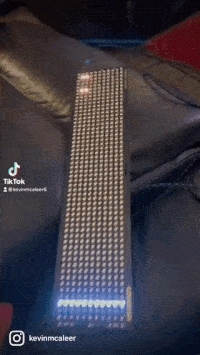](https://twitter.com/kevsmac/status/1601651784329859074)

Making a Guitar Hero game using a Pimoroni Galactic Unicorn and some MicroPython, powered by Raspberry Pi Pico W - [Twitter](https://twitter.com/kevsmac/status/1601651784329859074).

[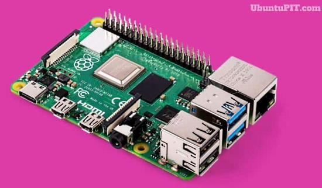](https://www.ubuntupit.com/best-raspberry-pi-alternatives/)

20 Best Raspberry Pi Alternatives | Best Single-Board Computer To Try - [Ubuntu Pit](https://www.ubuntupit.com/best-raspberry-pi-alternatives/).

[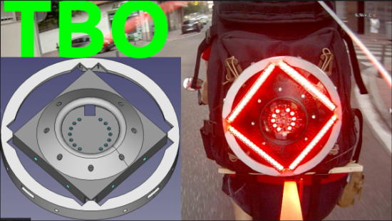](https://blog.adafruit.com/2022/12/06/brake-light-and-turn-signals-for-backpacks-circuitplaygroundexpress-hackadayio/)

Brake light and turn signals for backpacks with an Adafruit Circuit Playground Express, NeoPixels and CircuitPython - [Adafruit Blog](https://blog.adafruit.com/2022/12/06/brake-light-and-turn-signals-for-backpacks-circuitplaygroundexpress-hackadayio/) and [hackaday.io](https://hackaday.io/project/187037-brake-light-and-turn-signals-for-backpacks).

[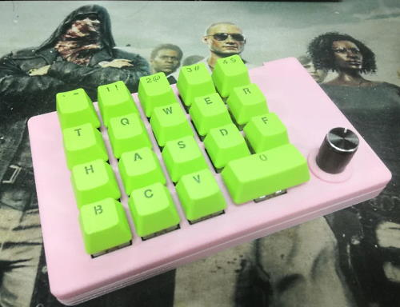](https://www.instructables.com/Only-30-Teach-You-How-to-Create-Your-Own-Personali/)

Learn how to create your own personalized mechanical keyboard with Raspberry Pi Pico and CircuitPython - [Instructables](https://www.instructables.com/Only-30-Teach-You-How-to-Create-Your-Own-Personali/).

The ultimate Unicode input device - [Adafruit Blog](https://blog.adafruit.com/2022/12/08/the-ultimate-unicode-input-device-raspberrypipico-circuitpython-hsgw-raspberry_pi/) via [Hackaday](https://hackaday.io/project/186191-ultimate-unicode-input-device).

[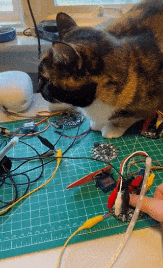](https://twitter.com/gallaugher/status/1601197987329638402)

> "Tabitha inspects [Dani's](https://twitter.com/danioc576) working CircuitPython Family Feud prototype. She thinks this gets full credit, but it could use more catnip." - [Twitter](https://twitter.com/gallaugher/status/1601197987329638402).

> "This weekend, I added to my rv32im [kianRISC-V](https://github.com/splinedrive/kianRiscV) SOC a UART receiver and also changed the transmit UART to an unblocking version. I took it to a MicroPython icebreaker version with some tweeks and now it runs on my board" - [Twitter](https://twitter.com/splinedrive/status/1599838138737664000).

[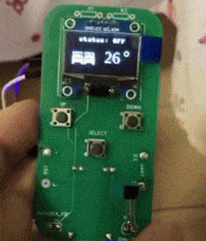](https://twitter.com/circuit_k/status/1600055881873461250)

A custom remote control in MicroPython for controlling a Tuya IR heater. It uses an ESP8266 with 3 buttons, making GET requests. It can select between two room heaters with "select" - [Twitter](https://twitter.com/circuit_k/status/1600055881873461250).

[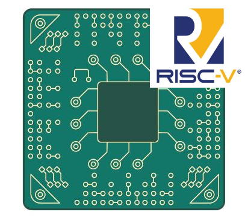](https://www.designnews.com/embedded-systems/why-risc-v-architecture-future-embedded-design)

Why the RISC-V Architecture is the future of Embedded Design - [DesignNews](https://www.designnews.com/embedded-systems/why-risc-v-architecture-future-embedded-design).

> I just created a web page to help me set up the pattern of LEDs to display /animate using a Pimoroni Plasma2040. It looks really awesome!! The idea is to embed that page as web interface onto the Pi Pico W by drawing on the webmatrix - [Twitter](https://twitter.com/DanBenitah/status/1601020048042520576).

[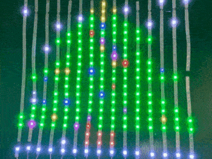](https://www.hackster.io/markkomus/holiday-neopixel-display-03cff4)

A Holiday NeoPixel with a NeoPixel (WS2812B) matrix, Raspberry Pi RP2040 board and CircuitPython to display festive holiday animations - [hackster.io](https://www.hackster.io/markkomus/holiday-neopixel-display-03cff4) via [Mastodon](https://mastodon.social/@markkomus/109480641858382743).

[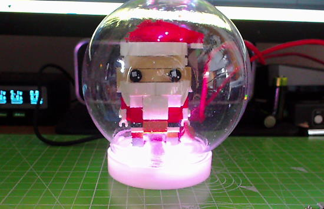](https://octodon.social/@TreasureDev@hackaday.social/109469262244537448)

A Lego Santa Claus, trapped in a plastic bubble and being forced to D I S C O as if his life depended on it. There is CircuitPython programmed Circuit Playground Express controlling the light show - [Mastodon](https://octodon.social/@TreasureDev@hackaday.social/109469262244537448).

[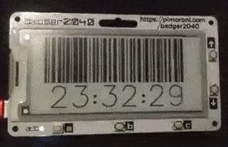](https://twitter.com/en4rab/status/1601003839477678080)

A barcode clock using a Pimoroni Badger 2040 and MicroPython - [Twitter thread](https://twitter.com/en4rab/status/1601003839477678080).

[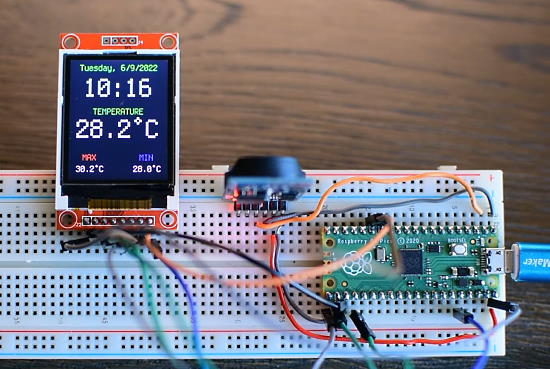](https://www.youtube.com/watch?v=gBofy7MMdIY)

Raspberry Pi Pico Project - Thermometer & Clock ST7735 & DS3231 with CircuitPython - [YouTube](https://www.youtube.com/watch?v=gBofy7MMdIY).

Attie Grande interviews Andy Piper about making, online presence, MicroPython, and community - [YouTube](https://www.youtube.com/watch?v=jktFR0vpHgU&t=3s).

Build Your Computer Science Skills With NASA - [Adafruit Blog](https://blog.adafruit.com/2022/12/09/build-your-computer-science-skills-with-nasa-csedweek-hourofcode-celebratingprogress/).

[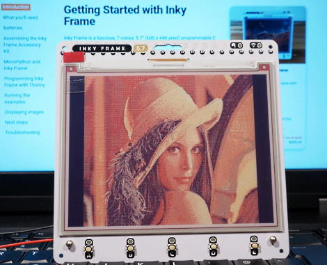](https://www.instructables.com/Battery-Powered-Digital-Picture-Frame-Using-Pimoro/)

A battery-powered digital picture frame using Pimoroni Inky Frame and MicroPython - [Instructables](https://www.instructables.com/Battery-Powered-Digital-Picture-Frame-Using-Pimoro/).

[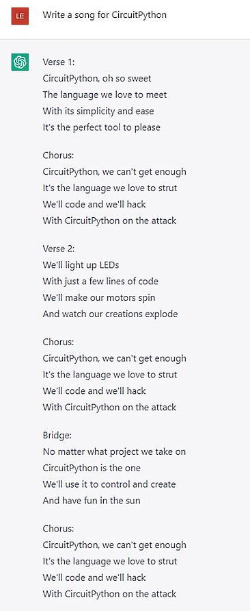](https://twitter.com/biglesp/status/1600083564820779008)

Les Pounder used ChatGPT to compose a CircuitPython song - [Twitter](https://twitter.com/biglesp/status/1600083564820779008).

When the heat breaks in your apartment and you just gotta use an Arduino Nano RP2040, an MCP9808 Temperature Sensor and CircuitPython to see how cold it is - [Twitter](https://twitter.com/danioc576/status/1602172832519229441).

[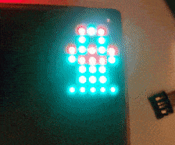](https://www.electromaker.io/project/view/chatgpt-made-this)

Experimenting with outsourcing a project to ChatGPT to make a nice festive animated Christmas Tree on a Unicorn HAT and do the write up too - [Electromaker](https://www.electromaker.io/project/view/chatgpt-made-this).

[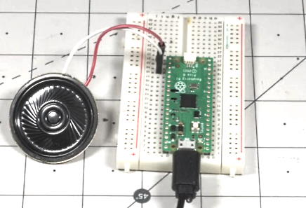](https://twitter.com/JeremySCook/status/1602321685134381062)

Making modem noises straight from a Raspberry Pi Pico GPIO pin via CircuitPython - [Twitter](https://twitter.com/JeremySCook/status/1602321685134381062).

VHS-Decode is a software defined videotape player - [GitHub Project](https://github.com/oyvindln/vhs-decode/tree/vhs_decode) and [Python Source](https://github.com/oyvindln/vhs-decode/tree/vhs_decode/vhsdecode).

Space Science with Python - Episode #393 of the TalkPython Podcast - [TalkPython](https://talkpython.fm/episodes/show/393/space-science-with-python).

Getters and Setters: Manage Attributes in Python - [Real Python](https://realpython.com/python-getter-setter/).

[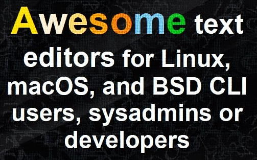](https://www.cyberciti.biz/open-source/awesome-text-editors-for-linux-and-unix-command-line-users-developers/)

Top 6 awesome text editors for Linux and Unix command-line users/developers - [nixCraft](https://www.cyberciti.biz/open-source/awesome-text-editors-for-linux-and-unix-command-line-users-developers/).

[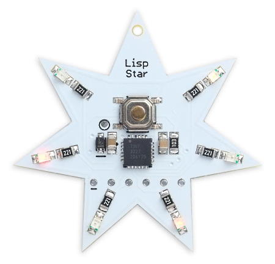](http://www.technoblogy.com/show?2AMW)

The Lisp Star is a star-shaped pendant that you can program in Lisp to make its six coloured LEDs twinkle in different patterns - [Technoblogy](http://www.technoblogy.com/show?2AMW).

Cirque simulates complex network topologies based upon docker nodes - [GitHub](https://github.com/openweave/cirque).

PyDev of the Week: NAME on [Mouse vs Python]()

CircuitPython Weekly Meeting for DATE ([notes]()) [on YouTube]()

#ICYDNCI What was the most popular, most clicked link, in [last week's newsletter](https://www.adafruitdaily.com/2022/12/06/python-on-microcontrollers-newsletter-100-blinka-compatible-sbcs-risc-v-and-so-much-more-circuitpython-micropython-thepsf-raspberry_pi/)? [RISC-V Assembly Language Programming](https://www.elektormagazine.com/articles/why-risc-v-assembly-language).

## New Boards Supported by CircuitPython

The number of supported microcontrollers and Single Board Computers (SBC) grows every week. This section outlines which boards have been included in CircuitPython or added to [CircuitPython.org](https://circuitpython.org/).

This week, there were no new boards added, but there are some in the pipeline.

*Note: For non-Adafruit boards, please use the support forums of the board manufacturer for assistance, as Adafruit does not have the hardware to assist in troubleshooting.*

Looking to add a new board to CircuitPython? It's highly encouraged! Adafruit has four guides to help you do so:

- [How to Add a New Board to CircuitPython](https://learn.adafruit.com/how-to-add-a-new-board-to-circuitpython/overview)
- [How to add a New Board to the circuitpython.org website](https://learn.adafruit.com/how-to-add-a-new-board-to-the-circuitpython-org-website)
- [Adding a Single Board Computer to PlatformDetect for Blinka](https://learn.adafruit.com/adding-a-single-board-computer-to-platformdetect-for-blinka)
- [Adding a Single Board Computer to Blinka](https://learn.adafruit.com/adding-a-single-board-computer-to-blinka)

## New Learn Guides!

[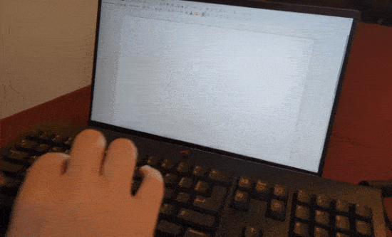](https://learn.adafruit.com/guides/latest)

[NeXT Computer Keyboard to USB HID with CircuitPython](https://learn.adafruit.com/next-computer-keyboard-to-usb-hid-with-circuitpython) from [Jeff Epler](https://learn.adafruit.com/u/jepler)

[Introduction to the Mastodon API using CircuitPython](https://learn.adafruit.com/intro-to-mastodon-api-circuitpython) from [Kattni](https://learn.adafruit.com/u/kattni)

[Bluetooth TV Zapper](https://learn.adafruit.com/bluetooth-tv-zapper) from [John Park](https://learn.adafruit.com/u/johnpark)

## CircuitPython Libraries!

CircuitPython support for hardware continues to grow. We are adding support for new sensors and breakouts all the time, as well as improving on the drivers we already have. As we add more libraries and update current ones, you can keep up with all the changes right here!

For the latest libraries, download the [Adafruit CircuitPython Library Bundle](https://circuitpython.org/libraries). For the latest community contributed libraries, download the [CircuitPython Community Bundle](https://github.com/adafruit/CircuitPython_Community_Bundle/releases).

If you'd like to contribute, CircuitPython libraries are a great place to start. Have an idea for a new driver? File an issue on [CircuitPython](https://github.com/adafruit/circuitpython/issues)! Have you written a library you'd like to make available? Submit it to the [CircuitPython Community Bundle](https://github.com/adafruit/CircuitPython_Community_Bundle). Interested in helping with current libraries? Check out the [CircuitPython.org Contributing page](https://circuitpython.org/contributing). We've included open pull requests and issues from the libraries, and details about repo-level issues that need to be addressed. We have a guide on [contributing to CircuitPython with Git and GitHub](https://learn.adafruit.com/contribute-to-circuitpython-with-git-and-github) if you need help getting started. You can also find us in the #circuitpython channels on the [Adafruit Discord](https://adafru.it/discord).

You can check out this [list of all the Adafruit CircuitPython libraries and drivers available](https://github.com/adafruit/Adafruit_CircuitPython_Bundle/blob/master/circuitpython_library_list.md). 

The current number of CircuitPython libraries is **394**!

**Updated Libraries!**

Here's this week's updated CircuitPython libraries:

  * [Adafruit_CircuitPython_Nunchuk](https://github.com/adafruit/Adafruit_CircuitPython_Nunchuk)
  * [Adafruit_CircuitPython_Typing](https://github.com/adafruit/Adafruit_CircuitPython_Typing)
  * [Adafruit_CircuitPython_PixelMap](https://github.com/adafruit/Adafruit_CircuitPython_PixelMap)
  * [Adafruit_CircuitPython_MiniMQTT](https://github.com/adafruit/Adafruit_CircuitPython_MiniMQTT)
  * [Adafruit_CircuitPython_Register](https://github.com/adafruit/Adafruit_CircuitPython_Register)
  * [Adafruit_Blinka](https://github.com/adafruit/Adafruit_Blinka)
  * [CircuitPython_Community_Bundle](https://github.com/adafruit/CircuitPython_Community_Bundle)

## What’s the team up to this week?

What is the team up to this week? Let’s check in!

**Dan**

I released CircuitPython 8.0.0-beta.5 on Wednesday, December 7. It includes changes from about 80 pull requests. I'll probably do another beta soon with the API and environment setting changes being done by Scott and Jeff.

I've fixed several minor 8.0.0 issues, and also investigated and closed some issues that no longer seem to be a problem. I also moved a few issues to a longer timeline. As of this writing, we have only 11 issues left for 8.0.0: we are seeing the light at the end of the tunnel!

**Kattni**

The [Intro to the Mastodon API](https://learn.adafruit.com/intro-to-mastodon-api-circuitpython) guide has been published! There's info on how to obtain your Mastodon API access token, and two CircuitPython examples that show you how to read from and write to Mastodon. If you're interested in using CircuitPython to interact with Mastodon, check out this guide!

Next up is the product guide for the EYESPI breakout. If you picked up one of these boards, and you want to know more details and help getting started, keep an eye out for that!

**Tim**

I started working on updating Blinka_Displayio API to match the new core APIs but ran into trouble in my development environment that I wanted to get sorted before I got into the Blinka_Displayio code, that's resolved now and I've started to dive in, but still have more work to do. I also did library PR reviews and testing, the main one was for typing in the wiznet Ethernet library.

**Jeff**

I've continued working on issues and bugs we'd like to see resolved before version 8.0 comes out. The biggest item is the replacement of ".env" with "settings.toml". This means that in the next beta you'll need to change where your Wifi Workflow settings are. We'll have updated documentation to reflect this change.

I also wrote another keyboard guide; check out the link elsewhere in the newsletter.

**Scott**

I've refined the `audiobufio` API and it is in beta.5. I also fixed a bug with the web workflow on ESP32s where it didn't respond very quickly. Now it is snappy and a pleasure to use.

From there, I've been working on refining the `coproc` module that was added to support the ultra-low-power processor on the ESP32-S2 and S3. I've tweaked it to have an `espulp` module and a generic `memorymap` module. It all compiles and I'm working to get it tested with a few examples. My goal is to make it easy to share programs to run on the coprocessor.

**Liz**

I wrote up a guide on the [QT 5V to 3V Shifter Breakout](https://learn.adafruit.com/adafruit-qt-5v-to-3v-shifter-breakout). It's an easy way to shift down to 3V logic from 5V logic boards. I also worked on the [Introduction to the Mastodon API using CircuitPython guide](https://learn.adafruit.com/intro-to-mastodon-api-circuitpython) with Kattni. I wrote the code examples and code explanations. I hope it will be a helpful resource for folks if they want to experiment with the Mastodon API.

## Upcoming events!

RISC-V Global Summit, December 12-15, 2022 San Jose, California US - [Linux Foundation](https://events.linuxfoundation.org/riscv-summit/), [YouTube](https://youtu.be/VecaMNCuuF0) via [Twitter](https://twitter.com/risc_v/status/1564719040588926979).

The next MicroPython Meetup in Melbourne will be on January 25th – [Meetup](https://www.meetup.com/MicroPython-Meetup/). Slides from the October meeting are [here](https://docs.google.com/presentation/d/e/2PACX-1vQnJM1r7vFuRMq9bzHWXKyjvnmQsDRB30OMVE5Ujcgv75_NGg3prgQ_QzAtVyJoQEdM-x5HvgSrFXS9/pub?slide=id.p).

FOSDEM is a free event for software developers to meet, share ideas and collaborate. Every year, thousands of developers of free and open source software from all over the world gather at the event in Brussels. February 4-5, 2023 in Brussels, Belgium - [Fosdem](https://fosdem.org/2023/).

PyCon US 2023 will be April 19-17, 2023, again in Salt Lake City, Utah USA - [PyCon US 2023](https://us.pycon.org/2023/).

**Send Your Events In**

As for other events, with the COVID pandemic, most in-person events are postponed or held online. If you know of virtual events or upcoming events, please let us know on Twitter with hashtag #CircuitPython or email to cpnews(at)adafruit(dot)com.

## Latest releases

CircuitPython's stable release is [#.#.#](https://github.com/adafruit/circuitpython/releases/latest) and its unstable release is [#.#.#-##.#](https://github.com/adafruit/circuitpython/releases). New to CircuitPython? Start with our [Welcome to CircuitPython Guide](https://learn.adafruit.com/welcome-to-circuitpython).

[2022####](https://github.com/adafruit/Adafruit_CircuitPython_Bundle/releases/latest) is the latest CircuitPython library bundle.

[v#.#.#](https://micropython.org/download) is the latest MicroPython release. Documentation for it is [here](http://docs.micropython.org/en/latest/pyboard/).

[#.#.#](https://www.python.org/downloads/) is the latest Python release. The latest pre-release version is [#.#.#](https://www.python.org/download/pre-releases/).

[#,### Stars](https://github.com/adafruit/circuitpython/stargazers) Like CircuitPython? [Star it on GitHub!](https://github.com/adafruit/circuitpython)

## Call for help -- Translating CircuitPython is now easier than ever!

[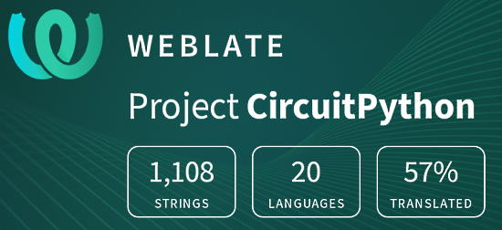](https://hosted.weblate.org/engage/circuitpython/)

One important feature of CircuitPython is translated control and error messages. With the help of fellow open source project [Weblate](https://weblate.org/), we're making it even easier to add or improve translations. 

Sign in with an existing account such as GitHub, Google or Facebook and start contributing through a simple web interface. No forks or pull requests needed! As always, if you run into trouble join us on [Discord](https://adafru.it/discord), we're here to help.

## jobs.adafruit.com - Find a dream job, find great candidates!

[jobs.adafruit.com](https://jobs.adafruit.com/) has returned and folks are posting their skills (including CircuitPython) and companies are looking for talented makers to join their companies - from Digi-Key, to Hackaday, Micro Center, Raspberry Pi and more.

## 36,132 thanks!

The Adafruit Discord community, where we do all our CircuitPython development in the open, reached over 36,132 humans - thank you!  Adafruit believes Discord offers a unique way for Python on hardware folks to connect. Join today at [https://adafru.it/discord](https://adafru.it/discord).

## ICYMI - In case you missed it

Python on hardware is the Adafruit Python video-newsletter-podcast! The news comes from the Python community, Discord, Adafruit communities and more and is broadcast on ASK an ENGINEER Wednesdays. The complete Python on Hardware weekly videocast [playlist is here](https://www.youtube.com/playlist?list=PLjF7R1fz_OOXRMjM7Sm0J2Xt6H81TdDev). The video podcast is on [iTunes](https://itunes.apple.com/us/podcast/python-on-hardware/id1451685192?mt=2), [YouTube](http://adafru.it/pohepisodes), [IGTV (Instagram TV](https://www.instagram.com/adafruit/channel/)), and [XML](https://itunes.apple.com/us/podcast/python-on-hardware/id1451685192?mt=2).

[The weekly community chat on Adafruit Discord server CircuitPython channel - Audio / Podcast edition](https://itunes.apple.com/us/podcast/circuitpython-weekly-meeting/id1451685016) - Audio from the Discord chat space for CircuitPython, meetings are usually Mondays at 2pm ET, this is the audio version on [iTunes](https://itunes.apple.com/us/podcast/circuitpython-weekly-meeting/id1451685016), Pocket Casts, [Spotify](https://adafru.it/spotify), and [XML feed](https://adafruit-podcasts.s3.amazonaws.com/circuitpython_weekly_meeting/audio-podcast.xml).

## Codecademy "Learn Hardware Programming with CircuitPython"

Codecademy, an online interactive learning platform used by more than 45 million people, has teamed up with Adafruit to create a coding course, “Learn Hardware Programming with CircuitPython”. The course is now available in the [Codecademy catalog](https://www.codecademy.com/learn/learn-circuitpython?utm_source=adafruit&utm_medium=partners&utm_campaign=circuitplayground&utm_content=pythononhardwarenewsletter).

## Contribute!

The CircuitPython Weekly Newsletter is a CircuitPython community-run newsletter emailed every Tuesday. The complete [archives are here](https://www.adafruitdaily.com/category/circuitpython/). It highlights the latest CircuitPython related news from around the web including Python and MicroPython developments. To contribute, edit next week's draft [on GitHub](https://github.com/adafruit/circuitpython-weekly-newsletter/tree/gh-pages/_drafts) and [submit a pull request](https://help.github.com/articles/editing-files-in-your-repository/) with the changes. You may also tag your information on Twitter with #CircuitPython. 

Join the Adafruit [Discord](https://adafru.it/discord) or [post to the forum](https://forums.adafruit.com/viewforum.php?f=60) if you have questions.
