- [ ] Kattni updates
- [ ] change date
- [ ] update title
- [ ] Feature story
- [ ] Update  for images
- [ ] Update ICYDNCI
- [ ] All images 550w max only
- [ ] Link "View this email in your browser."

News Sources

- [python.org](https://www.python.org/)
- [Python Insider - dev team blog](https://pythoninsider.blogspot.com/)
- [MicroPython Meetup Blog](https://melbournemicropythonmeetup.github.io/)
- [hackaday.io newest projects MicroPython](https://hackaday.io/projects?tag=micropython&sort=date) and [CircuitPython](https://hackaday.io/projects?tag=circuitpython&sort=date)
- [hackaday CircuitPython](https://hackaday.com/blog/?s=circuitpython) and [MicroPython](https://hackaday.com/blog/?s=micropython)
- [hackster.io CircuitPython](https://www.hackster.io/search?q=circuitpython&i=projects&sort_by=most_recent) and [MicroPython](https://www.hackster.io/search?q=micropython&i=projects&sort_by=most_recent)
- [https://opensource.com/tags/python](https://opensource.com/tags/python)
- [Mastodon CircuitPython](https://octodon.social/tags/CircuitPython)

View this email in your browser. **Warning: Flashing Imagery**

Welcome to the latest Python on Microcontrollers newsletter! Happy New Year! We found some CSS issues in the Newsletter template, which hopefully have been corrected, making it easier to read each week. - *Ed.*

We're on [Discord](https://discord.gg/HYqvREz), [Twitter](https://twitter.com/search?q=circuitpython&src=typed_query&f=live), and for past newsletters - [view them all here](https://www.adafruitdaily.com/category/circuitpython/). If you're reading this on the web, [subscribe here](https://www.adafruitdaily.com/). Here's the news this week:

## Pybricks Brings MicroPython to LEGO Controllers

[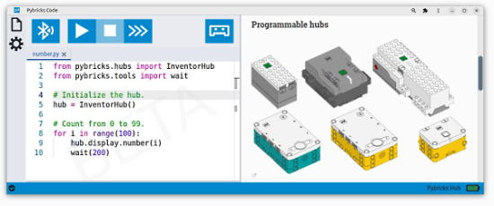](https://blog.adafruit.com/2022/12/29/pybricks-run-micropython-easily-on-lego-controllers-lego-micropython-laurensvalk/)

Pybricks is Python coding for smart LEGO® hubs. You can run MicroPython scripts directly on the hub and get full control of your motors and sensors.

Pybricks runs on LEGO® BOOST, City, Technic, MINDSTORMS®, and SPIKE®. You can code using Windows, Mac, Linux, Chromebook, and Android.

You can restore the original LEGO firmware with ease. This is very well coded and it even has a dark mode!

See the site at [code.pybricks.com](https://code.pybricks.com/) and the author [Twitter](https://twitter.com/laurensvalk) - [Adafruit Blog](https://blog.adafruit.com/2022/12/29/pybricks-run-micropython-easily-on-lego-controllers-lego-micropython-laurensvalk/).

## Developing with Pi Online Training Series

In a live video series, Digi-Key and Raspberry Pi offer insight and instruction on devices from the Raspberry Pi Foundation. The current focus is on the powerful (and available) RP2040 microcontroller and its associated boards, and to get you started they're even sending out a free Raspberry Pi Pico with every new class registration! - [Embedded Computing Design](https://www.bigmarker.com/series/developing-with-pi/series_summit?utm_bmcr_source=Social) via [Twitter](https://twitter.com/embedded_comp/status/1608840456451784704).

## Book: The Linux Command Line by William Shotts 5th Ed (free PDF available)

The Linux Command Line by William Shotts – Fifth Internet Edition Available Now!

Designed for the new command line user, this 555-page volume covers the same material as LinuxCommand.org but in much greater detail. In addition to the basics of command line use and shell scripting, The Linux Command Line includes chapters on many common programs used on the command line, as well as more advanced topics.

Released under a Creative Commons license, this book is available for free download in PDF format as well as a paper copy for sale at booksellers - [Adafruit Blog](https://blog.adafruit.com/2022/12/29/the-linux-command-line-by-william-shotts-5th-ed-free-pdf-available-linux/) and [wesite with PDF](https://sourceforge.net/projects/linuxcommand/files/TLCL/19.01/TLCL-19.01.pdf/download).

## A Keyboard Made Entirely with Python

Python is one of the best programming languages, it can do everything. So hsgw designed an entire keyboard, including the PCB, case, and firmware (KMK/CircuitPython) using only Python. No need to use Kicad and Fusion360. It is explained in a Jupyter Notebook (Google Colaboratory or binder), and it can be customized.

**Goals**

* Design not only the firmware, but also the schematic (netlist), PCB, and case all in Python.
* The code is explained in a runnable Jupyter Notebook (Google colaboratory) environment.

See more - [hackaday.io](https://hackaday.io/project/188907-keyboard-as-a-python-code) and [5z6p Instruments](https://5z6p.com/2022/12/21/ac2022/) (Japanese).

## The Best Arduino Alternatives of 2022 per All3DP

Making a list of "the best" Arduino alternatives is very hard at present, as many manufacturers have compelling offerings with broad feature sets. All3DP takes a stab at it and presents their list - [All3DP](https://all3dp.com/2/best-arduino-alternatives/).

## Feature

text - [site](url).

## This Week's Python Streams

Python on Hardware is all about building a cooperative ecosphere which allows contributions to be valued and to grow knowledge. Below are the streams within the last week focusing on the community.

### CircuitPython Deep Dive Stream

[This week](https://youtu.be/i_HnGvJzZk4), Tim streamed work on a Pico MIDI Sequencer - Offloading Display to another Microcontroller.

You can see the latest video and past videos on the Adafruit YouTube channel under the Deep Dive playlist - [YouTube](https://www.youtube.com/playlist?list=PLjF7R1fz_OOXBHlu9msoXq2jQN4JpCk8A).

### CircuitPython Parsec

John Park’s CircuitPython Parsec is back this week! John discusses I2C Bus Scanning - [Adafruit Blog](https://blog.adafruit.com/2022/12/26/john-parks-circuitpython-parsec-i2c-scanning-adafruit-johnedgarpark-adafruit-circuitpython/) and [YouTube](https://youtu.be/0cnNj4qwTAk).

Also an episode on Using Super Nintendo Controllers - [Adafruit Blog](https://blog.adafruit.com/2023/01/02/john-parks-circuitpython-parsec-using-super-nintendo-controllers-adafruit-johnedgarpark-adafruit-circuitpython/) and [YouTube](https://youtu.be/eroafO1pss0).

Catch all the episodes in the [YouTube playlist](https://www.youtube.com/playlist?list=PLjF7R1fz_OOWFqZfqW9jlvQSIUmwn9lWr).

### The CircuitPython Show

The CircuitPython Show is an independent podcast hosted by Paul Cutler, focusing on the people doing awesome things with CircuitPython. Each episode features Paul in conversation with a guest for a short interview – [CircuitPythonShow](https://circuitpythonshow.com/).

## Project of the Week: Gingerbread

Gingerbread is a set of Python utilities used by Winterbloom to create decorative printed circuit boards (PCBs), such as the ones used for front panels. It initially started with a command-line driven, Python implementation but eventually involved into a fully browser-based application utilizing a native library written in Zig & C and compiled to WASM - [Gingerbread](https://gingerbread.wntr.dev/). [GitHub](https://github.com/wntrblm/Gingerbread.py) and [Adafruit Blog]().

## News from around the web!

[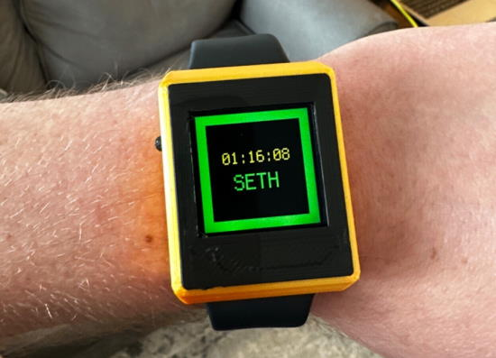](https://octodon.social/@Oakdevtech@mastodon.social/109616749539150796)

[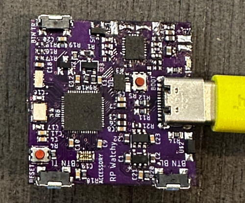](https://octodon.social/@Oakdevtech@mastodon.social/109616749539150796)

An LCD watch using an RP2040, RTC, wireless Qi charging, a 1.3” TFT display, and 6 pins including analog ones broken out to a Hirose Mezzanine flat connector. Runs CircuitPython - [Mastodon](https://octodon.social/@Oakdevtech@mastodon.social/109616749539150796).

[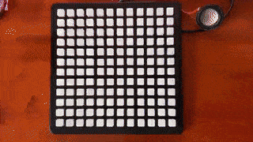](https://twitter.com/drfootleg/status/1608795010224500737)

> It lives! When it comes to interactive LED projects, it is best to go large. #NeoTrellis #CircuitPython #STEM - [Twitter](https://twitter.com/drfootleg/status/1608795010224500737).

[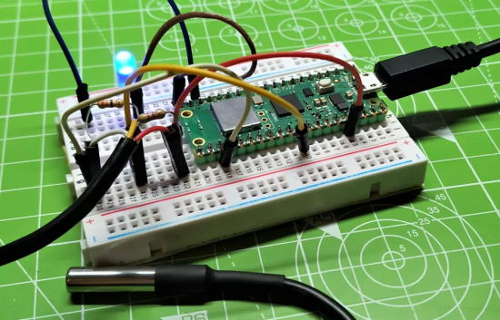](https://www.tomshardware.com/how-to/monitor-temperature-raspberry-pi-pico)

How To Monitor Temperature With a Raspberry Pi Pico and MicroPython - [Tom's Hardware](https://www.tomshardware.com/how-to/monitor-temperature-raspberry-pi-pico).

A cuddly dumpling bot that keeps you warm! Perfect companion for the end-of-year season. Machine sewn, animated eyes with an Adafruit Monster M4sk + CircuitPython. USB-powered rechargeable hand warmers inside - [Twitter Thread](https://twitter.com/chardane/status/1608582783060037632).

[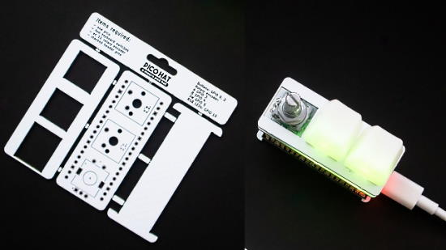](https://blog.adafruit.com/2022/12/30/pico-hat-pad-a-tiny-macropad-with-raspberry-pi-pico-piday-raspberry_pi-natalie_thenerd/)

Pico Hat Pad is a Raspberry Pi Pico hat with two mechanical switches and a rotary encoder. Powered by KMK / CircuitPython. This kit aims to be a cheap (under $20 Australian including caps, keys, Pico, PCBs, header pins) macro pad and solder practice kit - [GitHub](https://github.com/nataliethenerd/picohatpad), [Hackaday](https://hackaday.com/2022/12/30/a-fun-low-cost-start-for-your-macropad-hobby/) and [Adafruit Blog](https://blog.adafruit.com/2022/12/30/pico-hat-pad-a-tiny-macropad-with-raspberry-pi-pico-piday-raspberry_pi-natalie_thenerd/).

[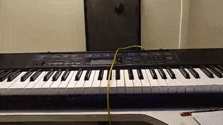](https://twitter.com/JeremySCook/status/1607478149780017159)

A MIDI keyboard interface, using Raspberry Pi Pico W and a Raspberry Pi 4 with CircuitPython - [Twitter](https://twitter.com/JeremySCook/status/1607478149780017159).

[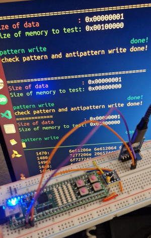](https://twitter.com/splinedrive/status/1608645298804649984)

> MicroPython running on an ice40hx8k FPGA with a kianRiscV SOC. 8 MBYTE PSRAM over breadboarding and qqspi all from scratch - [Twitter](https://twitter.com/splinedrive/status/1608645298804649984).

CircuitPython 8.0.0-beta.6 on an Adafruit Feather nRF52840 Express. Display joystick value with BLE, receive it with the other, and display the coordinates - [Twitter](https://twitter.com/DenshiClub/status/1609867914869633024).

Adding NeoPixel eyes to plastic skulls with an Adafruit ItsyBitsy and CircuitPython - [BlueDonkey](https://bluedonkey.org/2020/10/26/skull-eyes-project/).

[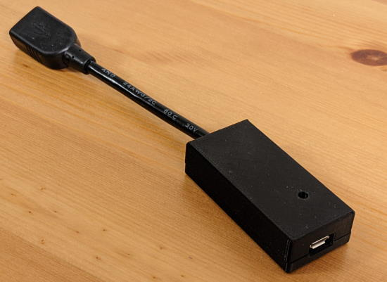](https://github.com/jfedor2/hid-remapper)

HID Remapper is a configurable USB dongle that allows remapping inputs from mice, keyboards and other devices. It works completely in hardware and requires no software running on the computer during normal use - [GitHub](https://github.com/jfedor2/hid-remapper).

[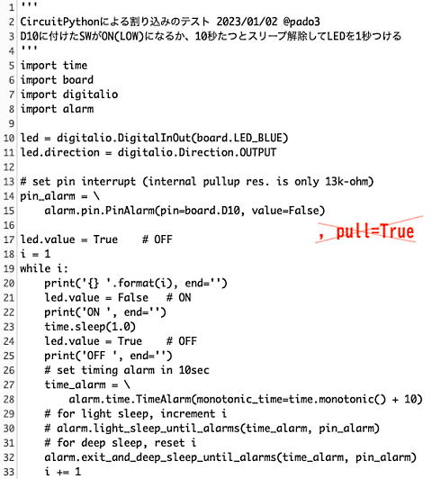](https://twitter.com/pado3/status/1609826304295317504)

Investigating sleep modes in CircuitPython on a Seeed Xiao - [Twitter](https://twitter.com/pado3/status/1609826304295317504).

text - [site](url).

[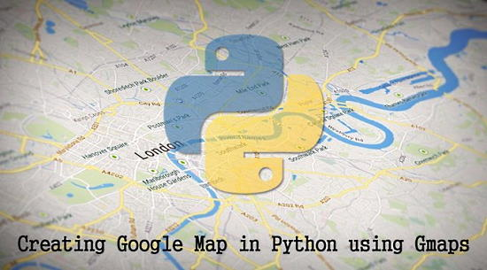](https://twitter.com/PythonPr/status/1607758158545694720)

How to create Google Map in Python using Gmaps - [Twitter](https://twitter.com/PythonPr/status/1607758158545694720).

[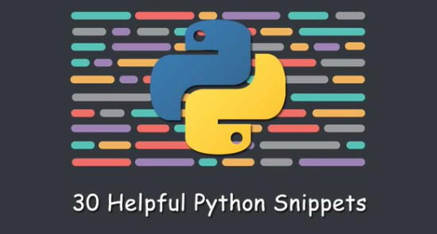](https://morioh.com/p/271bc88c0100?f=5c21fb01c16e2556b555ab32)

30 Helpful Python Snippets You Should Learn Today - [morioh.com](https://morioh.com/p/271bc88c0100?f=5c21fb01c16e2556b555ab32).

text - [site](url).

[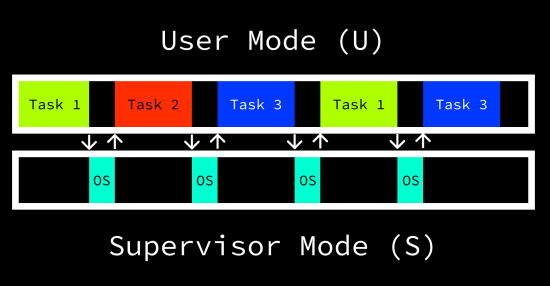](https://danielmangum.com/posts/risc-v-bytes-timer-interrupts/)

RISC-V timer interrupts - [Daniel Mangum](https://danielmangum.com/posts/risc-v-bytes-timer-interrupts/).

text - [site](url).

[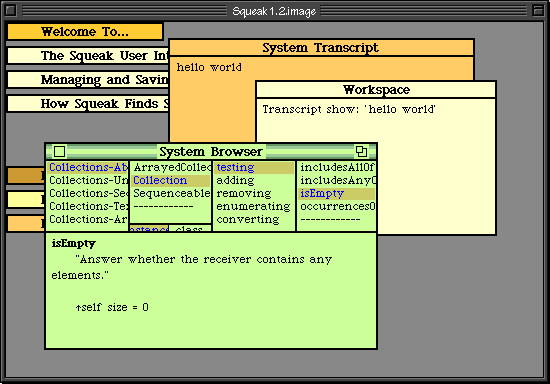](https://github.com/michaelengel/crosstalk)

crosstalk is a bare metal Smalltalk-80 port for Raspberry Pi single board computers - [GitHub](https://github.com/michaelengel/crosstalk).

Pyseidon: a fork-based "load-once, run many times" Python server - [FGitHub](https://github.com/gdb/pyseidon).

[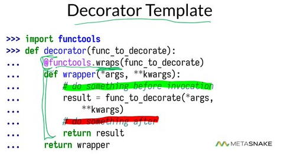](https://twitter.com/__mharrison__/status/1608493118634053633)

Learn about Decorators in Python in this Twitter thread - [Twitter](https://twitter.com/__mharrison__/status/1608493118634053633).

PyDev of the Week: NAME on [Mouse vs Python]()

CircuitPython Weekly Meeting for DATE ([notes]()) [on YouTube]()

#ICYDNCI What was the most popular, most clicked link, in [last week's newsletter](https://www.adafruitdaily.com/2022/12/28/python-on-microcontrollers-newsletter-usb-host-on-raspi-pico-via-pio-circuitpython-8-beta-6-and-much-more-circuitpython-python-micropython-thepsf-raspberry_pi/)? [CircuitPython 8.0.0 Beta 6 Released](https://blog.adafruit.com/2022/12/21/circuitpython-8-0-0-beta-6-released/).

## New

Banana Pi Release New Raspberry Pi Pico Alternative - [Tom's Hardware](https://www.tomshardware.com/news/banana-pi-release-new-raspberry-pi-pico-alternative).

> Programming the Banana Pi BPI-Pico-RP2040 is a straightforward process. Officially we have the choice of MicroPython and Arduino. Being an RP2040 based board there are other alternatives, such as TinyGo, Rust and CircuitPython. Right now there are no official versions crafted for the Banana Pi BPI-Pico-RP2040 but an eager community will soon port them.

[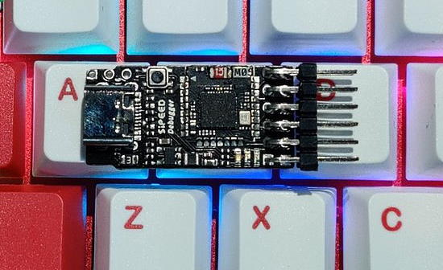](https://twitter.com/SipeedIO/status/1608669378358435841)

Coming to Aliexpress January 15th - [Twitter](https://twitter.com/SipeedIO/status/1608669378358435841).

The tiny dev kit for M0S (BL616,#RISCV RV32GCP 384M,WiFi6,USB2.0 HS). One board for 4 Functions：

1. M0S Dock: Simple dock board with 12IO
2. SDebugger: CKLink/DAPLink + UART Debugger
3. SUART4: USB-to-4UART, every UART up to 20Mbps
4. SLogic Pico: Simple LA with 40M@8CH~

## New Boards Supported by CircuitPython

The number of supported microcontrollers and Single Board Computers (SBC) grows every week. This section outlines which boards have been included in CircuitPython or added to [CircuitPython.org](https://circuitpython.org/).

This week, there were (#/no) new boards added!

- [Board name](url)
- [Board name](url)
- [Board name](url)

*Note: For non-Adafruit boards, please use the support forums of the board manufacturer for assistance, as Adafruit does not have the hardware to assist in troubleshooting.*

Looking to add a new board to CircuitPython? It's highly encouraged! Adafruit has four guides to help you do so:

- [How to Add a New Board to CircuitPython](https://learn.adafruit.com/how-to-add-a-new-board-to-circuitpython/overview)
- [How to add a New Board to the circuitpython.org website](https://learn.adafruit.com/how-to-add-a-new-board-to-the-circuitpython-org-website)
- [Adding a Single Board Computer to PlatformDetect for Blinka](https://learn.adafruit.com/adding-a-single-board-computer-to-platformdetect-for-blinka)
- [Adding a Single Board Computer to Blinka](https://learn.adafruit.com/adding-a-single-board-computer-to-blinka)

## New Learn Guides!

[title](url) from [name](url)

[title](url) from [name](url)

[title](url) from [name](url)

## Updated Learn Guides!

[title](url) from [name](url)

## CircuitPython Libraries!

CircuitPython support for hardware continues to grow. We are adding support for new sensors and breakouts all the time, as well as improving on the drivers we already have. As we add more libraries and update current ones, you can keep up with all the changes right here!

For the latest libraries, download the [Adafruit CircuitPython Library Bundle](https://circuitpython.org/libraries). For the latest community contributed libraries, download the [CircuitPython Community Bundle](https://github.com/adafruit/CircuitPython_Community_Bundle/releases).

If you'd like to contribute, CircuitPython libraries are a great place to start. Have an idea for a new driver? File an issue on [CircuitPython](https://github.com/adafruit/circuitpython/issues)! Have you written a library you'd like to make available? Submit it to the [CircuitPython Community Bundle](https://github.com/adafruit/CircuitPython_Community_Bundle). Interested in helping with current libraries? Check out the [CircuitPython.org Contributing page](https://circuitpython.org/contributing). We've included open pull requests and issues from the libraries, and details about repo-level issues that need to be addressed. We have a guide on [contributing to CircuitPython with Git and GitHub](https://learn.adafruit.com/contribute-to-circuitpython-with-git-and-github) if you need help getting started. You can also find us in the #circuitpython channels on the [Adafruit Discord](https://adafru.it/discord).

You can check out this [list of all the Adafruit CircuitPython libraries and drivers available](https://github.com/adafruit/Adafruit_CircuitPython_Bundle/blob/master/circuitpython_library_list.md). 

The current number of CircuitPython libraries is **###**!

**New Libraries!**

Here's this week's new CircuitPython libraries:

* [library](url)

**Updated Libraries!**

Here's this week's updated CircuitPython libraries:

* [library](url)

## What’s the team up to this week?

What is the team up to this week? Let’s check in!

**Dan**

We closed three issues for 8.0.0 but potentially have three new ones, making for six as of this writing.

I spent several days debugging a mysterious problem that caused `-O2` optimized builds to fail on SAMD builds. At first it seemed to be a USB-related problem, but it turned out that incorrect data was being reported back to the USB host, causing it to think that CIRCUITPY was much larger than it actually was, which caused a crash. After I fixed that, CircuitPython stopped crashing but the CIRCUITPY drive appeared to be corrupted and so was not mounted. I tried to narrow down the problem further, trying and discarding various theories such as delays not being correct, or variables not being `volatile`. The problem turned out to be related to disabling and enabling the microcontroller's memory cache during external flash operations. I added "memory fence" operations around the cache operations, and that fixed the problem. This was about as low level as the previous week's difficult bug, which involved compiler assumptions about register use.

**Kattni**

text - [site](url).

**Melissa**

text - [site](url).

**Tim**

I assembled the pico cowbell sequencer device designed by community member DJDevon3. I've been working on software for it. Learning about USB Midi output and starting to make a control scheme for choosing which notes get sent for each of the indexes in the sequence. I've got a few ideas in mind for adding a display to the sequencer, perhaps with a second micro-controller.

**Jeff**

text - [site](url).

**Scott**

text - [site](url).

**Liz**

text - [site](url).

## Upcoming events!

RISC-V Global Summit, December 12-15, 2023 San Jose, California US - [Linux Foundation](https://events.linuxfoundation.org/riscv-summit/), [YouTube](https://youtu.be/VecaMNCuuF0) via [Twitter](https://twitter.com/risc_v/status/1564719040588926979).

The next MicroPython Meetup in Melbourne will be on December 28th – [Meetup](https://www.meetup.com/MicroPython-Meetup/). Slides from the October meeting are [here](https://docs.google.com/presentation/d/e/2PACX-1vQnJM1r7vFuRMq9bzHWXKyjvnmQsDRB30OMVE5Ujcgv75_NGg3prgQ_QzAtVyJoQEdM-x5HvgSrFXS9/pub?slide=id.p).

FOSDEM is a free event for software developers to meet, share ideas and collaborate. Every year, thousands of developers of free and open source software from all over the world gather at the event in Brussels. February 4-5, 2023 in Brussels, Belgium - [Fosdem](https://fosdem.org/2023/).

PyCon US 2023 will be April 19-17, 2023, again in Salt Lake City, Utah USA - [PyCon US 2023](https://us.pycon.org/2023/).

**Send Your Events In**

As for other events, with the COVID pandemic, most in-person events are postponed or held online. If you know of virtual events or upcoming events, please let us know on Twitter with hashtag #CircuitPython or email to cpnews(at)adafruit(dot)com.

## Latest releases

CircuitPython's stable release is [#.#.#](https://github.com/adafruit/circuitpython/releases/latest) and its unstable release is [#.#.#-##.#](https://github.com/adafruit/circuitpython/releases). New to CircuitPython? Start with our [Welcome to CircuitPython Guide](https://learn.adafruit.com/welcome-to-circuitpython).

[2023####](https://github.com/adafruit/Adafruit_CircuitPython_Bundle/releases/latest) is the latest CircuitPython library bundle.

[v#.#.#](https://micropython.org/download) is the latest MicroPython release. Documentation for it is [here](http://docs.micropython.org/en/latest/pyboard/).

[#.#.#](https://www.python.org/downloads/) is the latest Python release. The latest pre-release version is [#.#.#](https://www.python.org/download/pre-releases/).

[#,### Stars](https://github.com/adafruit/circuitpython/stargazers) Like CircuitPython? [Star it on GitHub!](https://github.com/adafruit/circuitpython)

## Call for help -- Translating CircuitPython is now easier than ever!

One important feature of CircuitPython is translated control and error messages. With the help of fellow open source project [Weblate](https://weblate.org/), we're making it even easier to add or improve translations. 

Sign in with an existing account such as GitHub, Google or Facebook and start contributing through a simple web interface. No forks or pull requests needed! As always, if you run into trouble join us on [Discord](https://adafru.it/discord), we're here to help.

## jobs.adafruit.com - Find a dream job, find great candidates!

[jobs.adafruit.com](https://jobs.adafruit.com/) has returned and folks are posting their skills (including CircuitPython) and companies are looking for talented makers to join their companies - from Digi-Key, to Hackaday, Micro Center, Raspberry Pi and more.

**Job of the Week**

text - [Adafruit Jobs Board](https://jobs.adafruit.com/).

## NUMBER thanks!

The Adafruit Discord community, where we do all our CircuitPython development in the open, reached over NUMBER humans - thank you!  Adafruit believes Discord offers a unique way for Python on hardware folks to connect. Join today at [https://adafru.it/discord](https://adafru.it/discord).

## ICYMI - In case you missed it

Python on hardware is the Adafruit Python video-newsletter-podcast! The news comes from the Python community, Discord, Adafruit communities and more and is broadcast on ASK an ENGINEER Wednesdays. The complete Python on Hardware weekly videocast [playlist is here](https://www.youtube.com/playlist?list=PLjF7R1fz_OOXRMjM7Sm0J2Xt6H81TdDev). The video podcast is on [iTunes](https://itunes.apple.com/us/podcast/python-on-hardware/id1451685192?mt=2), [YouTube](http://adafru.it/pohepisodes), [IGTV (Instagram TV](https://www.instagram.com/adafruit/channel/)), and [XML](https://itunes.apple.com/us/podcast/python-on-hardware/id1451685192?mt=2).

[The weekly community chat on Adafruit Discord server CircuitPython channel - Audio / Podcast edition](https://itunes.apple.com/us/podcast/circuitpython-weekly-meeting/id1451685016) - Audio from the Discord chat space for CircuitPython, meetings are usually Mondays at 2pm ET, this is the audio version on [iTunes](https://itunes.apple.com/us/podcast/circuitpython-weekly-meeting/id1451685016), Pocket Casts, [Spotify](https://adafru.it/spotify), and [XML feed](https://adafruit-podcasts.s3.amazonaws.com/circuitpython_weekly_meeting/audio-podcast.xml).

## Codecademy "Learn Hardware Programming with CircuitPython"

Codecademy, an online interactive learning platform used by more than 45 million people, has teamed up with Adafruit to create a coding course, “Learn Hardware Programming with CircuitPython”. The course is now available in the [Codecademy catalog](https://www.codecademy.com/learn/learn-circuitpython?utm_source=adafruit&utm_medium=partners&utm_campaign=circuitplayground&utm_content=pythononhardwarenewsletter).

## Contribute!

The CircuitPython Weekly Newsletter is a CircuitPython community-run newsletter emailed every Tuesday. The complete [archives are here](https://www.adafruitdaily.com/category/circuitpython/). It highlights the latest CircuitPython related news from around the web including Python and MicroPython developments. To contribute, edit next week's draft [on GitHub](https://github.com/adafruit/circuitpython-weekly-newsletter/tree/gh-pages/_drafts) and [submit a pull request](https://help.github.com/articles/editing-files-in-your-repository/) with the changes. You may also tag your information on Twitter with #CircuitPython. 

Join the Adafruit [Discord](https://adafru.it/discord) or [post to the forum](https://forums.adafruit.com/viewforum.php?f=60) if you have questions.
