- [ ] Kattni updates
- [ ] change date
- [ ] update title
- [ ] Feature story
- [ ] Update  for images
- [ ] Update ICYDNCI
- [ ] All images 550w max only
- [ ] Link "View this email in your browser."

View this email in your browser. **Warning: Flashing Imagery**

Welcome to the latest Python on Microcontrollers newsletter! The New Year brings new product announcements from Espressif and Raspberry Pi. And promised Raspberry Pi Pico W Bluetooth support. If you have a resolution to learn Python (or learn more Python), there are lots of free resources and classes available. And if you want to write Python on Linux, snag a free virtual machine from IBM. Now is the best time to get involved, with so many resources available. - *Ed.*

We're on [Discord](https://discord.gg/HYqvREz), [Twitter](https://twitter.com/search?q=circuitpython&src=typed_query&f=live), and for past newsletters - [view them all here](https://www.adafruitdaily.com/category/circuitpython/). If you're reading this on the web, [subscribe here](https://www.adafruitdaily.com/). Here's the news this week:

## Bluetooth Support for Raspberry Pi Pico W Likely Coming in January

[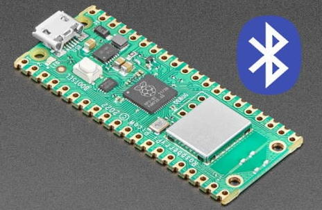](https://twitter.com/aallan/status/1610616300597907456?s=12&t=erdRbaVRnvVnCpDBWD34KA)

Bluetooth Support for Raspberry Pi Pico W is likely coming this month, per a Raspberry Pi team member. It will be in the 1.5.0 release of the Pico C software developer's kit. This should allow for adoption in Python at some point after that - [Twitter](https://twitter.com/aallan/status/1610616300597907456?s=12&t=erdRbaVRnvVnCpDBWD34KA), [Adafruit Blog](https://blog.adafruit.com/2023/01/04/raspberry-pi-pico-w-picow-bluetooth-support-coming-this-month-raspberrypi-aallan-raspberry_pi/) and [hackster.io](https://www.hackster.io/news/raspberry-pi-pico-w-bluetooth-support-is-just-around-the-corner-for-both-c-c-and-micropython-592c42d1170a).

## Raspberry Pi Releases New Autofocus Camera Modules

[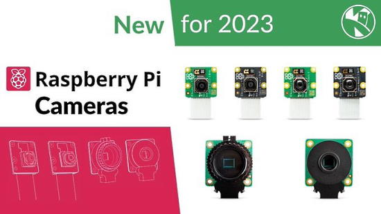](https://www.raspberrypi.com/news/new-autofocus-camera-modules/)

Raspberry Pi announced Monday the launch of Raspberry Pi Camera Module 3. Four different variants of Camera Module 3, in fact, starting at the familiar price of $25. There are new Camera Modules with both visible-light and infrared-sensitive options, and with either a standard or wide field of view (FoV). And in place of the fixed-focus optics of its predecessors, Camera Module 3 provides powered autofocus — which many have requested — allowing you to take crisp images of objects from around 5cm out to infinity - [Raspberry Pi](https://www.raspberrypi.com/news/new-autofocus-camera-modules/).

There is also a new video out discussing the cameras by Kevin McAleer - [YouTube](https://youtu.be/J_CkQ36tVA4).

## CircuitPython in 2023: Let the Devs Know Your Feelings!

As the year starts, the CircuitPython development team would like to take some time to share their goals for CircuitPython in 2023 and beyond. Just like past years (full summary [2019](https://blog.adafruit.com/2019/01/28/circuitpython-in-2019/), [2020](https://blog.adafruit.com/2020/02/03/circuitpython2020-recap/), [2021](https://blog.adafruit.com/2021/02/16/circuitpython2021-round-up/), and [2022](https://blog.adafruit.com/2022/02/01/thank-you-for-circuitpython2022/)), they’d like everyone in the Python on hardware community to contribute by posting their thoughts to a public place on the internet by Wednesday January 18th, 2023.

Here are a few ways to post:

* a video on YouTube
* a post on the CircuitPython forum
* a blog post on your site
* a post on Mastodon with tags #CircuitPython and #CircuitPython2023
* a Gist on GitHub

They want to hear from you. When you post, please add #CircuitPython2023 and email circuitpython2023@adafruit.com to let them know about your post so they can post it on the Adafruit Blog.

The post can cover any topic related to CircuitPython. See a suggested list and more in the post on the [Adafruit Blog](https://blog.adafruit.com/2023/01/01/circuitpython-in-2023-circuitpython2023-circuitpython/). This includes any suggestions or comments related to this newsletter.

Posts so far:

* [First #CircuitPython2023 Posts](https://blog.adafruit.com/2023/01/04/first-circuitpython2023-posts/)

## SparkFun turns Twenty Years Old

SparkFun, an open source parts supplier, turned 20 yeard old last week, according to founder Nathan Seidle - [SparkFun](https://www.sparkfun.com/news/5586) and [YouTube](https://youtu.be/YQ21ZxW6aoo).

> SparkFun turns 20 years old this week, and next year I’ll have worked at SparkFun half of my life. Since SparkFun opened its doors, there was always work to do. The challenge of getting a little faster to market, writing a little cleaner code, open sourcing more technologies, and increasing the production yield rate a few fractions of a percentage more was, and continues to be, thrilling. I get to puzzle for work, and I’ve got a whole team of like minded folks that makes another twenty years of SparkFun sound absolutely delightful.

## New Espressif Chip Announcements

Two announcements last Friday from Espressif on upcoming chips:

[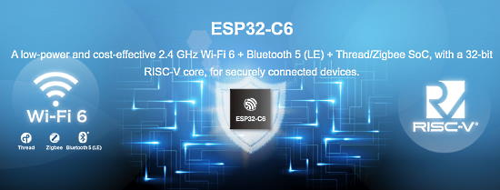](https://www.espressif.com/en/news/ESP32-C6_Available)

Espressif’s Wi-Fi 6 SoC, ESP32-C6, is officially available and will be supported in ESP-IDF 5.1. It combines 2.4 GHz Wi-Fi 6, Bluetooth 5 (LE) and the 802.15.4 protocol support. ESP32-C6 consists of a high-performance 32-bit RISC-V processor which can be clocked up to 160 MHz, and a low-power 32-bit RISC-V processor which can be clocked up to 20 MHz. ESP32-C6 has a 320KB ROM, a 512KB SRAM, and works with external flash. It comes with 30 (QFN40) or 22 (QFN32) programmable GPIOs, with support for SPI, UART, I2C, I2S, RMT, TWAI, PWM, SDIO, Motor Control PWM. It also packs a 12-bit ADC and a temperature sensor - [Espressif News](https://www.espressif.com/en/news/ESP32-C6_Available).

[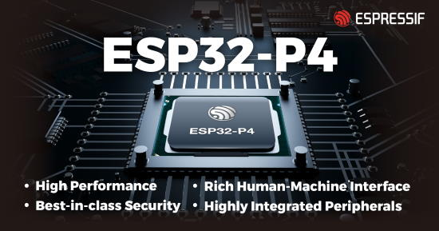](https://www.espressif.com/en/news/ESP32-P4)

The ESP32-P4 is powered by a dual-core RISC-V CPU with an AI instructions extension, an advanced memory subsystem, and integrated high-speed peripherals, running up to 400MHz. ESP32-P4 is designed for high-performance applications that require strong security. The ESP32-P4 HP core system has 768KB of on-chip SRAM, which can become accessible as cache when external PSRAM is available. In addition, the ESP32-P4 HP core system has 8KB of zero-wait TCM RAM, which can be used for fast data buffers or time-critical sections of code.

ESP32-P4 has more than 50 programmable GPIOs, which is significantly more than those of any other Espressif SoC to date. ESP32-P4 supports all the commonly used peripherals, such as SPI, I2S, I2C, LED PWM, MCPWM, RMT, ADC, DAC, UART, and TWAITM. Further to this, ESP32-P4 supports USB OTG 2.0 HS, Ethernet, and SDIO Host 3.0 for high-speed connectivity - [Espressif News](https://www.espressif.com/en/news/ESP32-P4).

## RISC-V Summit 2022: All Your CPUs Belong to Us

In [a recent guest editorial](https://www.eetimes.com/examining-the-top-five-fallacies-about-risc-v/) on EE Times, legendary professor David Patterson wrote about busting the five myths around the RISC-V instruction set architecture (ISA). At the recent [RISC-V Summit](https://riscv.org/event/risc-v-summit-2022/) organized by RISC-V International, the consortium that manages and promotes the RISC-V Instruction Set Architecture (ISA), its president, Calista Redmond, had a far more blunt message: RISC-V is inevitable.

In fact, she said, RISC-V will eventually have the best CPUs, the best software running on them and the best ecosystem of any microprocessor core family. These are mighty strong words for a nascent ISA that is only about 10 years old and that competes with the far more established Arm and x86 ISAs. It almost sounded like the Borg from Star Trek when they say, “Resistance is futile.” 

More - [EE Times](https://www.eetimes.com/risc-v-summit-2022-all-your-cpus-belong-to-us/).

## The UK National Museum of Computing Awards Raspberry Pi co-founders Liz and Eben Upton Honorary Fellowships

[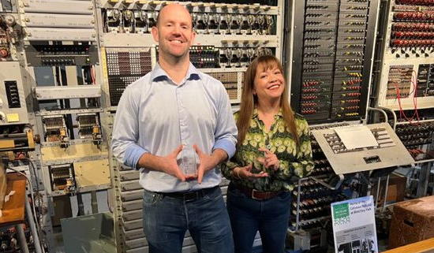](https://www.raspberrypi.com/news/liz-and-eben-honoured-by-the-national-museum-of-computing/)

The National Museum of Computing awarded Raspberry Pi co-founders Liz and Eben Upton Honorary Fellowships acknowledging “outstanding individuals who have made significant and lasting contributions to the fields of computing and technology” - [Raspberry Pi](https://www.raspberrypi.com/news/liz-and-eben-honoured-by-the-national-museum-of-computing/).

## This Week's Python Streams

Python on Hardware is all about building a cooperative ecosphere which allows contributions to be valued and to grow knowledge. Below are the streams within the last week focusing on the community.

### CircuitPython Deep Dive Stream

[This week](https://youtu.be/JiO3-99EqBA), Tim had more fun with the Pico Midi Sequencer.

You can see the latest video and past videos on the Adafruit YouTube channel under the Deep Dive playlist - [YouTube](https://www.youtube.com/playlist?list=PLjF7R1fz_OOXBHlu9msoXq2jQN4JpCk8A).

### CircuitPython Parsec

John Park’s CircuitPython Parsec this week is on Short vs. Long Press - [Adafruit Blog](https://blog.adafruit.com/2023/01/06/john-parks-circuitpython-parsec-short-vs-long-press-adafruit-johnedgarpark-adafruit-circuitpython/) and [YouTube](https://youtu.be/eUvbQSB9O7Y).

Catch all the episodes in the [YouTube playlist](https://www.youtube.com/playlist?list=PLjF7R1fz_OOWFqZfqW9jlvQSIUmwn9lWr).

### The CircuitPython Show

The CircuitPython Show is an independent podcast hosted by Paul Cutler, focusing on the people doing awesome things with CircuitPython. Each episode features Paul in conversation with a guest for a short interview – [CircuitPythonShow](https://circuitpythonshow.com/) and [Twitter](https://twitter.com/circuitpyshow).

## Project of the Week: Animations on OLED Displays Using CircuitPython

[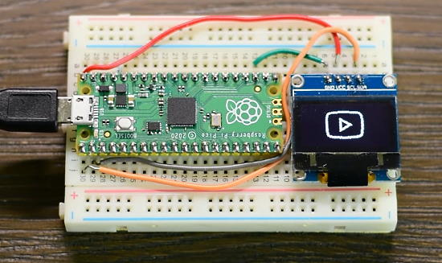](https://www.youtube.com/watch?v=WqyBWcjs_oY)

Animations on OLED displays using CircuitPython - [YouTube](https://www.youtube.com/watch?v=WqyBWcjs_oY) and [Tutorial](https://educ8s.tv/oled-animation/).

> There are many ways to load and display an animation on an OLED screen, either a monochrome display, or a color one. I am going to show you what I think is the easiest way to achieve it. I will work with the monochrome OLED, but the procedure works with the Color one as well.

## Focus: Learning Python

[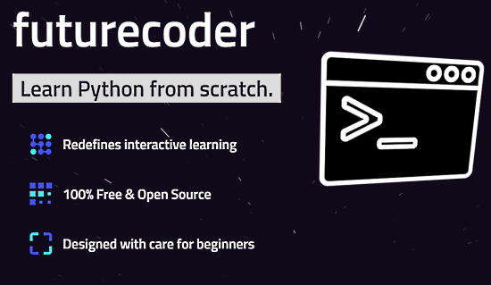](https://futurecoder.io/)

Learn Python from scratch, beginner friendly, 100% open source and free - [futurecoder](https://futurecoder.io/).

Harvard University is offering Web Programming with Python Course for free - [Twitter Thread](https://twitter.com/Nilofer_tweets/status/1610664159863263233).

10 Free Python Courses to upskill in 2023 - [Twitter Thread](https://twitter.com/RavitJain/status/1608932673569067009).

## News from around the web!

[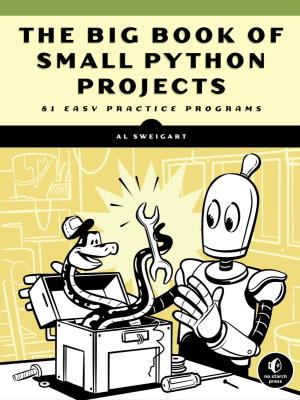](https://twitter.com/KirkDBorne/status/1610009076779438080)

The Big Book of Small #Python Projects: 81 small projects for beginners designed to build programming skills and teach new techniques (Free 434-page PDF download) - [Twitter](https://twitter.com/KirkDBorne/status/1610009076779438080).

[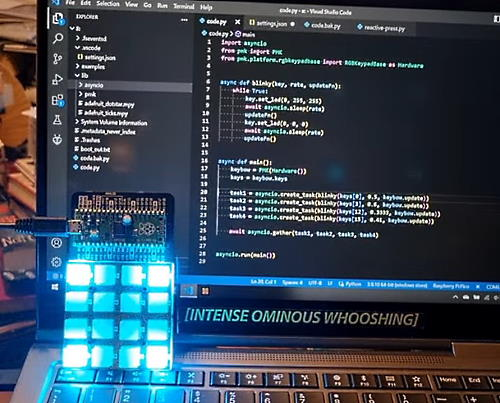](https://www.instagram.com/tv/Cm-EXcMo233/?igshid=MDJmNzVkMjY%3D)

> Learning cooperative multitasking in CircuitPython for the sequencer tomfoolery. Need to get nice sharp trigger pulses from 2ms to 50ms in length, and can't let it mess up all the other timings - [Instagram](https://www.instagram.com/tv/Cm-EXcMo233/?igshid=MDJmNzVkMjY%3D).

[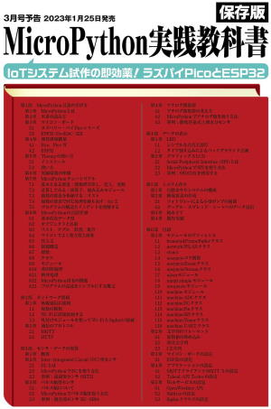](https://interface.cqpub.co.jp/magazine/202303/)

The Japanese language Interface Magazine March 2023 issue (release January 25th) features extensive coverage of MicroPython - [Interface](https://interface.cqpub.co.jp/magazine/202303/).

[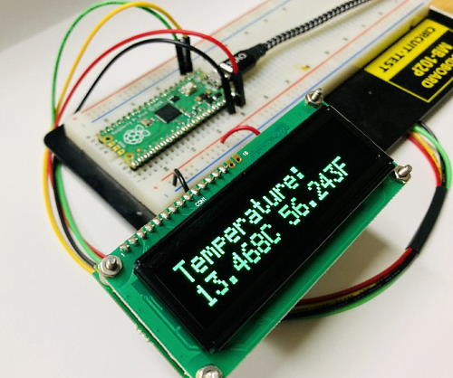](https://twitter.com/MatrixOrbital/status/1610784255617163267)

Using Raspberry Pi Pico RP2040 I2C with MicroPython for Matrix Orbital I2C Displays - [Twitter](https://twitter.com/MatrixOrbital/status/1610784255617163267) and [GitHub](https://github.com/MatrixOrbital/RP2040-Temp-I2C-Display).

> I still bodged a button on to the WiFindicator project and got reliable signal passing between the two devices! This is exciting because it means I have all of the fundementals in place to make this project reality. All the theory is proven out, I just need to put it all together - [Mastodon](https://mastodon.social/@andy_warb/109638706536131608).

[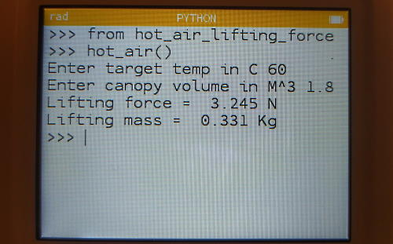](https://twitter.com/concreted0g/status/1610688495655215104)

Numworks calculator (CircuitPython): a Python script that calculates the lifting force and a lifting mass of a heated volume of air - [Twitter](https://twitter.com/concreted0g/status/1610688495655215104).

[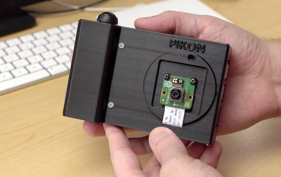](https://twitter.com/geerlingguy/status/1612359953880158209)

A Raspberry Pi camera - [Twitter](https://twitter.com/geerlingguy/status/1612359953880158209) and Python code on [GitHub](https://github.com/geerlingguy/pi-camera).

[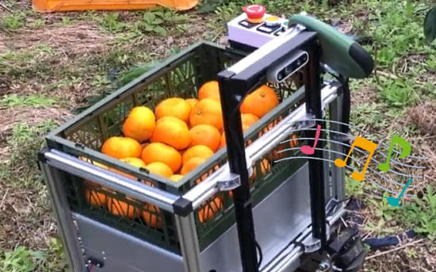](https://twitter.com/23232871hashimo/status/1612374899712208896)

Making a fam robotic assistant: Building a development environment for Atom Lite with MicroPython. Sounding the buzzer for M5Stack, communicated between Raspberry Pi 4 and Atom Lite and played the startup sound of the robot - [Twitter](https://twitter.com/23232871hashimo/status/1612374899712208896).

[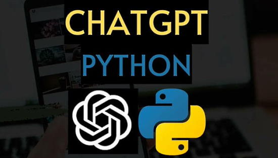](https://morioh.com/p/184ebed2363f?f=5e44c59998b8037d03aa8178)

How to use ChatGPT in Python using pyChatGPT - [morioh](https://morioh.com/p/184ebed2363f?f=5e44c59998b8037d03aa8178) and [YouTube](https://www.youtube.com/watch?v=S3okwVkxDgA).

[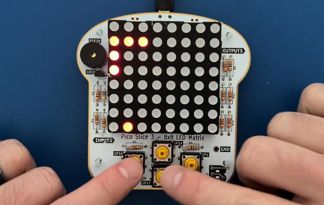](https://twitter.com/RangenMichael/status/1612220025083133952)

Making a snake game on a Pico Slice 3 using MicroPython and multiple cores - [YouTube](https://youtu.be/BaRkOadMJEc) and [Code](https://learn.breadstick.ca/breadstick/breadloaf/slice-3-8x8-dot-matrix/assembly-guide/micropython-code/2-snake), via [Twitter](https://twitter.com/RangenMichael/status/1612220025083133952).

[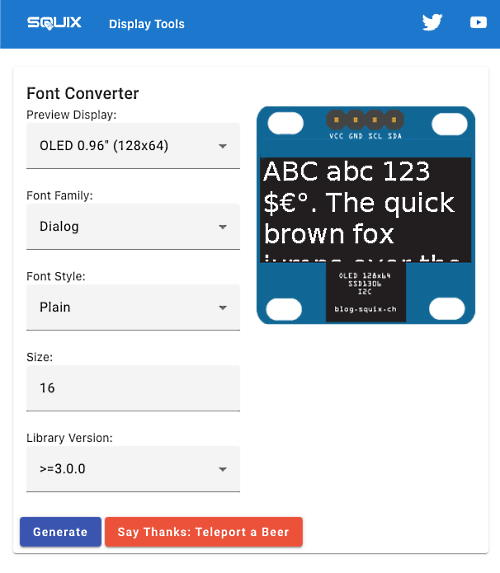](https://twitter.com/squix78/status/1612338735848333312?s=12&t=NIk1FJ8xSUf6pUWnMqMSIA)

An update to the popular [Font Converter](https://oleddisplay.squix.ch) over the weekend. It generates pixel fonts for embedded graphic libraries like Adafruit GFX - [Squix](https://oleddisplay.squix.ch/) via [Twitter](https://twitter.com/squix78/status/1612338735848333312?s=12&t=NIk1FJ8xSUf6pUWnMqMSIA).

[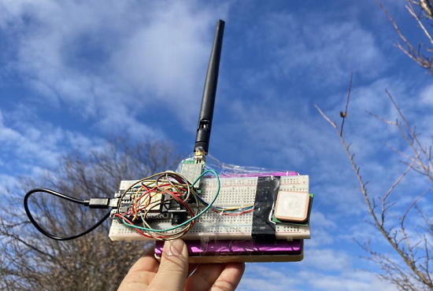](https://twitter.com/circuit_k/status/1612076418363699200)

A LoRa radio test setup with an ESP8266, GPS module, MicroPython and ebyte e32 LoRa module - [Twitter](https://twitter.com/circuit_k/status/1612076418363699200).

text - [site](url).

[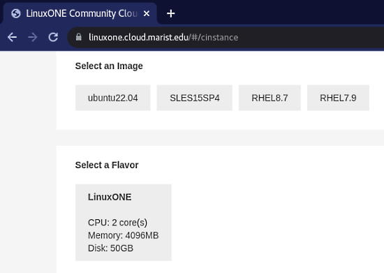](https://floss.social/@pleia2/109644045338118270)

Ubuntu 22.04 is now available on the IBM LinuxONE Community Cloud! What's that? It's a mainframe hosted at Marist College that has **free virtual machines available for developers, hobbyists, students and others** looking to test out their software on the s390x (IBM zSystems & LinuxONE) hardware architecture - [Mastodon](https://floss.social/@pleia2/109644045338118270) and Getting Started - [IBM}(https://developer.ibm.com/articles/get-started-with-ibm-linuxone/).

Make a Mastodon Bot on AWS Free Tier - [Matt Duggan](https://matduggan.com/make-a-mastodon-bot-on-aws-free-tier/).

Also: Introduction to the Mastodon API using CircuitPython  - [Adafruit Learning System](https://learn.adafruit.com/intro-to-mastodon-api-circuitpython).

text - [site](url).

[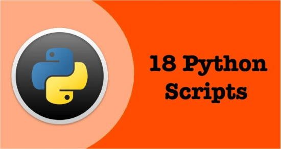](https://morioh.com/p/4f4b74ba17cc?f=5c21fb01c16e2556b555ab32)

18 Python scripts that help you write code faster - [morioh](https://morioh.com/p/4f4b74ba17cc?f=5c21fb01c16e2556b555ab32).

PyDev of the Week: NAME on [Mouse vs Python]()

CircuitPython Weekly Meeting for DATE ([notes]()) [on YouTube]()

#ICYDNCI What was the most popular, most clicked link, in [last week's newsletter](https://www.adafruitdaily.com/2023/01/03/python-on-microcontrollers-newsletter-micropython-on-lego-controllers-circuitpython-in-2023-survey-and-much-more-circuitpython-python-micropython-thepsf-raspberry_pi/)? [The Linux Command Line by William Shotts 5th Ed (free PDF)](https://blog.adafruit.com/2022/12/29/the-linux-command-line-by-william-shotts-5th-ed-free-pdf-available-linux/).

## New and Coming Soon

Banana Pi M5 Honest Review: Is it a Raspberry Pi 4 Challenger - [RaspberryTips](https://raspberrytips.com/banana-pi-m5-review/).

VisionFive 2: RISC-V Quad Core Low Cost SBC unboxing - [YouTube](https://www.youtube.com/watch?v=ykKnc86UtXg) via [Twitter](https://twitter.com/ChrisBarnatt/status/1612090674278531074).

## New Boards Supported by CircuitPython

The number of supported microcontrollers and Single Board Computers (SBC) grows every week. This section outlines which boards have been included in CircuitPython or added to [CircuitPython.org](https://circuitpython.org/).

This week, there was one new boards added:

- [E-Fidget](https://circuitpython.org/board/e_fidget/)

*Note: For non-Adafruit boards, please use the support forums of the board manufacturer for assistance, as Adafruit does not have the hardware to assist in troubleshooting.*

Looking to add a new board to CircuitPython? It's highly encouraged! Adafruit has four guides to help you do so:

- [How to Add a New Board to CircuitPython](https://learn.adafruit.com/how-to-add-a-new-board-to-circuitpython/overview)
- [How to add a New Board to the circuitpython.org website](https://learn.adafruit.com/how-to-add-a-new-board-to-the-circuitpython-org-website)
- [Adding a Single Board Computer to PlatformDetect for Blinka](https://learn.adafruit.com/adding-a-single-board-computer-to-platformdetect-for-blinka)
- [Adding a Single Board Computer to Blinka](https://learn.adafruit.com/adding-a-single-board-computer-to-blinka)

## CircuitPython Libraries!

CircuitPython support for hardware continues to grow. We are adding support for new sensors and breakouts all the time, as well as improving on the drivers we already have. As we add more libraries and update current ones, you can keep up with all the changes right here!

For the latest libraries, download the [Adafruit CircuitPython Library Bundle](https://circuitpython.org/libraries). For the latest community contributed libraries, download the [CircuitPython Community Bundle](https://github.com/adafruit/CircuitPython_Community_Bundle/releases).

If you'd like to contribute, CircuitPython libraries are a great place to start. Have an idea for a new driver? File an issue on [CircuitPython](https://github.com/adafruit/circuitpython/issues)! Have you written a library you'd like to make available? Submit it to the [CircuitPython Community Bundle](https://github.com/adafruit/CircuitPython_Community_Bundle). Interested in helping with current libraries? Check out the [CircuitPython.org Contributing page](https://circuitpython.org/contributing). We've included open pull requests and issues from the libraries, and details about repo-level issues that need to be addressed. We have a guide on [contributing to CircuitPython with Git and GitHub](https://learn.adafruit.com/contribute-to-circuitpython-with-git-and-github) if you need help getting started. You can also find us in the #circuitpython channels on the [Adafruit Discord](https://adafru.it/discord).

You can check out this [list of all the Adafruit CircuitPython libraries and drivers available](https://github.com/adafruit/Adafruit_CircuitPython_Bundle/blob/master/circuitpython_library_list.md). 

The current number of CircuitPython libraries is **###**!

**New Libraries!**

Here's this week's new CircuitPython libraries:

* [library](url)

**Updated Libraries!**

Here's this week's updated CircuitPython libraries:

* [library](url)

## What’s the team up to this week?

What is the team up to this week? Let’s check in!

**Dan**

Scott and Jeff and I had an 8.0.0 issue triage meeting and distributed the remaining issues among ourselves. As of this writing there are eight open issues.

We have had various issues with I2C on the ESP32-S3. There is a new proposed fix for the ESP-IDF. I tried it, but sadly it still doesn’t fix the behavior of the LC709203F or BNO055 I2C sensors. It's still necessary to retry operations to get them to work reliably, which is not necessary when they are used with an ESP32-S2.

**Melissa**

Recently I switched over to working on an installer for CircuitPython that could be used to directly program ESP32 boards instead of just downloading the firmware and using another tool to flash the board.

**Tim**

I've been working on the midi sequencer capabilities a little bit more, and starting to ramp back up on PR reviews after holiday break.

**Jeff**

I'm back to working on CircuitPython bugs! One interesting problem, discovered by a communuty member, was that multiple CircuitPython devices would not mount on the same MacOS machine at the same time. I learned that FAT devices have a 32-bit "Volume ID". MacOS apparently depends on the Volume ID being unique among devices inserted into the computer, but actually a fresh CircuitPython device would almost always get the same Volume ID. I corrected CircuitPython so that it chooses a random 32-bit volume ID when the CIRCUITPY drive is formatted (or, failing that, a volume ID that is based on the microcontroller's own unique ID).

**Scott**

This week I'm back from holiday vacation (even though I'm still visiting family.) I've gotten caught up on emails, Discord and forums. We've also had good discussions around 2023 planning. Next on my list is to draft my thoughts for #CircuitPython2023. I'd love to [hear your thoughts for #CircuitPython2023 too](https://blog.adafruit.com/2023/01/01/circuitpython-in-2023-circuitpython2023-circuitpython/)!

## Upcoming events!

The next MicroPython Meetup in Melbourne will be on December 28th – [Meetup](https://www.meetup.com/MicroPython-Meetup/). Slides from the October meeting are [here](https://docs.google.com/presentation/d/e/2PACX-1vQnJM1r7vFuRMq9bzHWXKyjvnmQsDRB30OMVE5Ujcgv75_NGg3prgQ_QzAtVyJoQEdM-x5HvgSrFXS9/pub?slide=id.p).

FOSDEM is a free event for software developers to meet, share ideas and collaborate. Every year, thousands of developers of free and open source software from all over the world gather at the event in Brussels. February 4-5, 2023 in Brussels, Belgium - [Fosdem](https://fosdem.org/2023/).

PyCon US 2023 will be April 19-17, 2023, again in Salt Lake City, Utah USA - [PyCon US 2023](https://us.pycon.org/2023/).

**Send Your Events In**

As for other events, with the COVID pandemic, most in-person events are postponed or held online. If you know of virtual events or upcoming events, please let us know on Twitter with hashtag #CircuitPython or email to cpnews(at)adafruit(dot)com.

## Latest releases

CircuitPython's stable release is [#.#.#](https://github.com/adafruit/circuitpython/releases/latest) and its unstable release is [#.#.#-##.#](https://github.com/adafruit/circuitpython/releases). New to CircuitPython? Start with our [Welcome to CircuitPython Guide](https://learn.adafruit.com/welcome-to-circuitpython).

[2023####](https://github.com/adafruit/Adafruit_CircuitPython_Bundle/releases/latest) is the latest CircuitPython library bundle.

[v#.#.#](https://micropython.org/download) is the latest MicroPython release. Documentation for it is [here](http://docs.micropython.org/en/latest/pyboard/).

[#.#.#](https://www.python.org/downloads/) is the latest Python release. The latest pre-release version is [#.#.#](https://www.python.org/download/pre-releases/).

[#,### Stars](https://github.com/adafruit/circuitpython/stargazers) Like CircuitPython? [Star it on GitHub!](https://github.com/adafruit/circuitpython)

## Call for help -- Translating CircuitPython is now easier than ever!

[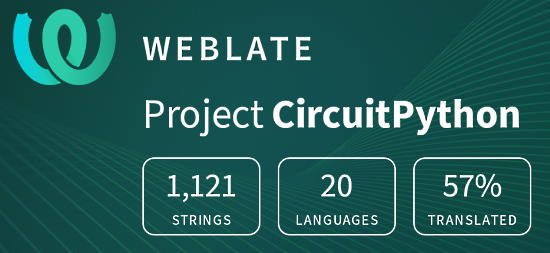](https://hosted.weblate.org/engage/circuitpython/)

One important feature of CircuitPython is translated control and error messages. With the help of fellow open source project [Weblate](https://weblate.org/), we're making it even easier to add or improve translations. 

Sign in with an existing account such as GitHub, Google or Facebook and start contributing through a simple web interface. No forks or pull requests needed! As always, if you run into trouble join us on [Discord](https://adafru.it/discord), we're here to help.

## jobs.adafruit.com - Find a dream job, find great candidates!

[jobs.adafruit.com](https://jobs.adafruit.com/) has returned and folks are posting their skills (including CircuitPython) and companies are looking for talented makers to join their companies - from Digi-Key, to Hackaday, Micro Center, Raspberry Pi and more.

**Job of the Week**

Employee Resources Assistant (Benefits & Payroll) - Adafruit Industries - [Adafruit Jobs Board](https://jobs.adafruit.com/job/employee-resources-assistant-benefits-payroll/).

## 36,374 thanks!

The Adafruit Discord community, where we do all our CircuitPython development in the open, reached over 36,374 humans - thank you!  Adafruit believes Discord offers a unique way for Python on hardware folks to connect. Join today at [https://adafru.it/discord](https://adafru.it/discord).

## ICYMI - In case you missed it

Python on hardware is the Adafruit Python video-newsletter-podcast! The news comes from the Python community, Discord, Adafruit communities and more and is broadcast on ASK an ENGINEER Wednesdays. The complete Python on Hardware weekly videocast [playlist is here](https://www.youtube.com/playlist?list=PLjF7R1fz_OOXRMjM7Sm0J2Xt6H81TdDev). The video podcast is on [iTunes](https://itunes.apple.com/us/podcast/python-on-hardware/id1451685192?mt=2), [YouTube](http://adafru.it/pohepisodes), [IGTV (Instagram TV](https://www.instagram.com/adafruit/channel/)), and [XML](https://itunes.apple.com/us/podcast/python-on-hardware/id1451685192?mt=2).

[The weekly community chat on Adafruit Discord server CircuitPython channel - Audio / Podcast edition](https://itunes.apple.com/us/podcast/circuitpython-weekly-meeting/id1451685016) - Audio from the Discord chat space for CircuitPython, meetings are usually Mondays at 2pm ET, this is the audio version on [iTunes](https://itunes.apple.com/us/podcast/circuitpython-weekly-meeting/id1451685016), Pocket Casts, [Spotify](https://adafru.it/spotify), and [XML feed](https://adafruit-podcasts.s3.amazonaws.com/circuitpython_weekly_meeting/audio-podcast.xml).

## Codecademy "Learn Hardware Programming with CircuitPython"

Codecademy, an online interactive learning platform used by more than 45 million people, has teamed up with Adafruit to create a coding course, “Learn Hardware Programming with CircuitPython”. The course is now available in the [Codecademy catalog](https://www.codecademy.com/learn/learn-circuitpython?utm_source=adafruit&utm_medium=partners&utm_campaign=circuitplayground&utm_content=pythononhardwarenewsletter).

## Contribute!

The CircuitPython Weekly Newsletter is a CircuitPython community-run newsletter emailed every Tuesday. The complete [archives are here](https://www.adafruitdaily.com/category/circuitpython/). It highlights the latest CircuitPython related news from around the web including Python and MicroPython developments. To contribute, edit next week's draft [on GitHub](https://github.com/adafruit/circuitpython-weekly-newsletter/tree/gh-pages/_drafts) and [submit a pull request](https://help.github.com/articles/editing-files-in-your-repository/) with the changes. You may also tag your information on Twitter with #CircuitPython. 

Join the Adafruit [Discord](https://adafru.it/discord) or [post to the forum](https://forums.adafruit.com/viewforum.php?f=60) if you have questions.
