- [X] Kattni updates
- [ ] change date
- [ ] update title
- [ ] Feature story
- [ ] Update  for images
- [ ] Update ICYDNCI
- [ ] All images 550w max only
- [ ] Link "View this email in your browser."

News Sources

- [python.org](https://www.python.org/)
- [Python Insider - dev team blog](https://pythoninsider.blogspot.com/)
- [MicroPython Meetup Blog](https://melbournemicropythonmeetup.github.io/)
- [hackaday.io newest projects MicroPython](https://hackaday.io/projects?tag=micropython&sort=date) and [CircuitPython](https://hackaday.io/projects?tag=circuitpython&sort=date)
- [hackaday CircuitPython](https://hackaday.com/blog/?s=circuitpython) and [MicroPython](https://hackaday.com/blog/?s=micropython)
- [hackster.io CircuitPython](https://www.hackster.io/search?q=circuitpython&i=projects&sort_by=most_recent) and [MicroPython](https://www.hackster.io/search?q=micropython&i=projects&sort_by=most_recent)
- [https://opensource.com/tags/python](https://opensource.com/tags/python)
- [Mastodon CircuitPython](https://octodon.social/tags/CircuitPython)

View this email in your browser. **Warning: Flashing Imagery**

Welcome to the latest Python on Microcontrollers newsletter!  - *Ed.*

We're on [Discord](https://discord.gg/HYqvREz), [Twitter](https://twitter.com/search?q=circuitpython&src=typed_query&f=live), and for past newsletters - [view them all here](https://www.adafruitdaily.com/category/circuitpython/). If you're reading this on the web, [subscribe here](https://www.adafruitdaily.com/). Here's the news this week:

## Raspberry Pi Debug Probe: a plug-and-play debug kit for $12

[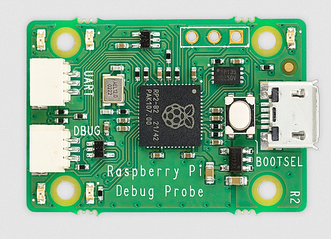](https://www.raspberrypi.com/news/raspberry-pi-debug-probe-a-plug-and-play-debug-kit-for-12/)

Yestertoday, Raspberry Pi launched the Raspberry Pi Debug Probe, a complete debug hardware solution for Arm-based microcontrollers, powered by RP2040, and priced at just $12 - [Raspberry Pi](https://www.raspberrypi.com/news/raspberry-pi-debug-probe-a-plug-and-play-debug-kit-for-12/).

The Raspberry Pi Debug Probe provides:

* A USB to Serial Wire Debug (SWD) bridge
* A generic USB serial adapter
* Cables to connect to a host computer, and to the debug target

While it has been designed with Raspberry Pi Pico, and other RP2040-based targets, in mind, the Raspberry Pi Debug Probe can be used to debug any Arm-based microcontroller that provides an SWD port with 3V3 I/O.

## CircuitPython 8.0.2 Released

We knew it was coming... with the recent release of CircuitPython 8.0.0, a large number of users have tried it out. And users tend to find "edge cases" where something minor might not be right. See the following for a list of issues this release corrects. - [Adafruit Blog](https://blog.adafruit.com/2023/02/14/circuitpython-8-0-2-released/) and [GitHub](https://github.com/adafruit/circuitpython/releases/tag/8.0.2).

## Use an iPad or Android to Code your MicroPython or CircuitPython Application

[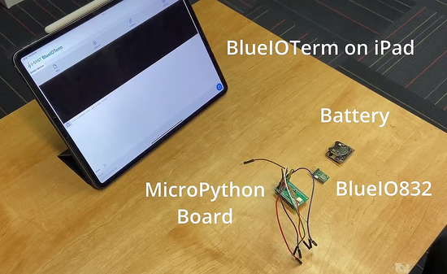](https://twitter.com/kytcath/status/1624799977632325637)

Do you need to write some MicroPython or CircuitPython code for your board but don't have a PC around? How about using your phone or tablet? I-SYST inc. provides their solution with their blueio832mini and blueioterm App for iOS & Android - [Twitter](https://twitter.com/kytcath/status/1624799977632325637) and [Crowd Supply](https://www.crowdsupply.com/i-syst/blueio832-mini).

## The Raspberry Pi Computing Curriculum

[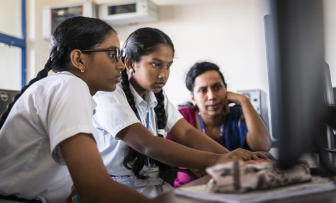](https://www.raspberrypi.org/blog/computing-curriculum-lesson-plans/)

The Raspberry Pi Computing Curriculum is a complete bank of free lesson plans and other resources that offer educators everything needed to teach computing lessons to all school-aged learners. It covers the full breadth of computing, including computing systems, programming, creating media, data and information, and societal impacts of digital technology. The 500 hours of free, downloadable resources within The Computing Curriculum include all the materials needed in the classroom - [Raspberry Pi Foundation](https://www.raspberrypi.org/blog/computing-curriculum-lesson-plans/).

## A Virtual Block-level Device for CircuitPython - Remote File System

[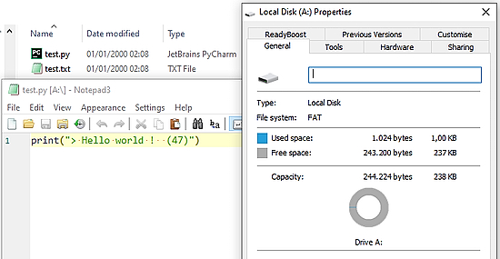](https://twitter.com/NibblePoker/status/1627472180735881217)

Twitter user Nibble Poker (Herwin Bozet of Azias Creations) has managed to get a working virtual block-level device working on CircuitPython, where each sector is fetched and written to from a remote host.
It also allows for remote code updates without having to touch or be anywhere near the MCU - [Twitter](https://twitter.com/NibblePoker/status/1627472180735881217) and [GitHub](https://github.com/aziascreations/CircuitPython-CustomFileSystems/tree/master/BLD-Remote).

## Linux 6.2 is out

[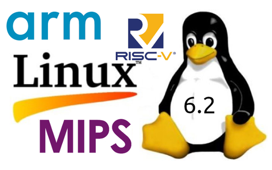]([url](https://www.cnx-software.com/2023/02/20/linux-6-2-release-main-changes-arm-risc-v-and-mips-architectures/))

#Linux 6.2 is out with initial support for some Apple Arm processors. There is also more support for for the Arm, RISC-V and MIPS architectures - [CNX Software]([url](https://www.cnx-software.com/2023/02/20/linux-6-2-release-main-changes-arm-risc-v-and-mips-architectures/)) via [Twitter](https://twitter.com/cnxsoft/status/1627612465436692486?t=pniafSVjlfvavntU3SkNvw&s=03).

## News from the Python Software Foundation

Python 3.11.2, Python 3.10.10 and 3.12.0 alpha 5 are available - [PSF Blog](https://blog.python.org/).

More including a second Developer-in-Residence discussion, Python Packaging, and second quarter PSF Fellow members - [PSF](https://www.python.org/).

## This Week's Python Streams

Python on Hardware is all about building a cooperative ecosphere which allows contributions to be valued and to grow knowledge. Below are the streams within the last week focusing on the community.

### CircuitPython Deep Dive Stream

[This week](https://youtube.com/live/610RAZziCU8), Tim streamed work on trying out GIF support.

You can see the latest video and past videos on the Adafruit YouTube channel under the Deep Dive playlist - [YouTube](https://www.youtube.com/playlist?list=PLjF7R1fz_OOXBHlu9msoXq2jQN4JpCk8A).

### CircuitPython Parsec

John Park’s CircuitPython Parsec this week is on {subject} - [Adafruit Blog](link) and [YouTube](link).

Catch all the episodes in the [YouTube playlist](https://www.youtube.com/playlist?list=PLjF7R1fz_OOWFqZfqW9jlvQSIUmwn9lWr).

## Project of the Week: 0x33.board MIDI controller (Beta)

[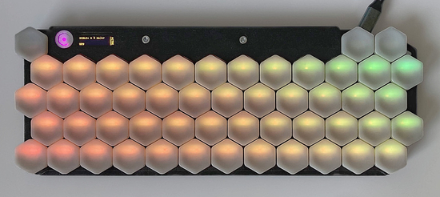](https://lectronz.com/products/beta-0x33-board-midi-controller)

The 0x33.board is a 48-key isomorphic MIDI key controller.

It supports USB-MIDI, TRS-MIDI (out only) and I2C. It also has a jack for 1-bit line output. The 48 keys of the main note surface are arranged in four staggered rows of twelve keys each. Each key has independent RGB backlighting that can be used to highlight scales.

Settings can be changed on the device using a small oled display and three dedicated menu/navigation keys. The 0x33.board firmware currently supports the Wicki-Hayden, Jankó, Harmonic Table and Gerhard layouts, but others can easily be added to the open-source CircuitPython firmware. It is currently in beta with production units expected to cost less - [Lectronz](https://lectronz.com/products/beta-0x33-board-midi-controller).

## News from around the web!

WizFi Chip Counter: a project using a WizFi360-EVB-PICO with sensors to create a tape microchip counting device, using CircuitPython - [hackster.io](https://www.hackster.io/ron-pang/wizfi-chip-counter-device-4ef97c).

> Managed to make a FAT12 filesystem with a code.py file and run it with CircuitPython using rp2040js, which emulates the RP2040 (chip on the Pico) in Node.js!  Hoping to make some cool CI/CD tools with this, but just cool to see the CircuitPython firmware running on the desktop! - [Mastodon](https://fosstodon.org/@tekktrik/109878432288671645).

[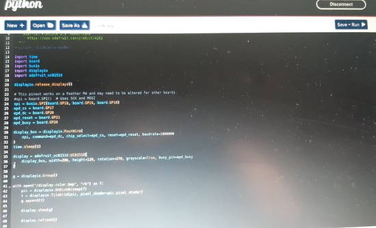](https://twitter.com/TheFlyingKipper/status/1627268369601683459?t=NO9JpAKGq_QvH9NV1GnaDw&s=03)

Powering a Pimoroni Badger W from a battery and programming it via WiFi link using CircuitPython Web workflow code editor - [Twitter Thread](https://twitter.com/TheFlyingKipper/status/1627268369601683459?t=NO9JpAKGq_QvH9NV1GnaDw&s=03).

[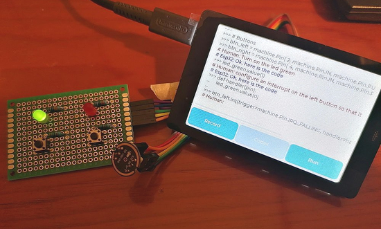](https://hackaday.io/project/188303-esp32-ai-assistant)

ESP32 AI assistant is an ESP32 that can be programmed in MicroPthon, by voice and in natural language - [hackaday.io](https://hackaday.io/project/188303-esp32-ai-assistant).

Learning the micro:bit Python Editor - [microbit.org](https://microbit.org/get-started/user-guide/python-editor/).

A self-contained board and display with a large button interface and 3D printed case using CircuitPython - [Twitter](https://twitter.com/BeBoXoS/status/1626244670853373954).

[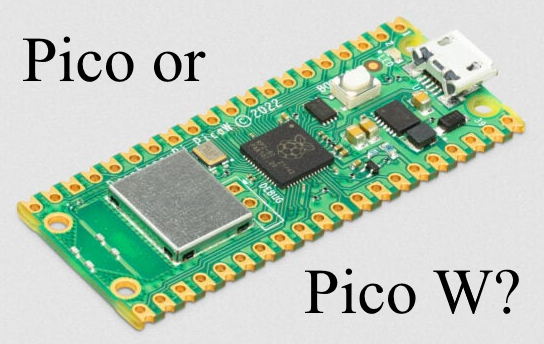](https://github.com/earlephilhower/arduino-pico/issues/849)

How to detect difference between Pico and Pico W (code added to the Earl Philhower code) - [GitHub](https://github.com/earlephilhower/arduino-pico/issues/849).

[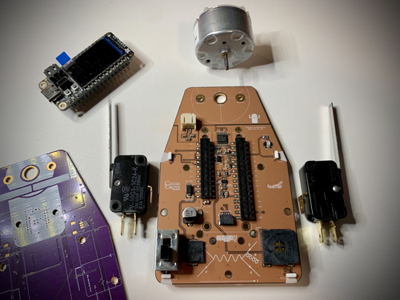](https://octodon.social/@cedargrove@mastodon.cloud/109871807462921908)

A next generation String Car Robot FeatherWing featureing a beautiful Oshpark After Dark PCB. Limit switch end-of-string detectors, audio amp and integral speaker, NeoPixel path illumination, and StemmaQT for anything else, programmable in CircuitPython - [Mastodon](https://octodon.social/@cedargrove@mastodon.cloud/109871807462921908).

[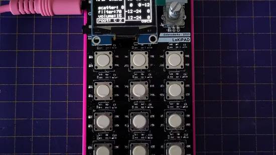](https://www.hackster.io/news/minimal-macro-midi-pad-43bac1a57251?s=03)

LoKiPAD is an inexpensive MacroPad clone with integrated audio hardware - [hackster.io](https://www.hackster.io/news/minimal-macro-midi-pad-43bac1a57251?s=03) and [YouTube](https://youtu.be/jMKC_18M17U).

[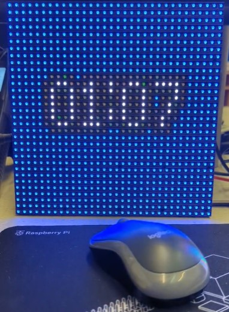](https://twitter.com/CannonFodder/status/1626389247254036485)

A digital clock with the Pimoroni Interstate 75W and MicroPython - [Twitter](https://twitter.com/CannonFodder/status/1626389247254036485).

Routing of the Eurorack Precision VCO module. It will be ready for Oshpark after confirming all footprints. The VCO will accept frequency and amplitude CV inputs as well as MIDI. The module incorporates an Adafruit ItsyBitsyM4 and a 1.54-inch TFT display, all coded in CircuitPython - [Mastodon](https://octodon.social/@cedargrove@mastodon.cloud/109838869712698999).

[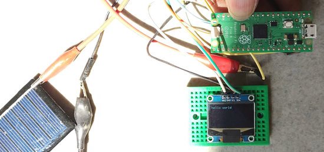](https://twitter.com/patilsaheb/status/1627383522523774976)

A Raspberry Pi Pico powered directly with a small solar panel, +ve to VSYS. It is running CircuitPython, driving an OLED display - [Twitter](https://twitter.com/patilsaheb/status/1627383522523774976).

The pico-ducky project now supports the Raspberry Pi Pico W. It has also been updated to support CircuitPython 8.0.0 - [Twitter](https://twitter.com/daveisu/status/1627071917722333185) and [GitHub](https://github.com/dbisu/pico-ducky).

Programming the Maker Badge with Czech text with CircuitPython - [Twitter](https://twitter.com/petr_vavrin/status/1626950770556907520).

[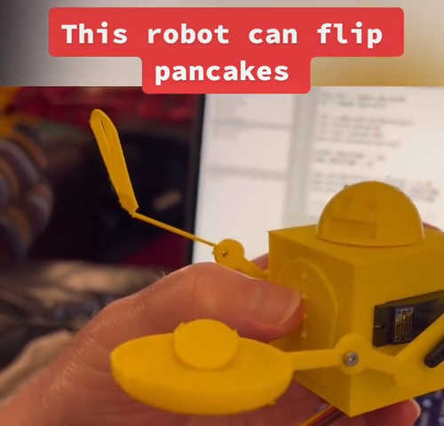](https://twitter.com/kevsmac/status/1627063869964435456)

A pancake flipping robot programmed in MicroPython - [Twitter](https://twitter.com/kevsmac/status/1627063869964435456).

[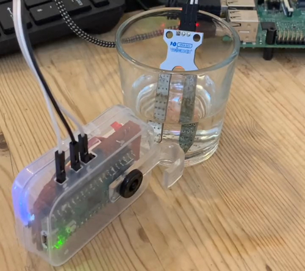](https://twitter.com/PaterPracticus/status/1626949272074690561)

Putting a Raspberry Pi Pico watering monitor into deep sleep and then wake it up again with MicroPython - [Twitter](https://twitter.com/PaterPracticus/status/1626949272074690561).

[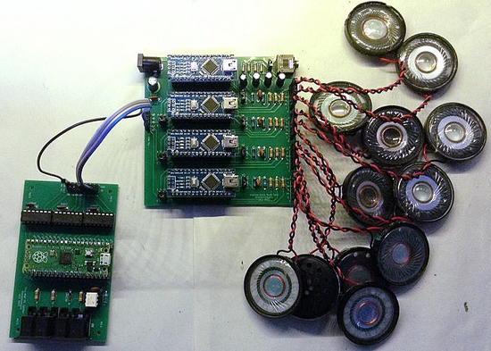](https://diyelectromusic.wordpress.com/2023/02/19/raspberry-pi-pico-midi-note-balancer/)

Details of the "note balancing" application for the Pico MIDI Splitter, used in the new LoFi Orchestra - [DIYelectromusic](https://diyelectromusic.wordpress.com/2023/02/19/raspberry-pi-pico-midi-note-balancer/) via [Twitter](https://twitter.com/diyelectromusic/status/1627407729265451010).

[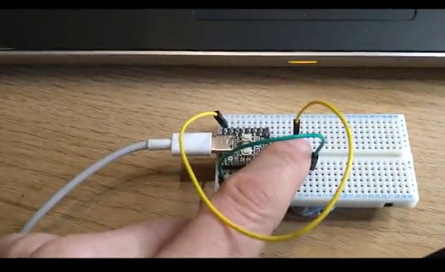](https://twitter.com/digitalMakerCIC/status/1627625142242140160?t=AI5nwHG2j2ZeIcFsjHjM_g&s=03)

A Tiny2040 using CircuitPython to have a counter play MP3's that "convert" to a monetary sentence... 1 Button + 1 Speaker and now built in MP3 playing ability! - [Digital-Maker](https://digital-maker.co.uk/number-to-money-counter-with-circuitpython-on-tiny2040) via [Twitter](https://twitter.com/digitalMakerCIC/status/1627625142242140160?t=AI5nwHG2j2ZeIcFsjHjM_g&s=03).

[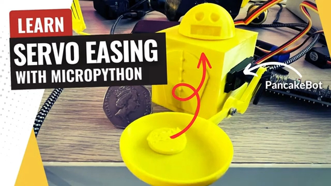](https://www.youtube.com/watch?v=kXs2nYP-aws)

Servo Easing with MicroPython - [YouTube](https://www.youtube.com/watch?v=kXs2nYP-aws).

[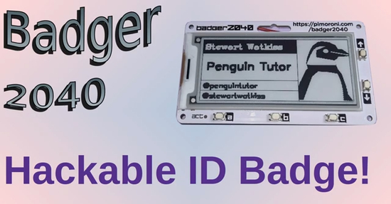](https://www.youtube.com/watch?v=mLhnrIqgvts)

Badger 2040W hacking, making a simple web app with MicroPython - [YouTube](https://www.youtube.com/watch?v=mLhnrIqgvts) via [Twitter](https://twitter.com/penguintutor/status/1627630352733700096?t=jwjDaTd0WSNfzLsvNUljww&s=03).

text - [site](url).

[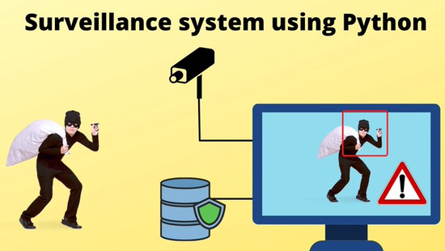](https://morioh.com/p/900bf047ecf6?f=5c21fb01c16e2556b555ab32)

How to Create Home Surveillance System Using Python - [morioh](https://morioh.com/p/900bf047ecf6?f=5c21fb01c16e2556b555ab32) and [YouTube](https://www.youtube.com/watch?v=lwPPPsI-_g8).

PyDev of the Week: NAME on [Mouse vs Python]()

CircuitPython Weekly Meeting for DATE ([notes]()) [on YouTube]()

#ICYDNCI What was the most popular, most clicked link, in [last week's newsletter](https://www.adafruitdaily.com/2023/02/14/python-on-microcontrollers-newsletter-pico-sdk-1-5-0-and-kicad-7-0-0-released-and-more-circuitpython-python-micropython-thepsf-raspberry_pi/)? [Python 3 Cheat Sheet](https://github.com/FavioVazquez/ds-cheatsheets/blob/master/Python/Others/mementopython3-english.pdf).

## New

NetPi is an Ethernet HAT for Raspberry Pi Pico that enables connection to the internet, supporting various internet protocols such as TCP, UDP, WOL over UDP, ICMP, IPv4, and more. NetPi can be used to create IoT devices, robots, home automation systems, and industrial control systems - [SB Components](https://shop.sb-components.co.uk/blogs/posts/netpi-ethernet-hat-for-pico-rp2040).

[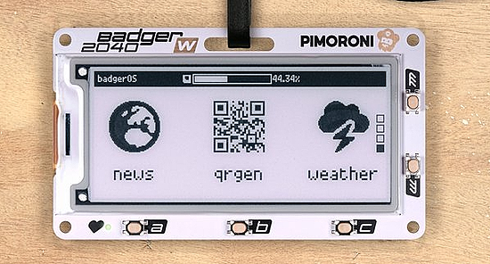](https://shop.pimoroni.com/products/badger-2040-w)

Badger 2040 W is a programmable badge with speedy B&W E Ink display and now WiFi - [Pimoroni](https://shop.pimoroni.com/products/badger-2040-w) via [Twitter](https://twitter.com/pimoroni/status/1626174396762144768).

[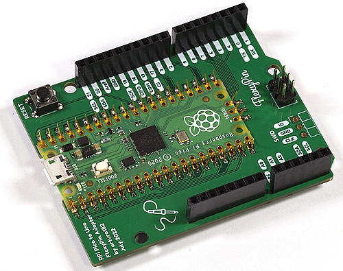](https://lectronz.com/products/raspberry-pi-pico-to-uno-flexypin-adapter)

A low cost Raspberry Pi Pico to Uno FlexyPin Adapter - [Lectronz](https://lectronz.com/products/raspberry-pi-pico-to-uno-flexypin-adapter).

## New Boards Supported by CircuitPython

The number of supported microcontrollers and Single Board Computers (SBC) grows every week. This section outlines which boards have been included in CircuitPython or added to [CircuitPython.org](https://circuitpython.org/).

This week, there was one new board added:

- [Hack Club Sprig](https://circuitpython.org/board/hack_club_sprig/)

*Note: For non-Adafruit boards, please use the support forums of the board manufacturer for assistance, as Adafruit does not have the hardware to assist in troubleshooting.*

Looking to add a new board to CircuitPython? It's highly encouraged! Adafruit has four guides to help you do so:

- [How to Add a New Board to CircuitPython](https://learn.adafruit.com/how-to-add-a-new-board-to-circuitpython/overview)
- [How to add a New Board to the circuitpython.org website](https://learn.adafruit.com/how-to-add-a-new-board-to-the-circuitpython-org-website)
- [Adding a Single Board Computer to PlatformDetect for Blinka](https://learn.adafruit.com/adding-a-single-board-computer-to-platformdetect-for-blinka)
- [Adding a Single Board Computer to Blinka](https://learn.adafruit.com/adding-a-single-board-computer-to-blinka)

## New Learn Guides!

[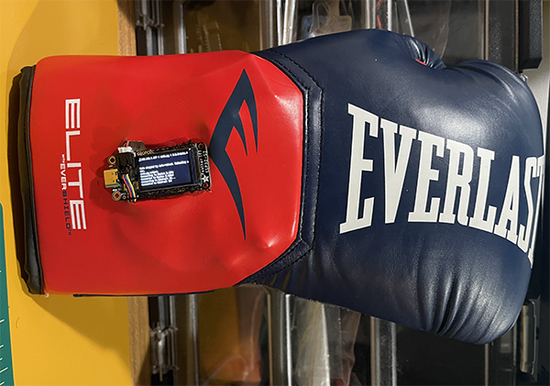](https://learn.adafruit.com/guides/latest)

[PyLeap ESP32-S2 TFT Boxing Glove Tracker w/ Adafruit IO](https://learn.adafruit.com/esp32-s2-tft-boxing-glove-tracker-w-adafruit-io) from [Trevor Beaton](https://learn.adafruit.com/u/Seekwill)

[Adafruit ESP32-S2 Reverse TFT Feather](https://learn.adafruit.com/esp32-s2-reverse-tft-feather) from [Kattni](https://learn.adafruit.com/u/kattni)

[Adafruit NeoKey BFF](https://learn.adafruit.com/adafruit-neokey-bff) from [Liz Clark](https://learn.adafruit.com/u/BlitzCityDIY)

## CircuitPython Libraries!

CircuitPython support for hardware continues to grow. We are adding support for new sensors and breakouts all the time, as well as improving on the drivers we already have. As we add more libraries and update current ones, you can keep up with all the changes right here!

For the latest libraries, download the [Adafruit CircuitPython Library Bundle](https://circuitpython.org/libraries). For the latest community contributed libraries, download the [CircuitPython Community Bundle](https://github.com/adafruit/CircuitPython_Community_Bundle/releases).

If you'd like to contribute, CircuitPython libraries are a great place to start. Have an idea for a new driver? File an issue on [CircuitPython](https://github.com/adafruit/circuitpython/issues)! Have you written a library you'd like to make available? Submit it to the [CircuitPython Community Bundle](https://github.com/adafruit/CircuitPython_Community_Bundle). Interested in helping with current libraries? Check out the [CircuitPython.org Contributing page](https://circuitpython.org/contributing). We've included open pull requests and issues from the libraries, and details about repo-level issues that need to be addressed. We have a guide on [contributing to CircuitPython with Git and GitHub](https://learn.adafruit.com/contribute-to-circuitpython-with-git-and-github) if you need help getting started. You can also find us in the #circuitpython channels on the [Adafruit Discord](https://adafru.it/discord).

You can check out this [list of all the Adafruit CircuitPython libraries and drivers available](https://github.com/adafruit/Adafruit_CircuitPython_Bundle/blob/master/circuitpython_library_list.md). 

The current number of CircuitPython libraries is **406**!

**New Libraries!**

Here's this week's new CircuitPython libraries:

* [jposada202020/CircuitPython_uplot](https://github.com/jposada202020/CircuitPython_uplot)

**Updated Libraries!**

Here's this week's updated CircuitPython libraries:

* [adafruit/Adafruit_CircuitPython_MiniMQTT](https://github.com/adafruit/Adafruit_CircuitPython_MiniMQTT)
* [adafruit/Adafruit_CircuitPython_Requests](https://github.com/adafruit/Adafruit_CircuitPython_Requests)
* [jposada202020/CircuitPython_uplot](https://github.com/jposada202020/CircuitPython_uplot)
* [tekktrik/CircuitPython_functools](https://github.com/tekktrik/CircuitPython_functools)

**Library PyPI Weekly Download Statistics**

**Total Library Stats**

228497 PyPI downloads over 306 libraries

**Top 10 Libraries by PyPI Downloads**

* Adafruit CircuitPython BusDevice (adafruit-circuitpython-busdevice): 26099
* Adafruit CircuitPython Requests (adafruit-circuitpython-requests): 25705
* Adafruit CircuitPython MiniMQTT (adafruit-circuitpython-minimqtt): 2274
* Adafruit CircuitPython Register (adafruit-circuitpython-register): 2132
* Adafruit CircuitPython Motor (adafruit-circuitpython-motor): 1799
* Adafruit CircuitPython NeoPixel (adafruit-circuitpython-neopixel): 1625
* Adafruit CircuitPython ADS1x15 (adafruit-circuitpython-ads1x15): 1587
* Adafruit CircuitPython Display Text (adafruit-circuitpython-display-text): 1585
* Adafruit CircuitPython Wiznet5k (adafruit-circuitpython-wiznet5k): 1564
* Adafruit CircuitPython ESP32SPI (adafruit-circuitpython-esp32spi): 1541

## What’s the team up to this week?

What is the team up to this week? Let’s check in!

**Dan**

I released CircuitPython 8.0.2 on Tuesday, February 14. This has some minor but necessary fixes to 8.0.0. There is no 8.0.1 -- I labeled the wrong thing with 8.0.1, so I just discarded it.

I added safemode.py to CircuitPython over the past week. safemode.py allows you to run some code to decide what to do after entering safe mode. Now you can recover automatically, instead of forcing the user to push a reset button to exit safe mode. This feature will be in the first beta of 8.1.0, which will be released soon, and is already available to test in the "Absolute Newest" builds.

**Kattni**

This week the [ESP32-S2 Reverse TFT Feather guide](https://learn.adafruit.com/esp32-s2-reverse-tft-feather) went live. It has everything you need to get started with and learn about your new Feather. 

I updated the [Feather ESP32-S3 guide](https://learn.adafruit.com/adafruit-esp32-s3-feather) to reflect the new revision having a different battery monitor chip onboard. There's code for both of them, and instructions on how to tell the difference.

**Melissa**

This past week, I have been working hard on the CircuitPython Installer for [circuitpython.org](https://circuitpython.org/). It is just about done feature-wise, but I'm still working on some debugging. At the moment, it is hanging while attempting to flash the device. Since I'm sure the code to flash the device is working, being that it is in a separate module and in use in other areas, it's only a matter of figuring out why my code just isn't working. I expect to have it working very soon since it was working at one point.

**Tim**

This week I tested PRs for the Wiznet Ethernet library and some others in the MiniMQTT library including new functionality to use secure communication on different ports rather than only the default one. I wired up a 7 color eink display and attempted to try out a PR build that adds support for displayio with it, I've been unsuccessful so far but will keep at it and have gotten a point in the right direction from Scott.

**Jeff**

I've been hard at work on a guide for using the new OV5640 breakout board with ESP32 and RP2040 microcontrollers and CircuitPython—Check elsewhere in the newsletter to find out if the guide was ready by newsletter publication time!

**Scott**

This week I wrapped up my dedicated work on [pysigrok](https://github.com/pysigrok/pysigrok). It's early but usable. In fact, I've started writing an "Implementer's Guide to the CircuitPython API" and am using it for testing. The goal of this guide is to assist folks in implementing the various modules that make up the CircuitPython API. I'm working to test and fix the iMX RT APIs and documenting gotchas as a I run across them.

**Liz**

This week I wrote guides on two new products: the [microSD Card BFF](https://learn.adafruit.com/adafruit-microsd-card-bff) and the [NeoKey BFF](https://learn.adafruit.com/adafruit-neokey-bff). The BFF boards are able to attach to the back of the QT Py boards, making them good for tiny projects. I think that the microSD Card BFF would be great for a tiny datalogger and the NeoKey BFF would be great for a tiny macro, like a commonly used keyboard shortcut or a password holder.

## Upcoming events!

The next MicroPython Meetup in Melbourne will be on February 22nd – [Meetup](https://www.meetup.com/MicroPython-Meetup/). 

Unlock the Power of MicroPython on an Arduino: Join a Live Webinar March 9, 2023 - [Elector](https://elektor.clickmeeting.com/arduino-micropython-webinar-with-sebastian-romero/register).

Hackaday Berlin 2023 has been scheduled for Saturday, March 25 - [Adafruit Blog](https://blog.adafruit.com/2023/02/08/hackaday-berlin-2023/) and [announcement](https://hackaday.com/2023/02/07/come-join-us-for-hackaday-berlin/).

PyCon US 2023 will be April 19-17, 2023, again in Salt Lake City, Utah USA - [PyCon US 2023](https://us.pycon.org/2023/).

The Open Hardware Summit is an annual conference organized by Open Source Hardware Association in New York City and virtually for 2 days: April 28-29, 2023 - [Eventbrite](https://www.eventbrite.com/e/open-hardware-summit-2023-tickets-525062294457).

**Send Your Events In**

If you know of virtual events or upcoming events, please let us know via email to cpnews(at)adafruit(dot)com.

## Latest releases

CircuitPython's stable release is [#.#.#](https://github.com/adafruit/circuitpython/releases/latest) and its unstable release is [#.#.#-##.#](https://github.com/adafruit/circuitpython/releases). New to CircuitPython? Start with our [Welcome to CircuitPython Guide](https://learn.adafruit.com/welcome-to-circuitpython).

[2023####](https://github.com/adafruit/Adafruit_CircuitPython_Bundle/releases/latest) is the latest CircuitPython library bundle.

[v#.#.#](https://micropython.org/download) is the latest MicroPython release. Documentation for it is [here](http://docs.micropython.org/en/latest/pyboard/).

[#.#.#](https://www.python.org/downloads/) is the latest Python release. The latest pre-release version is [#.#.#](https://www.python.org/download/pre-releases/).

[#,### Stars](https://github.com/adafruit/circuitpython/stargazers) Like CircuitPython? [Star it on GitHub!](https://github.com/adafruit/circuitpython)

## Call for help -- Translating CircuitPython is now easier than ever!

[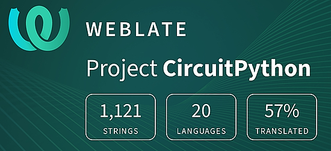](https://hosted.weblate.org/engage/circuitpython/)

One important feature of CircuitPython is translated control and error messages. With the help of fellow open source project [Weblate](https://weblate.org/), we're making it even easier to add or improve translations. 

Sign in with an existing account such as GitHub, Google or Facebook and start contributing through a simple web interface. No forks or pull requests needed! As always, if you run into trouble join us on [Discord](https://adafru.it/discord), we're here to help.

## jobs.adafruit.com - Find a dream job, find great candidates!

[jobs.adafruit.com](https://jobs.adafruit.com/) has returned and folks are posting their skills (including CircuitPython) and companies are looking for talented makers to join their companies - from Digi-Key, to Hackaday, Micro Center, Raspberry Pi and more.

**Job of the Week**

text - [Adafruit Jobs Board](https://jobs.adafruit.com/).

## NUMBER thanks!

The Adafruit Discord community, where we do all our CircuitPython development in the open, reached over NUMBER humans - thank you!  Adafruit believes Discord offers a unique way for Python on hardware folks to connect. Join today at [https://adafru.it/discord](https://adafru.it/discord).

## ICYMI - In case you missed it

Python on hardware is the Adafruit Python video-newsletter-podcast! The news comes from the Python community, Discord, Adafruit communities and more and is broadcast on ASK an ENGINEER Wednesdays. The complete Python on Hardware weekly videocast [playlist is here](https://www.youtube.com/playlist?list=PLjF7R1fz_OOXRMjM7Sm0J2Xt6H81TdDev). The video podcast is on [iTunes](https://itunes.apple.com/us/podcast/python-on-hardware/id1451685192?mt=2), [YouTube](http://adafru.it/pohepisodes), [IGTV (Instagram TV](https://www.instagram.com/adafruit/channel/)), and [XML](https://itunes.apple.com/us/podcast/python-on-hardware/id1451685192?mt=2).

[The weekly community chat on Adafruit Discord server CircuitPython channel - Audio / Podcast edition](https://itunes.apple.com/us/podcast/circuitpython-weekly-meeting/id1451685016) - Audio from the Discord chat space for CircuitPython, meetings are usually Mondays at 2pm ET, this is the audio version on [iTunes](https://itunes.apple.com/us/podcast/circuitpython-weekly-meeting/id1451685016), Pocket Casts, [Spotify](https://adafru.it/spotify), and [XML feed](https://adafruit-podcasts.s3.amazonaws.com/circuitpython_weekly_meeting/audio-podcast.xml).

## Codecademy "Learn Hardware Programming with CircuitPython"

Codecademy, an online interactive learning platform used by more than 45 million people, has teamed up with Adafruit to create a coding course, “Learn Hardware Programming with CircuitPython”. The course is now available in the [Codecademy catalog](https://www.codecademy.com/learn/learn-circuitpython?utm_source=adafruit&utm_medium=partners&utm_campaign=circuitplayground&utm_content=pythononhardwarenewsletter).

## Contribute!

The CircuitPython Weekly Newsletter is a CircuitPython community-run newsletter emailed every Tuesday. The complete [archives are here](https://www.adafruitdaily.com/category/circuitpython/). It highlights the latest CircuitPython related news from around the web including Python and MicroPython developments. To contribute, edit next week's draft [on GitHub](https://github.com/adafruit/circuitpython-weekly-newsletter/tree/gh-pages/_drafts) and [submit a pull request](https://help.github.com/articles/editing-files-in-your-repository/) with the changes. You may also tag your information on Twitter with #CircuitPython. 

Join the Adafruit [Discord](https://adafru.it/discord) or [post to the forum](https://forums.adafruit.com/viewforum.php?f=60) if you have questions.
