View this email in your browser. **Warning: Flashing Imagery**

Welcome to the latest Python on Microcontrollers newsletter! Finally, a week without a new CircuitPython release. Don't hold your breath too long as there will be an 8.0.4 and 8.1.0 is progressing. Today is a favorite for folks in science, math and computers & microcontrollers - it's Pi Day (3/14 in month/day format, the first 3 digits of Pi). Feel free to post your favorite Raspberry Pi-based project on social media and let us know via cpnews(at)adafruit(dot)com if it's programmed in any flavor of Python. I hope you enjoy this issue - *Ed.*

We're on [Discord](https://discord.gg/HYqvREz), [Twitter](https://twitter.com/search?q=circuitpython&src=typed_query&f=live), and for past newsletters - [view them all here](https://www.adafruitdaily.com/category/circuitpython/). If you're reading this on the web, [subscribe here](https://www.adafruitdaily.com/). Here's the news this week:

## Happy Pi Day

Pi Day is celebrated on March 14th (3/14) around the world. Pi (Greek letter “π”) is the symbol used in mathematics to represent a constant — the ratio of the circumference of a circle to its diameter — which is approximately 3.14159. Pi Day is an annual opportunity for math enthusiasts to recite the infinite digits of Pi, talk to their friends about math, and eat [pie, the dessert](https://en.wikipedia.org/wiki/Pie) - [piday.org](https://www.piday.org/).

Pi Day is also a day of celebrating Raspberry Pi. Pull out your favorite Pi (a Pi Pico / PicoW count!) and have some fun and consider donating to the Raspberry Pi Foundation - [Twitter](https://twitter.com/RaspberryPi_org/status/1633769903155994624) and [Donate](https://www.raspberrypi.org/donate/?utm_source=twitter&utm_medium=social&utm_campaign=pi-day-2023).

## GitHub Starts Rolling Out Two-Factor Authentication Requirement

[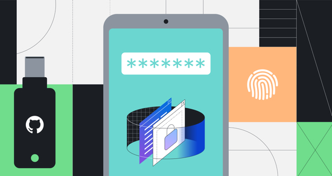](https://github.blog/2023-03-09-raising-the-bar-for-software-security-github-2fa-begins-march-13/)

Last year, GitHub announced their commitment to require all developers who contribute code on GitHub.com to enable two-factor authentication (2FA) by the end of 2023. From March 13, they will begin rolling out that 2FA requirement - [GitHub Blog](https://github.blog/2023-03-09-raising-the-bar-for-software-security-github-2fa-begins-march-13/).

## Make: Interviews Debra Ansell (@GeekMomProjects)

Frequent Pythonista Debra Ansell (@GeekMomProjects on Twitter) talks to Make: about the creative process, making blinking projects and much moroe - [Makezine](https://makezine.com/article/maker-news/obsessed-with-colorful-orbs/).

## Using CircuitPython in Neuroscience

Embedded.fm talks to Peter Griffin in Episode 444 about operant boxes, projects, embedded systems and more. At about the 29:30 minute mark, Peter talks about using CircuitPython in operant box programming - [embedded.fm](https://embedded.fm/episodes/444), [transcript](https://embedded.fm/transcripts/444) and [podcast audio download](https://traffic.libsyn.com/makingembeddedsystems/embedded-ep444.mp3?download=true).

## This Week's Python Streams

Python on Hardware is all about building a cooperative ecosphere which allows contributions to be valued and to grow knowledge. Below are the streams within the last week focusing on the community.

### CircuitPython Deep Dive Stream

This week, Tim is out, but you can see past videos on the Adafruit YouTube channel under the Deep Dive playlist - [YouTube](https://www.youtube.com/playlist?list=PLjF7R1fz_OOXBHlu9msoXq2jQN4JpCk8A).

### CircuitPython Parsec

John Park’s CircuitPython Parsec this week is on ANSI Escape Codes - [Adafruit Blog](https://blog.adafruit.com/2023/03/13/john-parks-circuitpython-parsec-ansi-escape-codes-adafruit-circuitpython/) and [YouTube](https://youtu.be/PcdxKl64uMo).

Catch all the episodes in the [YouTube playlist](https://www.youtube.com/playlist?list=PLjF7R1fz_OOWFqZfqW9jlvQSIUmwn9lWr).

## Project of the Week: CircuitPython Phone Dialer

[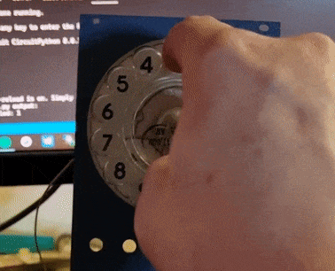](https://www.instagram.com/tv/CpnneDNoGWA/?igshid=MDJmNzVkMjY%3D)

Steve Anderson (irregularshed on Instagram) posts his project of an old rotary phone dial talking to his computer via CircuitPython running on a Wemos Lolin S2 Mini. "The S2 Mini has quite a good DAC so I'll be multiplying that out through an op amp to get values between 0v and 5v for my synth" - [Instagram](https://www.instagram.com/tv/CpnneDNoGWA/?igshid=MDJmNzVkMjY%3D).

## News from around the web!

[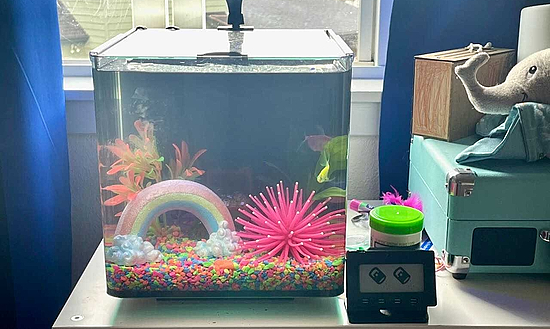](https://www.stevenquinndesign.com/fish-feeder-tracker/)

Building a fish feeder tracker with an Adafruit MagTag and CircuitPython - [Steven Quinn](https://www.stevenquinndesign.com/fish-feeder-tracker/) and [Code on GitHub](https://github.com/stevenquinn/fish-feeding-tracker).

[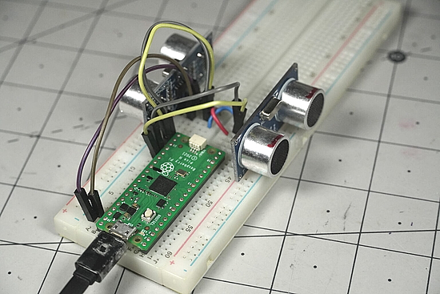]([url](https://www.raspberrypi.com/news/theremin-like-pico-h-musical-instrument/))

Theremin-like Pico H musical instrument with ultasonic sensors programmed in CircuitPython- [Raspberry Pi]([url](https://www.raspberrypi.com/news/theremin-like-pico-h-musical-instrument/)), [Twitter Video](https://twitter.com/JeremySCook/status/1620116344904757248) and [GitHub](https://github.com/JeremySCook/circuitpython-experiments/tree/main/MIDI).

[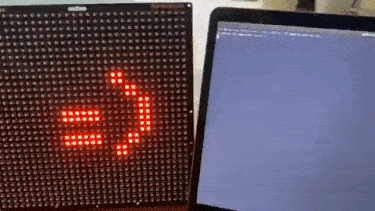](https://twitter.com/yezzer/status/1633024714250543105?t=1dTa30PzDQZIGEWnduXfqQ&s=03)

> We've all been thinking that AI needs to control physical things! So I've made a start here with some early morning noodling about in Python. This time OpenAI’s ChatGPT is controlling Pimoroni's excellent Cosmic Unicorn - [Twitter](https://twitter.com/yezzer/status/1633024714250543105?t=1dTa30PzDQZIGEWnduXfqQ&s=03).

Fig Pi is a LEGO Minifigure-shaped circuit board with an RP2040 microcontroller which can run CircuitPython - [Mastodon](https://mastodon.social/@ben_shockley/109995700046854313).

[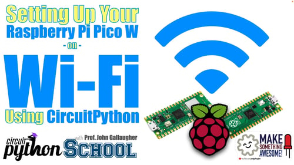](https://blog.adafruit.com/2023/03/10/connect-your-raspberry-pi-pico-w-to-your-wifi-network-using-circuitpython-raspberrypipico-piday-gallaugher-raspberry_pi/)

Connecting your Raspberry Pi Pico W to your WiFi network using CircuitPython - [Adafruit Blog](https://blog.adafruit.com/2023/03/10/connect-your-raspberry-pi-pico-w-to-your-wifi-network-using-circuitpython-raspberrypipico-piday-gallaugher-raspberry_pi/) and [YouTube](https://www.youtube.com/watch?v=l5A7Q4Z06Tc) via [Mastodon](https://mastodon.world/@gallaugher/109986058847172743).

[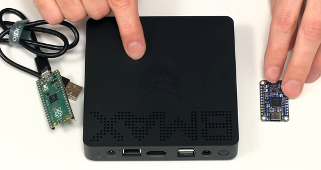](https://www.youtube.com/watch?v=Rt5xtIyxgco)

Adding GPIO for any PC or laptop using an Adafruit FT232H and Python - [YouTube](https://www.youtube.com/watch?v=Rt5xtIyxgco).

[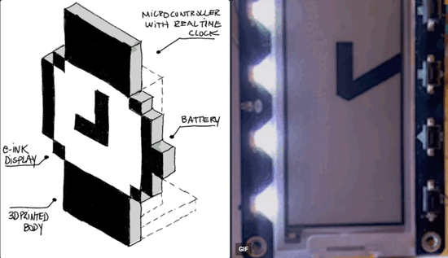](https://hachyderm.io/@pierrenick/110014123911711063)

> "In #MARCHintosh-esque fashion, I decided to make my Macintosh System watch cursor clock concept a reality! I wrote the display code for it — it's all CircuitPython, testing it on an Adafruit MagTag (using the buttons to add/remove 1h or 5min) - [Mastodon](https://hachyderm.io/@pierrenick/110014123911711063) and [GitHub](https://github.com/pndurette/system-watch-clock).

[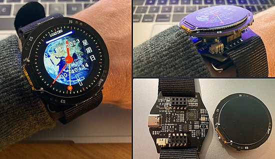](https://mastodon.social/@aallan/110010099227821571)

> In today's mailbag, a [1.28-inch TFT watch](https://www.tindie.com/products/adz1122/pi-pico-rp2040-128-inch-tft-display-watch-board/) built around the Raspberry Pi RP2040 microcontroller. Comes with pre-blown firmware, but absolutely no documentation at all. So I guess it's time to try and figure out how they're talking to the screen. First stop `picotool` to poke around inside the firmware, and then more aggressive methods. Although, with a bit of luck, I can find some datasheets for the screen and other peripherals" - [Mastodon Thread](https://mastodon.social/@aallan/110010099227821571).

[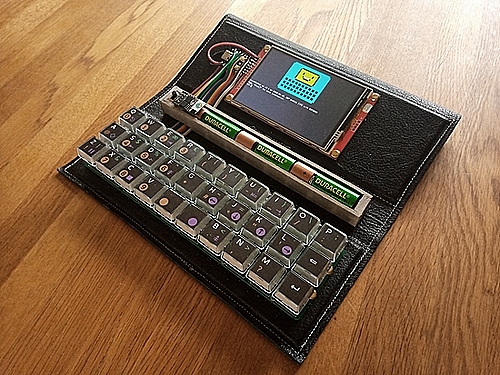](https://github.com/ncrawforth/VT2040-utils)

VT2040-utils is a collection of small utilites to turn a VT2040 and an ESP8266 running MicroPython into a useful portable computer, including an editor and GitHub client - [GitHub](https://github.com/ncrawforth/VT2040-utils).

[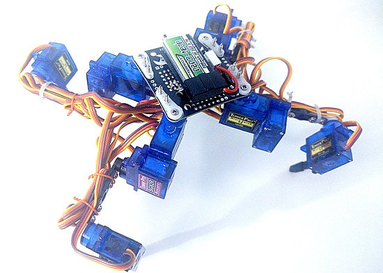](https://hackaday.io/project/9927-tote-had)

Tote, Hackaday Edition, is a small (fits in your palm) walking robot, with three degree of freedom legs, costing something around $30 for the parts, programmable in MicroPython - [Hackaday](https://hackaday.io/project/9927-tote-had) and [GitHub](https://github.com/deshipu/tote-had).

[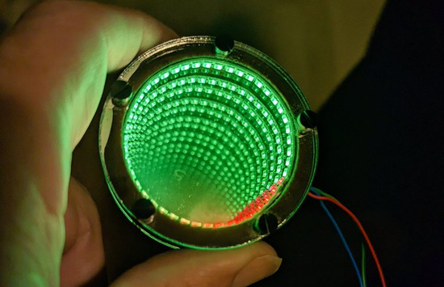](https://twitter.com/CannonFodder/status/1634314799776518147)

An infinity mirror: tiny but so pretty. LEDs are being driven by a Pimoroni Plasma Stick 2040W running the rainbow example - [Twitter](https://twitter.com/CannonFodder/status/1634314799776518147).

[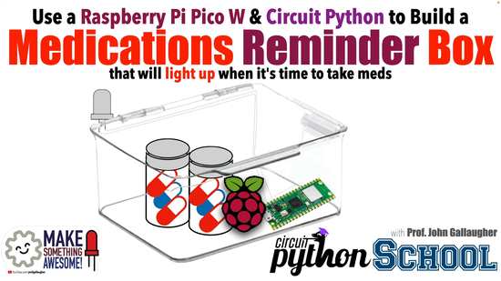](https://www.youtube.com/watch?v=USiLQ52QBIQ)

Building a Raspberry Pi Pico W medication reminder box using CircuitPython - [YouTube](https://www.youtube.com/watch?v=USiLQ52QBIQ).

[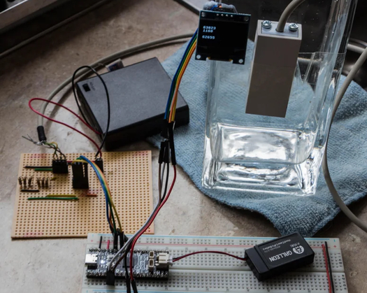](https://www.instructables.com/Water-Depth-Gauge-With-Capacitive-Difference-Senso/)

Using a Capacitive Difference Sensor W01 to measure the depth of water in a glass vase without getting it wet - [Instructables](https://www.instructables.com/Water-Depth-Gauge-With-Capacitive-Difference-Senso/) and [YouTube](https://youtu.be/5OUG9Fc96Hk).

PicoVGA - VGA/TV display on Raspberry Pico by Miroslav Nemecek - [GitHub](https://github.com/Panda381/PicoVGA).

Keyboard Builders' Digest Issue 115 is out - [kbd.news](https://kbd.news/issue/115/).

[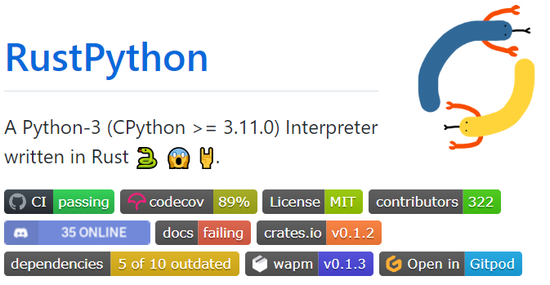](https://github.com/RustPython/RustPython)

RustPython is a Python 3 (CPython >= 3.11.0) interpreter written in Rust - [GitHub](https://github.com/RustPython/RustPython).

Aura Text: Like Any Text Editor, Unlike Any Text Editor build using Tkinter and Python - [GitHub](https://github.com/rohankishore/Aura-Text).

Meet Zig: The modern alternative to C - [Infoworld](https://www.infoworld.com/article/3689648/meet-the-zig-programming-language.html).

Lazy recursion, with generators - [tushar.lol](https://tushar.lol/post/recursive-generators/).

PyDev of the Week: Logan Thomas on [Mouse vs Python](https://www.blog.pythonlibrary.org/2023/03/13/pydev-of-the-week-logan-thomas/).

CircuitPython Weekly Meeting for March 13, 2023 ([notes](https://github.com/adafruit/adafruit-circuitpython-weekly-meeting/blob/main/2023/2023-03-13.md)) [on YouTube](https://youtu.be/ZhCqhDv-ajY)

#ICYDNCI What was the most popular, most clicked link, in [last week's newsletter](https://www.adafruitdaily.com/2023/03/07/python-on-microcontrollers-newsletter-circuitpython-8-1-0beta0-out-new-raspi-pico-documentation-and-much-more-circuitpython-python-micropython-thepsf-raspberry_pi/)? [New Raspberry Pi Pico and RP2040 Documentation](https://www.raspberrypi.com/documentation/microcontrollers/).

## New

A Wireless Video Editing Macropad with a 60mm Rotary Encoder (Jog Wheel). Designed for use with BlueMicro840 controllers programmable in Arduino or CircuitPython - [Tindie](https://www.tindie.com/products/jpconstantineau/wireless-video-editing-macropad-and-jog-wheel/) and [YouTube](https://youtu.be/JgODYCTNNbA).

Adafruit Metro M7 features 500 MHz NXP i.MX RT1011 Cortex-M7 SoC with ESP32 WiFi. Programmable in CircuitPython and Arduino - [CNX Software](https://www.cnx-software.com/2023/03/10/arduino-uno-adafruit-metro-m7-500-mhz-nxp-i-mx-rt1011-cortex-m7-soc/) and [Adafruit](https://www.adafruit.com/product/4950).

## Coming Soon

The Pimoroni DV Stick will plug into an HDMI port and sport two RP2040 chips. It'll allow for a MicroPython prompt and be programmable with C++, MicroPython or CircuitPython - [Tom's Hardware](https://www.tomshardware.com/news/pimoroni-stick-pi-gaming-console).

## New Boards Supported by CircuitPython

The number of supported microcontrollers and Single Board Computers (SBC) grows every week. This section outlines which boards have been included in CircuitPython or added to [CircuitPython.org](https://circuitpython.org/).

This week, there were no new boards added, but several are in development.

*Note: For non-Adafruit boards, please use the support forums of the board manufacturer for assistance, as Adafruit does not have the hardware to assist in troubleshooting.*

Looking to add a new board to CircuitPython? It's highly encouraged! Adafruit has four guides to help you do so:

- [How to Add a New Board to CircuitPython](https://learn.adafruit.com/how-to-add-a-new-board-to-circuitpython/overview)
- [How to add a New Board to the circuitpython.org website](https://learn.adafruit.com/how-to-add-a-new-board-to-the-circuitpython-org-website)
- [Adding a Single Board Computer to PlatformDetect for Blinka](https://learn.adafruit.com/adding-a-single-board-computer-to-platformdetect-for-blinka)
- [Adding a Single Board Computer to Blinka](https://learn.adafruit.com/adding-a-single-board-computer-to-blinka)

## New Learn Guides!

[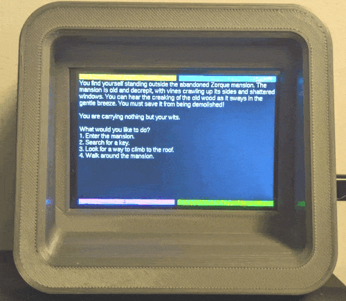](https://learn.adafruit.com/guides/latest)

[Infinite Text Adventure](https://learn.adafruit.com/infinite-text-adventure) from [Jeff Epler](https://learn.adafruit.com/u/jepler)

[Cyber Cat MIDI Keyboard](https://learn.adafruit.com/midi-cyber-cat-keyboard) from [John Park](https://learn.adafruit.com/u/johnpark)

[TRON DISC](https://learn.adafruit.com/trondisc) from the [Ruiz Brothers](https://learn.adafruit.com/trondisc)

[Bubble Table with LED Animations and IR Remote Control](https://learn.adafruit.com/bubble-table-with-led-animations-and-ir-remote-control) from [Erin St Blaine](https://learn.adafruit.com/u/firepixie)

## CircuitPython Libraries!

CircuitPython support for hardware continues to grow. We are adding support for new sensors and breakouts all the time, as well as improving on the drivers we already have. As we add more libraries and update current ones, you can keep up with all the changes right here!

For the latest libraries, download the [Adafruit CircuitPython Library Bundle](https://circuitpython.org/libraries). For the latest community contributed libraries, download the [CircuitPython Community Bundle](https://github.com/adafruit/CircuitPython_Community_Bundle/releases).

If you'd like to contribute, CircuitPython libraries are a great place to start. Have an idea for a new driver? File an issue on [CircuitPython](https://github.com/adafruit/circuitpython/issues)! Have you written a library you'd like to make available? Submit it to the [CircuitPython Community Bundle](https://github.com/adafruit/CircuitPython_Community_Bundle). Interested in helping with current libraries? Check out the [CircuitPython.org Contributing page](https://circuitpython.org/contributing). We've included open pull requests and issues from the libraries, and details about repo-level issues that need to be addressed. We have a guide on [contributing to CircuitPython with Git and GitHub](https://learn.adafruit.com/contribute-to-circuitpython-with-git-and-github) if you need help getting started. You can also find us in the #circuitpython channels on the [Adafruit Discord](https://adafru.it/discord).

You can check out this [list of all the Adafruit CircuitPython libraries and drivers available](https://github.com/adafruit/Adafruit_CircuitPython_Bundle/blob/master/circuitpython_library_list.md). 

The current number of CircuitPython libraries is **360**!

**Updated Libraries!**

Here's this week's updated CircuitPython libraries:

* [adafruit/Adafruit_CircuitPython_MiniMQTT](https://github.com/adafruit/Adafruit_CircuitPython_MiniMQTT)
* [jposada202020/CircuitPython_uplot](https://github.com/jposada202020/CircuitPython_uplot)

**Library Statistics**

**Total Library Stats**

* 140419 PyPI downloads over 308 libraries

**Top 10 Libraries by PyPI Downloads**

* Adafruit CircuitPython BusDevice (adafruit-circuitpython-busdevice): 7080
* Adafruit CircuitPython Requests (adafruit-circuitpython-requests): 6588
* Adafruit CircuitPython Register (adafruit-circuitpython-register): 1788
* Adafruit CircuitPython NeoPixel (adafruit-circuitpython-neopixel): 1686
* Adafruit CircuitPython MiniMQTT (adafruit-circuitpython-minimqtt): 1595
* Adafruit CircuitPython Motor (adafruit-circuitpython-motor): 1295
* Adafruit CircuitPython ADS1x15 (adafruit-circuitpython-ads1x15): 1231
* Adafruit CircuitPython framebuf (adafruit-circuitpython-framebuf): 1114
* Adafruit CircuitPython Display Text (adafruit-circuitpython-display-text): 1112
* Adafruit CircuitPython Wiznet5k (adafruit-circuitpython-wiznet5k): 1023

## What’s the team up to this week?

What is the team up to this week? Let’s check in!

**Dan**

This week I'm collecting a small number of fixes for a CircuitPython 8.0.4 release, which should happen fairly soon. I've also updated several underlying software libraries used by CircuitPython, in preparation for the 8.1.0 release.

**Melissa**

I was out sick most of this past week, but was able to work with the Adafruit IO team to resolve an elusive issue where the ESP8266 was freezing up. It ended up being due to an incorrect file system size parameter. I also started trying out the new ChatGPT API on the Raspberry Pi to see what some of the possibilities are.

**Tim**

I have been on vacation a portion of the week. Before leaving I was working on trying to fix some bugs in the bitmaptools boundary fill method. It was not properly executing background tasks or checking for interrupt from user so it made it feel stalled while working on larger bitmap segments.

**Jeff**

I've been working on the next feature for the Metro M7 (i2s output) and a ChatGPT-powered game for PyPortal that presents an infinite text adventure game. For the latter, there was a short video shown on last week's Ask an Engineer about it. It'll soon be a guide in the Adafruit Learning System.

**Scott**

This week I've been exploring the world of iMX RT's memory hierarchy and its impact on error handling and performance. These cpu cores have caches and tightly coupled memory that can be used to store data and code for fast access. Without using this areas well, the CPU will spend time waiting and effectively slow down.

Furthermore, if we're writing flash for CIRCUITPY, we cannot access code on the flash at the same time. This lead to really bad crashes where the CPU couldn't load the error handling code. Putting error handling code in RAM makes the crashes easier to debug and enter safe mode from.

So, I hope to make a PR soon to improve error handling and also performance.

This past week I published two new product guides. The first was for the [ESP32-S3 Reverse TFT Feather](https://learn.adafruit.com/esp32-s3-reverse-tft-feather). It's really great for compact IoT projects since it has the screen and three buttons built-in. The next guide was the [PiCowbell Adalogger](https://learn.adafruit.com/adafruit-picowbell-adalogger-for-pico). This board is designed to plug directly into a Pico or Pico W and has a STEMMA QT port, microSD card slot and RTC module with a coin cell battery holder for battery back-up. In the CircuitPython and Arduino pages I included examples for setting the RTC and for a quick start datalogging example: logging data from a temperature sensor to a text file on the microSD card with timestamps from the RTC.

## Upcoming events!

A Munich RISC-V Meetup, one day after the doors of Embedded World close on March 17th. RISC-V enthusiasts will get together in Munich, Bavaria - [RISCV.org](https://riscv.org/event/munich-risc-v-meetup/)

The next MicroPython Meetup in Melbourne will be on March 22nd – [Meetup](https://www.meetup.com/MicroPython-Meetup/). 

Hackaday Berlin 2023 is scheduled for Saturday, March 25 - [Adafruit Blog](https://blog.adafruit.com/2023/02/08/hackaday-berlin-2023/) and [announcement](https://hackaday.com/2023/02/07/come-join-us-for-hackaday-berlin/).

PyCon US 2023 will be April 19-17, 2023, again in Salt Lake City, Utah USA - [PyCon US 2023](https://us.pycon.org/2023/).

EuroPython 2023 will be July 17-23, 2023, in Prague, Czech Republic and Remote - [EuroPython 2023](https://ep2023.europython.eu/).

**Send Your Events In**

If you know of virtual events or upcoming events, please let us know via email to cpnews(at)adafruit(dot)com.

## Latest releases

CircuitPython's stable release is [8.0.3](https://github.com/adafruit/circuitpython/releases/latest) and its unstable release is [8.1.0-beta.0](https://github.com/adafruit/circuitpython/releases). New to CircuitPython? Start with our [Welcome to CircuitPython Guide](https://learn.adafruit.com/welcome-to-circuitpython).

[20230313](https://github.com/adafruit/Adafruit_CircuitPython_Bundle/releases/latest) is the latest CircuitPython library bundle.

[v1.19.1](https://micropython.org/download) is the latest MicroPython release. Documentation for it is [here](http://docs.micropython.org/en/latest/pyboard/).

[3.11.2](https://www.python.org/downloads/) is the latest Python release. The latest pre-release version is [3.12.0a6](https://www.python.org/download/pre-releases/).

[3,433 Stars](https://github.com/adafruit/circuitpython/stargazers) Like CircuitPython? [Star it on GitHub!](https://github.com/adafruit/circuitpython)

## Call for help -- Translating CircuitPython is now easier than ever!

[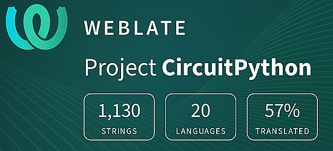](https://hosted.weblate.org/engage/circuitpython/)

One important feature of CircuitPython is translated control and error messages. With the help of fellow open source project [Weblate](https://weblate.org/), we're making it even easier to add or improve translations. 

Sign in with an existing account such as GitHub, Google or Facebook and start contributing through a simple web interface. No forks or pull requests needed! As always, if you run into trouble join us on [Discord](https://adafru.it/discord), we're here to help.

## 36,921 thanks!

The Adafruit Discord community, where we do all our CircuitPython development in the open, reached over 36,921 humans - thank you!  Adafruit believes Discord offers a unique way for Python on hardware folks to connect. Join today at [https://adafru.it/discord](https://adafru.it/discord).

## ICYMI - In case you missed it

Python on hardware is the Adafruit Python video-newsletter-podcast! The news comes from the Python community, Discord, Adafruit communities and more and is broadcast on ASK an ENGINEER Wednesdays. The complete Python on Hardware weekly videocast [playlist is here](https://www.youtube.com/playlist?list=PLjF7R1fz_OOXRMjM7Sm0J2Xt6H81TdDev). The video podcast is on [iTunes](https://itunes.apple.com/us/podcast/python-on-hardware/id1451685192?mt=2), [YouTube](http://adafru.it/pohepisodes), [IGTV (Instagram TV](https://www.instagram.com/adafruit/channel/)), and [XML](https://itunes.apple.com/us/podcast/python-on-hardware/id1451685192?mt=2).

[The weekly community chat on Adafruit Discord server CircuitPython channel - Audio / Podcast edition](https://itunes.apple.com/us/podcast/circuitpython-weekly-meeting/id1451685016) - Audio from the Discord chat space for CircuitPython, meetings are usually Mondays at 2pm ET, this is the audio version on [iTunes](https://itunes.apple.com/us/podcast/circuitpython-weekly-meeting/id1451685016), Pocket Casts, [Spotify](https://adafru.it/spotify), and [XML feed](https://adafruit-podcasts.s3.amazonaws.com/circuitpython_weekly_meeting/audio-podcast.xml).

## Codecademy "Learn Hardware Programming with CircuitPython"

Codecademy, an online interactive learning platform used by more than 45 million people, has teamed up with Adafruit to create a coding course, “Learn Hardware Programming with CircuitPython”. The course is now available in the [Codecademy catalog](https://www.codecademy.com/learn/learn-circuitpython?utm_source=adafruit&utm_medium=partners&utm_campaign=circuitplayground&utm_content=pythononhardwarenewsletter).

## Contribute!

The CircuitPython Weekly Newsletter is a CircuitPython community-run newsletter emailed every Tuesday. The complete [archives are here](https://www.adafruitdaily.com/category/circuitpython/). It highlights the latest CircuitPython related news from around the web including Python and MicroPython developments. To contribute, edit next week's draft [on GitHub](https://github.com/adafruit/circuitpython-weekly-newsletter/tree/gh-pages/_drafts) and [submit a pull request](https://help.github.com/articles/editing-files-in-your-repository/) with the changes. You may also tag your information on Twitter with #CircuitPython. 

Join the Adafruit [Discord](https://adafru.it/discord) or [post to the forum](https://forums.adafruit.com/viewforum.php?f=60) if you have questions.
