- [X] Kattni updates
- [ ] change date
- [ ] update title
- [ ] Feature story
- [ ] Update  for images
- [ ] Update ICYDNCI
- [ ] All images 550w max only
- [ ] Link "View this email in your browser."

News Sources

- [python.org](https://www.python.org/)
- [Python Insider - dev team blog](https://pythoninsider.blogspot.com/)
- [MicroPython Meetup Blog](https://melbournemicropythonmeetup.github.io/)
- [hackaday.io newest projects MicroPython](https://hackaday.io/projects?tag=micropython&sort=date) and [CircuitPython](https://hackaday.io/projects?tag=circuitpython&sort=date)
- [hackaday CircuitPython](https://hackaday.com/blog/?s=circuitpython) and [MicroPython](https://hackaday.com/blog/?s=micropython)
- [hackster.io CircuitPython](https://www.hackster.io/search?q=circuitpython&i=projects&sort_by=most_recent) and [MicroPython](https://www.hackster.io/search?q=micropython&i=projects&sort_by=most_recent)
- [https://opensource.com/tags/python](https://opensource.com/tags/python)
- [Mastodon CircuitPython](https://octodon.social/tags/CircuitPython)

View this email in your browser. **Warning: Flashing Imagery**

Welcome to the latest Python on Microcontrollers newsletter!  - *Ed.*

We're on [Discord](https://discord.gg/HYqvREz), [Twitter](https://twitter.com/search?q=circuitpython&src=typed_query&f=live), and for past newsletters - [view them all here](https://www.adafruitdaily.com/category/circuitpython/). If you're reading this on the web, [subscribe here](https://www.adafruitdaily.com/). Here's the news this week:

## 100 CircuitPython Community Libraries!

[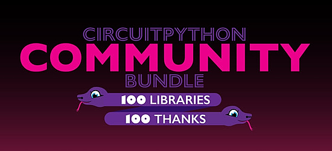](https://blog.adafruit.com/2023/03/22/100-circuitpython-community-libraries-circuitpython-python-circuitpython/)

The CircuitPython community reached a big milestone together! There are now 100 libraries in the CircuitPython Community Bundle! CircuitPython libraries are separate files designed to work with CircuitPython code.

The CircuitPython Community Bundle contain all the available libraries for CircuitPython that have been submitted by the CircuitPython community at large. These libraries are updated and maintained by their community authors. A huge thanks to all the authors and the folks that make CircuitPython easy and friendly for everyone. A special thanks to [CedarGroveStudios](https://github.com/CedarGroveStudios) for [submitting](https://github.com/adafruit/CircuitPython_Community_Bundle/pull/145) the 100th library: [CircuitPython_AD5293](https://github.com/CedarGroveStudios/CircuitPython_AD5293) – a CircuitPython driver for the AD5293 digital potentiometer.

The full list of all the CircuitPython libraries contained in the library bundles (Adafruit + Community) can be found on the [circuitpython.org](https://circuitpython.org/) [libraries](https://circuitpython.org/libraries) page - [Adafruit Blog](https://blog.adafruit.com/2023/03/22/100-circuitpython-community-libraries-circuitpython-python-circuitpython/).

## 37,000 thanks!

The Adafruit Discord community, where we do all our CircuitPython development in the open, reached over 37,000 humans - thank you!  Adafruit believes Discord offers a unique way for Python on hardware folks to connect. Join today at [https://adafru.it/discord](https://adafru.it/discord).

## Clippy gets smarter with Raspberry Pi and ChatGPT

Everyone is asking if ChatGPT is actually Clippy in disguise. Well, what better way to find out than building a ChatGPT-powered Clippy? ChatGPT in a box runs Azure Speech Services. It listens to what you ask and runs it through ChatGPT, which then sends back an answer for Azure Speech Services to say out loud, making it seems as though Clippy is talking to you.

David Packman’s Raspberry Pi project uses an Adafruit CRICKIT HAT, which gives Clippy a lot of functionality, including running speakers to give it a voice. Programming is with Python and the Adafruit Blinka compatibility layer for using CircuitPython code - [Raspberry Pi](https://www.raspberrypi.com/news/clippy-gets-smarter-with-raspberry-pi-and-chatgpt/), [Hackster.io](https://www.hackster.io/david-packman/clippygpt-6a683a#overview), and [YouTube](https://youtu.be/6OYGeOwd6RY).

## Feature

text - [site](url).

## Adafruit Engineer Anne Barela on Hackster Cafe Videocast

[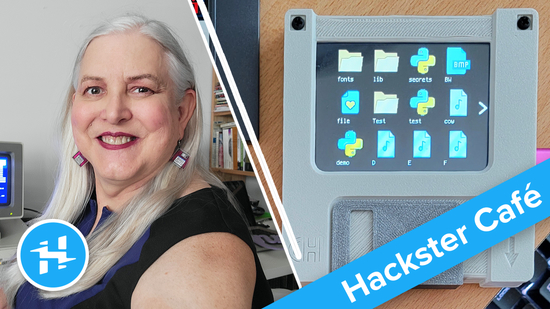](https://blog.adafruit.com/2023/03/21/anne-barela-on-hackster-cafe-today-at-1-pm-us-eastern-makers-hacketerio-anne_engineer/)

Adafruit engineer Anne Barela *(Ed. your editor)* appeared on the hackster.io Hackster Cafe broadcast March 21st discussing a wide range of topics including the [Floppy with a Display](https://learn.adafruit.com/a-floppy-thumb-drive-with-a-color-file-icon-display/overview) project, Adafruit and much more - [YouTube](https://www.youtube.com/watch?v=deX2R5fJPX8) and the [Adafruit Blog](https://blog.adafruit.com/2023/03/21/anne-barela-on-hackster-cafe-today-at-1-pm-us-eastern-makers-hacketerio-anne_engineer/).

## This Week's Python Streams

Python on Hardware is all about building a cooperative ecosphere which allows contributions to be valued and to grow knowledge. Below are the streams within the last week focusing on the community.

### CircuitPython Deep Dive Stream

[This week](link), Tim streamed work on {subject}.

You can see the latest video and past videos on the Adafruit YouTube channel under the Deep Dive playlist - [YouTube](https://www.youtube.com/playlist?list=PLjF7R1fz_OOXBHlu9msoXq2jQN4JpCk8A).

### CircuitPython Parsec

John Park’s CircuitPython Parsec this week is on {subject} - [Adafruit Blog](link) and [YouTube](link).

Catch all the episodes in the [YouTube playlist](https://www.youtube.com/playlist?list=PLjF7R1fz_OOWFqZfqW9jlvQSIUmwn9lWr).

## Project of the Week

text - [site](url).

## News from around the web!

[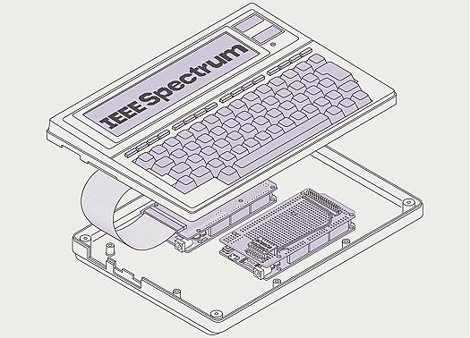](https://spectrum.ieee.org/using-i2c-to-upgrade-a-tandy)

Upcycling a Tandy Model 100, Part II, using an Adafruit Grand Central board and CircuitPython - [site](https://spectrum.ieee.org/using-i2c-to-upgrade-a-tandy).

[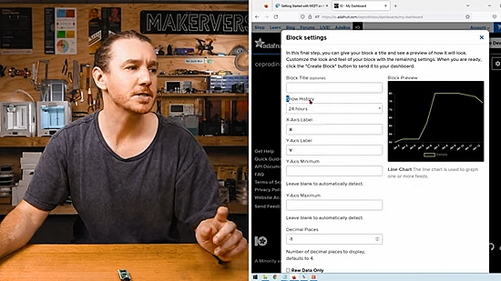](https://core-electronics.com.au/guides/getting-started-with-mqtt-on-raspberry-pi-pico-w-connect-to-the-internet-of-things/)

Getting Started with MQTT on Raspberry Pi Pico W and MicroPython. Connect to the Internet of Things using Adafruit IO - [Core Electronics](https://core-electronics.com.au/guides/getting-started-with-mqtt-on-raspberry-pi-pico-w-connect-to-the-internet-of-things/) and [YouTube](https://youtu.be/ybCMXqsQyDw).

[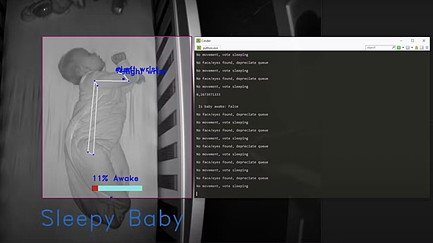](https://www.raspberrypi.com/news/baby-sleep-tracker-makes-parents-and-babies-more-rested/)

Caleb Olson created his own baby sleep tracker with Raspberry Pi 4 to make it easier for those caring for babies to know when they themselves can get some sleep - [Raspberry Pi](https://www.raspberrypi.com/news/baby-sleep-tracker-makes-parents-and-babies-more-rested/) and [GitHub](https://github.com/calebolson123/BabySleepCoach) via [Twitter](https://twitter.com/Raspberry_Pi/status/1638461281966456833?t=6Lim-69pkMckU2G8bOEdxQ&s=03).

text - [site](url).

[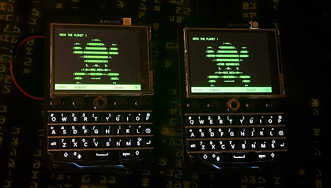](https://twitter.com/alx_nearphuture/status/1637829533662420996)

Two Keyboard FeatherWings using FeatherS2 and CircuitPython - [Twitter](https://twitter.com/alx_nearphuture/status/1637829533662420996).

text - [site](url).

text - [site](url).

[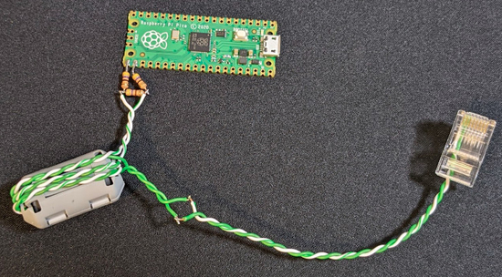](https://blog.adafruit.com/2023/03/24/ethernet-for-the-raspberry-pi-raspberry_pi-piday-raspberrypi/)

Raspberry Pi Pico Minimal Ethernet - [Adafruit Blog](https://blog.adafruit.com/2023/03/24/ethernet-for-the-raspberry-pi-raspberry_pi-piday-raspberrypi/).

Raspi Pi Pico W: Comfortable programming with CircuitPython (German) - [heise online](https://www.heise.de/ratgeber/Raspi-Pi-Pico-W-Komfortabel-programmieren-mit-CircuitPython-7595698.html).

text - [site](url).

text - [site](url).

text - [site](url).

text - [site](url).

text - [site](url).

text - [site](url).

text - [site](url).

SVG is a horribly complex format and an overkill for most projects. The specification includes way too many edge cases so implementing a new SVG renderer will always have drawbacks or missing pieces. TinyVG tries to be simpler. Fewer features, but powerful enough to cover 90% of use cases - [tinyvg.tech](https://tinyvg.tech/).

text - [site](url).

text - [site](url).

PyDev of the Week: NAME on [Mouse vs Python]()

CircuitPython Weekly Meeting for DATE ([notes]()) [on YouTube]()

**#ICYDNCI What was the most popular, most clicked link, in [last week's newsletter](https://link)? [title](url).**

## Coming Soon

[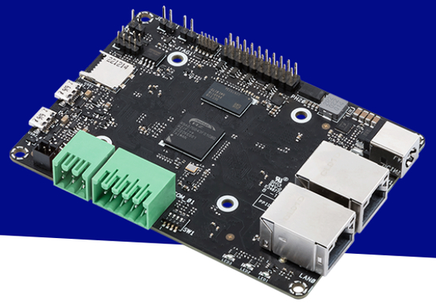](https://www.theregister.com/2023/03/15/asus_announces_riscv_tinker_board/)

Asus has unveiled a RISC-V model in its range of Tinker Board single board computer (SBC) systems, which up until now have all been Arm-based. The Tinker V is powered by a 64-bit RISC-V chip and aimed at embedded and IoT applications, but like other Tinker Boards and the Raspberry Pi, is likely to find its way into the hands of makers and enthusiasts as well - [The Register](https://www.theregister.com/2023/03/15/asus_announces_riscv_tinker_board/) and [Asus](https://tinker-board.asus.com/product/tinker-v.html).

text - [site](url).

## New Boards Supported by CircuitPython

The number of supported microcontrollers and Single Board Computers (SBC) grows every week. This section outlines which boards have been included in CircuitPython or added to [CircuitPython.org](https://circuitpython.org/).

This week, there were (#/no) new boards added!

- [Board name](url)
- [Board name](url)
- [Board name](url)

*Note: For non-Adafruit boards, please use the support forums of the board manufacturer for assistance, as Adafruit does not have the hardware to assist in troubleshooting.*

Looking to add a new board to CircuitPython? It's highly encouraged! Adafruit has four guides to help you do so:

- [How to Add a New Board to CircuitPython](https://learn.adafruit.com/how-to-add-a-new-board-to-circuitpython/overview)
- [How to add a New Board to the circuitpython.org website](https://learn.adafruit.com/how-to-add-a-new-board-to-the-circuitpython-org-website)
- [Adding a Single Board Computer to PlatformDetect for Blinka](https://learn.adafruit.com/adding-a-single-board-computer-to-platformdetect-for-blinka)
- [Adding a Single Board Computer to Blinka](https://learn.adafruit.com/adding-a-single-board-computer-to-blinka)

## New Learn Guides!

[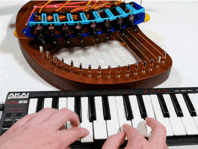](https://learn.adafruit.com/guides/latest)

[MIDI Controlled Robot Lyre with CircuitPython](https://learn.adafruit.com/midi-controlled-robot-lyre-with-circuitpython) from [Liz Clark](https://learn.adafruit.com/u/BlitzCityDIY)

[Adafruit Metro M7 1011 with AirLift](https://learn.adafruit.com/adafruit-metro-m7-with-airlift) from [Liz Clark](https://learn.adafruit.com/u/BlitzCityDIY)

## CircuitPython Libraries!

CircuitPython support for hardware continues to grow. We are adding support for new sensors and breakouts all the time, as well as improving on the drivers we already have. As we add more libraries and update current ones, you can keep up with all the changes right here!

For the latest libraries, download the [Adafruit CircuitPython Library Bundle](https://circuitpython.org/libraries). For the latest community contributed libraries, download the [CircuitPython Community Bundle](https://github.com/adafruit/CircuitPython_Community_Bundle/releases).

If you'd like to contribute, CircuitPython libraries are a great place to start. Have an idea for a new driver? File an issue on [CircuitPython](https://github.com/adafruit/circuitpython/issues)! Have you written a library you'd like to make available? Submit it to the [CircuitPython Community Bundle](https://github.com/adafruit/CircuitPython_Community_Bundle). Interested in helping with current libraries? Check out the [CircuitPython.org Contributing page](https://circuitpython.org/contributing). We've included open pull requests and issues from the libraries, and details about repo-level issues that need to be addressed. We have a guide on [contributing to CircuitPython with Git and GitHub](https://learn.adafruit.com/contribute-to-circuitpython-with-git-and-github) if you need help getting started. You can also find us in the #circuitpython channels on the [Adafruit Discord](https://adafru.it/discord).

You can check out this [list of all the Adafruit CircuitPython libraries and drivers available](https://github.com/adafruit/Adafruit_CircuitPython_Bundle/blob/master/circuitpython_library_list.md). 

The current number of CircuitPython libraries is **414**!

**New Libraries!**

Here's this week's new CircuitPython libraries:

  * [CedarGroveStudios/CircuitPython_AD5293](https://github.com/CedarGroveStudios/CircuitPython_AD5293)

**Updated Libraries!**

Here's this week's updated CircuitPython libraries:

  * [adafruit/Adafruit_CircuitPython_RGBLED](https://github.com/adafruit/Adafruit_CircuitPython_RGBLED)
  * [adafruit/Adafruit_CircuitPython_GFX](https://github.com/adafruit/Adafruit_CircuitPython_GFX)
  * [adafruit/Adafruit_CircuitPython_HID](https://github.com/adafruit/Adafruit_CircuitPython_HID)
  * [CedarGroveStudios/CircuitPython_AD9833](https://github.com/CedarGroveStudios/CircuitPython_AD9833)

**Library PyPI Weekly Download Statistics**
* **Total Library Stats**
  * 146809 PyPI downloads over 309 libraries
* **Top 10 Libraries by PyPI Downloads**
  * Adafruit CircuitPython BusDevice (adafruit-circuitpython-busdevice): 7654
  * Adafruit CircuitPython Requests (adafruit-circuitpython-requests): 7022
  * Adafruit CircuitPython Register (adafruit-circuitpython-register): 2074
  * Adafruit CircuitPython NeoPixel (adafruit-circuitpython-neopixel): 1822
  * Adafruit CircuitPython Wiznet5k (adafruit-circuitpython-wiznet5k): 1708
  * Adafruit CircuitPython Display Text (adafruit-circuitpython-display-text): 1445
  * Adafruit CircuitPython Motor (adafruit-circuitpython-motor): 1311
  * Adafruit CircuitPython MiniMQTT (adafruit-circuitpython-minimqtt): 1304
  * Adafruit CircuitPython ESP32SPI (adafruit-circuitpython-esp32spi): 1138
  * Adafruit CircuitPython ADS1x15 (adafruit-circuitpython-ads1x15): 991

## What’s the team up to this week?

What is the team up to this week? Let’s check in!

**Dan**

I'm wrangling the release of CircuitPython 8.1.0-beta.1 now. As I write this, it looks like we'll include at least 70 pull requests since beta.0, and have a good collection of fixes and enhancements.

I've contributed several miscellaneous fixes. On the build side, I changed the way we fetch submodules in a CircuitPython clone to use git "partial clones", specifically "blobless" clones. We used to use shallow clones for submodules. These had incomplete information about the git commit tree, which made it difficult to move between, or find tags or branches. Partial clones are better: they fetch metadata or commits lazily, but all the information is available on demand, so they appear as if they are complete.

**Kattni**

I recently returned after being out for a bit. I got some misc out of the way before beginning the guide for the Adafruit Feather RP2040 DVI microcontroller. If you pick up one of these nifty boards, keep an eye out for the guide!

Next up will be getting a head start on the Adafruit Feather RP2040 RFM by getting it added to CircuitPython, and creating the Fritzing object and PrettyPins diagram!

**Melissa**

[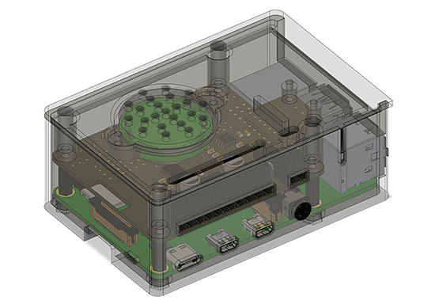](https://www.circuitpython.org/)

This past week, I took the ChatGPT Voice assistant and placed it inside a motorized toy bear. To keep everything nice and neat, I designed a 3D-printable case to house the Raspberry Pi and all of the components. This was one of the more complex things I've 3D modeled and am very happy with how it turned out. I showed off a demonstration of the bear at its current progress on [Adafruit's March 22nd SHOW and TELL](https://www.youtube.com/live/m7rZJALOhrc?feature=share&t=342).

**Tim**

I finished up the diskinfo API for web workflow. Working on that pushed the boundaries of my knowledge of core development out a bit further, so it was a great opportunity to learn more about "under the hood" of CircuitPython. I begun work on making a way for displayio Group to know the  height and width of the rectangle that it occupies on the display so that it can more easily be used with touch screens to test whether a user has touched within the bounds of a Group or not. There is still much work to do in order to get all of the measurements working correctly, especially when considering the scale and possible negative positions of children elements.

I finished up the diskinfo API for web workflow. Working on that pushed the boundaries of my knowledge of core development out a bit further, so it was a great opportunity to learn more about "under the hood" of CircuitPython. I begun work on making a way for displayio Group to know the  height and width of the rectangle that it occupies on the display so that it can more easily be used with touch screens to test whether a user has touched within the bounds of a Group or not. There is still much work to do in order to get all of the measurements working correctly, especially when considering the scale and possible negative positions of children elements.

**Jeff**

It took a bit of time, but the pull request to add support for I2S Audio Output on the i.MX RT family microcontrollers is finally ready for folks to kick the tires. As I write this there are still a few items to check and refine before merging it, but it'll be in "latest" builds some time soon.

I've tested the feature only on the Metro M7 with the Maxim MAX98357A I2S amplifier (Adafruit has a breakout board with this chip) but it should work across the whole line of i.MX RT micros, such as the Teensy, and on other I2S DACs and amplifiers.

One thing I am excited about is that it can mix together at least 12(!) 22kHz wave files from the CIRCUITPY drive at the same time. If you can fit your samples in the 2MB of the CIRCUITPY drive, this looks like it'll be a great board for some sample mixing.

**Scott**

The performance improvements I made for the i.MX RT (Metro M7 1011) will be in the next CircuitPython 8.1 beta. Based on the benchmarks, it's a 2-5x speedup. Now, I'm looking into optimizing our flash accesses to make the worst case where we need data from flash faster. Simply raising the speed to flash from 60MHz to 133MHz seems to be another 0.5x speedup or so. There are a couple other things we could do too.

I'm also working to add support for additional iMX RT chips like the 1050 and 1040. They have more RAM and are a bit faster than the 1011.

This week I did a bit of bug fixing as well. With my 7-color epaper changes I broke tricolor epaper. So, I fixed that yesterday. I also fixed an issue with displaying the CircuitPython terminal because I made the Blinka bitmap data read-only but some code was trying to write to it. 

**Liz**

This week I had two guides go live: the [Metro M7 1011 with AirLift](https://learn.adafruit.com/adafruit-metro-m7-with-airlift) and the [MIDI Controlled Robot Lyre with CircuitPython](https://learn.adafruit.com/midi-controlled-robot-lyre-with-circuitpython). The Metro M7 guide has all of the details you need to get started with the new Metro M7 board. This is the first dev board in the shop that uses the i.MX 1011.

The robot lyre was a long-term project that I'd been slowly making progress on for the past few weeks. It uses a Feather RP2040 running CircuitPython to control 16 servo motors with MIDI. Each servo is mounted directly above a string on the lyre so that it can be plucked when a corresponding MIDI note is received. The hardest part of this project was the CAD design, with some parts needing adjustments of less than a millimeter to find the optimal design. I learned a lot though and am looking forward to more robot instrument projects.

## Upcoming events!

PyCon US 2023 will be April 19-17, 2023, again in Salt Lake City, Utah USA - [PyCon US 2023](https://us.pycon.org/2023/).

The next MicroPython Meetup in Melbourne will be on April 26th – [Meetup](https://www.meetup.com/MicroPython-Meetup/). 

EuroPython 2023 will be July 17-23, 2023, in Prague, Czech Republic and Remote - [EuroPython 2023](https://ep2023.europython.eu/).

**Send Your Events In**

If you know of virtual events or upcoming events, please let us know via email to cpnews(at)adafruit(dot)com.

## Latest releases

CircuitPython's stable release is [#.#.#](https://github.com/adafruit/circuitpython/releases/latest) and its unstable release is [#.#.#-##.#](https://github.com/adafruit/circuitpython/releases). New to CircuitPython? Start with our [Welcome to CircuitPython Guide](https://learn.adafruit.com/welcome-to-circuitpython).

[2023####](https://github.com/adafruit/Adafruit_CircuitPython_Bundle/releases/latest) is the latest CircuitPython library bundle.

[v#.#.#](https://micropython.org/download) is the latest MicroPython release. Documentation for it is [here](http://docs.micropython.org/en/latest/pyboard/).

[#.#.#](https://www.python.org/downloads/) is the latest Python release. The latest pre-release version is [#.#.#](https://www.python.org/download/pre-releases/).

[#,### Stars](https://github.com/adafruit/circuitpython/stargazers) Like CircuitPython? [Star it on GitHub!](https://github.com/adafruit/circuitpython)

## Call for help -- Translating CircuitPython is now easier than ever!

[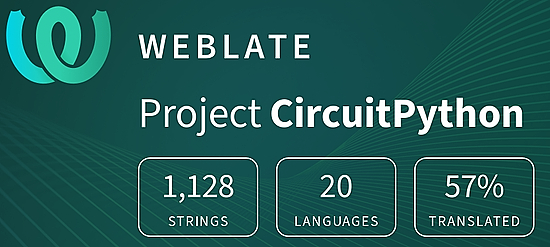](https://hosted.weblate.org/engage/circuitpython/)

One important feature of CircuitPython is translated control and error messages. With the help of fellow open source project [Weblate](https://weblate.org/), we're making it even easier to add or improve translations. 

Sign in with an existing account such as GitHub, Google or Facebook and start contributing through a simple web interface. No forks or pull requests needed! As always, if you run into trouble join us on [Discord](https://adafru.it/discord), we're here to help.

## ICYMI - In case you missed it

Python on hardware is the Adafruit Python video-newsletter-podcast! The news comes from the Python community, Discord, Adafruit communities and more and is broadcast on ASK an ENGINEER Wednesdays. The complete Python on Hardware weekly videocast [playlist is here](https://www.youtube.com/playlist?list=PLjF7R1fz_OOXRMjM7Sm0J2Xt6H81TdDev). The video podcast is on [iTunes](https://itunes.apple.com/us/podcast/python-on-hardware/id1451685192?mt=2), [YouTube](http://adafru.it/pohepisodes), [IGTV (Instagram TV](https://www.instagram.com/adafruit/channel/)), and [XML](https://itunes.apple.com/us/podcast/python-on-hardware/id1451685192?mt=2).

[The weekly community chat on Adafruit Discord server CircuitPython channel - Audio / Podcast edition](https://itunes.apple.com/us/podcast/circuitpython-weekly-meeting/id1451685016) - Audio from the Discord chat space for CircuitPython, meetings are usually Mondays at 2pm ET, this is the audio version on [iTunes](https://itunes.apple.com/us/podcast/circuitpython-weekly-meeting/id1451685016), Pocket Casts, [Spotify](https://adafru.it/spotify), and [XML feed](https://adafruit-podcasts.s3.amazonaws.com/circuitpython_weekly_meeting/audio-podcast.xml).

## Codecademy "Learn Hardware Programming with CircuitPython"

Codecademy, an online interactive learning platform used by more than 45 million people, has teamed up with Adafruit to create a coding course, “Learn Hardware Programming with CircuitPython”. The course is now available in the [Codecademy catalog](https://www.codecademy.com/learn/learn-circuitpython?utm_source=adafruit&utm_medium=partners&utm_campaign=circuitplayground&utm_content=pythononhardwarenewsletter).

## Contribute!

The CircuitPython Weekly Newsletter is a CircuitPython community-run newsletter emailed every Tuesday. The complete [archives are here](https://www.adafruitdaily.com/category/circuitpython/). It highlights the latest CircuitPython related news from around the web including Python and MicroPython developments. To contribute, edit next week's draft [on GitHub](https://github.com/adafruit/circuitpython-weekly-newsletter/tree/gh-pages/_drafts) and [submit a pull request](https://help.github.com/articles/editing-files-in-your-repository/) with the changes. You may also tag your information on Twitter with #CircuitPython. 

Join the Adafruit [Discord](https://adafru.it/discord) or [post to the forum](https://forums.adafruit.com/viewforum.php?f=60) if you have questions.
