View this email in your browser. **Warning: Flashing Imagery**

Welcome to the latest Python on Microcontrollers newsletter! A significant investment in Raspberry Pi by Sony tops this week's news. I'd like to see how AI is integrated. PyCon US will be here shortly - be sure to catch Adafruit folks there and content if you are remote. Folks are using new DVI/HDMI features for RP2040 chips and the CircuitPython team is working hard on porting the functionality to CircuitPython, stay tuned for high resolution, multiple bit depth displays on RP2040! And our largest section of the week is News from the Web - so much is happening in the community, so please check it out - *Ed.*

We're on [Discord](https://discord.gg/HYqvREz), [Twitter](https://twitter.com/search?q=circuitpython&src=typed_query&f=live), and for past newsletters - [view them all here](https://www.adafruitdaily.com/category/circuitpython/). If you're reading this on the web, [subscribe here](https://www.adafruitdaily.com/). Here's the news this week:

## Sony Backs Raspberry Pi With Funding and Access to AI Chips

[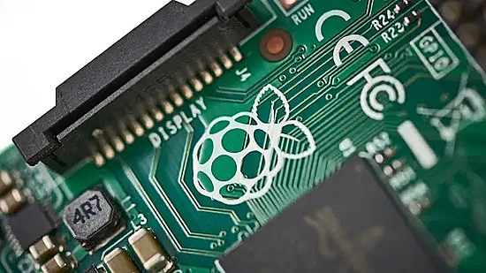](https://www.cnbc.com/2023/04/12/sony-backs-raspberry-pi-with-fresh-funding-access-to-ai-chips.html)

Sony Semiconductor Solutions has announced an investment in Raspberry Pi Ltd, the for-profit arm of the Raspberry Pi empire, telegraphing hopes that it will be able to make its AITRIOS edge artificial intelligence (edge AI) platform the go-to way to boost the single-board computers' capabilities for low-power on-device machine learning. The firm raised the cash at the same $500 million valuation it was worth in a 2021 funding round. The company has become a more active player in the enterprise — in a typical year, roughly 70% of its sales now come from commercial customers embedding its products into factories or consumer devices - [CNBC](https://www.cnbc.com/2023/04/12/sony-backs-raspberry-pi-with-fresh-funding-access-to-ai-chips.html) and [Hackster.io](https://www.hackster.io/news/sony-invests-in-raspberry-pi-aims-to-add-its-aitrios-edge-ai-platform-to-the-ecosystem-2da89121be26).

## PyCon US Coming Next Week: Python on Hardware Related Activities

[PyCon US 2023](https://us.pycon.org/2023/) is coming up in Salt Lake City, Utah USA April 21 - 23 with Development Sprints April 24 - 27. Adafruit CircuitPython team members be there hosting events! Kattni Rembor and Jeff Epler will be present, along with a few well-known community members. 

Kattni and Jeff will be managing Open Spaces during the conference. The location and time is yet to be determined, but will be known when the conference begins. These Open Spaces will give folks an introduction to CircuitPython via the Circuit Playground Express. There will be a Quickstart worksheet available to get started easily, and Kattni & Jeff will there to help. Kattni will be bringing some fun extras as well. Everyone is welcome to attend!

Kattni will be hosting three days of Development Sprints from 8am-5pm on Monday April 24 through Wednesday April 26. Jeff will be joining on Monday. The location will be determined during the conference. The Sprints are an opportunity to contribute to the CircuitPython project, on the Python side of things, through code and documentation on CircuitPython Libraries. Everyone is welcome; there will still be all of the introduction to CircuitPython hardware, so there will be opportunities for folks at any level to participate.

Kattni states: "If you're attending, please let me know ahead of time in the `#circuitpython-dev` channel on the [Adafruit Discord](https://adafru.it/discord), or come find us around the conference. We'd love to meet up! We're looking forward to PyCon US 2023, and we hope you are too! See you there!" - [PyCon US 2023](https://us.pycon.org/2023/).

**MicroPython Talk**

- [Create interactive games using MicroPython and electronics](https://us.pycon.org/2023/schedule/presentation/142/) by Juliana Karoline de Sousa

## Python Software Foundation is Worried About Looming EU Cybersecurity Rules

[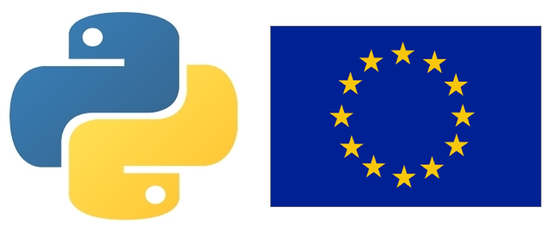](https://www.theregister.com/2023/04/12/python_management_eu/)

The Python Software Foundation (PSF) is concerned that proposed EU cybersecurity laws will leave open source organizations and individuals unfairly liable for distributing incorrect code - [The Register](https://www.theregister.com/2023/04/12/python_management_eu/).

> "If the proposed law is enforced as currently written, the authors of open-source components might bear legal and financial responsibility for the way their components are applied in someone else's commercial product," the PSF said in a [statement](https://pyfound.blogspot.com/2023/04/the-eus-proposed-cra-law-may-have.html) shared by executive director Deb Nicholson.

## How to Build Your Own Raspberry Pi Watch

[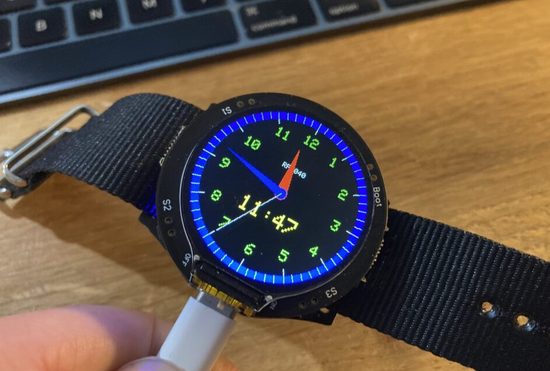](https://www.raspberrypi.com/news/how-to-build-your-own-raspberry-pi-watch/)

The Raspberry Pi Maker in Residence, Toby, and the Head of Documentation, Alasdair, were talking about the idea of a Raspberry Pi RP2040-powered watch. While they were looking around to see if anyone else had already come up with the idea and made one, they stumbled across an [RP2040-based 1.28-inch TFT display and watch board on Tindie](https://www.tindie.com/products/adz1122/pi-pico-rp2040-128-inch-tft-display-watch-board/). 

Read about how the duo tracked down the code and show how one can program the watch themselves in CircuitPython or MicroPython - [Raspberry Pi](https://www.raspberrypi.com/news/how-to-build-your-own-raspberry-pi-watch/).

## This Week's Python Streams

Python on Hardware is all about building a cooperative ecosphere which allows contributions to be valued and to grow knowledge. Below are the streams within the last week focusing on the community.

### CircuitPython Deep Dive Stream

[This week](https://www.youtube.com/watch?v=Z7m7TLDTcog), Tim streamed work on Remote Control of Microcontrollers.

You can see the latest video and past videos on the Adafruit YouTube channel under the Deep Dive playlist - [YouTube](https://www.youtube.com/playlist?list=PLjF7R1fz_OOXBHlu9msoXq2jQN4JpCk8A).

### CircuitPython Parsec

John Park’s CircuitPython Parsec this week is on Wiichuck uDraw Tablet - [Adafruit Blog](https://blog.adafruit.com/2023/04/14/john-parks-circuitpython-parsec-wiichuck-udraw-tablet-adafruit-circuitpython/) and [YouTube](https://youtu.be/47JJXpGytYc).

Catch all the episodes in the [YouTube playlist](https://www.youtube.com/playlist?list=PLjF7R1fz_OOWFqZfqW9jlvQSIUmwn9lWr).

### The CircuitPython Show

The CircuitPython Show is an independent podcast hosted by Paul Cutler, focusing on the people doing awesome things with CircuitPython. Each episode features Paul in conversation with a guest for a short interview – [CircuitPythonShow](https://circuitpythonshow.com/).

The latest episode was released April 10th and features Danny Staple.  Danny and Paul discuss Danny's book, Robotics with Raspberry Pi Pico – [Show List](https://circuitpythonshow.com/episodes/all).

## Project of the Week: The PYPRCA CircuitPython Calculator/Computer

[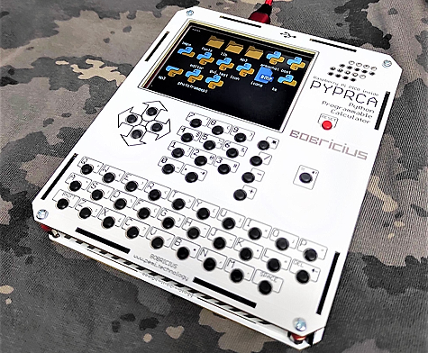](https://twitter.com/bobricius/status/1646646062449344512)

[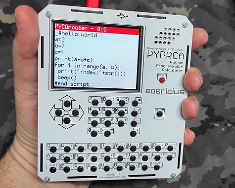](https://twitter.com/bobricius/status/1646646062449344512)

PYPRCA is a Python programable calculator and CircuitPython computer. It has a dedicated numerical keypad for better native input of numbers. It also has a
QWERTY key set for writing programs. Functions like SIN and COS are typed out rather than using shift buttons. 

Features:
- 2.8" color TFT IPS Display
- keyboard (7x7)
- Raspberry PICO or W
- SD card
- Grove GPIO
- Speaker 
- A simple quadratic equation solver
 
It is based on a Raspberry Pi Pico. It's a bit shorter and wider than a Numworks calculator - [Twitter Thread](https://twitter.com/bobricius/status/1646646062449344512) and [Hackaday.io](https://hackaday.io/project/190308-pyprca-python-programmable-calculator-computer).

## News from around the web!

[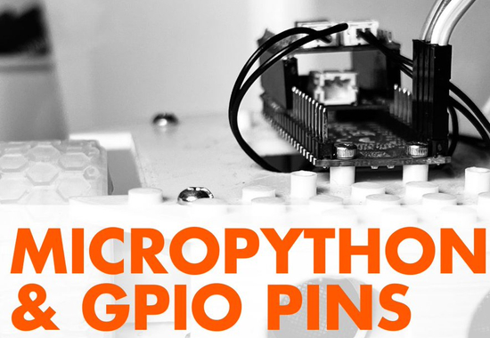](https://www.kevsrobots.com/learn/micropython_gpio/00_intro.html)

The Raspberry Pi Pico with MicroPython - GPIO Mastery course helps youl learn the basics of using MicroPython to control the GPIO pins on a Raspberry Pi Pico. Learn how to connect different components to the board, including LEDs, motors, and sensors, and how to control them with MicroPython code - [Kev's Robots](https://www.kevsrobots.com/learn/micropython_gpio/00_intro.html) via [Twitter](https://twitter.com/kevsmac/status/1646659723217850371).

[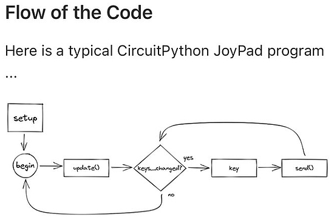](https://twitter.com/bradanlane/status/1646464582112690177)

Bradán Lane discusses making diagrams in various Git systems - [Twitter](https://twitter.com/bradanlane/status/1646464582112690177).

How to find your Microcontroller's IP address with only an LED - [YouTube](https://www.youtube.com/watch?v=emAe5euaVIM).

[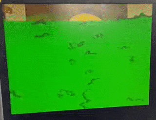](https://twitter.com/MarkKomus/status/1647622339666878466)

> Mark Komus writes "I took the still in progress CircuitPython DVI support and experimented getting an animated GIF to run in my second monitor with the Adafruit RP2040 DVI feather. This is ugly under the hood at the moment but I was able to get it going" - [Twitter](https://twitter.com/MarkKomus/status/1647622339666878466).

Making a wireless controller for a robot with a Raspberry Pi Pico and CircuitPython - [Twitter](https://twitter.com/scottmonaghan/status/1646167723162972166).

ChatGPT helps Wolverine create self-healing Python scripts - [Twitter](https://twitter.com/bio_bootloader/status/1636880208304431104), [GitHub](https://github.com/biobootloader/wolverine) and [Hackaday](https://hackaday.com/2023/04/09/wolverine-gives-your-python-scripts-the-ability-to-self-heal/).

[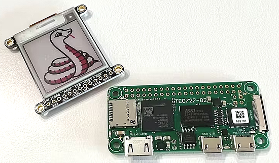](https://www.hackster.io/whitney-knitter/adafruit-circuitpython-on-the-zynqberryzero-c1b201)

CircuitPython on the ZynqberryZero: how to modify Adafruit's CircuitPython packages to install them on the ZynqberryZero with a Linux image created in PetaLinux 2022.1 - [hackster.io](https://www.hackster.io/whitney-knitter/adafruit-circuitpython-on-the-zynqberryzero-c1b201).

[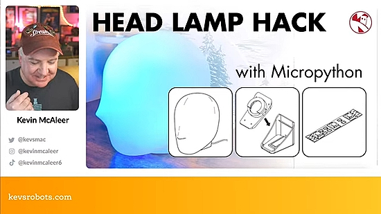](https://www.youtube.com/watch?v=fXgVCk3UTk0)

An Ikea head lamp hack with MicroPython - [YouTube](https://www.youtube.com/watch?v=fXgVCk3UTk0).

A review of the Elecfreaks Pico:ed V2 board (based on a Raspberry Pi RP2040) showing how to get started with CircuitPython and integrate it into a project, replacing a BBC Micro:bit board - [CNX Software](https://www.cnx-software.com/2023/04/14/review-picoed-v2-board-replacement-for-bbc-microbit/) via [Twitter](https://twitter.com/cnxsoft/status/1646823414215344131).

RP2040/CircuitPython 8.1.0 Beta 1, playing animated GIF file on an 8 bit parallel bus ILI9341 display - [YouTube](https://www.youtube.com/watch?v=t8j8op0yGfw) and [coxxect](https://coxxect.blogspot.com/2023/04/rp2040circuitpython-810-beta-1-play.html).

[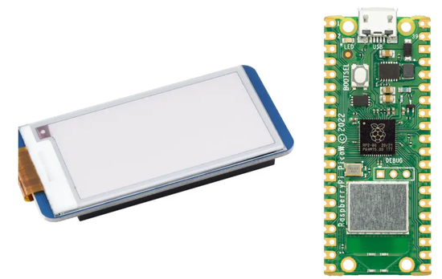](https://peppe8o.com/raspberry-pi-pico-epaper-eink/)

Raspberry Pi Pico and e-paper (e-ink) Display with MicroPython - [peppe80](https://peppe8o.com/raspberry-pi-pico-epaper-eink/).

[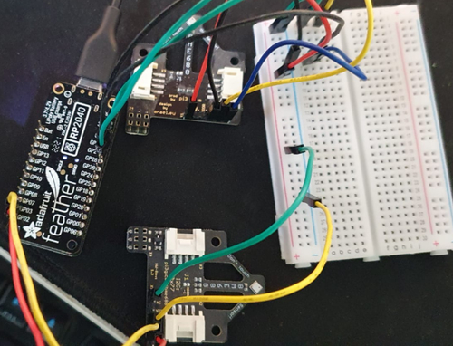](https://picockpit.com/raspberry-pi/circuitpython-adafruit-feather-rp2040-and-i2c/)

CircuitPython, Adafruit Feather RP2040 and I2C - [PiCockpit](https://picockpit.com/raspberry-pi/circuitpython-adafruit-feather-rp2040-and-i2c/).

The "Lost in Space" challenge was part of a CircuitPython exam. Play sounds from the B9 robot when close. CircuitPlayground Bluefruit (Express would work, too), Servo, APDS9960 sensor, mp3 audio, and simultaneous play, NeoPixel pulse, and servo move - [YouTube](https://youtu.be/_rk9HzRbyFU) via [Twitter](https://twitter.com/gallaugher/status/1647640190427582466).

Shower clock with Raspberry Pi Pico and MicroPython - [lucstechblog](http://lucstechblog.blogspot.com/2023/03/showerclock-with-raspberry-pi-pico-and.html).

Laurens Valk writes "What do you get if you mix LEGO Duplo with MicroPython, Python, and Pybricks? I built this for my daughters and they had a blast playing with it" - [Twitter Thread](https://twitter.com/laurensvalk/status/1633200217163014144).

Raspberry Pi Pico Weather Station using MicroPython - [BCRobotics](https://bc-robotics.com/tutorials/raspberry-pi-pico-weather-station-part-2-micropython/).

[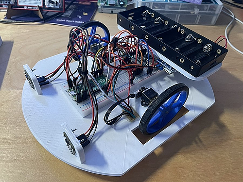](https://twitter.com/r_schulz_maker/status/1647917306717118465)

> Roland Schulz writes "I repaired my broken encoder and finished successfully all electrical circuits of my Orion Robots robot. The first tests with CircuitPython also passed. Battery holder and power supplies are also in place" - [Twitter](https://twitter.com/r_schulz_maker/status/1647917306717118465).

[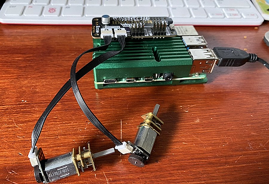](https://twitter.com/drfootleg/status/1647177225630777347)

Testing the encoder motor support on the new Pimoroni robotics HAT on Raspberry Pi - [Twitter](https://twitter.com/drfootleg/status/1647177225630777347).

30 Python Language Tricks That Will Make You a Better Coder - [morioh](https://morioh.com/p/46a6564fe621?f=5cb7d89d660c8335951ca454).

PyDev of the Week: PERSON on [Mouse vs Python]()

CircuitPython Weekly Meeting for April 17, 2023 ([notes]()) [on YouTube]()

#ICYDNCI What was the most popular, most clicked link, in [last week's newsletter](https://www.adafruitdaily.com/2023/04/11/python-on-microcontrollers-newsletter-new-raspberry-pi-code-editor-pycon-us-this-month-and-much-more-circuitpython-python-micropython-thepsf-raspberry_pi/)? [Book: Think Python 2nd. Ed](http://greenteapress.com/thinkpython2/thinkpython2.pdf).

## New

[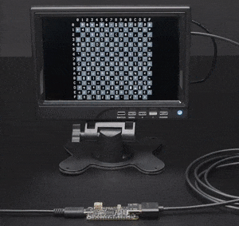](https://www.adafruit.com/product/5710)

Adafruit Feather RP2040 with DVI Output Port - Works with HDMI in Arduino now, CircuitPython later - [Adafruit](https://www.adafruit.com/product/5710).

[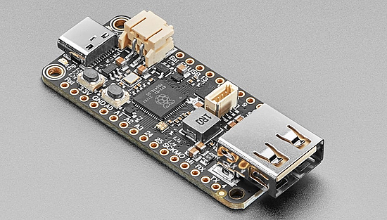](https://www.adafruit.com/product/5723)

Adafruit Feather RP2040 with USB Type A Host - [Adafruit](https://www.adafruit.com/product/5723).

Orange Pi 800, an "all in the keyboard" computer: Specs, Price, Release & Reviews - [all3dp](https://all3dp.com/2/orange-pi-800-review-specs/).

## New Boards Supported by CircuitPython

The number of supported microcontrollers and Single Board Computers (SBC) grows every week. This section outlines which boards have been included in CircuitPython or added to [CircuitPython.org](https://circuitpython.org/).

This week, there were no new boards added but several are in-progress.

*Note: For non-Adafruit boards, please use the support forums of the board manufacturer for assistance, as Adafruit does not have the hardware to assist in troubleshooting.*

Looking to add a new board to CircuitPython? It's highly encouraged! Adafruit has four guides to help you do so:

- [How to Add a New Board to CircuitPython](https://learn.adafruit.com/how-to-add-a-new-board-to-circuitpython/overview)
- [How to add a New Board to the circuitpython.org website](https://learn.adafruit.com/how-to-add-a-new-board-to-the-circuitpython-org-website)
- [Adding a Single Board Computer to PlatformDetect for Blinka](https://learn.adafruit.com/adding-a-single-board-computer-to-platformdetect-for-blinka)
- [Adding a Single Board Computer to Blinka](https://learn.adafruit.com/adding-a-single-board-computer-to-blinka)

## New Learn Guides!

[Playing Animated GIF Files in CircuitPython](https://learn.adafruit.com/using-animated-gif-files-in-circuitpython) from [Anne Barela](https://learn.adafruit.com/u/AnneBarela)

[Adafruit CircuitPython Wii Classic Controller Library](https://learn.adafruit.com/adafruit-circuitpython-wii-classic-controller-library) from [Liz Clark](https://learn.adafruit.com/u/BlitzCityDIY)

[Adafruit Feather RP2040 RFM69](https://learn.adafruit.com/feather-rp2040-rfm69) from [Kattni](https://learn.adafruit.com/u/kattni)

## CircuitPython Libraries!

CircuitPython support for hardware continues to grow. We are adding support for new sensors and breakouts all the time, as well as improving on the drivers we already have. As we add more libraries and update current ones, you can keep up with all the changes right here!

For the latest libraries, download the [Adafruit CircuitPython Library Bundle](https://circuitpython.org/libraries). For the latest community contributed libraries, download the [CircuitPython Community Bundle](https://github.com/adafruit/CircuitPython_Community_Bundle/releases).

If you'd like to contribute, CircuitPython libraries are a great place to start. Have an idea for a new driver? File an issue on [CircuitPython](https://github.com/adafruit/circuitpython/issues)! Have you written a library you'd like to make available? Submit it to the [CircuitPython Community Bundle](https://github.com/adafruit/CircuitPython_Community_Bundle). Interested in helping with current libraries? Check out the [CircuitPython.org Contributing page](https://circuitpython.org/contributing). We've included open pull requests and issues from the libraries, and details about repo-level issues that need to be addressed. We have a guide on [contributing to CircuitPython with Git and GitHub](https://learn.adafruit.com/contribute-to-circuitpython-with-git-and-github) if you need help getting started. You can also find us in the #circuitpython channels on the [Adafruit Discord](https://adafru.it/discord).

You can check out this [list of all the Adafruit CircuitPython libraries and drivers available](https://github.com/adafruit/Adafruit_CircuitPython_Bundle/blob/master/circuitpython_library_list.md). 

The current number of CircuitPython libraries is **422**!

**New Libraries!**

Here's this week's new CircuitPython libraries:

  * [furbrain/CircuitPython_async_buzzer](https://github.com/furbrain/CircuitPython_async_buzzer)
  * [jposada202020/CircuitPython_simple_dial](https://github.com/jposada202020/CircuitPython_simple_dial)

**Updated Libraries!**

Here's this week's updated CircuitPython libraries:

  * [adafruit/Adafruit_CircuitPython_MAX1704x](https://github.com/adafruit/Adafruit_CircuitPython_MAX1704x)
  * [adafruit/Adafruit_CircuitPython_PN532](https://github.com/adafruit/Adafruit_CircuitPython_PN532)
  * [adafruit/Adafruit_CircuitPython_Wii_Classic](https://github.com/adafruit/Adafruit_CircuitPython_Wii_Classic)
  * [tekktrik/CircuitPython_CSV](https://github.com/tekktrik/CircuitPython_CSV)
  * [CedarGroveStudios/CircuitPython_AD9833](https://github.com/CedarGroveStudios/CircuitPython_AD9833)
  * [s-light/CircuitPython_ansi_escape_code](https://github.com/s-light/CircuitPython_ansi_escape_code)

**Library PyPI Weekly Download Statistics**

**Total Library Stats**

  * 87596 PyPI downloads over 310 libraries
 
**Top 10 Libraries by PyPI Downloads**

  * Adafruit CircuitPython BusDevice (adafruit-circuitpython-busdevice): 6199
  * Adafruit CircuitPython Requests (adafruit-circuitpython-requests): 5331
  * Adafruit CircuitPython NeoPixel (adafruit-circuitpython-neopixel): 1638
  * Adafruit CircuitPython Register (adafruit-circuitpython-register): 1545
  * Adafruit CircuitPython Motor (adafruit-circuitpython-motor): 917
  * Adafruit CircuitPython Display Text (adafruit-circuitpython-display-text): 884
  * Adafruit CircuitPython Wiznet5k (adafruit-circuitpython-wiznet5k): 817
  * Adafruit CircuitPython Pixelbuf (adafruit-circuitpython-pixelbuf): 801
  * Adafruit CircuitPython PCA9685 (adafruit-circuitpython-pca9685): 730
  * Adafruit CircuitPython MiniMQTT (adafruit-circuitpython-minimqtt): 722

## What’s the CircuitPython team up to this week?

What is the team up to this week? Let’s check in!

**Dan**

This week I did some testing and researching of the BNO55 and BNO85 sensors. These sensors do not work well on certain microcontrollers, and on others they are fine. It turns out they sometimes violate the I2C bus protocol. Some I2C implementations are more tolerant of these violations than others. I added warnings to the Learn Guides for these sensors for now. It might also be possible to do some silent error recovery inside the CircuitPython libraries, but for now, we are warning the potential users.

**Kattni**

This week I added the CircuitPython Essentials pages to the Feather RP2040 RFM69 guide. This includes the usual, but also includes a simple radio demo. The demo requires two Feathers, and when the appropriate code is loaded onto each one, you can press the Boot button on one, and change the NeoPixel color on the other! Basically, this example shows you how to set up the hardware, and send and receive packets between two modules. That means you have a place to start for any project using the RFM69 module!

Next up is the Adafruit Feather RP2040 RFM95 guide.

**Melissa**

Over the past couple of weeks, I finished working on the [Robotic AI Bear using ChatGPT Learn Guide](https://learn.adafruit.com/robotic-ai-bear-using-chatgpt). This was once of the biggest project guides I've worked on and included 3D printing, Disassembly of the bear, electronics, and lots of code. I had a lot of fun making the project and the project and guide turned out well.

**Tim**

This week I've been working on some new capabilities for the pybadger conference badge code to give it an IoT integration and allow it to launch other sample circuitpython scripts from a menu. I'm also still chasing some issues with multiple displays and I've got an improvement for the Monster M4sk library to submit that will attach the backlight to the display initialization so the system will keep it on after code.py finishes.

**Scott**

I've been feeling better this week. I burned out on iMX RT work and got tempted by the new Feather RP2040 DVI. I've added DVI support to CircuitPython. I've proven it works well but have taken a couple shortcuts that I need to fix before creating a PR. Next, I'll get back to the iMX RT work that I have pending.

**Liz**

This week I worked on a guide for the [CircuitPython Wii Classic Controller library](https://learn.adafruit.com/adafruit-circuitpython-wii-classic-controller-library). This library allows you to use a Wii Classic controller connected to a nunchuck breakout with CircuitPython. This is also the first CircuitPython library that I wrote.
Additionally, I've been working on adding U2IF support for a few of the RP2040 "bones" Feathers that have been added to the shop. This lets folks use CPython modules with CircuitPython modules on a desktop computer. It's been a fun learning experience and I'm looking forward to using it in some upcoming projects. 

## Upcoming events!

The next MicroPython Meetup in Melbourne will be on April 26th – [Meetup](https://www.meetup.com/MicroPython-Meetup/). 

EuroPython 2023 will be July 17-23, 2023, in Prague, Czech Republic and Remote - [EuroPython 2023](https://ep2023.europython.eu/).

PyCon UK will be returning to Cardiff City Hall from Friday 22nd September to Monday 25th September 2023 - [PyCon UK](https://2023.pyconuk.org/).

**Send Your Events In**

If you know of virtual events or upcoming events, please let us know via email to cpnews(at)adafruit(dot)com.

## Latest releases

CircuitPython's stable release is [#.#.#](https://github.com/adafruit/circuitpython/releases/latest) and its unstable release is [#.#.#-##.#](https://github.com/adafruit/circuitpython/releases). New to CircuitPython? Start with our [Welcome to CircuitPython Guide](https://learn.adafruit.com/welcome-to-circuitpython).

[2023####](https://github.com/adafruit/Adafruit_CircuitPython_Bundle/releases/latest) is the latest CircuitPython library bundle.

[v#.#.#](https://micropython.org/download) is the latest MicroPython release. Documentation for it is [here](http://docs.micropython.org/en/latest/pyboard/).

[#.#.#](https://www.python.org/downloads/) is the latest Python release. The latest pre-release version is [#.#.#](https://www.python.org/download/pre-releases/).

[#,### Stars](https://github.com/adafruit/circuitpython/stargazers) Like CircuitPython? [Star it on GitHub!](https://github.com/adafruit/circuitpython)

## Call for help -- Translating CircuitPython is now easier than ever!

[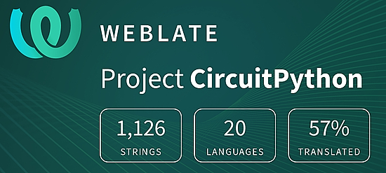](https://hosted.weblate.org/engage/circuitpython/)

One important feature of CircuitPython is translated control and error messages. With the help of fellow open source project [Weblate](https://weblate.org/), we're making it even easier to add or improve translations. 

Sign in with an existing account such as GitHub, Google or Facebook and start contributing through a simple web interface. No forks or pull requests needed! As always, if you run into trouble join us on [Discord](https://adafru.it/discord), we're here to help.

## 37,146 thanks!

The Adafruit Discord community, where we do all our CircuitPython development in the open, reached over 37,146 humans - thank you!  Adafruit believes Discord offers a unique way for Python on hardware folks to connect. Join today at [https://adafru.it/discord](https://adafru.it/discord).

## ICYMI - In case you missed it

Python on hardware is the Adafruit Python video-newsletter-podcast! The news comes from the Python community, Discord, Adafruit communities and more and is broadcast on ASK an ENGINEER Wednesdays. The complete Python on Hardware weekly videocast [playlist is here](https://www.youtube.com/playlist?list=PLjF7R1fz_OOXRMjM7Sm0J2Xt6H81TdDev). The video podcast is on [iTunes](https://itunes.apple.com/us/podcast/python-on-hardware/id1451685192?mt=2), [YouTube](http://adafru.it/pohepisodes), [IGTV (Instagram TV](https://www.instagram.com/adafruit/channel/)), and [XML](https://itunes.apple.com/us/podcast/python-on-hardware/id1451685192?mt=2).

[The weekly community chat on Adafruit Discord server CircuitPython channel - Audio / Podcast edition](https://itunes.apple.com/us/podcast/circuitpython-weekly-meeting/id1451685016) - Audio from the Discord chat space for CircuitPython, meetings are usually Mondays at 2pm ET, this is the audio version on [iTunes](https://itunes.apple.com/us/podcast/circuitpython-weekly-meeting/id1451685016), Pocket Casts, [Spotify](https://adafru.it/spotify), and [XML feed](https://adafruit-podcasts.s3.amazonaws.com/circuitpython_weekly_meeting/audio-podcast.xml).

## Contribute!

The CircuitPython Weekly Newsletter is a CircuitPython community-run newsletter emailed every Tuesday. The complete [archives are here](https://www.adafruitdaily.com/category/circuitpython/). It highlights the latest CircuitPython related news from around the web including Python and MicroPython developments. To contribute, edit next week's draft [on GitHub](https://github.com/adafruit/circuitpython-weekly-newsletter/tree/gh-pages/_drafts) and [submit a pull request](https://help.github.com/articles/editing-files-in-your-repository/) with the changes. You may also tag your information on Twitter with #CircuitPython. 

Join the Adafruit [Discord](https://adafru.it/discord) or [post to the forum](https://forums.adafruit.com/viewforum.php?f=60) if you have questions.
