- [ ] Kattni updates
- [ ] change date
- [ ] update title
- [ ] Feature story
- [ ] Update  for images
- [ ] Update ICYDNCI
- [ ] All images 550w max only
- [ ] Link "View this email in your browser."

News Sources

- [python.org](https://www.python.org/)
- [Python Insider - dev team blog](https://pythoninsider.blogspot.com/)
- [MicroPython Meetup Blog](https://melbournemicropythonmeetup.github.io/)
- [hackaday.io newest projects MicroPython](https://hackaday.io/projects?tag=micropython&sort=date) and [CircuitPython](https://hackaday.io/projects?tag=circuitpython&sort=date)
- [hackaday CircuitPython](https://hackaday.com/blog/?s=circuitpython) and [MicroPython](https://hackaday.com/blog/?s=micropython)
- [hackster.io CircuitPython](https://www.hackster.io/search?q=circuitpython&i=projects&sort_by=most_recent) and [MicroPython](https://www.hackster.io/search?q=micropython&i=projects&sort_by=most_recent)
- [https://opensource.com/tags/python](https://opensource.com/tags/python)
- [Mastodon CircuitPython](https://octodon.social/tags/CircuitPython)

View this email in your browser. **Warning: Flashing Imagery**

Welcome to the latest Python on Microcontrollers newsletter!  - *Ed.*

We're on [Discord](https://discord.gg/HYqvREz), [Twitter](https://twitter.com/search?q=circuitpython&src=typed_query&f=live), and for past newsletters - [view them all here](https://www.adafruitdaily.com/category/circuitpython/). If you're reading this on the web, [subscribe here](https://www.adafruitdaily.com/). Here's the news this week:

## PyCon US This Week: Python on Hardware Related Activities

[PyCon US 2023](https://us.pycon.org/2023/) is happening in Salt Lake City, Utah USA April 21 - 23 with Development Sprints April 24 - 27. Adafruit CircuitPython team members have been there hosting events! Kattni Rembor and Jeff Epler will be present, along with a few well-known community members. 

Kattni and Jeff managed Open Spaces during the conference. These Open Spaces have given folks an introduction to CircuitPython via the Circuit Playground Express. 

**Kattni will be hosting three days of Development Sprints from 8am-5pm on Monday April 24 through Wednesday April 26.** The location will be determined during the conference. The Sprints are an opportunity to contribute to the CircuitPython project, on the Python side of things, through code and documentation on CircuitPython Libraries. Everyone is welcome; there will still be all of the introduction to CircuitPython hardware, so there will be opportunities for folks at any level to participate.

Kattni states: "If you're attending, please let me know in the `#circuitpython-dev` channel on the [Adafruit Discord](https://adafru.it/discord), or come find us around the conference. We'd love to meet up! We're looking forward to PyCon US 2023, and we hope you are too! See you there!" - [PyCon US 2023](https://us.pycon.org/2023/).

**Next PyCon US: 2024 and 2025**

[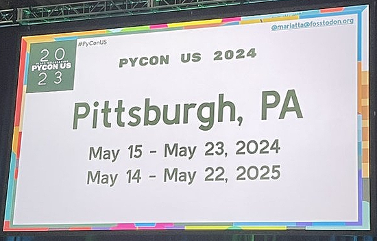](https://us.pycon.org/2023/)

PyCon US 2024 will be held in Pittsburgh, PA from May 15-23, 2024 and also in Pittsburgh May 14-22, 2025.

## Work Progresses on Using an Adafruit Feather DVI with CircuitPython

[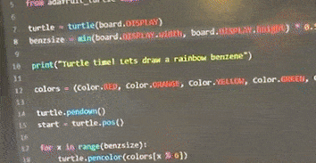](https://twitter.com/adafruit/status/1648738649637371909)

Turtle LOGO running nicely on the Feather DVI with CircuitPython. Ladyada rummaged through CircuitPython project-lead tannewt's GitHub branches to find this build of CircuitPython with DVI output support. Now you can treat any HDMI monitor as a display for CircuitPython! For example, above she is running ["turtle" demos](https://docs.python.org/3/library/turtle.html) that show making cool graphical shapes, but to a display on the desk, via the [Feather RP2040 with DVI](https://adafruit.com/product/5710). The REPL also appears on the screen - how fun is that!? - [Twitter](https://twitter.com/adafruit/status/1648738649637371909).

## Awesome MIDI and Game Controller with CircuitPython

Christopher Stevens had built a most remarkable MIDI controller. Based on an [Adafruit tutorial by John Park](https://learn.adafruit.com/neocontroller-color-grading-input-box), Christopher has taken this from a 4 to a 77 out of ten!  - [Twitter](https://twitter.com/owntheweb/status/1650273862293262336).

He writes:

> This dual 3-axis joystick (HOSAS) features two microcontrollers: an Adafruit Metro Grand Central M4 for all the buttons and joysticks with exception of the NeoSliders and NeoKeys managed by a Feather RP2040 (pink!). Grand Central was great for all the inputs and timers for LED fades.   Feather RP2040 managed I2C reads separately as it offered the cool factor, yet was a bit slower in reads per second than direct inputs handled the Grand Central. This turned out well for gaming purposes for fast controls with upper controls not needing that speed (less used).    The game controller sends out low latency MIDI signals, which can be converted to joystick controls with an app like midi2vjoy. This is TBD, still exploring, rocking as a MIDI controller so far! Maybe I'll make a flight sim demo while also performing music at the same time?!!   Both boards communicate with each other via UART at a basic level, syncing when that center ship power button is pressed (cool pulse in video) and to sync the continuous rainbow color rotation in all NeoPixels. It does utilize CircuitPython, super fun in this project! 

## Google Announces the List of 574 Python Packages in its new "Assured Open Source Software" Service

Google now has 574 Python packages in its new "Assured Open Source Software" service. Assured Open Source Software is a Google Cloud service that enables enterprise users of open source software to incorporate the same trusted OSS packages which Google uses into their own developer workflows - [Google](https://cloud.google.com/assured-open-source-software/docs/supported-packages).

## This Week's Python Streams

Python on Hardware is all about building a cooperative ecosphere which allows contributions to be valued and to grow knowledge. Below are the streams within the last week focusing on the community.

### CircuitPython Deep Dive Stream

[This week](https://www.youtube.com/watch?v=TXWj1vxuiRI), Tim streamed working on some DisplayIO bugfixes.

You can see the latest video and past videos on the Adafruit YouTube channel under the Deep Dive playlist - [YouTube](https://www.youtube.com/playlist?list=PLjF7R1fz_OOXBHlu9msoXq2jQN4JpCk8A).

### CircuitPython Parsec

John Park’s CircuitPython Parsec this week is on {subject} - [Adafruit Blog](link) and [YouTube](link).

Catch all the episodes in the [YouTube playlist](https://www.youtube.com/playlist?list=PLjF7R1fz_OOWFqZfqW9jlvQSIUmwn9lWr).

### The CircuitPython Show

The CircuitPython Show is an independent podcast hosted by Paul Cutler, focusing on the people doing awesome things with CircuitPython. Each episode features Paul in conversation with a guest for a short interview – [CircuitPythonShow](https://circuitpythonshow.com/) and [Twitter](https://twitter.com/circuitpyshow).

The latest episode was released (date) and features (guest).  They and Paul talk {subject} – [Show List](https://circuitpythonshow.com/episodes/all).

## Project of the Week: The Imitator Pedal

The Imitator "super karaoke" Pedal uses an artificial intelligence library called demucs to split any song into 4 tracks: vocal, drums, bass and others (which includes guitar, keyboards, winds, etc), and then you can use the pedal itself to control playback and mixing of those channels, with a rotary encoder assigned to each track.

It's all open hardware and open software, using a case from a Jícara instead of a metal case to lower the CO2 to produce the product.

In "white" mode, you can select the next or previous song from the ones already processed by the pedal. In "color" mode, you can mute/unmute the tracks, control their mixing volume, as well as pause/unpause by using the metal button.

The project runs on a Raspberry Pi 4 and has a Python web interface to talk to Azure Functions (which also has Python code on it) - [YouTube](https://www.youtube.com/watch?v=_IGj-wyZRRc) and [GitHub](https://github.com/fede2cr/pedales).

## News from around the web!

RP20-Footie Raspberry Pi Pico Capacitive Pedal  - [Twitter](https://twitter.com/JeremySCook/status/1648737154984443930) and [Tindie](https://www.tindie.com/products/jeremycook/rp20-footie-raspberry-pi-pico-capacitive-pedal/).

A small DIY board that automatically switches ON the popular JBD BMS, effectively switching ON the EBike/EScooter, when there is motion / vibration. Automatically switches OFF the BMS after a timeout without motion. Uses an ESP32-S2, ADXL345 and CircuitPython - [GitHub](https://github.com/OpenSourceEBike/Automatic_Switch_Anti_spark_JBD_BMS).

> With help from a Core Electronics YouTube tutorial, I'm using MicroPython on a Raspberry Pi Pico to create a NeoPixel display. I fed the code into ChatGPT and asked the AI to comment the code to help me better understand how it's working - [Twitter](https://twitter.com/morrill_rob/status/1648782735325151232).

[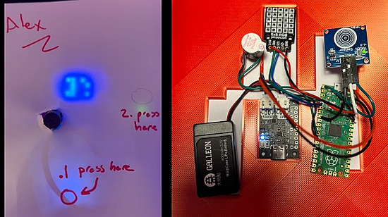](https://twitter.com/kevsmac/status/1649197331495940099)

An electronic birthday card with Raspberry Pi Pico and MicroPython - [Twitter](https://twitter.com/kevsmac/status/1649197331495940099).

[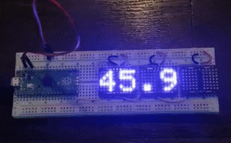](https://twitter.com/lixielabs/status/1649587736276537344?t=ka5gvNJaUVQGxkuQp_3daQ&s=03)

Porting the PixieChroma library to CircuitPython - [Twitter](https://twitter.com/lixielabs/status/1649587736276537344?t=ka5gvNJaUVQGxkuQp_3daQ&s=03).

[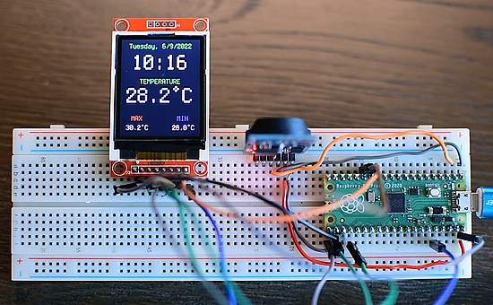](https://youtu.be/gBofy7MMdIY)

Raspberry Pi Pico Thermometer and Clock using ST7735 and DS3231 - [YouTube](https://youtu.be/gBofy7MMdIY).

[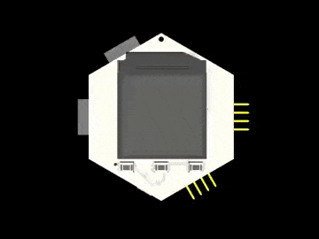](https://twitter.com/bradanlane/status/1650252799882457090)

RP2040 HEXI (reference implementation). RP2040 with LiPo and charging, 2000mA LDO (so this HEXI can power a lot of others), ST7789 display, buttons, and an accelerometer. Being a HEXI, it also has the required headers for VCC, GND, and I2C. It could be programmed in C/C++ with Arduino IDE, VScode+PlatformIO, CircuitPython or MicroPython - [Twitter](https://twitter.com/bradanlane/status/1650252799882457090).

[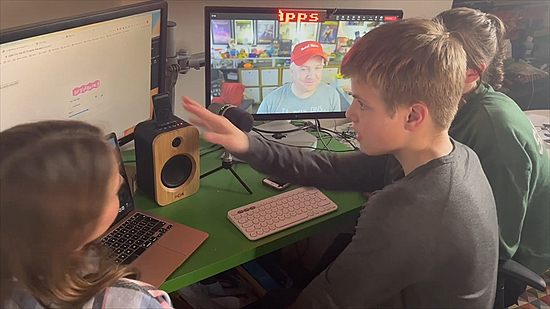](https://www.youtube.com/watch?v=Zkg41yj3X88)

Access and control Your home web werver from anywhere with a Raspberry Pi Pico W and MicroPython - [YouTube](https://www.youtube.com/watch?v=Zkg41yj3X88) via [Twitter](https://twitter.com/GurgleApps/status/1650445119093452801?t=U9WNumFaC4o6ALN1P3_04w&s=03).

Outdoor wireless testing of a Raspberry Pi Pico + CircuitPython robot - [Twitter](https://twitter.com/scottmonaghan/status/1650297402782281729).

[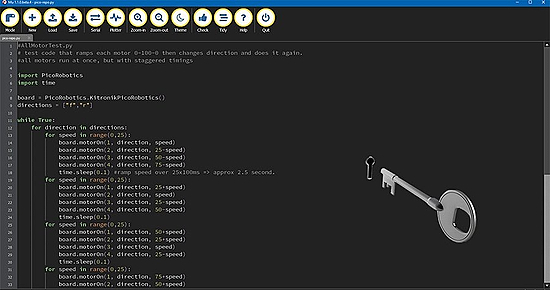](https://kitronik.co.uk/blogs/resources/circuitpython-for-kitronik-motor-driver-boards-for-raspberry-pi-pico)

Using CircuitPython With The Kitronik Motor Driver Boards for Raspberry Pi Pico - [Kitronik](https://kitronik.co.uk/blogs/resources/circuitpython-for-kitronik-motor-driver-boards-for-raspberry-pi-pico).

[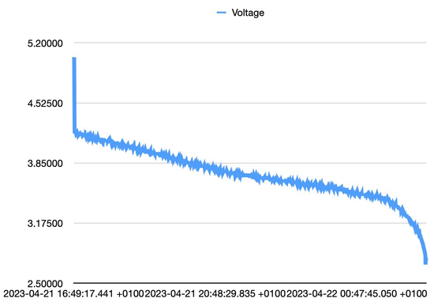](https://twitter.com/mark_mcgookin/status/1649698508365086721)

> Bit of fun last night with a Raspberry Pi Pico W and Pimoroni lipo shim + display pack with an 18350 cell running CircuitPython. Posting voltage to an API. 2,382 API Posts (every 15s) 09h 55m, display always on, on wifi whole time. > 5v = charging. 4.2v = 100%, 2.8 = 0% - [Twitter](https://twitter.com/mark_mcgookin/status/1649698508365086721).

[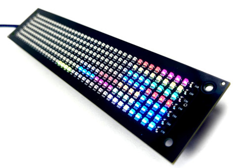](https://gitlab.com/bradanlane_cp/lumosstick/-/tree/main/font)

A clean 5x7 font for use with CircuitPython - [GitLab](https://gitlab.com/bradanlane_cp/lumosstick/-/tree/main/font) via [Twitter](https://twitter.com/bradanlane/status/1649702171514904576).

[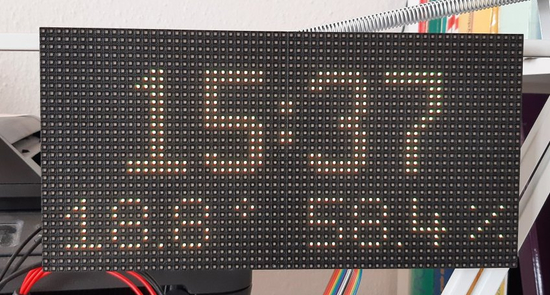](https://github.com/danielmader/MatrixClock_MicroPythonESP)

A simple clock for a 64x32 HUB75 LED matrix display with scheduled NTP sync and a SHT40 sensor using MicroPython - [GitHub](https://github.com/danielmader/MatrixClock_MicroPythonESP).

text - [site](url).

How to Read the Docs like a Professional - [YouTube](https://youtu.be/SWr6NW2osqc).

[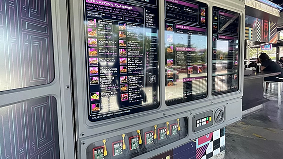](https://www.tomshardware.com/news/six-raspberry-pi-4s-power-sci-fi-themed-chinese-take-out-signage)

Six Raspberry Pi 4's Power Sci-Fi-Themed Chinese Take-Out Signage - [Tom's Hardware](https://www.tomshardware.com/news/six-raspberry-pi-4s-power-sci-fi-themed-chinese-take-out-signage).

[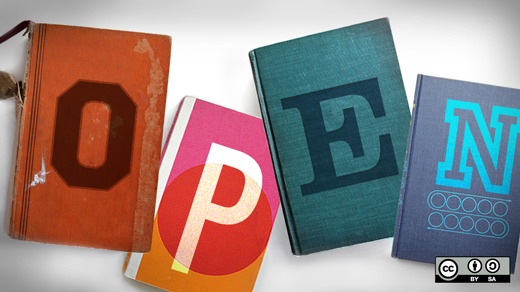](https://opensource.com/article/23/4/how-i-teach-python)

How I teach Python with open source tools - [opensource.com](https://opensource.com/article/23/4/how-i-teach-python).

Wall Street's Transition from Excel to Python - [Mito DS](https://blog.trymito.io/untitled/) via [Awesome Python Weekly](https://python.libhunt.com/newsletter/360).

PyDev of the Week: NAME on [Mouse vs Python]()

CircuitPython Weekly Meeting for DATE ([notes]()) [on YouTube]()

**#ICYDNCI What was the most popular, most clicked link, in [last week's newsletter](https://link)? [title](url).**

## Coming Soon

[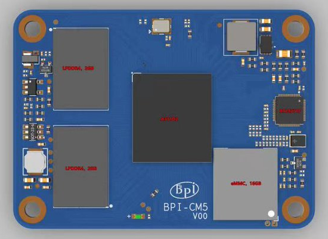](https://twitter.com/sinovoip/status/1648565477281787904)

Banana Pi BPI-CM5 Compute Module, coming soon - [Twitter](https://twitter.com/sinovoip/status/1648565477281787904).

[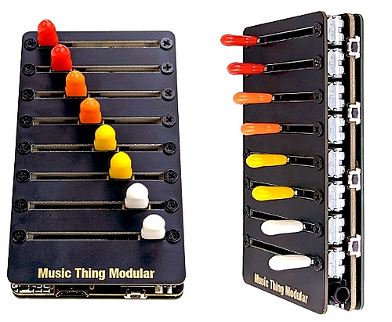](https://www.thonk.co.uk/shop/music-thing-8mu/)

The 8mu is a pocket-sized MIDI controller (slightly smaller than a credit card!) with eight faders that can send messages via MIDI. It’s designed to be open and hackable and can be re-programmed in Arduino or CircuitPython - [Thonk](https://www.thonk.co.uk/shop/music-thing-8mu/) via [Twitter](https://twitter.com/musicthing/status/1649454966162030603).

## New Boards Supported by CircuitPython

The number of supported microcontrollers and Single Board Computers (SBC) grows every week. This section outlines which boards have been included in CircuitPython or added to [CircuitPython.org](https://circuitpython.org/).

This week, there were three new boards added!

- [EFR32xG24 Dev Kit](https://circuitpython.org/board/silabs_devkit_xg24_brd2601b/)
- [EFR32xG24 Explorer Kit](https://circuitpython.org/board/silabs_explorerkit_xg24_brd2703a/)
- [SparkFun Thing Plus Matter MGM240P](https://circuitpython.org/board/sparkfun_thing_plus_matter_mgm240p/)

*Note: For non-Adafruit boards, please use the support forums of the board manufacturer for assistance, as Adafruit does not have the hardware to assist in troubleshooting.*

Looking to add a new board to CircuitPython? It's highly encouraged! Adafruit has four guides to help you do so:

- [How to Add a New Board to CircuitPython](https://learn.adafruit.com/how-to-add-a-new-board-to-circuitpython/overview)
- [How to add a New Board to the circuitpython.org website](https://learn.adafruit.com/how-to-add-a-new-board-to-the-circuitpython-org-website)
- [Adding a Single Board Computer to PlatformDetect for Blinka](https://learn.adafruit.com/adding-a-single-board-computer-to-platformdetect-for-blinka)
- [Adding a Single Board Computer to Blinka](https://learn.adafruit.com/adding-a-single-board-computer-to-blinka)

## Updated Learn Guides!

[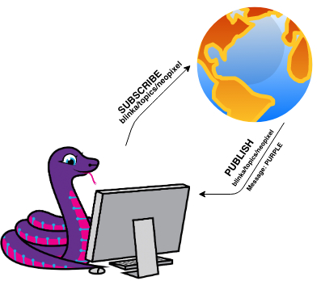](https://learn.adafruit.com/guides/latest)

[MQTT in CircuitPython](https://learn.adafruit.com/mqtt-in-circuitpython) from [Brent Rubell](https://learn.adafruit.com/u/brubell)

[CircuitPython Libraries on Linux and Raspberry Pi](https://learn.adafruit.com/circuitpython-on-raspberrypi-linux) from [Melissa LeBlanc-Williams](https://learn.adafruit.com/u/MakerMelissa)

## CircuitPython Libraries!

CircuitPython support for hardware continues to grow. We are adding support for new sensors and breakouts all the time, as well as improving on the drivers we already have. As we add more libraries and update current ones, you can keep up with all the changes right here!

For the latest libraries, download the [Adafruit CircuitPython Library Bundle](https://circuitpython.org/libraries). For the latest community contributed libraries, download the [CircuitPython Community Bundle](https://github.com/adafruit/CircuitPython_Community_Bundle/releases).

If you'd like to contribute, CircuitPython libraries are a great place to start. Have an idea for a new driver? File an issue on [CircuitPython](https://github.com/adafruit/circuitpython/issues)! Have you written a library you'd like to make available? Submit it to the [CircuitPython Community Bundle](https://github.com/adafruit/CircuitPython_Community_Bundle). Interested in helping with current libraries? Check out the [CircuitPython.org Contributing page](https://circuitpython.org/contributing). We've included open pull requests and issues from the libraries, and details about repo-level issues that need to be addressed. We have a guide on [contributing to CircuitPython with Git and GitHub](https://learn.adafruit.com/contribute-to-circuitpython-with-git-and-github) if you need help getting started. You can also find us in the #circuitpython channels on the [Adafruit Discord](https://adafru.it/discord).

You can check out this [list of all the Adafruit CircuitPython libraries and drivers available](https://github.com/adafruit/Adafruit_CircuitPython_Bundle/blob/master/circuitpython_library_list.md). 

The current number of CircuitPython libraries is **###**!

**New Libraries!**

Here's this week's new CircuitPython libraries:

* [library](url)

**Updated Libraries!**

Here's this week's updated CircuitPython libraries:

* [library](url)

**Library Statistics**

## What’s the CircuitPython team up to this week?

What is the team up to this week? Let’s check in!

**Dan**

The Friday before this week, Scott and I triaged the 8.1.0 and 8.x.x issue lists. We assigned a number of issues, closed a few, and moved some others to 9.0.0 or Long Term. This will help us move toward 8.1.0 sooner.

I tested a new Espressif fix for I2C issues on ESP32-S3 and other chips. Unfortunately it doesn't fix the known I2C problems. But hope springs eternal when I see fixes this like.

I am working on a new introduction page for the Blinka guides.

**Kattni**

Kattni is attending PyCon US 2023 this week and leading Open Spaces and CircuitPython Sprints.

**Melissa**

This past week I worked on writing the software for a collaborative project with Erin St. Blaine. This is basically an eBook that displays generated stories. The project involved taking care of formatting, animating, and displaying the text. Look for a guide in the coming weeks.

**Tim**

This week I've working on enhancements to the conference badge script for Kattni to use at Pycon. The new version has a scroll-able menu that can launch other demo scripts, with rainbow color neopixels while you scroll. It also contains remote control functionality so that other computers on the same WIFI network can use a browser page to change the neopixel colors. The other main thing I've worked on is some troubleshooting and a fix for an issue using the Si7021 sensor with Blinka on a Raspberry Pi.

**Scott**

This week I've been polishing [the DVI PR](https://github.com/adafruit/circuitpython/pull/7880). Thanks to Mark and Ladyada for testing and helping me fix issues.

Next up is some bug hunting for e-paper displays and then i.MX RT chips.

**Jeff**

Jeff is attending PyCon US 2023 this week and helping with Open Spaces and CircuitPython Sprints.

**Liz**

This week I updated the guide for the [ADT7410 breakout](https://learn.adafruit.com/adt7410-breakout) to include the new STEMMA QT version. There's an updated pinouts page, new Fritzing diagrams and updated resources on the downloads page.

Next week I am attending Open Hardware Summit in New York City. I'm very excited for this since I had plans to attend the 2020 Summit which was moved online due to the pandemic. The line-up for talks looks great and I'm looking forward to being in-person for an event again.

## Upcoming events!

The next MicroPython Meetup in Melbourne will be on April 26th – [Meetup](https://www.meetup.com/MicroPython-Meetup/). 

EuroPython 2023 will be July 17-23, 2023, in Prague, Czech Republic and Remote - [EuroPython 2023](https://ep2023.europython.eu/).

PyCon UK will be returning to Cardiff City Hall from Friday 22nd September to Monday 25th September 2023 - [PyCon UK](https://2023.pyconuk.org/).

**Send Your Events In**

If you know of virtual events or upcoming events, please let us know via email to cpnews(at)adafruit(dot)com.

## Latest releases

CircuitPython's stable release is [8.0.5](https://github.com/adafruit/circuitpython/releases/latest) and its unstable release is [8.1.0-beta.1](https://github.com/adafruit/circuitpython/releases). New to CircuitPython? Start with our [Welcome to CircuitPython Guide](https://learn.adafruit.com/welcome-to-circuitpython).

[20230424](https://github.com/adafruit/Adafruit_CircuitPython_Bundle/releases/latest) is the latest CircuitPython library bundle.

[v1.19.1](https://micropython.org/download) is the latest MicroPython release. Documentation for it is [here](http://docs.micropython.org/en/latest/pyboard/).

[3.11.3](https://www.python.org/downloads/) is the latest Python release. The latest pre-release version is [3.12.0a7](https://www.python.org/download/pre-releases/).

[3,503 Stars](https://github.com/adafruit/circuitpython/stargazers) Like CircuitPython? [Star it on GitHub!](https://github.com/adafruit/circuitpython)

## Call for help -- Translating CircuitPython is now easier than ever!

[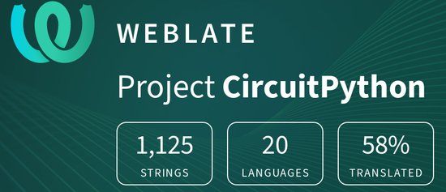](https://hosted.weblate.org/engage/circuitpython/)

One important feature of CircuitPython is translated control and error messages. With the help of fellow open source project [Weblate](https://weblate.org/), we're making it even easier to add or improve translations. 

Sign in with an existing account such as GitHub, Google or Facebook and start contributing through a simple web interface. No forks or pull requests needed! As always, if you run into trouble join us on [Discord](https://adafru.it/discord), we're here to help.

## 37,191 thanks!

The Adafruit Discord community, where we do all our CircuitPython development in the open, reached over 37,191 humans - thank you!  Adafruit believes Discord offers a unique way for Python on hardware folks to connect. Join today at [https://adafru.it/discord](https://adafru.it/discord).

## ICYMI - In case you missed it

Python on hardware is the Adafruit Python video-newsletter-podcast! The news comes from the Python community, Discord, Adafruit communities and more and is broadcast on ASK an ENGINEER Wednesdays. The complete Python on Hardware weekly videocast [playlist is here](https://www.youtube.com/playlist?list=PLjF7R1fz_OOXRMjM7Sm0J2Xt6H81TdDev). The video podcast is on [iTunes](https://itunes.apple.com/us/podcast/python-on-hardware/id1451685192?mt=2), [YouTube](http://adafru.it/pohepisodes), [IGTV (Instagram TV](https://www.instagram.com/adafruit/channel/)), and [XML](https://itunes.apple.com/us/podcast/python-on-hardware/id1451685192?mt=2).

[The weekly community chat on Adafruit Discord server CircuitPython channel - Audio / Podcast edition](https://itunes.apple.com/us/podcast/circuitpython-weekly-meeting/id1451685016) - Audio from the Discord chat space for CircuitPython, meetings are usually Mondays at 2pm ET, this is the audio version on [iTunes](https://itunes.apple.com/us/podcast/circuitpython-weekly-meeting/id1451685016), Pocket Casts, [Spotify](https://adafru.it/spotify), and [XML feed](https://adafruit-podcasts.s3.amazonaws.com/circuitpython_weekly_meeting/audio-podcast.xml).

## Contribute!

The CircuitPython Weekly Newsletter is a CircuitPython community-run newsletter emailed every Tuesday. The complete [archives are here](https://www.adafruitdaily.com/category/circuitpython/). It highlights the latest CircuitPython related news from around the web including Python and MicroPython developments. To contribute, edit next week's draft [on GitHub](https://github.com/adafruit/circuitpython-weekly-newsletter/tree/gh-pages/_drafts) and [submit a pull request](https://help.github.com/articles/editing-files-in-your-repository/) with the changes. You may also tag your information on Twitter with #CircuitPython. 

Join the Adafruit [Discord](https://adafru.it/discord) or [post to the forum](https://forums.adafruit.com/viewforum.php?f=60) if you have questions.
