- [ ] Kattni updates
- [ ] change date
- [ ] update title
- [ ] Feature story
- [ ] Update  for images
- [ ] Update ICYDNCI
- [ ] All images 550w max only
- [ ] Link "View this email in your browser."

News Sources

- [python.org](https://www.python.org/)
- [Python Insider - dev team blog](https://pythoninsider.blogspot.com/)
- [MicroPython Meetup Blog](https://melbournemicropythonmeetup.github.io/)
- [hackaday.io newest projects MicroPython](https://hackaday.io/projects?tag=micropython&sort=date) and [CircuitPython](https://hackaday.io/projects?tag=circuitpython&sort=date)
- [hackaday CircuitPython](https://hackaday.com/blog/?s=circuitpython) and [MicroPython](https://hackaday.com/blog/?s=micropython)
- [hackster.io CircuitPython](https://www.hackster.io/search?q=circuitpython&i=projects&sort_by=most_recent) and [MicroPython](https://www.hackster.io/search?q=micropython&i=projects&sort_by=most_recent)
- [https://opensource.com/tags/python](https://opensource.com/tags/python)
- [Mastodon CircuitPython](https://octodon.social/tags/CircuitPython)

View this email in your browser. **Warning: Flashing Imagery**

Welcome to the latest Python on Microcontrollers newsletter! No sooner than PyCon US wrapped up, there was a flood of MicroPython news. On it's tenth anniversary, version 1.20.0 was released with many exciting features. CircuitPython 8.1.0-beta.2 is close to the final 8.1.0 release and has DVI video baked in! It's never been a better time to try / work with Python to program microcontrollers and single board computers. I'm looking forward to everyone flying home and putting some of their Python knowledge to good use - whether commercially or as open source. What are you working on? Be sure to let us know at cpnews(at)adafruit(dot)com. - *Ed.*

We're on [Discord](https://discord.gg/HYqvREz), [Twitter](https://twitter.com/search?q=circuitpython&src=typed_query&f=live), and for past newsletters - [view them all here](https://www.adafruitdaily.com/category/circuitpython/). If you're reading this on the web, [subscribe here](https://www.adafruitdaily.com/). Here's the news this week:

## MicroPython v1.20.0 Released

MicroPython v1.20.0 has been released and it contains a wide array of improvements and fixes. Of particular note, it has a new lightweight package manager called mip, which uses a custom protocol to query and install packages that is optimised for embedded systems. It is intended to take over the role of upip and supports installing packages from micropython-lib as well as any URL. The Raspberry Pi Pico W is now supported with WiFi. See all the changes - [GitHub](https://github.com/micropython/micropython/releases). [Download](https://micropython.org/download) and [GitHub Discvussions](https://github.com/orgs/micropython/discussions/11342).

> "...there is a lot more coming in the pipeline. MicroPython is part of Google's Season of Docs for the third time so there will be even more improvements to the documentation in the coming 6 months. There is work on some new hardware targets, and we intend to put more effort into the zephyr port. We would also like to make progress this year towards MicroPython v2.

[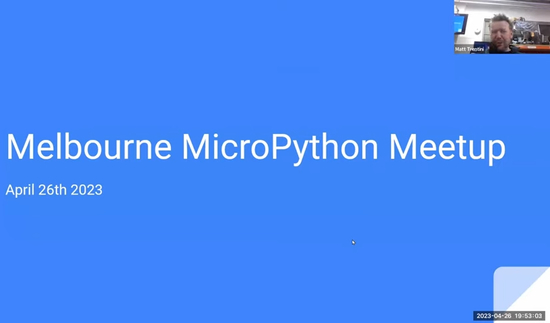](https://www.youtube.com/watch?v=l11a2V3vyZ4)

Damien George discusses the MicroPython v1.20.0 release at the MicroPython Meetup - [YouTube](https://www.youtube.com/watch?v=l11a2V3vyZ4).

A review from hackster.io - [hackster.io](https://www.hackster.io/news/micropython-1-20-0-launches-with-mip-a-dedicated-package-manager-and-raspberry-pi-pico-w-support-258033aa9d45).

Pimoroni has updated their version of MicroPython with the goodness of the recent release - [GitHub](https://github.com/pimoroni/pimoroni-pico/releases/tag/v1.20.1).

## Celebrating Ten Years of MicroPython

[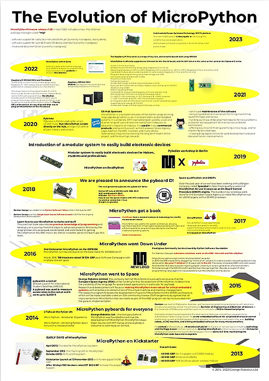](https://twitter.com/micropython/status/1652324169499959298)

MicroPython is celebrating it's tenth year! Have a closer look at the evolution - [Poster](https://micropython.org/resources/MicroPython10YearsPoster.pdf) and [Video](https://www.youtube.com/watch?v=Y2RJfW11zR8), via [Twitter](https://twitter.com/micropython/status/1652324169499959298).

[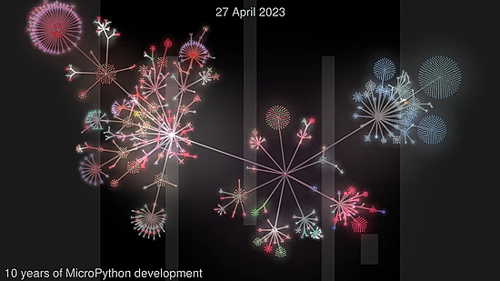](https://www.youtube.com/watch?v=Y2RJfW11zR8)

## CircuitPython 8.1.0 Beta 2 Released

CircuitPython 8.1.0-beta.2, a beta release for CircuitPython 8.1.0, is now out and it is the latest unstable release - [GitHub](https://github.com/adafruit/circuitpython/releases).

**Notable changes since 8.0.0:**

* Silicon Labs (SiLabs) MG24 microcontroller family port (`silabs`), contributed by Silicon Labs.
* Add animated GIF support, including palette support: `gifio.OnDiskGif`.
* Add `safemode.py`, for programmatic handling of safe mode.
* Add ESP-NOW support on Espressif.
* `synthio` improvements and new features. API may change before 8.1.0 final.
* Add `picodvi` on RP2040: DVI/HDMI framebuffer and `displayio` support.
* Add 7-color e-ink display support.
* Add `bitmaptools.drawpolygon()`.
* Allow setting pystack size in `settings.toml`.
* Add dither support to `Palette`.
* Support `array.extend(iterable)`.

## PyCon US 2023 Wraps Up After Sprints 

The team was Captained by Kattni Rembor with able First Officer Jeff Epler.

The sprints lasted three days and drew a large crowd to look at furthering CircuitPython. Special thanks to Alec (tekktrik), Keith (KeithTheEE) and all the community members who turned out to assist and make the sessions successful.

[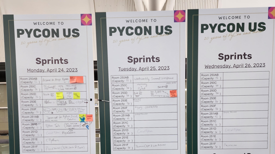](url)

Below is one of two special Adafruit lunchboxes stuffed with goodies, donated and auctioned off in support of PyLadies. One of the winners donated a kit to a PyCon staff member's child. It's a very special community.

[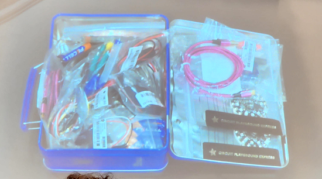](url)

## Feature

text - [site](url).

## PicoPins Updated

[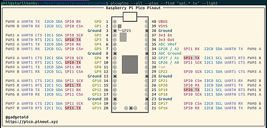](https://twitter.com/Gadgetoid/status/1652756357831970817)

Phil Howard has released version 1.1.0 of his picopins command line Raspberry Pi Pico pinout tool with regex label search, refactoring and more - [pico.pinout.xyz](https://pico.pinout.xyz/) via [Twitter](https://twitter.com/Gadgetoid/status/1652756357831970817).

Install: `python3 -m pip install —upgrade picopins`

## This Week's Python Streams

Python on Hardware is all about building a cooperative ecosphere which allows contributions to be valued and to grow knowledge. Below are the streams within the last week focusing on the community.

### CircuitPython Deep Dive Stream

[This week](https://www.youtube.com/watch?v=CXXxDJUdtoI), Tim streamed work on testing and reviewing PRs.

You can see the latest video and past videos on the Adafruit YouTube channel under the Deep Dive playlist - [YouTube](https://www.youtube.com/playlist?list=PLjF7R1fz_OOXBHlu9msoXq2jQN4JpCk8A).

### CircuitPython Parsec

John Park’s CircuitPython Parsec this week is on Touchscreen Calibration - [Adafruit Blog](https://blog.adafruit.com/2023/04/28/john-parks-circuitpython-parsec-touchscreen-calibration-adafruit-circuitpython/) and [YouTube](https://youtu.be/HiJ_ywW9rWQ).

Catch all the episodes in the [YouTube playlist](https://www.youtube.com/playlist?list=PLjF7R1fz_OOWFqZfqW9jlvQSIUmwn9lWr).

### The CircuitPython Show

The CircuitPython Show is an independent podcast hosted by Paul Cutler, focusing on the people doing awesome things with CircuitPython. Each episode features Paul in conversation with a guest for a short interview – [CircuitPythonShow](https://circuitpythonshow.com/) and [Twitter](https://twitter.com/circuitpyshow).

The latest episode was released this past week and features Seth Kerr.  They talked FPGAs, including Seth's new IcyBlue FPGA Feather – [Show List](https://circuitpythonshow.com/episodes/all).

## Project of the Week: A MicroPython Traffic Light Simulation

A teeny tiny traffic signal simulator using the Pimoroni Cosmic Unicorn LED display. There is one simulating the Red/Yellow/Green lights and one simulating an intersection - [Twitter Thread](https://twitter.com/kfarr/status/1650717451817201664) and source - [GitHub](https://github.com/kfarr/cosmic-unicorn-playground/blob/main/traffic-signal.py).

## News from around the web!

A DIY Controller for M8 Tracker using a Raspberry Pi Pico and CircuitPython - [Adafruit Blog](https://blog.adafruit.com/2023/04/25/diy-controller-for-m8-tracker/).

How To Manage MicroPython Modules With Mip on Raspberry Pi Pico - [Tom's Hardware](https://www.tomshardware.com/how-to/raspberry-pi-pico-micropython-mip).

[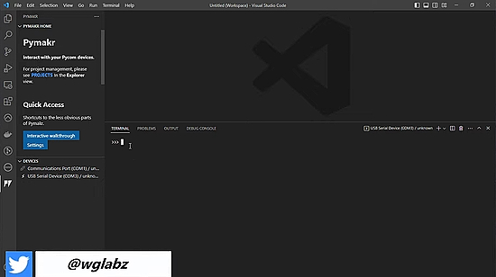](https://www.youtube.com/watch?v=jcnsZw7JiRY)

Using the new package manager (mip) for MicroPython with Raspberry Pi Pico - [YouTube](https://www.youtube.com/watch?v=jcnsZw7JiRY).

Bass reactive LED lights for a car with ESP32 and MicroPython - [Hackaday](https://hackaday.com/2023/04/25/bass-reactive-leds-for-your-car/), [Project](https://tech.scarey.net/bass-reactive-leds/) and [GitHub](https://github.com/scarey/bass-reactive-leds/).

Bradán Lane (@bradanlane) writes" "Took a little time to update my RP2040 'kitchen sink' to CircuitPython 8.0.5 and write some demo/test code." - [Twitter](https://twitter.com/bradanlane/status/1652045939752706082).

[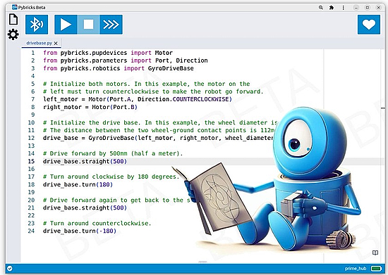](https://twitter.com/laurensvalk/status/1650861562935250949)

A brand new Pybricks MicroPython beta release is out. Highlights include reading the robot heading with a gyro and a GyroDriveBase class for increased precision in straights and turns - [PyBricks Beta](https://beta.pybricks.com/) via [Twitter](https://twitter.com/laurensvalk/status/1650861562935250949).

[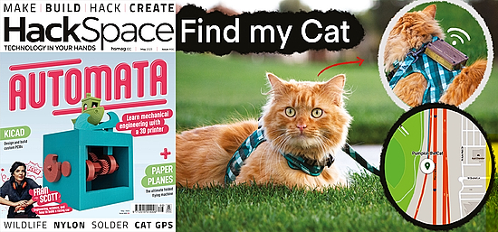](https://hackspace.raspberrypi.com/issues/66/pdf)

Making a pet tracker with MicroPython - [HackSpace Magazine pp34-39](https://hackspace.raspberrypi.com/issues/66/pdf).

[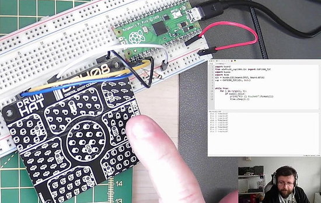](https://twitter.com/biglesp/status/1652286423607681027)

Using the Pimoroni DrumHAT with Raspberry Pi Pico using CircuitPython - [Twitter](https://twitter.com/biglesp/status/1652286423607681027).

[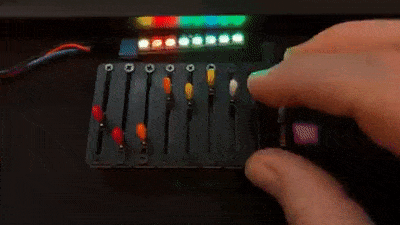](https://twitter.com/johnedgarpark/status/1652417717989937152)

Off label use for the TRS MIDI out port on the Music Thing Modular 8mu — controlling NeoPixels plugged into the 3.5mm port using CircuitPython - [Twitter](https://twitter.com/johnedgarpark/status/1652417717989937152).

[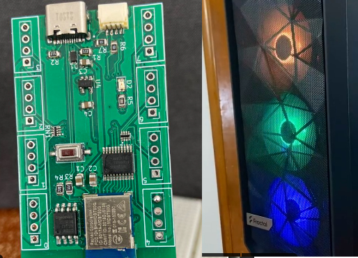](https://twitter.com/MarkKomus/status/1652846977506476032)

>  "What started with my needing a new CPU fan resulted in a new case with aRGB fans. My motherboard didn’t support aRGB, so rather then buy a controller for $20 I spent $100 making my own! nRF52840 for BLE with level shifting logic running CircuitPython" - [Twitter](https://twitter.com/MarkKomus/status/1652846977506476032).

[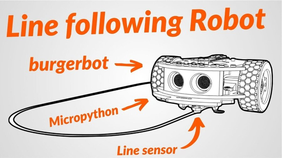](https://twitter.com/kevsmac/status/1652936776191705091)

A line following robot with MicroPython and Raspberry Pi Pico - [YouTube](https://www.youtube.com/watch?v=ZuX45_rid68) via [Twitter](https://twitter.com/kevsmac/status/1652936776191705091).

[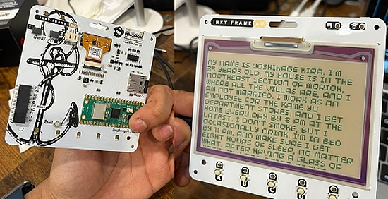](https://twitter.com/nbaronia1/status/1652760941283495937)

> "Got an inky frame (e-ink display + 256kb Raspberry Pi Pico) made by Pimoroni... Time to begin my life as a local MicroPython shitposter on the edge" - [Twitter](https://twitter.com/nbaronia1/status/1652760941283495937).

[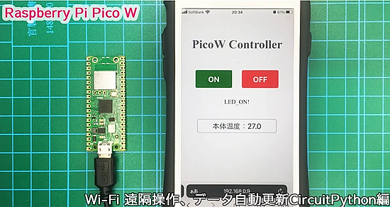](https://logikara.blog/picow-server-circuitpy/)

Raspberry Pi PicoW WiFi communication, remote control and display, CircuitPython edition - [Logikara Blog](https://logikara.blog/picow-server-circuitpy/).

[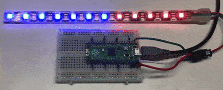](https://www.coderdojotc.org/micropython/basics/05-neopixel/)

MicroPython for Kids: NeoPixels - [MicroPython for Kids](https://www.coderdojotc.org/micropython/basics/05-neopixel/).

Raspberry Pi Pico TFT LCD Touch Screen Tutorial - MicroPython - [DIY Project Lab](https://diyprojectslab.com/raspberry-pi-pico-tft-lcd-touch-screen-tutorial/).

[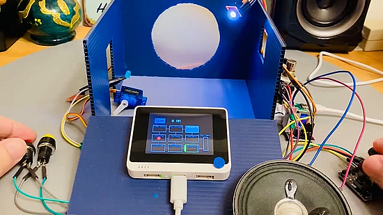](https://twitter.com/alankrantas/status/1652572901789552640)

> "Sneak preview of the FNAF tabletop fan game. It’s running CircuitPython 8. The cheat mode is on to show where the enemy is. The majority of coding is more or less done. Now I got to install lights and controls and a movable door then decorate the room" - [Twitter](https://twitter.com/alankrantas/status/1652572901789552640).

> "Made a wireless button using a pair of Raspberry Pi Pico W to fire the annoying Zoom macro (Ctrl+Alt+Shift+H). Started following The Pi Hut's tutorial, then realised MicroPython doesn't support HID. CircuitPython saved the day, and my remote came in handy at our last seminar" - [Twitter](https://twitter.com/SimonTupin/status/1652014986405789709).

text - [site](url).

text - [site](url).

PyDev of the Week: NAME on [Mouse vs Python]()

CircuitPython Weekly Meeting for DATE ([notes]()) [on YouTube]()

#ICYDNCI What was the most popular, most clicked link, in [last week's newsletter](https://www.adafruitdaily.com/2023/04/25/python-on-microcontrollers-newsletter-pycon-us-happenings-circuitpython-dvi-coming-out-and-much-more-circuitpython-python-micropython-thepsf-raspberry_pi/)? [How To Read Documentation For Beginners](https://www.youtube.com/watch?v=SWr6NW2osqc).

## Coming Soon

CircuitPython support for DVI 'Bell works with Wifi on Pico W. Adafruit is testing it with CircuitPython *and* WiFi support: so they're able to connect over the internet with SSL to a site, get data, and then display it on a monitor. Since the Pico W requires a lot of memory for the wireless connectivity, they're using monochrome DVI output which means there is about 50K remaining after the framebuffer is allocated for the DVI display. CircuitPython supports 1, 2 or 8 bit color, which you can configure based on your memory availability - [Twitter](https://twitter.com/adafruit/status/1651222390511206411).

## New

[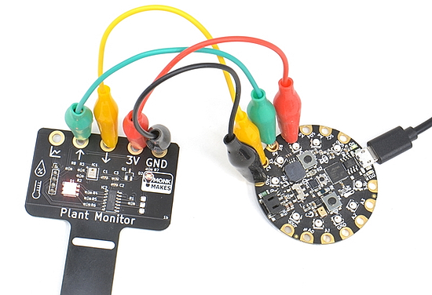](https://blog.adafruit.com/2023/04/26/new-guide-the-monkmakes-plant-monitor-and-circuitpython-adafruitlearningsystem-circuitplaygroundexpress-circuitpython-monkmakes/)

If you have trouble keeping your calatheas and pepperomias happy and not overwatering them to root rot ruin, why not take a gander at the Plant Monitor from Ada-friend Monk Makes. Its a super easy and friendly way to get started with sensing & gardening projects with no soldering required - [Adafruit Blog](https://blog.adafruit.com/2023/04/26/new-guide-the-monkmakes-plant-monitor-and-circuitpython-adafruitlearningsystem-circuitplaygroundexpress-circuitpython-monkmakes/), [Guide](https://learn.adafruit.com/monkmakes-plant-monitor-and-circuitpython/overview) and [Order](https://www.adafruit.com/product/5587https://www.adafruit.com/product/5587).

## New Boards Supported by CircuitPython

The number of supported microcontrollers and Single Board Computers (SBC) grows every week. This section outlines which boards have been included in CircuitPython or added to [CircuitPython.org](https://circuitpython.org/).

This week, there was one new board added:

- [Feather RP2040 RFM9x](https://circuitpython.org/board/adafruit_feather_rp2040_rfm9x/)

*Note: For non-Adafruit boards, please use the support forums of the board manufacturer for assistance, as Adafruit does not have the hardware to assist in troubleshooting.*

Looking to add a new board to CircuitPython? It's highly encouraged! Adafruit has four guides to help you do so:

- [How to Add a New Board to CircuitPython](https://learn.adafruit.com/how-to-add-a-new-board-to-circuitpython/overview)
- [How to add a New Board to the circuitpython.org website](https://learn.adafruit.com/how-to-add-a-new-board-to-the-circuitpython-org-website)
- [Adding a Single Board Computer to PlatformDetect for Blinka](https://learn.adafruit.com/adding-a-single-board-computer-to-platformdetect-for-blinka)
- [Adding a Single Board Computer to Blinka](https://learn.adafruit.com/adding-a-single-board-computer-to-blinka)

## New Learn Guides!

[Weather Wise Wifi Umbrella Stand](https://learn.adafruit.com/weather-wise-wifi-umbrella-stand) from [Erin St Blaine](https://learn.adafruit.com/u/firepixie)

[The MonkMakes Plant Monitor and CircuitPython](https://learn.adafruit.com/monkmakes-plant-monitor-and-circuitpython) from [Simon Monk](https://learn.adafruit.com/monkmakes-plant-monitor-and-circuitpython)

[Feather RP2040 DVI Video Synth](https://learn.adafruit.com/feather-rp2040-dvi-video-synth) from [Liz Clark](https://learn.adafruit.com/u/BlitzCityDIY)

## Updated Learn Guides!

[MQTT in CircuitPython](https://learn.adafruit.com/mqtt-in-circuitpython) from [Brent Rubell](https://learn.adafruit.com/u/brubell)

## CircuitPython Libraries!

CircuitPython support for hardware continues to grow. We are adding support for new sensors and breakouts all the time, as well as improving on the drivers we already have. As we add more libraries and update current ones, you can keep up with all the changes right here!

For the latest libraries, download the [Adafruit CircuitPython Library Bundle](https://circuitpython.org/libraries). For the latest community contributed libraries, download the [CircuitPython Community Bundle](https://github.com/adafruit/CircuitPython_Community_Bundle/releases).

If you'd like to contribute, CircuitPython libraries are a great place to start. Have an idea for a new driver? File an issue on [CircuitPython](https://github.com/adafruit/circuitpython/issues)! Have you written a library you'd like to make available? Submit it to the [CircuitPython Community Bundle](https://github.com/adafruit/CircuitPython_Community_Bundle). Interested in helping with current libraries? Check out the [CircuitPython.org Contributing page](https://circuitpython.org/contributing). We've included open pull requests and issues from the libraries, and details about repo-level issues that need to be addressed. We have a guide on [contributing to CircuitPython with Git and GitHub](https://learn.adafruit.com/contribute-to-circuitpython-with-git-and-github) if you need help getting started. You can also find us in the #circuitpython channels on the [Adafruit Discord](https://adafru.it/discord).

You can check out this [list of all the Adafruit CircuitPython libraries and drivers available](https://github.com/adafruit/Adafruit_CircuitPython_Bundle/blob/master/circuitpython_library_list.md). 

The current number of CircuitPython libraries is **###**!

**New Libraries!**

Here's this week's new CircuitPython libraries:

* [library](url)

**Updated Libraries!**

Here's this week's updated CircuitPython libraries:

* [library](url)

**Library Statistics**

## What’s the CircuitPython team up to this week?

What is the team up to this week? Let’s check in!

**Dan**

I released CircuitPython 8.1.0-beta.2 on April 26, about four weeks after the previous beta release. We are making steady progress towards 8.1.0 final.

I was on [Show and Tell](https://www.youtube.com/live/Gcw8rOYaO8U?feature=share&t=80) on Wednesday, showing off a simple demo of the upcoming Adafruit Feather RP2040 Prop-Maker, which is another RP2040 "Bones" board. This Feather features a 5v level-shifted NeoPixel pin, an LIS3DH accelerometer, an I2S audio amplifier, a servo pin header, and an extra GPIO you can use to attach a button or switch, or whatever). The NeoPixel strip connections, the speaker, and extra GPIO are all screw terminals, so you don't need to do any soldering. *(Ed: makes for a nice lower cost lightsaber, etc.)*     

**Tim**

This week a few members of the team were off at PyCon and sprints were occurring with many new contributors picking up issues for the first time and submitting PRs. I've been spending time during the week reviewing the increased amount of submissions.

**Scott**

The PicoDVI support was merged in last week. It is in 8.1.0-beta.2. Beware that the API will change a little bit before 8.1.0 stable due to feedback from folks using it.

I also fixed an e-paper display issue due to incorrect byte order in addresses. This impacts SSD1675, SSD1680 and SSD1681 as far as I know. The fix is in CircuitPython core but the libraries also need to be updated.

Now I'm back to my i.MX RT work. I'm adding support for more versions of the chip. I'm also speeding up the flash chip speed and getting about a 20% performance boost on the benchmarks.

## Upcoming events!

The next MicroPython Meetup in Melbourne will be on May 24th – [Meetup](https://www.meetup.com/MicroPython-Meetup/). From the  April 26th meeting - [Notes](https://docs.google.com/presentation/d/e/2PACX-1vS7oU-US5MN1bXTbPG4ZNFtVJuOYQx5GOdIOURQVP7ESSm08sz7M9q_vFXxCaihmjng2Sl2KwbtcGbQ/pub?slide=id.p) and [Video](https://www.youtube.com/watch?v=gKpc900G1DE).

EuroPython 2023 will be July 17-23, 2023, in Prague, Czech Republic and Remote - [EuroPython 2023](https://ep2023.europython.eu/).

PyCon UK will be returning to Cardiff City Hall from Friday 22nd September to Monday 25th September 2023 - [PyCon UK](https://2023.pyconuk.org/).

**Send Your Events In**

If you know of virtual events or upcoming events, please let us know via email to cpnews(at)adafruit(dot)com.

## Latest releases

CircuitPython's stable release is [#.#.#](https://github.com/adafruit/circuitpython/releases/latest) and its unstable release is [#.#.#-##.#](https://github.com/adafruit/circuitpython/releases). New to CircuitPython? Start with our [Welcome to CircuitPython Guide](https://learn.adafruit.com/welcome-to-circuitpython).

[2023####](https://github.com/adafruit/Adafruit_CircuitPython_Bundle/releases/latest) is the latest CircuitPython library bundle.

[v#.#.#](https://micropython.org/download) is the latest MicroPython release. Documentation for it is [here](http://docs.micropython.org/en/latest/pyboard/).

[#.#.#](https://www.python.org/downloads/) is the latest Python release. The latest pre-release version is [#.#.#](https://www.python.org/download/pre-releases/).

[#,### Stars](https://github.com/adafruit/circuitpython/stargazers) Like CircuitPython? [Star it on GitHub!](https://github.com/adafruit/circuitpython)

## Call for help -- Translating CircuitPython is now easier than ever!

[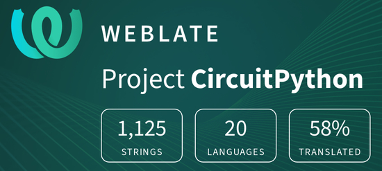](https://hosted.weblate.org/engage/circuitpython/)

One important feature of CircuitPython is translated control and error messages. With the help of fellow open source project [Weblate](https://weblate.org/), we're making it even easier to add or improve translations. 

Sign in with an existing account such as GitHub, Google or Facebook and start contributing through a simple web interface. No forks or pull requests needed! As always, if you run into trouble join us on [Discord](https://adafru.it/discord), we're here to help.

## 37,254 thanks!

The Adafruit Discord community, where we do all our CircuitPython development in the open, reached over 37,254 humans - thank you!  Adafruit believes Discord offers a unique way for Python on hardware folks to connect. Join today at [https://adafru.it/discord](https://adafru.it/discord).

## ICYMI - In case you missed it

Python on hardware is the Adafruit Python video-newsletter-podcast! The news comes from the Python community, Discord, Adafruit communities and more and is broadcast on ASK an ENGINEER Wednesdays. The complete Python on Hardware weekly videocast [playlist is here](https://www.youtube.com/playlist?list=PLjF7R1fz_OOXRMjM7Sm0J2Xt6H81TdDev). The video podcast is on [iTunes](https://itunes.apple.com/us/podcast/python-on-hardware/id1451685192?mt=2), [YouTube](http://adafru.it/pohepisodes), [IGTV (Instagram TV](https://www.instagram.com/adafruit/channel/)), and [XML](https://itunes.apple.com/us/podcast/python-on-hardware/id1451685192?mt=2).

[The weekly community chat on Adafruit Discord server CircuitPython channel - Audio / Podcast edition](https://itunes.apple.com/us/podcast/circuitpython-weekly-meeting/id1451685016) - Audio from the Discord chat space for CircuitPython, meetings are usually Mondays at 2pm ET, this is the audio version on [iTunes](https://itunes.apple.com/us/podcast/circuitpython-weekly-meeting/id1451685016), Pocket Casts, [Spotify](https://adafru.it/spotify), and [XML feed](https://adafruit-podcasts.s3.amazonaws.com/circuitpython_weekly_meeting/audio-podcast.xml).

## Contribute!

The CircuitPython Weekly Newsletter is a CircuitPython community-run newsletter emailed every Tuesday. The complete [archives are here](https://www.adafruitdaily.com/category/circuitpython/). It highlights the latest CircuitPython related news from around the web including Python and MicroPython developments. To contribute, edit next week's draft [on GitHub](https://github.com/adafruit/circuitpython-weekly-newsletter/tree/gh-pages/_drafts) and [submit a pull request](https://help.github.com/articles/editing-files-in-your-repository/) with the changes. You may also tag your information on Twitter with #CircuitPython. 

Join the Adafruit [Discord](https://adafru.it/discord) or [post to the forum](https://forums.adafruit.com/viewforum.php?f=60) if you have questions.
