View this email in your browser. **Warning: Flashing Imagery**

Welcome to the latest Python on Microcontrollers newsletter! After a bit of a wait, Raspberry Pi has somewhat quietly released a major update to Raspberry Pi OS. If you've been looking for software to match their peripheral releases, check it out. KiCad is holding a conference in September in Spain, pack your bags. A very full issue this week with something for everyone. Enjoy - *Ed.*

We're on [Discord](https://discord.gg/HYqvREz), [Twitter](https://twitter.com/search?q=circuitpython&src=typed_query&f=live), and for past newsletters - [view them all here](https://www.adafruitdaily.com/category/circuitpython/). If you're reading this on the web, [subscribe here](https://www.adafruitdaily.com/). Here's the news this week:

## A New Raspberry Pi OS Update Arrives with Linux Kernel 6.1 LTS

[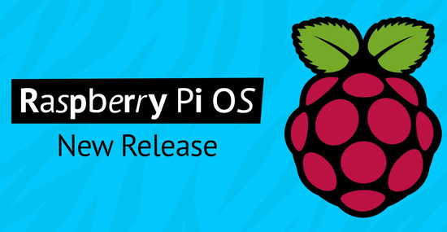](https://www.omglinux.com/raspberry-pi-os-update-may-2023/)

A new Raspberry Pi OS update has arrived with the release of Linux Kernel 6.1. This is the first update to the official operating system for Raspberry Pi devices in 3 months and is notable for being the first version powered by the [Linux 6.1](https://www.omgubuntu.co.uk/2022/12/linux-kernel-6-1-released-new-features) LTS kernel (previous versions use Linux 5.15 LTS). The newer kernel offers improved hardware support, new drivers, performance boosts, and better security. Gamers will appreciate the addition of new gamepad drivers. 

The Raspberry Pi OS 2023-05-03 update also features updated software, including Chromium 113, Mathematic 13.2.1, Matlab 23.1.0, and Raspberry Pi Imager 1.7.4 and big updates to libcamera, libcamera-apps (including improved thumbnail rendering), and picamera2 (including EXIF date and time tags) - [omgLinux](https://www.omglinux.com/raspberry-pi-os-update-may-2023/) and [RaspberryPi.com Downloads](https://www.raspberrypi.com/software/operating-systems/).

## European KiCad Conference will be held in September 9-10th, 2023

KiCad Conference (KiCon) is the largest gathering of hardware users and developers using [KiCad](https://www.kicad.org/). Following the success of the first KiCon in 2019 in Chicago, this is the second annual KiCon, and the first one in Europe. If you are interested in KiCad, as a user, developer, or contributor, this is the place to be. It will be held at the Palexco Conference Center, in A Coruña, Spain, from Sept 9th through the 10th, 2023 - [KiCon 2023](https://kicon.kicad.org/).

## CircuitPython and Version Control

[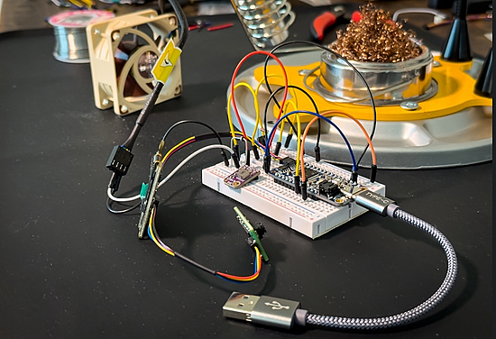](http://www.movingelectrons.net/posts/circuitpython-and-version-control/)

The Moving Electrons blog discusses CircuitPython and version control in projects. Just like coding on a computer, CircuitPython would benefit from some form of version control. A simple Linux bash script is created to manage the git workflow and copying files - [Moving Electrons](http://www.movingelectrons.net/posts/circuitpython-and-version-control/).

## EduBlocks acquired by Anaconda

[Anaconda Inc.](https://www.anaconda.com/), provider of the world’s most popular data science platform, today announced the acquisition of [EduBlocks](https://www.edublocks.org/), a free, web-based, drag-and-drop Python coding platform built to help K-12 students learn fundamental skills. With EduBlocks, Anaconda expands its reach and offerings for K-12 schools as well as for beginner-level professionals - [Anaconda](https://www.anaconda.com/press/anaconda-acquires-edublocks-to-empower-k-12-data-literacy-and-expand-educational-offerings) via [Twitter](https://twitter.com/all_about_code/status/1654196244678430723).

## What's the Best Language for Microcontrollers: MicroPython, CircuitPython, Arduino, or C?

[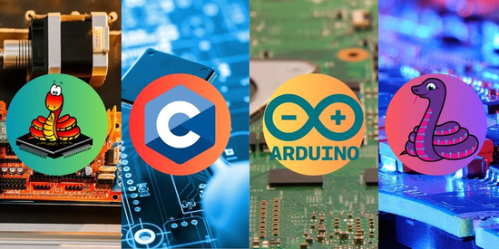](https://www.makeuseof.com/microcontroller-best-language-micropython-circuitpython-arduino-c/?newsletter_popup=1)

What's the Best Language for Microcontrollers: MicroPython, CircuitPython, Arduino, or C? MakeUseOf takes a look at four popular methods and finds that it can truly dependon what type of user is looking to program their project - [MakeUseOf](https://www.makeuseof.com/microcontroller-best-language-micropython-circuitpython-arduino-c/?newsletter_popup=1).

# Mojo

[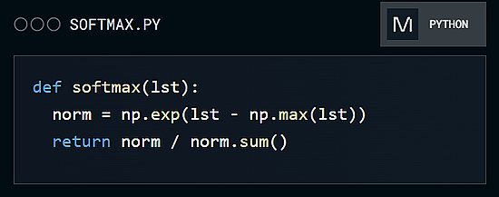](https://www.modular.com/mojo)

Mojo is a new programming language for AI developers. Mojo combines the usability of Python with the performance of C, unlocking programmability of AI hardware and extensibility of AI models - [Modular](https://www.modular.com/mojo).

[Eugene Yan](https://twitter.com/eugeneyan/status/1655407250809421824) ran a simple benchmark (Mandelbrot sets) between Mojo and Python. The speedup is impressive, and it benefits from Python's libraries - [Twitter](https://twitter.com/eugeneyan/status/1655407250809421824) and [GitHub](https://gist.github.com/eugeneyan/1d2ea70fed81662271f784034cc30b73).

• Python: 1,184ms
• Mojo: 27ms 
• Python (vectorized): 240ms
• Mojo (vectorized): 2ms

## A Universal CircuitPython Computer

[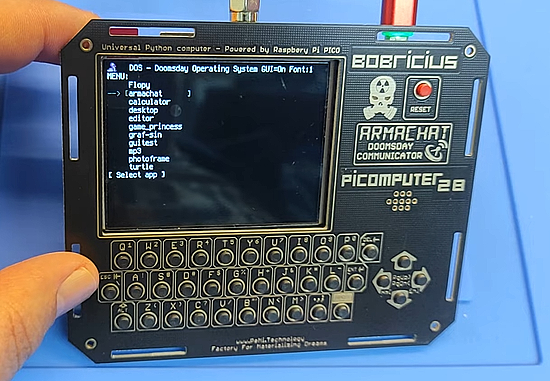](https://twitter.com/bobricius/status/1655553815200907265)

[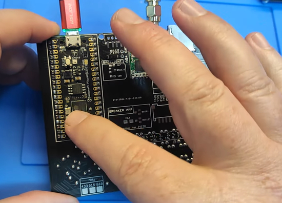](https://twitter.com/bobricius/status/1655553815200907265)

bobricius has expanded the capabilities of his microcomputer-based full keyboard projects to include the PICOmputer 28 Universal CircuitPython Computer. It acomodates a Raspberry Pi Pico, Pico W, or ESP32-S3 as the processor and supports either a 2.8", 2" or 1.3" display. It also accomodates a LoRa module, Grove modules and a speaker. There is an optional battery add-on board - [Twitter](https://twitter.com/bobricius/status/1655553815200907265) and [YouTube](https://youtu.be/gAyOtK3Nai8).

## New Python Book Humble Bundle

Humble Bundle is offering a set of Python programming eBooks at special prices. A $555 value for pay as you want with a share of the proceeds going to the Python Software Foundation - [Humble Bundle](https://www.humblebundle.com/books/python-no-starch-books).

## Advanced Text with MicroPython on Raspberry Pi Pico COnnected to Waveshare LCD Displays

[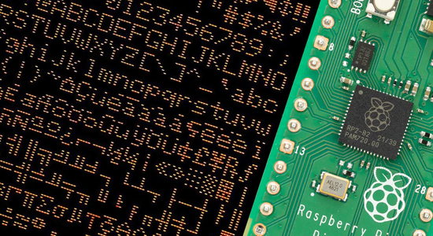](https://thepihut.com/blogs/raspberry-pi-tutorials/advanced-text-with-micropython-on-raspberry-pi-pico-displays)

Using advanced text with MicroPython on Raspberry Pi Pico with Waveshare LCD displays - [The Pi Hut](https://thepihut.com/blogs/raspberry-pi-tutorials/advanced-text-with-micropython-on-raspberry-pi-pico-displays) via [Twitter](https://twitter.com/ThePiHut/status/1654449543319113728).

## This Week's Python Streams

Python on Hardware is all about building a cooperative ecosphere which allows contributions to be valued and to grow knowledge. Below are the streams within the last week focusing on the community.

### CircuitPython Deep Dive Stream

[This week](https://www.youtube.com/watch?v=oxJ_XCZIt-I), Tim streamed work on HTTP Server controlling multiple peripherals.

You can see the latest video and past videos on the Adafruit YouTube channel under the Deep Dive playlist - [YouTube](https://www.youtube.com/playlist?list=PLjF7R1fz_OOXBHlu9msoXq2jQN4JpCk8A).

### CircuitPython Parsec

John Park’s CircuitPython Parsec will be broadcast on JP's stream on Thursday. For past shows visit the [Adafruit Blog](https://blog.adafruit.com/?s=parsec) and [YouTube](https://www.youtube.com/results?search_query=adafruit+parsec).

Catch all the episodes in the [YouTube playlist](https://www.youtube.com/playlist?list=PLjF7R1fz_OOWFqZfqW9jlvQSIUmwn9lWr).

### The CircuitPython Show

The CircuitPython Show is an independent podcast hosted by Paul Cutler, focusing on the people doing awesome things with CircuitPython. Each episode features Paul in conversation with a guest for a short interview – [CircuitPythonShow](https://circuitpythonshow.com/) and [Twitter](https://twitter.com/circuitpyshow).

The latest episode was released May 8th and features Ben Shockley.  Ben shares how he created the Mini Fig boards, how CircuitPython has helped with development, and advice for new PCB designers. – [Show List](https://www.circuitpythonshow.com/@circuitpythonshow/episodes).

## Project of the Week: Forecasting the Weather with Picasso Paintings

[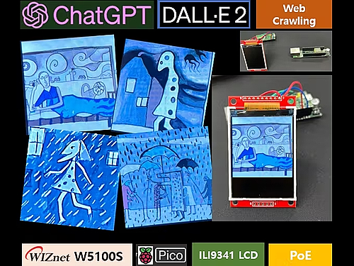](https://www.hackster.io/alan43/wow-enjoy-the-current-weather-with-picasso-s-painting-1e01f4)

Alan has created a project to display weather information in the form of Picasso-like images. Through web crawling, the Python code asks GPT to make a simple story about the weather, sends the story to DALL-E 2 to obtain a Picasso-like image of the current weather, then transmits the image to a Raspberry Pi Pico through Ethernet and outputs it to an LCD via CircuitPython - [hackster.io project](https://www.hackster.io/alan43/wow-enjoy-the-current-weather-with-picasso-s-painting-1e01f4), [article](https://www.hackster.io/news/chatgpt-and-dall-e-make-weather-reports-interesting-13206593e617), [YouTube](https://youtu.be/PKeusv8m2aM) and [GitHub](https://github.com/Alan-Shin/W5100S-Pico-GPT-API).

## News from around the web!

[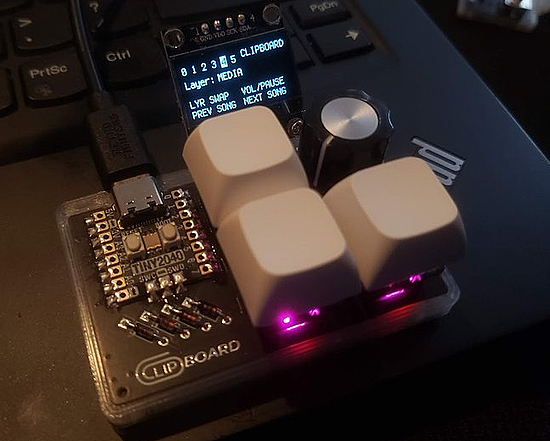](https://twitter.com/dj505_/status/1653594849957023745)

The Clipboard is a small macropad which runs CircuitPython/KMK. Despite the tiny form factor, it's capable of doing quite a bit - [Twitter](https://twitter.com/dj505_/status/1653594849957023745) and [GitHub](https://github.com/dj505/Clipboard).

Lasertheremin lets you play more than one note at the same time using three VL53L0X time of flight sensors and two PCM5102 DACs. "I am always trying to find out, how far Micropython can be pushed" - [Hackaday](https://hackaday.io/project/190809-lasertheremin).

[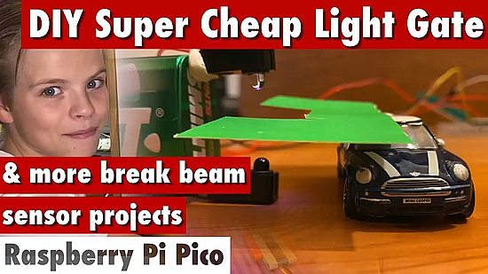](https://gurgleapps.com/learn/projects/how-to-use-a-break-beam-sensor-and-make-your-own-light-gate-on-the-cheap)

How to use a break beam sensor and make your own light gate on the cheap using a Raspberry Pi Pico and MicroPython - [GurgleApps](https://gurgleapps.com/learn/projects/how-to-use-a-break-beam-sensor-and-make-your-own-light-gate-on-the-cheap), [GitHub](https://github.com/gurgleapps/light-gate) and [YouTube](https://www.youtube.com/watch?v=HFVfMt-eCTU).

A power recliner chair controller with MicroPython and Raspberry Pi Pico W - [Hackaday.io](https://hackaday.io/project/190773-power-recliner-chair-controller) and [GitHub](https://github.com/sbc279/Chair-Automation)

[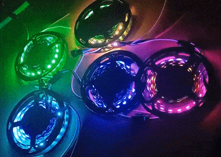](https://twitter.com/EstudioRoble/status/1653748127256440832)

Estudio Roble drives 500 NeoPixels with an Adafruit ItsyBitsy M4 and CircuitPython - [Twitter](https://twitter.com/EstudioRoble/status/1653748127256440832).

[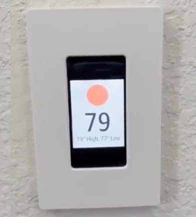](https://twitter.com/McmanusJaney/status/1655127134438928387)

An in-wall CircuitPython weather station - [Twitter](https://twitter.com/McmanusJaney/status/1655127134438928387).

Polling the the YouTube API for data using a Raspberry Pi Pico and CircuitPython - [Twitter](https://twitter.com/yorumiru/status/1654758368152793088).

[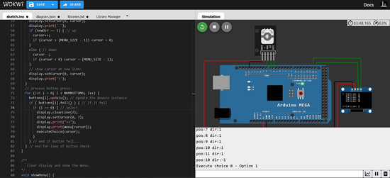](https://twitter.com/tainalo2/status/1655211905961656320)

Using the [Wokwi Arduino/ESP simulator](https://wokwi.com/) programmable in MicroPython - [Twitter](https://twitter.com/tainalo2/status/1655211905961656320).

[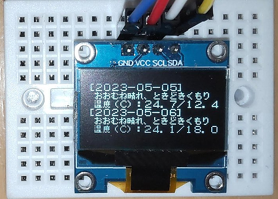](https://twitter.com/maresaku_mono/status/1655076869740560384)

Getting the weather forcast with Raspberry Pi, MicroPython and Open Meteo - [Project](https://maresaku.wixsite.com/raspberry/post/raspberry-pi-pico-w-micropython%E3%81%A7open-meteo%E3%81%AE%E5%A4%A9%E6%B0%97%E4%BA%88%E5%A0%B1%E3%81%AE%E5%8F%96%E5%BE%97%E3%81%AB%E6%8C%91%E6%88%A6%E3%81%97%E3%81%BE%E3%81%97%E3%81%9F%E3%80%82) and [Twitter](https://twitter.com/maresaku_mono/status/1655076869740560384).

[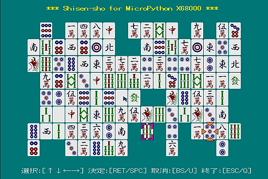](https://github.com/nozwas/shisen-x68k)

Making the game Sichuan for MicroPython-x68k - [GitHub](https://github.com/nozwas/shisen-x68k).

A single-axis solar tracker that uses two light detectors (LDRs) and two resistors in series to create a light potentiometer, done in MicroPython - [Twitter](https://twitter.com/kimberleym55872/status/1654682998296678401).

[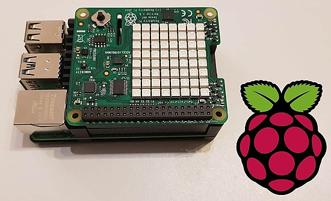](https://raspberrytips.com/best-raspberry-pi-hats/)

The top 13 Raspberry Pi HATs one needs to try in 2023 - [RaspberryTips](https://raspberrytips.com/best-raspberry-pi-hats/).

How to Create an Image of a Raspberry Pi SD Card? (Win/Linux/Mac) - [RaspberryTips](https://raspberrytips.com/create-image-sd-card/).

A good thread explaining Python list comprehension - [Twitter](https://twitter.com/akshay_pachaar/status/1655565727376740352).

PyDev of the Week: NAME on [Mouse vs Python]()

CircuitPython Weekly Meeting for DATE ([notes]()) [on YouTube]()

#ICYDNCI What was the most popular, most clicked link, in [last week's newsletter](https://www.adafruitdaily.com/2023/05/02/python-on-microcontrollers-newsletter-micropython-v1-20-0-and-circuitpython-8-1-0-beta-2-released-and-much-more-circuitpython-python-micropython-thepsf-raspberry_pi/)? [The 10 Year Evolution of MicroPython](https://twitter.com/micropython/status/1652324169499959298).

## Coming Soon

The Adafruit RP2040 CAN Bus Feather with MCP2515 CAN Controller and STEMMA QT I2C port - [Adafruit](https://www.adafruit.com/product/5724).

ArmaCard - SPI micro SD card to LoRa RFM95 adapter which works with CircuitPython - [Tindie](https://www.tindie.com/products/bobricius/armacard-spi-micro-sd-card-to-lora-rfm95-adapter/) vcia [Twitter](https://twitter.com/bobricius/status/1654471811168452610).

## New Boards Supported by CircuitPython

The number of supported microcontrollers and Single Board Computers (SBC) grows every week. This section outlines which boards have been included in CircuitPython or added to [CircuitPython.org](https://circuitpython.org/).

This week, there were eleven new boards added!

- [ESP32-C3-0.42LCD](https://circuitpython.org/board/01space_lcd042_esp32c3/)
- [Feather RP2040 Prop-Maker](https://circuitpython.org/board/adafruit_feather_rp2040_prop_maker/)
- [Core2 ESP32 IoT](https://circuitpython.org/board/m5stack_core2/)
- [YD-ESP32-S3 N16R8](https://circuitpython.org/board/yd_esp32_s3_n16r8/)
- [YD-ESP32-S3 N8R8](https://circuitpython.org/board/yd_esp32_s3_n8r8/)
- [TTGO T-Display ESP32 16M](https://circuitpython.org/board/lilygo_ttgo_tdisplay_esp32_16m/)
- [T-Watch 2020 V3](https://circuitpython.org/board/lilygo_twatch_2020_v3/)
- [Feather RP2040 CAN Bus](https://circuitpython.org/board/adafruit_feather_rp2040_can/)
- [Feather RP2040 ThinkInk](https://circuitpython.org/board/adafruit_feather_rp2040_thinkink/)
- [Feather RP2040 with USB Type A Host](https://circuitpython.org/board/adafruit_feather_rp2040_usb_host/)
- [BeagleBone Blue](https://circuitpython.org/blinka/beaglebone_blue/)

*Note: For non-Adafruit boards, please use the support forums of the board manufacturer for assistance, as Adafruit does not have the hardware to assist in troubleshooting.*

Looking to add a new board to CircuitPython? It's highly encouraged! Adafruit has four guides to help you do so:

- [How to Add a New Board to CircuitPython](https://learn.adafruit.com/how-to-add-a-new-board-to-circuitpython/overview)
- [How to add a New Board to the circuitpython.org website](https://learn.adafruit.com/how-to-add-a-new-board-to-the-circuitpython-org-website)
- [Adding a Single Board Computer to PlatformDetect for Blinka](https://learn.adafruit.com/adding-a-single-board-computer-to-platformdetect-for-blinka)
- [Adding a Single Board Computer to Blinka](https://learn.adafruit.com/adding-a-single-board-computer-to-blinka)

## New Learn Guides!

[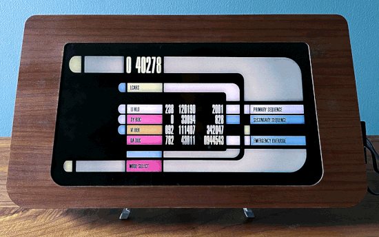](https://learn.adafruit.com/guides/latest)

[Star Trek LCARS Display](https://learn.adafruit.com/star-trek-lcars-display) from [John Park](https://learn.adafruit.com/u/johnpark)

## CircuitPython Libraries!

CircuitPython support for hardware continues to grow. We are adding support for new sensors and breakouts all the time, as well as improving on the drivers we already have. As we add more libraries and update current ones, you can keep up with all the changes right here!

For the latest libraries, download the [Adafruit CircuitPython Library Bundle](https://circuitpython.org/libraries). For the latest community contributed libraries, download the [CircuitPython Community Bundle](https://github.com/adafruit/CircuitPython_Community_Bundle/releases).

If you'd like to contribute, CircuitPython libraries are a great place to start. Have an idea for a new driver? File an issue on [CircuitPython](https://github.com/adafruit/circuitpython/issues)! Have you written a library you'd like to make available? Submit it to the [CircuitPython Community Bundle](https://github.com/adafruit/CircuitPython_Community_Bundle). Interested in helping with current libraries? Check out the [CircuitPython.org Contributing page](https://circuitpython.org/contributing). We've included open pull requests and issues from the libraries, and details about repo-level issues that need to be addressed. We have a guide on [contributing to CircuitPython with Git and GitHub](https://learn.adafruit.com/contribute-to-circuitpython-with-git-and-github) if you need help getting started. You can also find us in the #circuitpython channels on the [Adafruit Discord](https://adafru.it/discord).

You can check out this [list of all the Adafruit CircuitPython libraries and drivers available](https://github.com/adafruit/Adafruit_CircuitPython_Bundle/blob/master/circuitpython_library_list.md). 

The current number of CircuitPython libraries is **432**!

**New Libraries!**

Here's this week's new CircuitPython libraries:

  * [jposada202020/CircuitPython_LPS28](https://github.com/jposada202020/CircuitPython_LPS28)

**Updated Libraries!**

Here's this week's updated CircuitPython libraries:
  * [adafruit/Adafruit_CircuitPython_SSD1680](https://github.com/adafruit/Adafruit_CircuitPython_SSD1680)
  * [adafruit/Adafruit_CircuitPython_hashlib](https://github.com/adafruit/Adafruit_CircuitPython_hashlib)
  * [adafruit/Adafruit_CircuitPython_FancyLED](https://github.com/adafruit/Adafruit_CircuitPython_FancyLED)
  * [adafruit/Adafruit_CircuitPython_SimpleIO](https://github.com/adafruit/Adafruit_CircuitPython_SimpleIO)
  * [adafruit/Adafruit_CircuitPython_Wiznet5k](https://github.com/adafruit/Adafruit_CircuitPython_Wiznet5k)
  * [jposada202020/CircuitPython_simple_dial](https://github.com/jposada202020/CircuitPython_simple_dial)
  * [ricardoquesada/bluepad32-circuitpython](https://github.com/ricardoquesada/bluepad32-circuitpython)
  * [furbrain/CircuitPython_async_button](https://github.com/furbrain/CircuitPython_async_button)
  * [furbrain/CircuitPython_mag_cal](https://github.com/furbrain/CircuitPython_mag_cal)

**Library PyPI Weekly Download Statistics**
* **Total Library Stats**
  * 100188 PyPI downloads over 310 libraries
* **Top 10 Libraries by PyPI Downloads**
  * Adafruit CircuitPython BusDevice (adafruit-circuitpython-busdevice): 6758
  * Adafruit CircuitPython Requests (adafruit-circuitpython-requests): 6188
  * Adafruit CircuitPython Register (adafruit-circuitpython-register): 1969
  * Adafruit CircuitPython NeoPixel (adafruit-circuitpython-neopixel): 1455
  * Adafruit CircuitPython Motor (adafruit-circuitpython-motor): 1134
  * Adafruit CircuitPython RGB Display (adafruit-circuitpython-rgb-display): 1097
  * Adafruit CircuitPython Wiznet5k (adafruit-circuitpython-wiznet5k): 1065
  * Adafruit CircuitPython Display Text (adafruit-circuitpython-display-text): 1052
  * Adafruit CircuitPython ServoKit (adafruit-circuitpython-servokit): 895
  * Adafruit CircuitPython MiniMQTT (adafruit-circuitpython-minimqtt): 828

## What’s the CircuitPython team up to this week?

What is the team up to this week? Let’s check in!

**Kattni**

I returned this week from 10 days at PyCon and a weekend to recover. PyCon was amazing; it was so wonderful to reconnect with friends, and to make new friends. We hosted three sets of events: a workshop, Open Spaces and Sprints. The workshop was held during the Education Summit before the conference. Open Spaces happen during the three-day conference. Sprints are held in the days following the conference; there are four days total, however, we hosted for three days only. The workshop was an excellent Welcome to CircuitPython! event - a bunch of folks chose to join in, and definitely enjoyed themselves. Open Spaces are self-guided meetups around a topic of the hosts choice, and in our case, it was an introduction to CircuitPython using the Circuit Playground Express. 

All three days were well attended, though Friday and Sunday outdid Saturday by quite a bit. We had new folks every day, but engaged the same folks all three days in many cases as well. Everyone enjoyed it, and 65+ attendees left with a CPX to take home. The Sprints are designed around providing a space for folks to contribute to your open source project. We had many attendees, all three days, who were excited to contribute code and documentation to the CircuitPython project. Based on PR numbers alone, it was the most successful sprint we've ever hosted. The best part to me, though, is that folks are still engaging after the conference and Sprints have ended. This is great to see!

This week, I published the Adafruit Feather RP2040 RFM95 guide. It has everything you need to get started with your new RP2040 LoRa Feather. From Pinouts, to tips and tricks, to CircuitPython and Arduino demos, this guide is the place to go after getting your new Feather. Check it out!

Next up is a 3D printed canary nightlight collaboration with Noe, as well as catching up on a list of guide updates and miscellaneous whatnot that need to be taken care of.

**Melissa**

Over the past couple of weeks, I have mostly been out because I was busy moving. Now that I am settling in, I was able to merge a major update to the [CircuitPython Code Editor](https://code.circuitpython.org/) that uses Vite instead of the obsolete Snowpack and I fixed a JavaScript file that only runs on devices to parse the updated links properly.

**Tim**

This week I've been reviewing the influx of PRs from the PyCon sprinters. Many type annotations and other improvements have been submitted, it's been great to see. The other thing I've been working on this week making a non-blocking text marquee for the 14x4 segment displays so you can scroll messages while doing other things.

**Jeff**

I'm back from PyCon US (which was a blast) and have continued working on `synthio`.

I've got a new open pull request to really increase the amount of control the Python program has over the synthesizer. It adds a new Note class, which has a number of properties that can all be varied dynamically while the note is playing — the note frequency itself in Hz, but also the note's individual envelope, waveform, tremolo & vibrato.

I've also adapted the standard Python `wave` library into CircuitPython. This was super handy because it enables easy use of waveforms from [AKWF](https://github.com/KristofferKarlAxelEkstrand/AKWF-FREE) with `synthio`. By the time you read this, it may already be available in the bundle as `adafruit_wave`.

The AKWF files are free to download under the CC0 license but the author [requests a donation](https://www.adventurekid.se/akrt/waveforms/adventure-kid-waveforms/) if you find them useful.

**Scott**

This week I wrapped up the DVI API changes and my i.MX RT work. I should be working on a porting guide for the CircuitPython APIs but Ladyada distracted me with implementing [the Bus Pirate command line interface](http://dangerousprototypes.com/docs/Bus_Pirate_menu_options_guide) on top of CircuitPython.

**Liz**

I published two new guides. The first is a [video synth using the Feather RP2040 DVI](https://learn.adafruit.com/feather-rp2040-dvi-video-synth). It was written with the PicoDVI Fork for Arduino. It was the most project code I've ever written with Arduino and it was really fun.

The next guide is the [product guide for the Feather RP2040 USB Host](https://learn.adafruit.com/adafruit-feather-rp2040-with-usb-type-a-host). This board has USB Host functionality in Arduino and I'm looking forward to possibly doing a project with it.

## Upcoming events!

The next MicroPython Meetup in Melbourne will be on May 24th – [Meetup](https://www.meetup.com/MicroPython-Meetup/). From the  April 26th meeting - [Notes](https://docs.google.com/presentation/d/e/2PACX-1vS7oU-US5MN1bXTbPG4ZNFtVJuOYQx5GOdIOURQVP7ESSm08sz7M9q_vFXxCaihmjng2Sl2KwbtcGbQ/pub?slide=id.p) and [Video](https://www.youtube.com/watch?v=gKpc900G1DE).

EuroPython 2023 will be July 17-23, 2023, in Prague, Czech Republic and Remote - [EuroPython 2023](https://ep2023.europython.eu/).

PyCon UK will be returning to Cardiff City Hall from Friday 22nd September to Monday 25th September 2023 - [PyCon UK](https://2023.pyconuk.org/).

**Send Your Events In**

If you know of virtual events or upcoming events, please let us know via email to cpnews(at)adafruit(dot)com.

## Latest releases

CircuitPython's stable release is [#.#.#](https://github.com/adafruit/circuitpython/releases/latest) and its unstable release is [#.#.#-##.#](https://github.com/adafruit/circuitpython/releases). New to CircuitPython? Start with our [Welcome to CircuitPython Guide](https://learn.adafruit.com/welcome-to-circuitpython).

[2023####](https://github.com/adafruit/Adafruit_CircuitPython_Bundle/releases/latest) is the latest CircuitPython library bundle.

[v#.#.#](https://micropython.org/download) is the latest MicroPython release. Documentation for it is [here](http://docs.micropython.org/en/latest/pyboard/).

[#.#.#](https://www.python.org/downloads/) is the latest Python release. The latest pre-release version is [#.#.#](https://www.python.org/download/pre-releases/).

[#,### Stars](https://github.com/adafruit/circuitpython/stargazers) Like CircuitPython? [Star it on GitHub!](https://github.com/adafruit/circuitpython)

## Call for help -- Translating CircuitPython is now easier than ever!

One important feature of CircuitPython is translated control and error messages. With the help of fellow open source project [Weblate](https://weblate.org/), we're making it even easier to add or improve translations. 

Sign in with an existing account such as GitHub, Google or Facebook and start contributing through a simple web interface. No forks or pull requests needed! As always, if you run into trouble join us on [Discord](https://adafru.it/discord), we're here to help.

## NUMBER thanks!

The Adafruit Discord community, where we do all our CircuitPython development in the open, reached over NUMBER humans - thank you!  Adafruit believes Discord offers a unique way for Python on hardware folks to connect. Join today at [https://adafru.it/discord](https://adafru.it/discord).

## ICYMI - In case you missed it

Python on hardware is the Adafruit Python video-newsletter-podcast! The news comes from the Python community, Discord, Adafruit communities and more and is broadcast on ASK an ENGINEER Wednesdays. The complete Python on Hardware weekly videocast [playlist is here](https://www.youtube.com/playlist?list=PLjF7R1fz_OOXRMjM7Sm0J2Xt6H81TdDev). The video podcast is on [iTunes](https://itunes.apple.com/us/podcast/python-on-hardware/id1451685192?mt=2), [YouTube](http://adafru.it/pohepisodes), [IGTV (Instagram TV](https://www.instagram.com/adafruit/channel/)), and [XML](https://itunes.apple.com/us/podcast/python-on-hardware/id1451685192?mt=2).

[The weekly community chat on Adafruit Discord server CircuitPython channel - Audio / Podcast edition](https://itunes.apple.com/us/podcast/circuitpython-weekly-meeting/id1451685016) - Audio from the Discord chat space for CircuitPython, meetings are usually Mondays at 2pm ET, this is the audio version on [iTunes](https://itunes.apple.com/us/podcast/circuitpython-weekly-meeting/id1451685016), Pocket Casts, [Spotify](https://adafru.it/spotify), and [XML feed](https://adafruit-podcasts.s3.amazonaws.com/circuitpython_weekly_meeting/audio-podcast.xml).

## Contribute!

The CircuitPython Weekly Newsletter is a CircuitPython community-run newsletter emailed every Tuesday. The complete [archives are here](https://www.adafruitdaily.com/category/circuitpython/). It highlights the latest CircuitPython related news from around the web including Python and MicroPython developments. To contribute, edit next week's draft [on GitHub](https://github.com/adafruit/circuitpython-weekly-newsletter/tree/gh-pages/_drafts) and [submit a pull request](https://help.github.com/articles/editing-files-in-your-repository/) with the changes. You may also tag your information on Twitter with #CircuitPython. 

Join the Adafruit [Discord](https://adafru.it/discord) or [post to the forum](https://forums.adafruit.com/viewforum.php?f=60) if you have questions.
