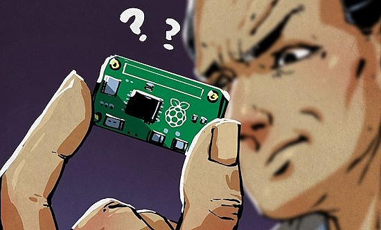
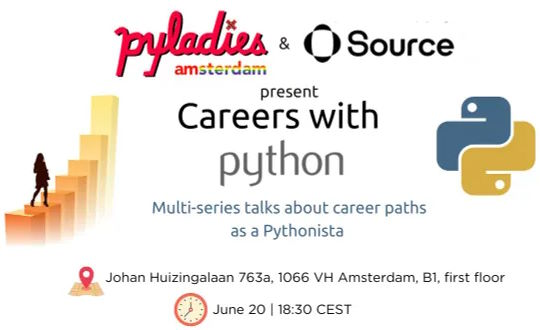
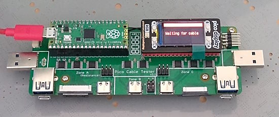
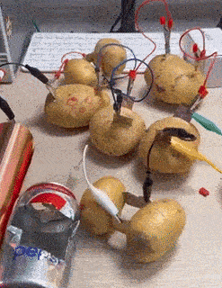
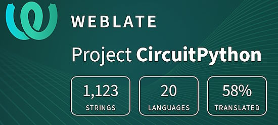

- [ ] Kattni updates
- [ ] change date
- [ ] update title
- [ ] Feature story
- [ ] Update  for images
- [ ] Update ICYDNCI
- [ ] All images 550w max only
- [ ] Link "View this email in your browser."

News Sources

- [python.org](https://www.python.org/)
- [Python Insider - dev team blog](https://pythoninsider.blogspot.com/)
- [MicroPython Meetup Blog](https://melbournemicropythonmeetup.github.io/)
- [hackaday.io newest projects MicroPython](https://hackaday.io/projects?tag=micropython&sort=date) and [CircuitPython](https://hackaday.io/projects?tag=circuitpython&sort=date)
- [hackaday CircuitPython](https://hackaday.com/blog/?s=circuitpython) and [MicroPython](https://hackaday.com/blog/?s=micropython)
- [hackster.io CircuitPython](https://www.hackster.io/search?q=circuitpython&i=projects&sort_by=most_recent) and [MicroPython](https://www.hackster.io/search?q=micropython&i=projects&sort_by=most_recent)
- [https://opensource.com/tags/python](https://opensource.com/tags/python)
- [Mastodon CircuitPython](https://octodon.social/tags/CircuitPython)

View this email in your browser. **Warning: Flashing Imagery**

Welcome to the latest Python on Microcontrollers newsletter!  - *Ed.*

We're on [Discord](https://discord.gg/HYqvREz), [Twitter](https://twitter.com/search?q=circuitpython&src=typed_query&f=live), and for past newsletters - [view them all here](https://www.adafruitdaily.com/category/circuitpython/). If you're reading this on the web, [subscribe here](https://www.adafruitdaily.com/). Here's the news this week:

## A New Release to the Thonny Editor Provides New Features

A new version of the Thonny Python editor has been released with bug fixes and new features. The default installation uses Python 3.10 and looks to run in 64 bit mode. ESP flashing dialog now allows selecting from list of know MicroPython and CircuitPython variants, and downloads them for you - [GitHub](https://github.com/thonny/thonny/releases/tag/v4.1.0) via [Twitter](https://twitter.com/thonnyide/status/1665219568002818049).

## PyCon US '23 and PyCascades '23 Videos Are Now Out

The PyCon US 2023 talk recordings are now available on the PyCon US YouTube channel - [YouTube](https://www.youtube.com/c/pyconus).

The PyCascades 2023 talk recordings are now available on the PyCascades YouTube channel - [YouTube](https://www.youtube.com/watch?v=1OVyuw5_PDk&list=PLcNrB7gPa-NedACvFYa9iVUIhnku_EBSz).

## New MicroPython YouTube Channel

MicroPython now has an official YouTube channel for their videos - [YouTube](https://www.youtube.com/@MicroPythonOfficial).

## Software Driving Hardware

Hackaday was talking about Christopher Barnatt’s very insightful analysis of [what the future holds for the Raspberry Pi single board computers](https://hackaday.com/2023/05/31/what-next-for-the-sbc-that-has-everything/) on their [Podcast](https://hackaday.com/2023/06/02/hackaday-podcast-221-the-future-of-the-raspberry-pi-sniffing-a-toothbrush-your-tactical-tool-threshold/). On the one hand, they’re becoming such competent computers that they are beginning to compete with lightweight desktop machines, instead of just being a hacker curiosity.

On the other hand, especially given the shortage and the increase in price that has come with the Pi’s expanding memory endowments, a lot of people who would “just throw in a Raspberry Pi” are starting to think more carefully about their options. 

These days, there is no shortage of microcontrollers that have enough memory – both flash and RAM – to support a higher-level environment like MicroPython. And if you think about it, MicroPython brings to the microcontrollers a lot of what people were using a Raspberry Pi for in projects anyway: a friendly interactive programming environment that was free of the compile-here, flash-there debug cycle. If you’re happy coding Python on a single-board Linux computer, you’ll be more or less happy coding in MicroPython or CircuitPython on a microcontroller - [Hackaday](https://hackaday.com/2023/06/03/software-driving-hardware/).

## Git 2.41 Released

Git 2.41 was released June 1st with features and bug fixes from over 95 contributors - [GitHub Blog](https://github.blog/2023-06-01-highlights-from-git-2-41/) and [Release Notes](https://github.com/git/git/blob/v2.41.0/Documentation/RelNotes/2.41.0.txt).

## From the Python Software Foundation

**Python Language Summit** - Python core developers, triagers, and special guests gathered for the Python Language Summit: an all-day event of talks where the future direction of Python is discussed. The Language Summit 2023, just before PyCon US '23, included three back-to-back talks on the C API, an update on work towards making the Global Interpreter Lock optional, and a discussion on how to tackle burnout in the community - [PSF Blog](https://pyfound.blogspot.com/2023/05/the-python-language-summit-2023_29.html).

**PSF Board of Directors Openings** - Nominations for the Python Software Foundation Board of Directors are open - [PSF Blog](https://pyfound.blogspot.com/2023/05/thinking-about-running-for-python.html).

## PyLadies Presents: Careers with Python

This meetup is the third volume of the "Careers with Python" series that aims to guide one through the various career paths and opportunities available as a Python developer. June 20th, 2023 in Amsterdam - [Meetup](https://www.meetup.com/pyladiesams/events/293631462/).

## This Week's Python Streams

Python on Hardware is all about building a cooperative ecosphere which allows contributions to be valued and to grow knowledge. Below are the streams within the last week focusing on the community.

### CircuitPython Deep Dive Stream

[This week](link), Tim streamed work on {subject}.

You can see the latest video and past videos on the Adafruit YouTube channel under the Deep Dive playlist - [YouTube](https://www.youtube.com/playlist?list=PLjF7R1fz_OOXBHlu9msoXq2jQN4JpCk8A).

### CircuitPython Parsec

John Park’s CircuitPython Parsec this week is on Color Gradients with NeoPixels - [Adafruit Blog](https://blog.adafruit.com/2023/06/02/john-parks-circuitpython-parsec-color-gradients-with-neopixels-adafruit-circuitpython/) and [YouTube](https://youtu.be/bDvrkIC17zE).

Catch all the episodes in the [YouTube playlist](https://www.youtube.com/playlist?list=PLjF7R1fz_OOWFqZfqW9jlvQSIUmwn9lWr).

### The CircuitPython Show

The CircuitPython Show is an independent podcast hosted by Paul Cutler, focusing on the people doing awesome things with CircuitPython. Each episode features Paul in conversation with a guest for a short interview – [CircuitPythonShow](https://circuitpythonshow.com/).

The latest episode was released June 5th and features Martin Tan.  Martin and Paul discuss Martin's new book, micro:bit Projects with Python and Single Board Computers: Building STEAM Projects with Code Club and Kids' Maker Groups. – [Show List](https://www.circuitpythonshow.com/@circuitpythonshow/episodes).

## Project of the Week: Making a Massive Functional Nose

This massive nose sniffs things then prints a description of the smell. Adnose is an interactive sculpture combining image recognition and machine learning. It was 3D printed in separate pieces before being assembled and then finished to give it a sculptural look. It uses a Raspberry Pi 4, camera, distance sensor, thermal printer and speaker, programmed through a Python script - [Raspberry Pi News](https://www.raspberrypi.com/news/this-massive-nose-sniffs-things-then-prints-a-description-of-the-smell/).

## News from around the web!

A Raspberry Pi Pico powered cable tester/identifier running CircuitPython - [Twitter](https://twitter.com/burtyb/status/1665708811942871040).

VCVRack CableControl is a virtual cable controller for the VCVRack Eurorack emulator which requires nothing more than a Raspberry Pi Pico (or other CircuitPython compatible Microcontroller). Written in CircuitPython. Provides 26x physical sockets which can be distributed as inputs or outputs - [GitHub](https://github.com/PatchworkBoy/VCVRack_CableControl).

PyCascades talk: What's That Smell? Detecting Air Quality with Python (and Raspberry Pi) - [YouTube](https://www.youtube.com/watch?v=HH_G9ut1SFg&list=PLcNrB7gPa-NedACvFYa9iVUIhnku_EBSz&index=20).

> "Faculty have seen a drop in student visitors post-COVID, so I Funked Up my Boston College office for more fun. Also a great way to teach IoT and MQTT with the Raspberry Pi Pico W, Adafruit IO, and CircuitPython" - [YouTube First Video](https://www.youtube.com/watch?v=565lpAIWjJM), [YouTube Second Video](https://www.youtube.com/watch?v=UxhCPdK7W38), and [GitHub](https://github.com/gallaugher/disco-button), via [Twitter](https://twitter.com/gallaugher/status/1664381585481687041).

Widow's Might: Non-emergency IoT service Buttons for Elders - [Hackster](https://www.hackster.io/bradspry/widow-s-might-non-emergency-iot-service-buttons-for-elders-bfb7fc) and [Hackaday](https://hackaday.io/project/191322-widows-might-non-emergency-buttons-for-elders).

Trying to power a Raspberry Pi Pico running MicroPython with a battery made from potatoes - [Twitter](https://twitter.com/kevsmac/status/1663986103789993988).

text - [site](url).

text - [site](url).

text - [site](url).

text - [site](url).

text - [site](url).

text - [site](url).

text - [site](url).

text - [site](url).

text - [site](url).

text - [site](url).

text - [site](url).

text - [site](url).

text - [site](url).

text - [site](https://matt.blwt.io/post/lua-the-little-language-that-could/).

Lua: The Little Language That Could - [Matt Blewitt](url).

PyDev of the Week: NAME on [Mouse vs Python]()

CircuitPython Weekly Meeting for 5/30/23 ([notes](https://github.com/adafruit/adafruit-circuitpython-weekly-meeting/blob/main/2023/2023-05-30.md)) [on YouTube](https://youtu.be/UUQlni5EGkE)

CircuitPython Weekly Meeting for 6/5/23 ([notes]()) [on YouTube]()

**#ICYDNCI What was the most popular, most clicked link, in [last week's newsletter](https://link)? [title](url).**

## Coming Soon

text - [site](url).

text - [site](url).

## New Boards Supported by CircuitPython

The number of supported microcontrollers and Single Board Computers (SBC) grows every week. This section outlines which boards have been included in CircuitPython or added to [CircuitPython.org](https://circuitpython.org/).

This week, there were (#/no) new boards added!

- [Board name](url)
- [Board name](url)
- [Board name](url)

*Note: For non-Adafruit boards, please use the support forums of the board manufacturer for assistance, as Adafruit does not have the hardware to assist in troubleshooting.*

Looking to add a new board to CircuitPython? It's highly encouraged! Adafruit has four guides to help you do so:

- [How to Add a New Board to CircuitPython](https://learn.adafruit.com/how-to-add-a-new-board-to-circuitpython/overview)
- [How to add a New Board to the circuitpython.org website](https://learn.adafruit.com/how-to-add-a-new-board-to-the-circuitpython-org-website)
- [Adding a Single Board Computer to PlatformDetect for Blinka](https://learn.adafruit.com/adding-a-single-board-computer-to-platformdetect-for-blinka)
- [Adding a Single Board Computer to Blinka](https://learn.adafruit.com/adding-a-single-board-computer-to-blinka)

## New Learn Guides!

[title](url) from [name](url)

[title](url) from [name](url)

[title](url) from [name](url)

## Updated Learn Guides!

[title](url) from [name](url)

## CircuitPython Libraries!

CircuitPython support for hardware continues to grow. We are adding support for new sensors and breakouts all the time, as well as improving on the drivers we already have. As we add more libraries and update current ones, you can keep up with all the changes right here!

For the latest libraries, download the [Adafruit CircuitPython Library Bundle](https://circuitpython.org/libraries). For the latest community contributed libraries, download the [CircuitPython Community Bundle](https://github.com/adafruit/CircuitPython_Community_Bundle/releases).

If you'd like to contribute, CircuitPython libraries are a great place to start. Have an idea for a new driver? File an issue on [CircuitPython](https://github.com/adafruit/circuitpython/issues)! Have you written a library you'd like to make available? Submit it to the [CircuitPython Community Bundle](https://github.com/adafruit/CircuitPython_Community_Bundle). Interested in helping with current libraries? Check out the [CircuitPython.org Contributing page](https://circuitpython.org/contributing). We've included open pull requests and issues from the libraries, and details about repo-level issues that need to be addressed. We have a guide on [contributing to CircuitPython with Git and GitHub](https://learn.adafruit.com/contribute-to-circuitpython-with-git-and-github) if you need help getting started. You can also find us in the #circuitpython channels on the [Adafruit Discord](https://adafru.it/discord).

You can check out this [list of all the Adafruit CircuitPython libraries and drivers available](https://github.com/adafruit/Adafruit_CircuitPython_Bundle/blob/master/circuitpython_library_list.md). 

The current number of CircuitPython libraries is **###**!

**New Libraries!**

Here's this week's new CircuitPython libraries:

* [library](url)

**Updated Libraries!**

Here's this week's updated CircuitPython libraries:

* [library](url)

**Library Statistics**

## What’s the CircuitPython team up to this week?

What is the team up to this week? Let’s check in!

**Dan**

This week I've been working on making the fetching of submodules more selective in the CircuitPython repo. The idea is to fetch only the submodules you need. If you're building only for a particular port, there's no reason to fetch all the submodules for every port, which can take minutes.

I've also started to look at Greg Neverov's proposals for `asyncio` again, as we start working on what we want in the 9.0.0 release.

**Kattni**

This week I finished up the Feather RP2040 DVI guide. It was started before the board came out, but there were some issues, so getting the board into the shop was delayed. The guide was set aside, and not dealt with again until the past week. It's completed now! If you picked up one of these nifty boards, check out the guide. It has everything you need to get started, including CircuitPython and Arduino DVI video examples!

Next up in guide land is the CHOC NeoKey breakout, followed by the STEMMA QT Gamepad. Keep an eye out for those coming soon!

**Melissa**

This past week I've been catching up on GitHub issues. I've been focusing on the display issues in the [Raspberry Pi Installer Scripts GitHub repository](https://github.com/adafruit/Raspberry-Pi-Installer-Scripts). One of the issues that took some time was updating the Display Driver for the 1.14" display so that it fixes the offsets. I started with the source code from the current driver and added the calculations from the old driver and was able to get it working again.

**Tim**

This week I've been going back through typing PRs submitted during pycon that needed additional changes still and doing what I can to move them forward. I also started digging into a `displayio` issue submitted recently that results in hidden objects making the refresh rendering time longer than they would if they were visible, I've attempted a few fixes and had some success in figuring out where the hidden items are taking extra time. It still needs some additional testing and likely a few more changes before it's ready to go.

**Jeff**

Another week, another `synthio` improvement. In a new pull request, the overall FIR filtering is replaced with per note biquad filtering, which is more frequently used in audio synthesis. This allows each sound to have a different filter, which is especially useful for creating percussive effects where a drum might have a low pass filter while a high hat would use a high pass filter. Mark (gamblor) demonstrated this during last week's Show and Tell program.

**Scott**

This week I've been mostly working in the Pyrate code. I added 1-Wire support and am working on UART support. UART is a bit tricky because the pins on the Pyrate board don't support native UART. So, I'm polishing up the PIO code used for UART. That code will allow us to use any pin for TX or RX.

**Liz**

This week I've been working on a synth that uses the ANO rotary encoders. The code is written in CircuitPython with the new synthio module features. It is probably the longest code I've ever written in CircuitPython and it's been super fun adding different modes to show the features in `synthio`. The guide should be live soon along with some demo videos.

## Upcoming events!

The next MicroPython Meetup in Melbourne will be on June 28th – [Meetup](https://www.meetup.com/MicroPython-Meetup/). From the May 24th meeting - [Notes](https://docs.google.com/presentation/d/e/2PACX-1vQ3rvNGR3NyBkSc6t1nXMoGvNuf9Btq10ZQR-4DagW5q4cbPtGMZXOoRRRo2wWOi2u7xH-Bf_HTBjb2/pub?slide=id.p).

EuroPython 2023 will be July 17-23, 2023, in Prague, Czech Republic and Remote - [EuroPython 2023](https://ep2023.europython.eu/).

PyCon UK will be returning to Cardiff City Hall from Friday 22nd September to Monday 25th September 2023 - [PyCon UK](https://2023.pyconuk.org/).

Hackaday has announced that the Hackaday Supercon is on for 2023, and will be taking place November 3 – 5 in Pasadena, California, USA.They’d like to hear your proposals for talks and workshops! The [Call for Speakers](https://docs.google.com/forms/d/e/1FAIpQLSfYDwIzWTHZ0_7d8GUznm3Z9w3y8aDcV1MVGSUyY1nTcdJ9Jw/viewform?usp=sf_link) and [Call for Workshops](https://docs.google.com/forms/d/e/1FAIpQLSeJIm0fWcrJIN8ge1K6Mvt2tfoFYOqre3isod5vKRGr-iyvJg/viewform?usp=sf_link) forms are online now, and you have until July 18th to sign up - [Adafruit Blog](https://blog.adafruit.com/2023/05/10/hackaday-supercon-2023-is-on-supercon-hackaday/) and [Hackaday](https://hackaday.com/2023/05/10/supercon-2023-is-on-we-want-you/).

**Send Your Events In**

If you know of virtual events or upcoming events, please let us know via email to cpnews(at)adafruit(dot)com.

## Latest releases

CircuitPython's stable release is [#.#.#](https://github.com/adafruit/circuitpython/releases/latest) and its unstable release is [#.#.#-##.#](https://github.com/adafruit/circuitpython/releases). New to CircuitPython? Start with our [Welcome to CircuitPython Guide](https://learn.adafruit.com/welcome-to-circuitpython).

[2023####](https://github.com/adafruit/Adafruit_CircuitPython_Bundle/releases/latest) is the latest CircuitPython library bundle.

[v#.#.#](https://micropython.org/download) is the latest MicroPython release. Documentation for it is [here](http://docs.micropython.org/en/latest/pyboard/).

[#.#.#](https://www.python.org/downloads/) is the latest Python release. The latest pre-release version is [#.#.#](https://www.python.org/download/pre-releases/).

[#,### Stars](https://github.com/adafruit/circuitpython/stargazers) Like CircuitPython? [Star it on GitHub!](https://github.com/adafruit/circuitpython)

## Call for help -- Translating CircuitPython is now easier than ever!

One important feature of CircuitPython is translated control and error messages. With the help of fellow open source project [Weblate](https://weblate.org/), we're making it even easier to add or improve translations. 

Sign in with an existing account such as GitHub, Google or Facebook and start contributing through a simple web interface. No forks or pull requests needed! As always, if you run into trouble join us on [Discord](https://adafru.it/discord), we're here to help.

## NUMBER thanks!

The Adafruit Discord community, where we do all our CircuitPython development in the open, reached over NUMBER humans - thank you!  Adafruit believes Discord offers a unique way for Python on hardware folks to connect. Join today at [https://adafru.it/discord](https://adafru.it/discord).

## ICYMI - In case you missed it

Python on hardware is the Adafruit Python video-newsletter-podcast! The news comes from the Python community, Discord, Adafruit communities and more and is broadcast on ASK an ENGINEER Wednesdays. The complete Python on Hardware weekly videocast [playlist is here](https://www.youtube.com/playlist?list=PLjF7R1fz_OOXRMjM7Sm0J2Xt6H81TdDev). The video podcast is on [iTunes](https://itunes.apple.com/us/podcast/python-on-hardware/id1451685192?mt=2), [YouTube](http://adafru.it/pohepisodes), [IGTV (Instagram TV](https://www.instagram.com/adafruit/channel/)), and [XML](https://itunes.apple.com/us/podcast/python-on-hardware/id1451685192?mt=2).

[The weekly community chat on Adafruit Discord server CircuitPython channel - Audio / Podcast edition](https://itunes.apple.com/us/podcast/circuitpython-weekly-meeting/id1451685016) - Audio from the Discord chat space for CircuitPython, meetings are usually Mondays at 2pm ET, this is the audio version on [iTunes](https://itunes.apple.com/us/podcast/circuitpython-weekly-meeting/id1451685016), Pocket Casts, [Spotify](https://adafru.it/spotify), and [XML feed](https://adafruit-podcasts.s3.amazonaws.com/circuitpython_weekly_meeting/audio-podcast.xml).

## Contribute!

The CircuitPython Weekly Newsletter is a CircuitPython community-run newsletter emailed every Tuesday. The complete [archives are here](https://www.adafruitdaily.com/category/circuitpython/). It highlights the latest CircuitPython related news from around the web including Python and MicroPython developments. To contribute, edit next week's draft [on GitHub](https://github.com/adafruit/circuitpython-weekly-newsletter/tree/gh-pages/_drafts) and [submit a pull request](https://help.github.com/articles/editing-files-in-your-repository/) with the changes. You may also tag your information on Twitter with #CircuitPython. 

Join the Adafruit [Discord](https://adafru.it/discord) or [post to the forum](https://forums.adafruit.com/viewforum.php?f=60) if you have questions.
