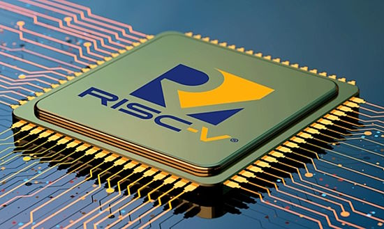
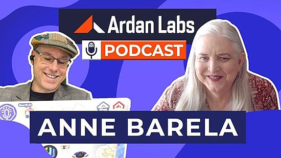
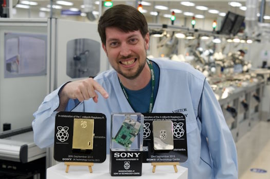
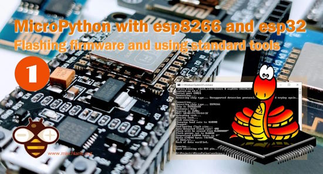
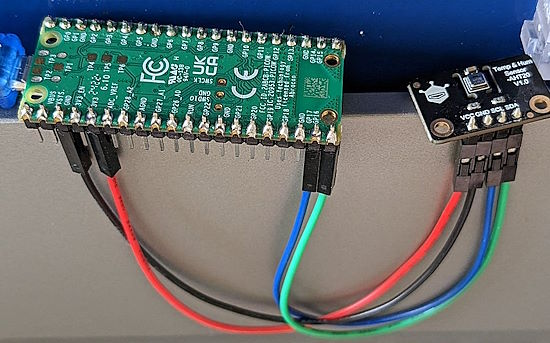
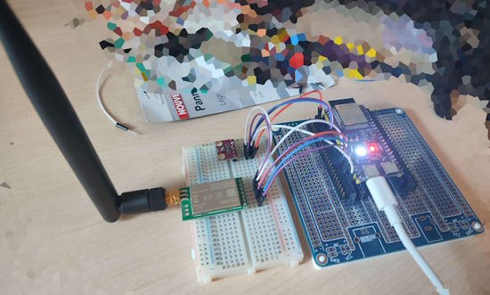
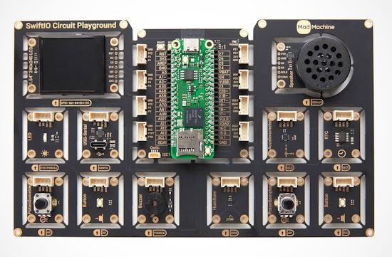

- [X] Kattni updates
- [ ] change date
- [ ] update title
- [ ] Feature story
- [ ] Update  for images
- [ ] Update ICYDNCI
- [ ] All images 550w max only
- [ ] Link "View this email in your browser."

News Sources

- [python.org](https://www.python.org/)
- [Python Insider - dev team blog](https://pythoninsider.blogspot.com/)
- [MicroPython Meetup Blog](https://melbournemicropythonmeetup.github.io/)
- [hackaday.io newest projects MicroPython](https://hackaday.io/projects?tag=micropython&sort=date) and [CircuitPython](https://hackaday.io/projects?tag=circuitpython&sort=date)
- [hackaday CircuitPython](https://hackaday.com/blog/?s=circuitpython) and [MicroPython](https://hackaday.com/blog/?s=micropython)
- [hackster.io CircuitPython](https://www.hackster.io/search?q=circuitpython&i=projects&sort_by=most_recent) and [MicroPython](https://www.hackster.io/search?q=micropython&i=projects&sort_by=most_recent)
- [https://opensource.com/tags/python](https://opensource.com/tags/python)
- [Mastodon CircuitPython](https://octodon.social/tags/CircuitPython)

Information Links

- [Last weeks Stats & Subscribers](https://us10.admin.mailchimp.com/campaigns/show?id=569021) - Mailchimp (login needed)
- [Last Week's Newsletter](https://www.adafruitdaily.com/category/circuitpython/) - adafruitdaily.com
- New Boards: [Microcontrollers](https://circuitpython.org/downloads?sort-by=date-desc) and [Blinka](https://circuitpython.org/blinka?sort-by=date-desc). compare with [last week](https://www.adafruitdaily.com/category/circuitpython/)
- [Team Updates](https://3.basecamp.com/3732686/buckets/4356693/questions/1994563901) - Basecamp, internal data
- [Weblate latest graphic](https://hosted.weblate.org/widgets/circuitpython/#open) - crop and resize to 550px, name yyddmmweblate.jpg

View this email in your browser. **Warning: Flashing Imagery**

Welcome to the latest Python on Microcontrollers newsletter!  - *Ed.*

We're on [Discord](https://discord.gg/HYqvREz), [Twitter](https://twitter.com/search?q=circuitpython&src=typed_query&f=live), and for past newsletters - [view them all here](https://www.adafruitdaily.com/category/circuitpython/). If you're reading this on the web, [subscribe here](https://www.adafruitdaily.com/). Here's the news this week:

## CircuitPython 8.2.0 Beta 1 Released! 

CircuitPython 8.2.0-beta.1 was released this past week. It's a beta release for CircuitPython 8.2.0. - [Adafruit Blog](https://blog.adafruit.com/2023/06/08/circuitpython-8-2-0-beta-1-released/) and release notes on [GitHub](https://github.com/adafruit/circuitpython/releases/tag/8.2.0-beta.1).

**Notable changes to 8.2.0 since 8.1.0**

* Continued enhancement of `synthio`.
* RP2040 `alarm.sleep_memory`.
* Reduce size of stack frames.

## Autodesk announces EAGLE CAD Retirement in 2026

Effective June 7, 2026, Autodesk will no longer sell nor support EAGLE. New and active Fusion 360 and Fusion 360 with EAGLE Premium subscriptions will continue to give access to Fusion 360 electronics as well as EAGLE Premium functionality until EAGLE is no longer supported in June 2026.

A lot of boards designed to run Python and Open Source designs are created in EAGLE so this may effect a large part of the industry - [Autodesk](https://www.autodesk.com/support/technical/article/caas/sfdcarticles/sfdcarticles/Autodesk-EAGLE-Announcement-Next-steps-and-FAQ.html).

## Focus on RISC-V

A major tectonic shift away from Arm to RISC-V may be in the works for Qualcomm, Samsung, Google, Nvidia and Apple - [Patently Apple](https://www.patentlyapple.com/2023/06/a-major-tectonic-shift-away-from-arm-to-risc-v-may-be-in-the-works-for-qualcomm-samsung-google-nvidia-and-apple.html).

Industry leaders launch [RISE](https://riseproject.dev/) to accelerate the development of Open Source Software for RISC-V - [The Linux Foundation](https://linuxfoundation.eu/newsroom/rise-project-launches-to-accelerate-development-of-risc-v).

## Feature

text - [site](url).

## Videocast: Ardan Labs talks Adafruit, Engineering, and Foreign Service with Anne Barela

Adafruit CircuitPython team member Anne Barela (*Ed Note: also your editor*) spoke with Ardan Labs on a number of topics including Adafruit and CircuitPython as well as Anne's life pre-Adafruit - [YouTube](https://www.youtube.com/watch?v=Ft1LjPobT8k).

## This Week's Python Streams

Python on Hardware is all about building a cooperative ecosphere which allows contributions to be valued and to grow knowledge. Below are the streams within the last week focusing on the community.

### CircuitPython Deep Dive Stream

[This week](link), Tim streamed work on {subject}.

You can see the latest video and past videos on the Adafruit YouTube channel under the Deep Dive playlist - [YouTube](https://www.youtube.com/playlist?list=PLjF7R1fz_OOXBHlu9msoXq2jQN4JpCk8A).

### CircuitPython Parsec

John Park’s CircuitPython Parsec is off this week - catch all the episodes in the [YouTube playlist](https://www.youtube.com/playlist?list=PLjF7R1fz_OOWFqZfqW9jlvQSIUmwn9lWr).

### The CircuitPython Show

The CircuitPython Show is an independent podcast hosted by Paul Cutler, focusing on the people doing awesome things with CircuitPython. Each episode features Paul in conversation with a guest for a short interview – [CircuitPythonShow](https://circuitpythonshow.com/).

The show is off this week.  Last week Martin Tan joined the show and next week Paul interviews Erin St. Blaine. – [Show List](https://www.circuitpythonshow.com/@circuitpythonshow/episodes).

## Project of the Week: Using the RP2040-based Round Waveshare Display with CircuitPython

Recently Josh found a micocontroller with a round LCD made by Waveshare. It's built around the RP2040 chip that sits at the heart of the Raspberry Pico, making it very compatible with Arduino and Python. It has some built in sensors, 4MB of flash, and a lipo charger circuit. 

Although the [official website](https://www.waveshare.com/wiki/RP2040-Touch-LCD-1.28) only mentions C and MicroPython support, there is a beta CircuitPython firmware build available to download [on circuitpython.org](https://circuitpython.org/board/waveshare_rp2040_lcd_1_28/). This device uses the GC9A01 graphics driver, which is supported by the latest CircuitPython release - [Josh on Design](https://joshondesign.com/2023/06/08/pico_round_lcd).

## News from around the web!

How Raspberry Pis are made (a factory tour) - [Jeff Geerling](https://www.jeffgeerling.com/blog/2023/how-raspberry-pis-are-made-factory-tour) and [YouTube](https://www.youtube.com/watch?v=k2C4lbbIH0c).

Making a DIY voltmeter with ESP32 and MicroPython - [YouTube](https://www.youtube.com/watch?v=-XCU1H7Eerw).

text - [site](url).

MicroPython with ESP8266 and ESP32: flashing firmware and programming with basic tools - [mischianti.org](https://mischianti.org/2023/06/07/micropython-with-esp8266-and-esp32-flashing-firmware-and-programming-with-basic-tools-1/).

text - [site](url).

Creating a DFRobot AHT20 sensor breakout library for MicroPython - [Twitter](https://twitter.com/joepweijers/status/1666447594506125312) and [GitHub](https://github.com/JoepWeijers/DFRobot_AHT20_MicroPython).

> "Finally got a successful transmission with a custom driver for Ebyte's E32 modules after 2-3 days of work. Just a couple more tests and documentation and the RFM9x modules will finally have some proper competition" - [Twitter](https://twitter.com/NibblePoker/status/1666878881037418510).

text - [site](url).

text - [site](url).

text - [site](url).

text - [site](url).

text - [site](url).

text - [site](url).

text - [site](url).

text - [site](url).

micropython_rsa: a port of [Adafruit_CircuitPython_RSA](https://github.com/adafruit/Adafruit_CircuitPython_RSA) to run in MicroPython - [GitHub](https://github.com/KipCrossing/micropython_rsa).

SwiftIO Playground: an IoT hardware set for hardware programming in Swift - [CrowdSupply](https://www.crowdsupply.com/madmachine-limited/swiftio-playground).

Egos-2000 packs an entire RISC-V operating system into just 2,000 lines of code - [hackster.io](https://www.hackster.io/news/yunhao-zhang-s-egos-2000-packs-an-entire-risc-v-operating-system-into-just-2-000-lines-of-code-2ba9875524a7).

PyDev of the Week: NAME on [Mouse vs Python]()

CircuitPython Weekly Meeting for DATE ([notes]()) [on YouTube]()

#ICYDNCI What was the most popular, most clicked link, in [last week's newsletter](https://www.adafruitdaily.com/2023/06/06/python-on-microcontrollers-newsletter-new-thonny-and-git-versions-plenty-of-projects-and-more-circuitpython-python-micropython-thepsf-raspberry_pi/)? [Official MicroPython YouTube Channel](https://www.youtube.com/@MicroPythonOfficial).

## Coming Soon

text - [site](url).

text - [site](url).

## New Boards Supported by CircuitPython

The number of supported microcontrollers and Single Board Computers (SBC) grows every week. This section outlines which boards have been included in CircuitPython or added to [CircuitPython.org](https://circuitpython.org/).

This week, there were eight new boards added!

- [Pimoroni Pico DV Demo Base for Pico](https://circuitpython.org/board/pimoroni_pico_dv_base/)
- [Plasma Stick 2040 W (Pico W Aboard)](https://circuitpython.org/board/pimoroni_plasma2040w/)
- [https://circuitpython.org/board/pimoroni_badger2040w/](https://circuitpython.org/board/pimoroni_badger2040w/)
- [Inky Frame 5.7" (Pico W Aboard)](https://circuitpython.org/board/pimoroni_inky_frame_5_7/)
- [MIMXRT1060-EVKB Eval Kit](https://circuitpython.org/board/imxrt1060_evkb/)
- [MIMXRT1050-EVKB Eval Kit](https://circuitpython.org/board/imxrt1050_evkb/)
- [MIMXRT1040-EVK Eval Kit](https://circuitpython.org/board/imxrt1040_evk/)
- [MIMXRT1015-EVK Eval Kit](https://circuitpython.org/board/imxrt1015_evk/)

*Note: For non-Adafruit boards, please use the support forums of the board manufacturer for assistance, as Adafruit does not have the hardware to assist in troubleshooting.*

Looking to add a new board to CircuitPython? It's highly encouraged! Adafruit has four guides to help you do so:

- [How to Add a New Board to CircuitPython](https://learn.adafruit.com/how-to-add-a-new-board-to-circuitpython/overview)
- [How to add a New Board to the circuitpython.org website](https://learn.adafruit.com/how-to-add-a-new-board-to-the-circuitpython-org-website)
- [Adding a Single Board Computer to PlatformDetect for Blinka](https://learn.adafruit.com/adding-a-single-board-computer-to-platformdetect-for-blinka)
- [Adding a Single Board Computer to Blinka](https://learn.adafruit.com/adding-a-single-board-computer-to-blinka)

## New Learn Guides!

[Circle of Fifths Euclidean Synth with synthio and CircuitPython](https://learn.adafruit.com/circle-of-fifths-euclidean-synth-with-synthio-and-circuitpython) from [Liz Clark](https://learn.adafruit.com/u/BlitzCityDIY)

[Computer Perfection Synthesizer](https://learn.adafruit.com/computer-perfection-synthesizer) from [John Park](https://learn.adafruit.com/u/johnpark)

[Clue Shot Timer](https://learn.adafruit.com/clue-shot-timer) from [Eva Herrada](https://learn.adafruit.com/u/eherrada)

## CircuitPython Libraries!

CircuitPython support for hardware continues to grow. We are adding support for new sensors and breakouts all the time, as well as improving on the drivers we already have. As we add more libraries and update current ones, you can keep up with all the changes right here!

For the latest libraries, download the [Adafruit CircuitPython Library Bundle](https://circuitpython.org/libraries). For the latest community contributed libraries, download the [CircuitPython Community Bundle](https://github.com/adafruit/CircuitPython_Community_Bundle/releases).

If you'd like to contribute, CircuitPython libraries are a great place to start. Have an idea for a new driver? File an issue on [CircuitPython](https://github.com/adafruit/circuitpython/issues)! Have you written a library you'd like to make available? Submit it to the [CircuitPython Community Bundle](https://github.com/adafruit/CircuitPython_Community_Bundle). Interested in helping with current libraries? Check out the [CircuitPython.org Contributing page](https://circuitpython.org/contributing). We've included open pull requests and issues from the libraries, and details about repo-level issues that need to be addressed. We have a guide on [contributing to CircuitPython with Git and GitHub](https://learn.adafruit.com/contribute-to-circuitpython-with-git-and-github) if you need help getting started. You can also find us in the #circuitpython channels on the [Adafruit Discord](https://adafru.it/discord).

You can check out this [list of all the Adafruit CircuitPython libraries and drivers available](https://github.com/adafruit/Adafruit_CircuitPython_Bundle/blob/master/circuitpython_library_list.md). 

The current number of CircuitPython libraries is **443**!

**New Libraries!**

Here's this week's new CircuitPython libraries:

  * [todbot/CircuitPython_PS2Controller](https://github.com/todbot/CircuitPython_PS2Controller)
  * [jposada202020/CircuitPython_H3LIS200DL](https://github.com/jposada202020/CircuitPython_H3LIS200DL)

**Updated Libraries!**

Here's this week's updated CircuitPython libraries:

  * [adafruit/Adafruit_CircuitPython_RGBLED](https://github.com/adafruit/Adafruit_CircuitPython_RGBLED)
  * [adafruit/Adafruit_CircuitPython_MatrixKeypad](https://github.com/adafruit/Adafruit_CircuitPython_MatrixKeypad)
  * [adafruit/Adafruit_CircuitPython_EPD](https://github.com/adafruit/Adafruit_CircuitPython_EPD)
  * [furbrain/CircuitPython_mag_cal](https://github.com/furbrain/CircuitPython_mag_cal)

**Library PyPI Weekly Download Stats**
* **Total Library Stats**
  * 138910 PyPI downloads over 310 libraries
* **Top 10 Libraries by PyPI Downloads**
  * Adafruit CircuitPython BusDevice (adafruit-circuitpython-busdevice): 7001
  * Adafruit CircuitPython Requests (adafruit-circuitpython-requests): 6223
  * Adafruit CircuitPython Register (adafruit-circuitpython-register): 2108
  * Adafruit CircuitPython NeoPixel (adafruit-circuitpython-neopixel): 2031
  * Adafruit CircuitPython Motor (adafruit-circuitpython-motor): 1307
  * Adafruit CircuitPython ServoKit (adafruit-circuitpython-servokit): 1253
  * Adafruit CircuitPython Display Text (adafruit-circuitpython-display-text): 1192
  * Adafruit CircuitPython Wiznet5k (adafruit-circuitpython-wiznet5k): 1030
  * Adafruit CircuitPython BLE (adafruit-circuitpython-ble): 1029
  * Adafruit CircuitPython MiniMQTT (adafruit-circuitpython-minimqtt): 992

## What’s the CircuitPython team up to this week?

What is the team up to this week? Let’s check in!

**Dan**

I released CircuitPython 8.2.0-beta.1 on Thursday, June 8. Notably, it contains the latest round of `synthio` changes, and fixes an issue on the Circuit Playground Express that caused stack overflows.

I've started merging MicroPython v1.19.1 into CircuitPython. When that is working, we'll start on v1.20. There are also some interesting changes post-v1.20 that we might want to pick up soon.

**Kattni**

This week the [Feather RP2040 DVI guide](https://learn.adafruit.com/adafruit-feather-rp2040-dvi) went live. It has everything you need to get started using your Feather DVI. If you picked up one of these nifty boards, check out the guide!

Next up is the NeoKey MX and CHOC Breakouts guide. It will have all the details about these little boards, including demos in CircuitPython and Arduino. Keep an eye out for this one!

**Melissa**

This past week I continued working on GitHub issues. My main focus was on testing a PR for CircuitPython and updating the MatrixPortal library for an upcoming new version of the MatrixPortal board.

**Tim**

I've been working on moving typing PR's forward that had been stalled since being submitted this week. In addition I've continued digging inside of the core `displayio` code to gain a better understanding of it's internals and ultimately try to fix an issue that causes hidden elements to take longer to render then their visible counterparts. 

**Jeff**

Last week I mentioned that I was working on a `synthio` enhancement. This work, per-note filtering based on the mathematical "biquad" filter, has been merged and is in 8.2.0-beta.1.

**Scott**

This week I've bounced from [adding 1-Wire](https://github.com/adafruit/Circuit_Pyrate/commit/0dec24053456b7c315ff0bc289ad2387bba6348a) and [UART to the Pyrate code](https://github.com/adafruit/Circuit_Pyrate/commit/eb0288c51fac0f394fcb5e88408b56b8d9981911), to [slimming down stack frames to allow more recursion in CP](https://github.com/adafruit/circuitpython/pull/8071) and [writing a generator for the swirly mounting grid](https://gist.github.com/tannewt/0acd1f6af48c43dc7e15243fe0af47ed). I've also been [poking](https://github.com/tannewt/StemmaG0-Template) the [STM32G0 Stemma QT board](https://github.com/tannewt/StemmaG0) that I designed.

**Liz**

I had two new guides go live this week. The first is the [product guide for the NeoDriver](https://learn.adafruit.com/adafruit-neodriver-i2c-to-neopixel-driver), which is a seesaw-based breakout that lets you control NeoPixels over I2C. This is really handy for folks using Blinka on non-Raspberry Pi single board computers. I did some testing with some of these SBC's and had some great results. The most impressive were with Libre Computer's Le Potato board. I wrote up the steps required to get it running on [one of my user pages](https://learn.adafruit.com/u/BlitzCityDIY/pages/neodriver-with-le-potato).

The second guide was a big project: the [Circle of Fifths Euclidean Synth with synthio and CircuitPython](https://learn.adafruit.com/circle-of-fifths-euclidean-synth-with-synthio-and-circuitpython). This was a fun challenge to use the `synthio` module for the first time and come up with an intuitive and responsive musical interface using the ANO rotary encoders. I hope folks will find the guide useful for inspiring their own `synthio` projects.

## Upcoming events!

The next MicroPython Meetup in Melbourne will be on June 28th – [Meetup](https://www.meetup.com/MicroPython-Meetup/). From the May 24th meeting - [Notes](https://docs.google.com/presentation/d/e/2PACX-1vQ3rvNGR3NyBkSc6t1nXMoGvNuf9Btq10ZQR-4DagW5q4cbPtGMZXOoRRRo2wWOi2u7xH-Bf_HTBjb2/pub?slide=id.p).

EuroPython 2023 will be July 17-23, 2023, in Prague, Czech Republic and Remote - [EuroPython 2023](https://ep2023.europython.eu/).

PyCon UK will be returning to Cardiff City Hall from Friday 22nd September to Monday 25th September 2023 - [PyCon UK](https://2023.pyconuk.org/).

Hackaday has announced that the Hackaday Supercon is on for 2023, and will be taking place November 3 – 5 in Pasadena, California, USA.They’d like to hear your proposals for talks and workshops! The [Call for Speakers](https://docs.google.com/forms/d/e/1FAIpQLSfYDwIzWTHZ0_7d8GUznm3Z9w3y8aDcV1MVGSUyY1nTcdJ9Jw/viewform?usp=sf_link) and [Call for Workshops](https://docs.google.com/forms/d/e/1FAIpQLSeJIm0fWcrJIN8ge1K6Mvt2tfoFYOqre3isod5vKRGr-iyvJg/viewform?usp=sf_link) forms are online now, and you have until July 18th to sign up - [Adafruit Blog](https://blog.adafruit.com/2023/05/10/hackaday-supercon-2023-is-on-supercon-hackaday/) and [Hackaday](https://hackaday.com/2023/05/10/supercon-2023-is-on-we-want-you/).

**Send Your Events In**

If you know of virtual events or upcoming events, please let us know via email to cpnews(at)adafruit(dot)com.

## Latest releases

CircuitPython's stable release is [#.#.#](https://github.com/adafruit/circuitpython/releases/latest) and its unstable release is [#.#.#-##.#](https://github.com/adafruit/circuitpython/releases). New to CircuitPython? Start with our [Welcome to CircuitPython Guide](https://learn.adafruit.com/welcome-to-circuitpython).

[2023####](https://github.com/adafruit/Adafruit_CircuitPython_Bundle/releases/latest) is the latest CircuitPython library bundle.

[v#.#.#](https://micropython.org/download) is the latest MicroPython release. Documentation for it is [here](http://docs.micropython.org/en/latest/pyboard/).

[#.#.#](https://www.python.org/downloads/) is the latest Python release. The latest pre-release version is [#.#.#](https://www.python.org/download/pre-releases/).

[#,### Stars](https://github.com/adafruit/circuitpython/stargazers) Like CircuitPython? [Star it on GitHub!](https://github.com/adafruit/circuitpython)

## Call for help -- Translating CircuitPython is now easier than ever!

One important feature of CircuitPython is translated control and error messages. With the help of fellow open source project [Weblate](https://weblate.org/), we're making it even easier to add or improve translations. 

Sign in with an existing account such as GitHub, Google or Facebook and start contributing through a simple web interface. No forks or pull requests needed! As always, if you run into trouble join us on [Discord](https://adafru.it/discord), we're here to help.

## NUMBER thanks!

The Adafruit Discord community, where we do all our CircuitPython development in the open, reached over NUMBER humans - thank you!  Adafruit believes Discord offers a unique way for Python on hardware folks to connect. Join today at [https://adafru.it/discord](https://adafru.it/discord).

## ICYMI - In case you missed it

Python on hardware is the Adafruit Python video-newsletter-podcast! The news comes from the Python community, Discord, Adafruit communities and more and is broadcast on ASK an ENGINEER Wednesdays. The complete Python on Hardware weekly videocast [playlist is here](https://www.youtube.com/playlist?list=PLjF7R1fz_OOXRMjM7Sm0J2Xt6H81TdDev). The video podcast is on [iTunes](https://itunes.apple.com/us/podcast/python-on-hardware/id1451685192?mt=2), [YouTube](http://adafru.it/pohepisodes), [IGTV (Instagram TV](https://www.instagram.com/adafruit/channel/)), and [XML](https://itunes.apple.com/us/podcast/python-on-hardware/id1451685192?mt=2).

[The weekly community chat on Adafruit Discord server CircuitPython channel - Audio / Podcast edition](https://itunes.apple.com/us/podcast/circuitpython-weekly-meeting/id1451685016) - Audio from the Discord chat space for CircuitPython, meetings are usually Mondays at 2pm ET, this is the audio version on [iTunes](https://itunes.apple.com/us/podcast/circuitpython-weekly-meeting/id1451685016), Pocket Casts, [Spotify](https://adafru.it/spotify), and [XML feed](https://adafruit-podcasts.s3.amazonaws.com/circuitpython_weekly_meeting/audio-podcast.xml).

## Contribute!

The CircuitPython Weekly Newsletter is a CircuitPython community-run newsletter emailed every Tuesday. The complete [archives are here](https://www.adafruitdaily.com/category/circuitpython/). It highlights the latest CircuitPython related news from around the web including Python and MicroPython developments. To contribute, edit next week's draft [on GitHub](https://github.com/adafruit/circuitpython-weekly-newsletter/tree/gh-pages/_drafts) and [submit a pull request](https://help.github.com/articles/editing-files-in-your-repository/) with the changes. You may also tag your information on Twitter with #CircuitPython. 

Join the Adafruit [Discord](https://adafru.it/discord) or [post to the forum](https://forums.adafruit.com/viewforum.php?f=60) if you have questions.
