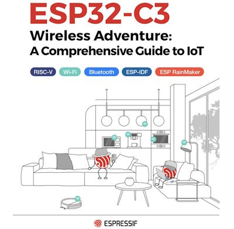
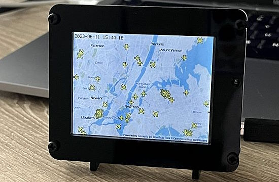
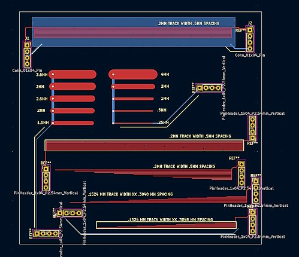
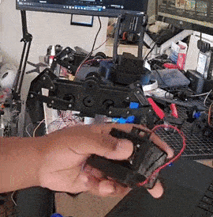
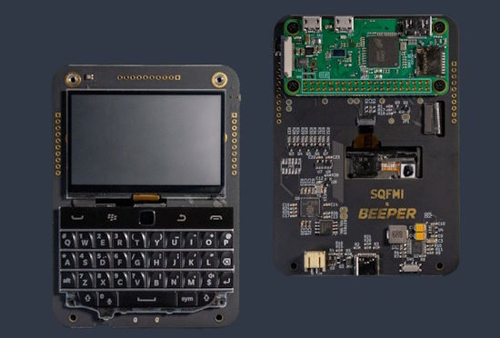
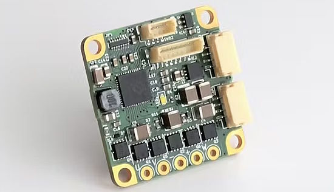
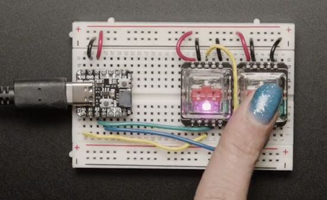
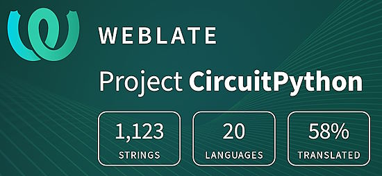

- [ ] Kattni updates
- [ ] change date
- [ ] update title
- [ ] Feature story
- [ ] Update  for images
- [ ] Update ICYDNCI
- [ ] All images 550w max only
- [ ] Link "View this email in your browser."

News Sources

- Twitter: [CircuitPython](https://twitter.com/search?q=circuitpython&src=typed_query&f=live), [MicroPython](https://twitter.com/search?q=micropython&src=typed_query&f=live) and [Python](https://twitter.com/search?q=python&src=typed_query)
- [python.org](https://www.python.org/)
- [Python Insider - dev team blog](https://pythoninsider.blogspot.com/)
- [MicroPython Meetup Blog](https://melbournemicropythonmeetup.github.io/)
- [hackaday.io newest projects MicroPython](https://hackaday.io/projects?tag=micropython&sort=date) and [CircuitPython](https://hackaday.io/projects?tag=circuitpython&sort=date)
- [hackaday CircuitPython](https://hackaday.com/blog/?s=circuitpython) and [MicroPython](https://hackaday.com/blog/?s=micropython)
- [hackster.io CircuitPython](https://www.hackster.io/search?q=circuitpython&i=projects&sort_by=most_recent) and [MicroPython](https://www.hackster.io/search?q=micropython&i=projects&sort_by=most_recent)
- [https://opensource.com/tags/python](https://opensource.com/tags/python)
- [Mastodon CircuitPython](https://octodon.social/tags/CircuitPython)

Information Links

- [Last weeks Stats & Subscribers](https://us10.admin.mailchimp.com/campaigns/show?id=569021) - Mailchimp (login needed)
- [Last Week's Newsletter](https://www.adafruitdaily.com/category/circuitpython/) - adafruitdaily.com
- New Boards: [Microcontrollers](https://circuitpython.org/downloads?sort-by=date-desc) and [Blinka](https://circuitpython.org/blinka?sort-by=date-desc). compare with [last week](https://www.adafruitdaily.com/category/circuitpython/)
- [Team Updates](https://3.basecamp.com/3732686/buckets/4356693/questions/1994563901) - Basecamp, internal data
- [Weblate latest graphic](https://hosted.weblate.org/widgets/circuitpython/#open) - crop and resize to 550px, name yyddmmweblate.jpg
- Discord Users: Use **/serverinfo** in any channel to get the user count
- For Weblate graphic, go [here](https://hosted.weblate.org/widgets/circuitpython/), click the last one then copy the full size, cut down via photo editor and resize to 550px

Tools

- [Twitter Video to MP4](https://twittervideodownloader.com/)
- Mastodon Videos: Just save to mp4 directly
- [MP4 to animated GIF](https://ezgif.com/video-to-gif) - NOTE: All animated GIFs must be < 1MB, use small size and optimize feature

View this email in your browser. **Warning: Flashing Imagery**

Welcome to the latest Python on Microcontrollers newsletter!  - *Ed.*

We're on [Discord](https://discord.gg/HYqvREz), [Twitter](https://twitter.com/search?q=circuitpython&src=typed_query&f=live), and for past newsletters - [view them all here](https://www.adafruitdaily.com/category/circuitpython/). If you're reading this on the web, [subscribe here](https://www.adafruitdaily.com/). Here's the news this week:

## Bluetooth Arrives for the Raspberry Pi Pico W

A year after the Raspberry Pi Pico W was launched with its Infineon CYW43439 wireless chip, Raspberry Pi has software to enable Bluetooth for their C SDK (Version 1.5.1) and in MicroPython. CircuitPython support will follow in time - [Raspberry Pi](https://www.raspberrypi.com/news/new-functionality-bluetooth-for-pico-w/) and [hackster.io](https://twitter.com/Hacksterio/status/1668954939349950466).

> "Specifically, we support Bluetooth Classic — with the temporary exception of ACL/SCO — along with both the BLE Central and Peripheral roles. Things are also configurable so you can enable Bluetooth Classic and BLE either individually, or have both of them available at the same time."

## Feature

text - [site](url).

## Testing the Performance of SPI-Based LCD Displays and displayio in CircuitPython

Josh gets a WaveShare round LCD and measures the response time of drawing the design above with CircuitPython and displayio - [Josh On Design](https://joshondesign.com/2023/06/12/display_io_perf).

## The EuroPython Schedule Has Been Finalized

EuroPython 2023 will be July 17-23, 2023, in Prague, Czech Republic and Remote. The [list of sessions](https://ep2023.europython.eu/sessions) with the selected talk, tutorials and posters are out now - [EuroPython Newsletter](https://blog.europython.eu/europython-may-2023-newsletter/) and [EuroPython 2023](https://ep2023.europython.eu/).

## Espressif Issues Free Book on ESP32-C3

Espressif has released a new book on their ESP32-C3 microcontroller. This free book is 400 pages - [Espressif](https://www.espressif.com/sites/default/files/documentation/ESP32-C3%20Wireless%20Adventure.pdf) (PDF) via [Twitter](https://twitter.com/EspressifSystem/status/1668660874100473861).

## This Week's Python Streams

Python on Hardware is all about building a cooperative ecosphere which allows contributions to be valued and to grow knowledge. Below are the streams within the last week focusing on the community.

### CircuitPython Deep Dive Stream

[This week](link), Tim streamed work on {subject}.

You can see the latest video and past videos on the Adafruit YouTube channel under the Deep Dive playlist - [YouTube](https://www.youtube.com/playlist?list=PLjF7R1fz_OOXBHlu9msoXq2jQN4JpCk8A).

### CircuitPython Parsec

John Park’s CircuitPython Parsec this week is on {subject} - [Adafruit Blog](link) and [YouTube](link).

Catch all the episodes in the [YouTube playlist](https://www.youtube.com/playlist?list=PLjF7R1fz_OOWFqZfqW9jlvQSIUmwn9lWr).

### The CircuitPython Show

The CircuitPython Show is an independent podcast hosted by Paul Cutler, focusing on the people doing awesome things with CircuitPython. Each episode features Paul in conversation with a guest for a short interview – [CircuitPythonShow](https://circuitpythonshow.com/) and [Twitter](https://twitter.com/circuitpyshow).

The latest episode was released (date) and features (guest).  They and Paul talk {subject} – [Show List](https://circuitpythonshow.com/episodes/all).

## Project of the Week: Track flights in Real-Time on a PyPortal

The Flight Tracker collects and visualizes real-time flight data on an Adafruit PyPortal display, enabling users to track and monitor the live positions of aircraft through a dynamically updating map, controlled via CircuitPython.

To begin, a custom map image is downloaded to the PyPortal, centered on a location coordinate defined by the user. This image serves as the background for the map display. Then, at regular intervals of thirty seconds, the Flight Tracker sends a request to the OpenSky Network API, retrieving live aircraft data that falls within the boundaries of the map - [Adafruit Blog](https://blog.adafruit.com/2023/06/14/track-flights-in-real-time-on-a-pyportal-circuitpython-pyportal/), [Reddit](https://www.reddit.com/r/adafruit/comments/148ey6x/track_flights_in_realtime_on_a_pyportal_tutorial/), [Tutorial](https://www.hackster.io/rhammell/pyportal-flight-tracker-0be6b0) and [GitHub](https://github.com/rhammell/pyportal-flight-tracker).

## News from around the web!

A great summary on USB and wireless capabilities of MicroPython and CircuitPython at the moment - [Twitter](https://twitter.com/matt_trentini/status/1669509120721035264) and [GitHub](https://github.com/micropython/micropython-lib/pull/558).

Testing PCB traces for analog capacitive touch response with Raspberry Pi Pico and CircuitPython - [Twitter](https://twitter.com/JeremySCook/status/1668301493735129088).

> Deciding on how to control your robots body can be a hard decision. For this robot, I went with an Adafruit Feather combination for the motors and transmiter/receiver - [Twitter](https://twitter.com/Odd_Jayy/status/1668812463180255232).

Jeff Geerling gives a video tour of the new [BeepBerry](https://beepberry.sqfmi.com/) LCD+Keyboard in a BlackBerry form factor powered by a Raspberry Pi Zero form factor processor  - [Twitter](https://twitter.com/geerlingguy/status/1668981421359132673).

Raspberry Pi in the natural world: see where Raspberry Pi devices have been deployed in the world to monitor nature - [Raspberry Pi](https://www.raspberrypi.com/news/raspberry-pi-in-the-natural-world/) and [YouTube](https://youtu.be/V3HbygM0iq4).

text - [site](url).

text - [site](url).

text - [site](url).

text - [site](url).

text - [site](url).

text - [site](url).

text - [site](url).

text - [site](url).

text - [site](url).

text - [site](url).

text - [site](url).

text - [site](url).

PyDev of the Week: NAME on [Mouse vs Python]()

CircuitPython Weekly Meeting for DATE ([notes]()) [on YouTube]()

#ICYDNCI What was the most popular, most clicked link, in [last week's newsletter](https://www.adafruitdaily.com/2023/06/13/python-on-microcontrollers-newsletter-circuitpython-8-2-0-beta-1-focus-on-risc-v-and-more-circuitpython-python-micropython-thepsf-raspberry_pi/)? [A Major Tectonic Shift away from Arm to RISC-V may be in the works for Qualcomm, Samsung, Google, Nvidia and Apple](https://www.patentlyapple.com/2023/06/a-major-tectonic-shift-away-from-arm-to-risc-v-may-be-in-the-works-for-qualcomm-samsung-google-nvidia-and-apple.html).

## New

The new Tinymovr M5 is a powerful brushless motor controller with Python support - [hackster.io](https://www.hackster.io/news/the-new-tinymovr-m5-is-a-cute-yet-powerful-brushless-motor-controller-with-python-arduino-support-049180f31da9).

Milk-V unveils its third RISC-V board in a month: the $9 dual-core Linux-capable Milk-V Duo - [hackster.io](https://www.hackster.io/news/milk-v-unveils-its-third-risc-v-board-in-a-month-the-9-dual-core-linux-capable-milk-v-duo-3fb5d9f978d1).

## New Boards Supported by CircuitPython

The number of supported microcontrollers and Single Board Computers (SBC) grows every week. This section outlines which boards have been included in CircuitPython or added to [CircuitPython.org](https://circuitpython.org/).

This week, there were (#/no) new boards added!

- [Board name](url)
- [Board name](url)
- [Board name](url)

*Note: For non-Adafruit boards, please use the support forums of the board manufacturer for assistance, as Adafruit does not have the hardware to assist in troubleshooting.*

Looking to add a new board to CircuitPython? It's highly encouraged! Adafruit has four guides to help you do so:

- [How to Add a New Board to CircuitPython](https://learn.adafruit.com/how-to-add-a-new-board-to-circuitpython/overview)
- [How to add a New Board to the circuitpython.org website](https://learn.adafruit.com/how-to-add-a-new-board-to-the-circuitpython-org-website)
- [Adding a Single Board Computer to PlatformDetect for Blinka](https://learn.adafruit.com/adding-a-single-board-computer-to-platformdetect-for-blinka)
- [Adding a Single Board Computer to Blinka](https://learn.adafruit.com/adding-a-single-board-computer-to-blinka)

## New Learn Guides!

[title](url) from [name](url)

[title](url) from [name](url)

[title](url) from [name](url)

## Updated Learn Guides!

[title](url) from [name](url)

## CircuitPython Libraries!

CircuitPython support for hardware continues to grow. We are adding support for new sensors and breakouts all the time, as well as improving on the drivers we already have. As we add more libraries and update current ones, you can keep up with all the changes right here!

For the latest libraries, download the [Adafruit CircuitPython Library Bundle](https://circuitpython.org/libraries). For the latest community contributed libraries, download the [CircuitPython Community Bundle](https://github.com/adafruit/CircuitPython_Community_Bundle/releases).

If you'd like to contribute, CircuitPython libraries are a great place to start. Have an idea for a new driver? File an issue on [CircuitPython](https://github.com/adafruit/circuitpython/issues)! Have you written a library you'd like to make available? Submit it to the [CircuitPython Community Bundle](https://github.com/adafruit/CircuitPython_Community_Bundle). Interested in helping with current libraries? Check out the [CircuitPython.org Contributing page](https://circuitpython.org/contributing). We've included open pull requests and issues from the libraries, and details about repo-level issues that need to be addressed. We have a guide on [contributing to CircuitPython with Git and GitHub](https://learn.adafruit.com/contribute-to-circuitpython-with-git-and-github) if you need help getting started. You can also find us in the #circuitpython channels on the [Adafruit Discord](https://adafru.it/discord).

You can check out this [list of all the Adafruit CircuitPython libraries and drivers available](https://github.com/adafruit/Adafruit_CircuitPython_Bundle/blob/master/circuitpython_library_list.md). 

The current number of CircuitPython libraries is **###**!

**New Libraries!**

Here's this week's new CircuitPython libraries:

* [library](url)

**Updated Libraries!**

Here's this week's updated CircuitPython libraries:

* [library](url)

**Library Statistics**

## What’s the CircuitPython team up to this week?

What is the team up to this week? Let’s check in!

**Dan**

I've started merging MicroPython v1.19.1 into CircuitPython. I'm examining several hundred changed, added, or deleted files. So far there are no surprises.

**Kattni**

This week I published the [NeoKey Breakouts guide](https://learn.adafruit.com/neokey-breakout) and the [TRRS jack breakout guide](https://learn.adafruit.com/trrs-jack-breakout). The NeoKey guide has everything you need to use both the MX and CHOC NeoKey Breakouts, including demos. The TRRS jack breakout guide gives you details about the board.

Next up, I'm working on the guide for the I2S Amplifier BFF. This guide will have everything you need to know about the BFF. It will also have multiple demos in CircuitPython and Arduino to get you started with I2S audio. Keep an eye out for that!

**Melissa**

This past week, I've been testing out all of the Matrix-related guides to ensure that they are working with upcoming hardware. Some of the testing failed and I'm going through those guides and fixing the code to get it working.

**Tim**

This week I've continued to dig into the core hidden tilegird issue and have learned more about the internal variables inside of TileGrid implementation. I have a proposed change to try to fix the reported issue that I will submit the PR for this week. 

I've also picked up the effort to effort to refactor the ESP32SPI socket to have the same API as CPYthon and builtin wifi sockets. Danh originally worked on this, but there was an incompatibility found when using the refactored version to download large files. I found the root cause of the incompatibility and submitted a PR for a fix in the requests library and I'll be carrying out further testing based on feedback from discussion during the weekly meeting.

**Jeff**

My main activity in the last week was not CircuitPython: I published a new guide showing how to create a full-fledged CP/M retrocomputer using a couple of Adafruit Feather boards. You can [check it out on the Adafruit Learning System](https://learn.adafruit.com/rp2040-runcpm-emulator-with-usb-keyboard-hdmi-screen) and [Hackster.io](https://www.hackster.io/news/jeff-epler-turns-two-adafruit-feather-rp2040-boards-into-a-fully-functional-cp-m-microcomputer-ee2a95b123dc).

**Scott**

This week I'm traveling. So, I'm not getting many coding projects done. I am having lots of good CircuitPython discussions and have gotten a swirly mounting board. It looks like it turned out ok. I'm still caught up on email, Discord and the forums too.

**Liz**

This week I did a few guide updates. I updated the Pico W HTTP Server code to work with the new http server library refactor. I also did some updates on the ESP32-S3 board guides to include text in the Arduino pages for pressing the reset button after uploading code to the board. Otherwise I've been getting the RP2040 Prop-Maker Feather guide started and I've been documenting a new project that involves adding a QT Py ESP32-S2 to an Ikea air quality monitor.

## Upcoming events!

The next MicroPython Meetup in Melbourne will be on June 28th – [Meetup](https://www.meetup.com/MicroPython-Meetup/). From the May 24th meeting - [Notes](https://docs.google.com/presentation/d/e/2PACX-1vQ3rvNGR3NyBkSc6t1nXMoGvNuf9Btq10ZQR-4DagW5q4cbPtGMZXOoRRRo2wWOi2u7xH-Bf_HTBjb2/pub?slide=id.p).

EuroPython 2023 will be July 17-23, 2023, in Prague, Czech Republic and Remote - [EuroPython 2023](https://ep2023.europython.eu/).

PyCon UK will be returning to Cardiff City Hall from Friday 22nd September to Monday 25th September 2023 - [PyCon UK](https://2023.pyconuk.org/).

Hackaday has announced that the Hackaday Supercon is on for 2023, and will be taking place November 3 – 5 in Pasadena, California, USA.They’d like to hear your proposals for talks and workshops! The [Call for Speakers](https://docs.google.com/forms/d/e/1FAIpQLSfYDwIzWTHZ0_7d8GUznm3Z9w3y8aDcV1MVGSUyY1nTcdJ9Jw/viewform?usp=sf_link) and [Call for Workshops](https://docs.google.com/forms/d/e/1FAIpQLSeJIm0fWcrJIN8ge1K6Mvt2tfoFYOqre3isod5vKRGr-iyvJg/viewform?usp=sf_link) forms are online now, and you have until July 18th to sign up - [Adafruit Blog](https://blog.adafruit.com/2023/05/10/hackaday-supercon-2023-is-on-supercon-hackaday/) and [Hackaday](https://hackaday.com/2023/05/10/supercon-2023-is-on-we-want-you/).

**Send Your Events In**

If you know of virtual events or upcoming events, please let us know via email to cpnews(at)adafruit(dot)com.

## Latest releases

CircuitPython's stable release is [#.#.#](https://github.com/adafruit/circuitpython/releases/latest) and its unstable release is [#.#.#-##.#](https://github.com/adafruit/circuitpython/releases). New to CircuitPython? Start with our [Welcome to CircuitPython Guide](https://learn.adafruit.com/welcome-to-circuitpython).

[2023####](https://github.com/adafruit/Adafruit_CircuitPython_Bundle/releases/latest) is the latest CircuitPython library bundle.

[v#.#.#](https://micropython.org/download) is the latest MicroPython release. Documentation for it is [here](http://docs.micropython.org/en/latest/pyboard/).

[#.#.#](https://www.python.org/downloads/) is the latest Python release. The latest pre-release version is [#.#.#](https://www.python.org/download/pre-releases/).

[#,### Stars](https://github.com/adafruit/circuitpython/stargazers) Like CircuitPython? [Star it on GitHub!](https://github.com/adafruit/circuitpython)

## Call for help -- Translating CircuitPython is now easier than ever!

One important feature of CircuitPython is translated control and error messages. With the help of fellow open source project [Weblate](https://weblate.org/), we're making it even easier to add or improve translations. 

Sign in with an existing account such as GitHub, Google or Facebook and start contributing through a simple web interface. No forks or pull requests needed! As always, if you run into trouble join us on [Discord](https://adafru.it/discord), we're here to help.

## NUMBER thanks!

The Adafruit Discord community, where we do all our CircuitPython development in the open, reached over NUMBER humans - thank you!  Adafruit believes Discord offers a unique way for Python on hardware folks to connect. Join today at [https://adafru.it/discord](https://adafru.it/discord).

## ICYMI - In case you missed it

Python on hardware is the Adafruit Python video-newsletter-podcast! The news comes from the Python community, Discord, Adafruit communities and more and is broadcast on ASK an ENGINEER Wednesdays. The complete Python on Hardware weekly videocast [playlist is here](https://www.youtube.com/playlist?list=PLjF7R1fz_OOXRMjM7Sm0J2Xt6H81TdDev). The video podcast is on [iTunes](https://itunes.apple.com/us/podcast/python-on-hardware/id1451685192?mt=2), [YouTube](http://adafru.it/pohepisodes), [IGTV (Instagram TV](https://www.instagram.com/adafruit/channel/)), and [XML](https://itunes.apple.com/us/podcast/python-on-hardware/id1451685192?mt=2).

[The weekly community chat on Adafruit Discord server CircuitPython channel - Audio / Podcast edition](https://itunes.apple.com/us/podcast/circuitpython-weekly-meeting/id1451685016) - Audio from the Discord chat space for CircuitPython, meetings are usually Mondays at 2pm ET, this is the audio version on [iTunes](https://itunes.apple.com/us/podcast/circuitpython-weekly-meeting/id1451685016), Pocket Casts, [Spotify](https://adafru.it/spotify), and [XML feed](https://adafruit-podcasts.s3.amazonaws.com/circuitpython_weekly_meeting/audio-podcast.xml).

## Contribute!

The CircuitPython Weekly Newsletter is a CircuitPython community-run newsletter emailed every Tuesday. The complete [archives are here](https://www.adafruitdaily.com/category/circuitpython/). It highlights the latest CircuitPython related news from around the web including Python and MicroPython developments. To contribute, edit next week's draft [on GitHub](https://github.com/adafruit/circuitpython-weekly-newsletter/tree/gh-pages/_drafts) and [submit a pull request](https://help.github.com/articles/editing-files-in-your-repository/) with the changes. You may also tag your information on Twitter with #CircuitPython. 

Join the Adafruit [Discord](https://adafru.it/discord) or [post to the forum](https://forums.adafruit.com/viewforum.php?f=60) if you have questions.
