- [X] Kattni updates
- [ ] change date
- [ ] update title
- [ ] Feature story
- [ ] Update  for images
- [ ] Update ICYDNCI
- [ ] All images 550w max only
- [ ] Link "View this email in your browser."

News Sources

- Twitter: [CircuitPython](https://twitter.com/search?q=circuitpython&src=typed_query&f=live), [MicroPython](https://twitter.com/search?q=micropython&src=typed_query&f=live) and [Python](https://twitter.com/search?q=python&src=typed_query)
- Mastodon [CircuitPython](https://octodon.social/tags/CircuitPython) and [MicroPython](https://octodon.social/tags/MicroPython)
- [python.org](https://www.python.org/)
- [Python Insider - dev team blog](https://pythoninsider.blogspot.com/)
- [MicroPython Meetup Blog](https://melbournemicropythonmeetup.github.io/)
- [hackaday.io newest projects MicroPython](https://hackaday.io/projects?tag=micropython&sort=date) and [CircuitPython](https://hackaday.io/projects?tag=circuitpython&sort=date)
- [hackaday CircuitPython](https://hackaday.com/blog/?s=circuitpython) and [MicroPython](https://hackaday.com/blog/?s=micropython)
- [hackster.io CircuitPython](https://www.hackster.io/search?q=circuitpython&i=projects&sort_by=most_recent) and [MicroPython](https://www.hackster.io/search?q=micropython&i=projects&sort_by=most_recent)
- [https://opensource.com/tags/python](https://opensource.com/tags/python)

Information Links

- [Last weeks Stats & Subscribers](https://us10.admin.mailchimp.com/campaigns/show?id=569021) - Mailchimp (login needed)
- [Last Week's Newsletter](https://www.adafruitdaily.com/category/circuitpython/) - adafruitdaily.com
- New CircuitPython Boards: [Microcontrollers](https://circuitpython.org/downloads?sort-by=date-desc) and [Blinka](https://circuitpython.org/blinka?sort-by=date-desc). Compare with [last week](https://www.adafruitdaily.com/category/circuitpython/)
- [Team Updates](https://3.basecamp.com/3732686/buckets/4356693/questions/1994563901) - Basecamp, internal data
- [Weblate latest graphic](https://hosted.weblate.org/widgets/circuitpython/#open) - crop and resize to 550px, name yyddmmweblate.jpg
- Discord Users: Use **/serverinfo** in any channel to get the user count
- For Weblate graphic, go [here](https://hosted.weblate.org/widgets/circuitpython/), click the last one then copy the full size, cut down via photo editor and resize to 550px
- Get Deep Dive info from Adafruit YouTube [Live](https://studio.youtube.com/channel/UCpOlOeQjj7EsVnDh3zuCgsA/videos/live?filter=%5B%5D&sort=%7B%22columnType%22%3A%22date%22%2C%22sortOrder%22%3A%22DESCENDING%22%7D) and CircuitPython Parsec from John Park posting on the [Adafruit Blog](https://blog.adafruit.com/?s=parsec)

View this email in your browser. **Warning: Flashing Imagery**

Welcome to the latest Python on Microcontrollers newsletter!  - *Ed.*

We're on [Discord](https://discord.gg/HYqvREz), [Twitter](https://twitter.com/search?q=circuitpython&src=typed_query&f=live), and for past newsletters - [view them all here](https://www.adafruitdaily.com/category/circuitpython/). If you're reading this on the web, [subscribe here](https://www.adafruitdaily.com/). Here's the news this week:

## Pythonistas on Podcasts This Week

### Kattni Rembor Interviewed on Teaching Python

The Teaching Python podcast with Kelly and Sean devotes their latest broadcast to CircuitPython - [Teaching Python](https://www.teachingpython.fm/110).

> "We're excited to have Kattni Rembor from Adafruit as our special guest, who has contributed extensively to the CircuitPython platform, from beginner guides to advanced projects. We delve into CircuitPython, a version of Python designed for microcontrollers. Created for beginners and educational purposes, it provides a unique approach to learning Python. Kattni enlightens us on the vast applications of CircuitPython, ranging from environmental sensing to assistive technologies for people with disabilities."

### Tod Kurt on The Real Python Podcast

[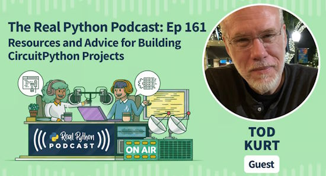](https://realpython.com/podcasts/rpp/161/)

Christopher Bailey at The Real Python Podcast interviews CircuitPythonista Tod Kurt. Tod has been working with embedded electronics for a long time and has been an active member of the Arduino community. He recently started to build projects using CircuitPython, and it has become his preferred prototype method - [Real Python](https://realpython.com/podcasts/rpp/161/).

## Adafruit Commercial Toy Hacking

[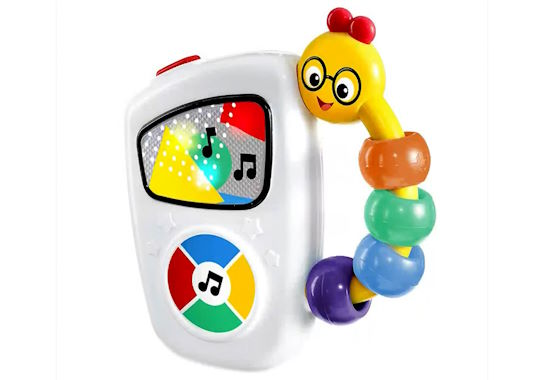](https://blog.adafruit.com/2023/06/22/adafruit-top-secret-june-21-2023-adafruit-adafruittopsecret-adafruit/)

[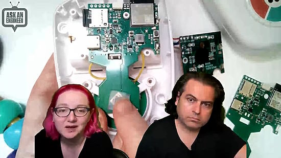](https://blog.adafruit.com/2023/06/22/adafruit-top-secret-june-21-2023-adafruit-adafruittopsecret-adafruit/)

[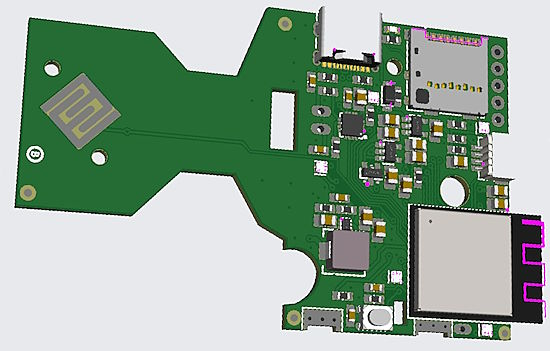](https://blog.adafruit.com/2023/06/22/adafruit-top-secret-june-21-2023-adafruit-adafruittopsecret-adafruit/)

Adafruit's Ladyada has been hacking the Baby Einstein toy for "Babyada". She now has a custom ESP32-S2 board with an SD card to replace the original board. With CircuitPython, it now plays any song selected on the SD card - [Adafruit Top Secret](https://blog.adafruit.com/2023/06/22/adafruit-top-secret-june-21-2023-adafruit-adafruittopsecret-adafruit/).

## PiFinder Raspberry Pi Camera

The PiFinder is an all-in-one device that mounts on any telescope and uses a Raspberry Pi High Quality Camera to take photos of the night sky. The PiFinder figures out where a telescope is pointing to help observers find and view astronomical objects. A Raspberry Pi 4 takes care of image processing and logging, with the help of onboard GPS. See [GitHub](https://github.com/brickbots/PiFinder/tree/main) for Python code and 3D Print files - [Raspberry Pi](https://www.raspberrypi.com/news/superior-stargazing-with-the-pifinder/) via [Twitter](https://twitter.com/Raspberry_Pi/status/1672210384244097025).

## Last Chance: PSF Board of Directors Vote

The 2023 election for the Python Software Foundation Board of Directors is open. Voting closes Friday June 30, 2023 at 11:59 UTC so vote soonest. You must already be a confirmed voting member of the PSF to vote - [Python.org](https://www.python.org/nominations/elections/2023-python-software-foundation-board/nominees/).

## A Raspberry Pi RP2040-Based Tamagochi Virtual Pet

[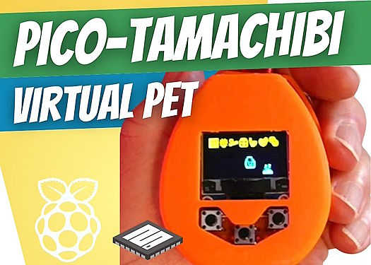](https://www.kevsrobots.com/blog/picotamachibi.html)

Picotamachibi is the name for a fun MicroPython based virtual pet. It uses a Raspberry Pi Pico microcontroller board and a SSD1306 128x64 OLED display. The full source code for Picotamachibi is on [GitHub](https://github.com/kevinmcaleer/picotamachibi) - [Kev's Robots](https://www.kevsrobots.com/blog/picotamachibi.html).

## Make: Reviews the Adafruit Feather RP2040 with DVI

[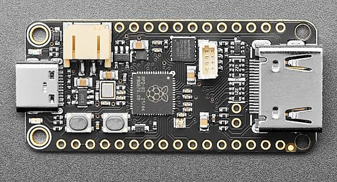](https://makezine.com/products/boards/adafruit-feather-rp2040-with-dvi/)

The Make: Boards Guide reviews the Adafruit Feather RP2040 with DVI is a microcontroller board capable of DVI digital video output on an HDMI port. Since the RP2040's release, hackers have been pushing the PIO peripherals to their limits, including producing analog VGA video output. Taking it a step further, the PicoDVI project proved it was possible to generate digital video directly from the RP2040 without using an additional chip. Now Adafruit has packaged all the hardware needed to get DVI output from an RP2040 in a Feather-sized board and wrapped the PicoDVI project code for use in the Arduino IDE and in CircuitPython - [Makezine](https://makezine.com/products/boards/adafruit-feather-rp2040-with-dvi/) and [Adafruit](https://www.adafruit.com/product/5710).

## This Week's Python Streams

Python on Hardware is all about building a cooperative ecosphere which allows contributions to be valued and to grow knowledge. Below are the streams within the last week focusing on the community.

### CircuitPython Deep Dive Stream

[This week](https://youtube.com/live/ZxYlMu4JLKY), Tim streamed work on Feather DVI with displayio and pride flags multiple ways.

You can see the latest video and past videos on the Adafruit YouTube channel under the Deep Dive playlist - [YouTube](https://www.youtube.com/playlist?list=PLjF7R1fz_OOXBHlu9msoXq2jQN4JpCk8A).

### CircuitPython Parsec

John Park’s CircuitPython Parsec this week is on Function Lists - [Adafruit Blog](https://blog.adafruit.com/2023/06/24/john-parks-circuitpython-parsec-function-lists-adafruit-circuitpython/) and [YouTube](https://youtu.be/84yBMiYh4v0).

Catch all the episodes in the [YouTube playlist](https://www.youtube.com/playlist?list=PLjF7R1fz_OOWFqZfqW9jlvQSIUmwn9lWr).

## Project of the Week: The PICOPAD

[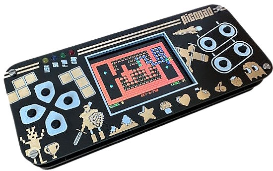](https://pajenicko.cz/picopad-open-source-herni-konzole)

Picopad is an open game console that offers a unique opportunity for young tech enthusiasts. It comes as a kit, allowing one to learn the principles of soldering and electronics while building their own games console. In addition, Picopad supports C and MicroPython programming. It's based on the Raspberry Pi RP2040 microcontroller. It has a 2 inch TFT display and a microSD slot.

All games on Picopad are open source on [GitHub](https://pajenicko.cz/picopad-open-source-herni-konzole). A multi-program with 16 games is pre-installed on the Picopad, which provides a wide range of entertainment including Ants, Train, Flappy, PacMan, Sokoban, Atoms, Eggs, 15, GhostRace, Chess, Life, Maze, Raptor, Tetris, TV Tennis and Vegaslot. 

A novel thing for this is a UF2 SD card loader: from a menu, one can select to reflash/run games/programs in UF2 format, like a program loader for UF2 based software - [pajenicko.cz](https://pajenicko.cz/picopad-open-source-herni-konzole) via [Twitter](https://twitter.com/bobricius/status/1671966652701745174).

## News from around the web!

[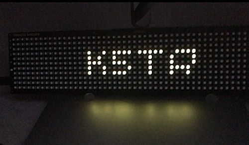](http://www.whiskeytangohotel.com/2023/05/hamalertorg-integration-with-pimoroni.html)

Using a Pimoroni RP2040-based LED matrix display and MicroPython to display Morse Code messages via HamAlert.com - [WhiskeyTangoHotel.com](http://www.whiskeytangohotel.com/2023/05/hamalertorg-integration-with-pimoroni.html) and [YouTube](https://www.youtube.com/watch?v=1ZCNzaiF4ZA).

[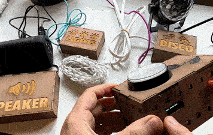](https://www.instagram.com/reel/Ct1vuVnr0j6/?igshid=MzRlODBiNWFlZA%3D%3D)

> The full setup for my daughter’s music button. There is a Raspberry Pi #pico W in each box, controlling various components. The project uses MQTT, free Adafruit IO and CircuitPython - [Instagram](https://www.instagram.com/reel/Ct1vuVnr0j6/?igshid=MzRlODBiNWFlZA%3D%3D).

[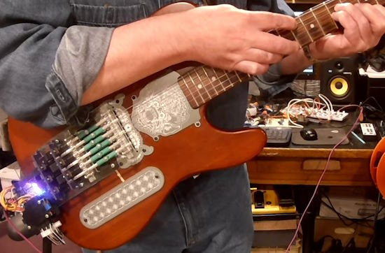](https://makezine.com/article/craft/music/how-i-built-a-guitar-picking-robot/)

Two weeks ago, we had The Guitar Picking Robot in the newsletter. In a new article by Make:, the project gets described in full. It uses a Pimoroni Servo 2040 board which combines a RP2040 microcontroller and servo controllers. CircuitPython is used to program the board - [Make:](https://makezine.com/article/craft/music/how-i-built-a-guitar-picking-robot/).

[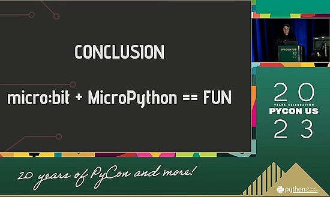](https://us.pycon.org/2023/schedule/presentation/142/)

PyCon  2023 talk by Juliana Karoline de Sousa: Create interactive games using MicroPython and electronics - [PyCon US](https://us.pycon.org/2023/schedule/presentation/142/) and [Video](https://www.youtube.com/watch?v=teALLngESw0), via [Twitter](https://twitter.com/matt_trentini/status/1671331741087469568).

See more PyCon US 2023 videos - [YouTube](https://www.youtube.com/@PyConUS/videos)

[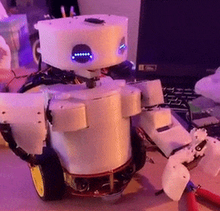](https://twitter.com/scottmonaghan/status/1672408092116496387)

Fixes and upgrades for the ALICE robot to get her ready OpenSauce. The Robot and controller run on Feather M4 Expresses and communicate via RFM95 LoRa radios. The controller also interfaces with an XBox Kinect to capture the user’s poses - [Twitter](https://twitter.com/scottmonaghan/status/1672408092116496387).

[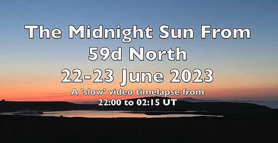](https://www.youtube.com/watch?v=bN3y1Wtvj78)

> I made a 'slow' video of the 'midnight Sun' as it skirts from NW to NE last night (20230622-23) from Rousay, Orkney, using a 
Raspberry_Pi HD camera and Python time lapse code - [YouTube](https://www.youtube.com/watch?v=bN3y1Wtvj78) via [Twitter](https://twitter.com/callump/status/1672290500945035273).

GitHub user whimmsee has coded a CircuitPython library for the PMW3360 motion sensor - [GitHub](https://github.com/whimsee/CircuitPython_PMW3360).

[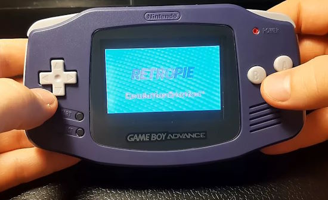](https://www.tomshardware.com/news/raspberry-pi-zero-game-boy-advance)

Raspberry Pi Zero powers Game Boy Advance Retro Pie handheld - [Tom's Hardware](https://www.tomshardware.com/news/raspberry-pi-zero-game-boy-advance).

[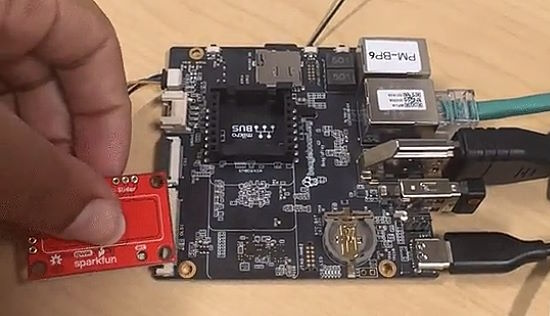](https://www.hackster.io/ashleigh-taylor/beagleplay-qwiic-capactive-touch-slider-095ae0)

BeaglePlay + Qwiic Capactive Touch Slider: use Python on BeaglePlay to use Qwiic Capacitive Touch Slider - [Hackster.io](https://www.hackster.io/ashleigh-taylor/beagleplay-qwiic-capactive-touch-slider-095ae0).

text - [site](url).

[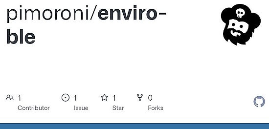](https://github.com/pimoroni/enviro-ble)

There is an early library from Pimoroni for enabling Bluetooth Low Energy (BLE) on their Enviro range of products using a Raspberry Pi Pico W client board - [GitHub](https://github.com/pimoroni/enviro-ble) via [Twitter](https://twitter.com/Gadgetoid/status/1672316406610665501).

text - [site](url).

text - [site](url).

text - [site](url).

[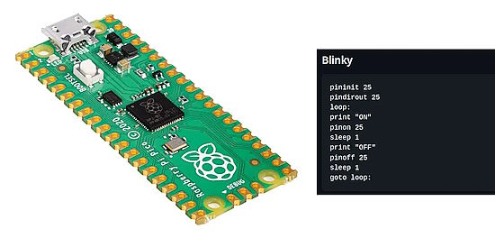](https://www.cnx-software.com/2023/06/23/piccolobasic-basic-interpreter-raspberry-pi-pico-board/)

PiccoloBASIC – A BASIC interpreter for the Raspberry Pi Pico board - [CNX Software](https://www.cnx-software.com/2023/06/23/piccolobasic-basic-interpreter-raspberry-pi-pico-board/), [GitHub](https://github.com/garyexplains/piccoloBASIC) and [YouTube](https://youtu.be/oWyMGDDcykY).

ArduForth is a Forth-like interpreter for the Arduino environment - [GitHub](https://github.com/ukmaker/ArduForth).

cocotb is a coroutine based cosimulation library for writing VHDL and Verilog testbenches in Python - [GitHub](https://github.com/cocotb/cocotb).

PyDev of the Week: NAME on [Mouse vs Python]()

CircuitPython Weekly Meeting for June 20th, 2023 ([notes](https://github.com/adafruit/adafruit-circuitpython-weekly-meeting/blob/main/2023/2023-06-20.md)) [on YouTube](https://youtu.be/YVwsizkG0nM)

CircuitPython Weekly Meeting for DATE ([notes]()) [on YouTube]()

#ICYDNCI What was the most popular, most clicked link, in [last week's newsletter](https://www.adafruitdaily.com/2023/06/20/python-on-microcontrollers-newsletter-micropython-adds-bluetooth-for-the-pico-w-and-much-more-circuitpython-python-micropython-thepsf-raspberry_pi/)? [ESP32-C3 Comprehensive Guide to IoT (free)](https://www.espressif.com/sites/default/files/documentation/ESP32-C3%20Wireless%20Adventure.pdf) (PDF).

## Coming Soon

text - [site](url).

text - [site](url).

## New Boards Supported by CircuitPython

The number of supported microcontrollers and Single Board Computers (SBC) grows every week. This section outlines which boards have been included in CircuitPython or added to [CircuitPython.org](https://circuitpython.org/).

This week, there were no new boards added, but there are some in processing.

*Note: For non-Adafruit boards, please use the support forums of the board manufacturer for assistance, as Adafruit does not have the hardware to assist in troubleshooting.*

Looking to add a new board to CircuitPython? It's highly encouraged! Adafruit has four guides to help you do so:

- [How to Add a New Board to CircuitPython](https://learn.adafruit.com/how-to-add-a-new-board-to-circuitpython/overview)
- [How to add a New Board to the circuitpython.org website](https://learn.adafruit.com/how-to-add-a-new-board-to-the-circuitpython-org-website)
- [Adding a Single Board Computer to PlatformDetect for Blinka](https://learn.adafruit.com/adding-a-single-board-computer-to-platformdetect-for-blinka)
- [Adding a Single Board Computer to Blinka](https://learn.adafruit.com/adding-a-single-board-computer-to-blinka)

## New Learn Guides!

[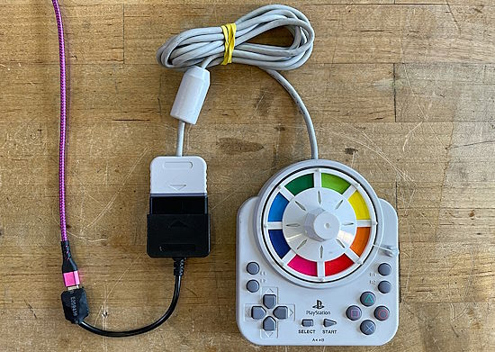](https://learn.adafruit.com/guides/latest)

[PlayStation Spinner Controller](https://learn.adafruit.com/playstation-spinner-controller) from [John Park](https://learn.adafruit.com/u/johnpark)

[ESP32-S2 Reverse TFT Digital Clock Display featuring Blanka-chan!](https://learn.adafruit.com/esp32-s2-tft-digital-clock-display-featuring-blanka-chan) from [Trevor Beaton](https://learn.adafruit.com/u/Seekwill)

[LoRa Signal Bridge with the Feather RP2040 RFM](https://learn.adafruit.com/lora-signal-bridge-with-the-feather-rp2040-rfm) from [Eva Herrada](https://learn.adafruit.com/u/eherrada)

[Adafruit I2S Amplifier BFF](https://learn.adafruit.com/i2s-amplifier-bff) from [Kattni](https://learn.adafruit.com/u/kattni)

[Adafruit RP2040 Prop-Maker Feather](https://learn.adafruit.com/adafruit-rp2040-prop-maker-feather) from [Liz Clark](https://learn.adafruit.com/u/BlitzCityDIY)

[Adafruit NeoDriver - I2C to NeoPixel Driver](https://learn.adafruit.com/adafruit-neodriver-i2c-to-neopixel-driver) from [Liz Clark](https://learn.adafruit.com/u/BlitzCityDIY)

## CircuitPython Libraries!

CircuitPython support for hardware continues to grow. We are adding support for new sensors and breakouts all the time, as well as improving on the drivers we already have. As we add more libraries and update current ones, you can keep up with all the changes right here!

For the latest libraries, download the [Adafruit CircuitPython Library Bundle](https://circuitpython.org/libraries). For the latest community contributed libraries, download the [CircuitPython Community Bundle](https://github.com/adafruit/CircuitPython_Community_Bundle/releases).

If you'd like to contribute, CircuitPython libraries are a great place to start. Have an idea for a new driver? File an issue on [CircuitPython](https://github.com/adafruit/circuitpython/issues)! Have you written a library you'd like to make available? Submit it to the [CircuitPython Community Bundle](https://github.com/adafruit/CircuitPython_Community_Bundle). Interested in helping with current libraries? Check out the [CircuitPython.org Contributing page](https://circuitpython.org/contributing). We've included open pull requests and issues from the libraries, and details about repo-level issues that need to be addressed. We have a guide on [contributing to CircuitPython with Git and GitHub](https://learn.adafruit.com/contribute-to-circuitpython-with-git-and-github) if you need help getting started. You can also find us in the #circuitpython channels on the [Adafruit Discord](https://adafru.it/discord).

You can check out this [list of all the Adafruit CircuitPython libraries and drivers available](https://github.com/adafruit/Adafruit_CircuitPython_Bundle/blob/master/circuitpython_library_list.md). 

The current number of CircuitPython libraries is **443**!

**Updated Libraries!**

Here's this week's updated CircuitPython libraries:

  * [adafruit/Adafruit_CircuitPython_Requests](https://github.com/adafruit/Adafruit_CircuitPython_Requests)

**Library PyPI Weekly Download Stats**

**Total Library Stats**

  * 139856 PyPI downloads over 310 libraries
 
**Top 10 Libraries by PyPI Downloads**

  * Adafruit CircuitPython BusDevice (adafruit-circuitpython-busdevice): 5954
  * Adafruit CircuitPython Requests (adafruit-circuitpython-requests): 5928
  * Adafruit CircuitPython Register (adafruit-circuitpython-register): 1748
  * Adafruit CircuitPython NeoPixel (adafruit-circuitpython-neopixel): 1488
  * Adafruit CircuitPython Motor (adafruit-circuitpython-motor): 1137
  * Adafruit CircuitPython Display Text (adafruit-circuitpython-display-text): 1105
  * Adafruit CircuitPython MiniMQTT (adafruit-circuitpython-minimqtt): 1032
  * Adafruit CircuitPython Wiznet5k (adafruit-circuitpython-wiznet5k): 1011
  * Adafruit CircuitPython BLE (adafruit-circuitpython-ble): 908
  * Adafruit CircuitPython DHT (adafruit-circuitpython-dht): 891

## What’s the CircuitPython team up to this week?

What is the team up to this week? Let’s check in!

**Dan**

I visited Adafruit in NYC last week. This week Scott, Jeff, and I triaged the remaining CircuitPython 8.2.0 issues. I addressed several of them, which were mostly just documentation improvements. Very soon we should be able to make an 8.2.0 release candidate, and if that works out, we'll release 8.2.0 final.

**Kattni**

My [I2S BFF](https://learn.adafruit.com/i2s-amplifier-bff) guide went out this week. It has everything you need to know about your board, and includes examples in both Arduino and CircuitPython.

Next up is the Gamepad QT guide for the new I2C Mini Gamepad breakout. Keep an eye out for that, coming soon!

**Melissa**

This past week, one of the bigger projects I completed was testing a large number of guides and  updating the [RGB Matrix Dreidel Game](https://learn.adafruit.com/rgb-matrix-dreidel-game) Learn Guide that Liz had written so that it could play I2S audio in addition to the original design. This involved updating the 3D design, building a circuit, and updating the software.

**Tim**

This week I've been working on testing the proposed changes to make ESP32SPI socket's API be more similar to it's CPYthon counterpart. MiniMQTT was the main functionality that I've tested with it this week. I also submitted a PR to refactor an older ESP32SPI_WSGI server module over to be in the WSGI library instead of the ESP32SPI Driver library and updated it to work with the newer, more compatible socket API.

**Jeff**

For the Teddy Ruxpin (2017) reverse engineering project, I implemented mouth movements & eye movements. For mouth movements, I use the json output of a program called "rhubarb", which can turn an audio file into mouth positions; it was intended for cartoon animation but has proven useful here. A big thanks to John Park for investigating various pieces of software and concluding this one was the best open source one. My work is public and coded in Python but it's not yet documented well enough for anyone else to use: https://github.com/jepler/snxrom

**Scott**

Last week I was visiting New York City. We had high level discussions around Adafruit and CircuitPython but didn't work much on specific things. This week I revised [the swirly grid](https://www.adafruit.com/product/5774) [generator script](https://gist.github.com/tannewt/0acd1f6af48c43dc7e15243fe0af47ed) and then generated more sizes. Now, I'm working on USB host support including converting the USB reports from a connected keyboard into CircuitPython's serial input. This is the beginning of a "USB host workflow" where we can have an onboard text editor.

**Liz**

This week I published the guide for the new [RP2040 Prop-Maker Feather](https://learn.adafruit.com/adafruit-rp2040-prop-maker-feather). I think this Feather will be really popular with folks since it has so many built-in components. I think the coolest part is the onboard I2S amp with the speaker terminal block output. Usually using I2S audio requires breadboarding or soldering so being able to quickly hook up a speaker and have nice sound quality is really cool.

I've also been updating some ESP32-S2/S3 guides to include information on the MAX17048 battery monitor, which is replacing the now-discontinued LC709203. This involves updating a few pages and redoing the Factory Reset code to check for either the LC709203 or the MAX17048.

## Upcoming events!

The next MicroPython Meetup in Melbourne will be on June 28th – [Meetup](https://www.meetup.com/MicroPython-Meetup/). From the May 24th meeting - [Notes](https://docs.google.com/presentation/d/e/2PACX-1vQ3rvNGR3NyBkSc6t1nXMoGvNuf9Btq10ZQR-4DagW5q4cbPtGMZXOoRRRo2wWOi2u7xH-Bf_HTBjb2/pub?slide=id.p).

EuroPython 2023 will be July 17-23, 2023, in Prague, Czech Republic and Remote - [EuroPython 2023](https://ep2023.europython.eu/).

PyCon UK will be returning to Cardiff City Hall from Friday 22nd September to Monday 25th September 2023 - [PyCon UK](https://2023.pyconuk.org/).

Hackaday has announced that the Hackaday Supercon is on for 2023, and will be taking place November 3 – 5 in Pasadena, California, USA. They’d like to hear your proposals for talks and workshops! The [Call for Speakers](https://docs.google.com/forms/d/e/1FAIpQLSfYDwIzWTHZ0_7d8GUznm3Z9w3y8aDcV1MVGSUyY1nTcdJ9Jw/viewform?usp=sf_link) and [Call for Workshops](https://docs.google.com/forms/d/e/1FAIpQLSeJIm0fWcrJIN8ge1K6Mvt2tfoFYOqre3isod5vKRGr-iyvJg/viewform?usp=sf_link) forms are online now, and you have until July 18th to sign up - [Adafruit Blog](https://blog.adafruit.com/2023/05/10/hackaday-supercon-2023-is-on-supercon-hackaday/) and [Hackaday](https://hackaday.com/2023/05/10/supercon-2023-is-on-we-want-you/).

**Send Your Events In**

If you know of virtual events or upcoming events, please let us know via email to cpnews(at)adafruit(dot)com.

## Latest releases

CircuitPython's stable release is [#.#.#](https://github.com/adafruit/circuitpython/releases/latest) and its unstable release is [#.#.#-##.#](https://github.com/adafruit/circuitpython/releases). New to CircuitPython? Start with our [Welcome to CircuitPython Guide](https://learn.adafruit.com/welcome-to-circuitpython).

[2023####](https://github.com/adafruit/Adafruit_CircuitPython_Bundle/releases/latest) is the latest CircuitPython library bundle.

[v#.#.#](https://micropython.org/download) is the latest MicroPython release. Documentation for it is [here](http://docs.micropython.org/en/latest/pyboard/).

[#.#.#](https://www.python.org/downloads/) is the latest Python release. The latest pre-release version is [#.#.#](https://www.python.org/download/pre-releases/).

[#,### Stars](https://github.com/adafruit/circuitpython/stargazers) Like CircuitPython? [Star it on GitHub!](https://github.com/adafruit/circuitpython)

## Call for help -- Translating CircuitPython is now easier than ever!

[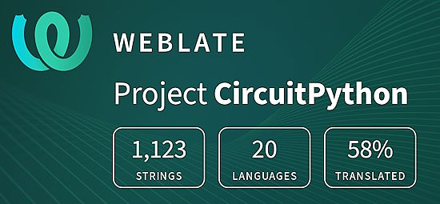](https://hosted.weblate.org/engage/circuitpython/)

One important feature of CircuitPython is translated control and error messages. With the help of fellow open source project [Weblate](https://weblate.org/), we're making it even easier to add or improve translations. 

Sign in with an existing account such as GitHub, Google or Facebook and start contributing through a simple web interface. No forks or pull requests needed! As always, if you run into trouble join us on [Discord](https://adafru.it/discord), we're here to help.

## NUMBER thanks!

The Adafruit Discord community, where we do all our CircuitPython development in the open, reached over NUMBER humans - thank you!  Adafruit believes Discord offers a unique way for Python on hardware folks to connect. Join today at [https://adafru.it/discord](https://adafru.it/discord).

## ICYMI - In case you missed it

Python on hardware is the Adafruit Python video-newsletter-podcast! The news comes from the Python community, Discord, Adafruit communities and more and is broadcast on ASK an ENGINEER Wednesdays. The complete Python on Hardware weekly videocast [playlist is here](https://www.youtube.com/playlist?list=PLjF7R1fz_OOXRMjM7Sm0J2Xt6H81TdDev). The video podcast is on [iTunes](https://itunes.apple.com/us/podcast/python-on-hardware/id1451685192?mt=2), [YouTube](http://adafru.it/pohepisodes), [IGTV (Instagram TV](https://www.instagram.com/adafruit/channel/)), and [XML](https://itunes.apple.com/us/podcast/python-on-hardware/id1451685192?mt=2).

[The weekly community chat on Adafruit Discord server CircuitPython channel - Audio / Podcast edition](https://itunes.apple.com/us/podcast/circuitpython-weekly-meeting/id1451685016) - Audio from the Discord chat space for CircuitPython, meetings are usually Mondays at 2pm ET, this is the audio version on [iTunes](https://itunes.apple.com/us/podcast/circuitpython-weekly-meeting/id1451685016), Pocket Casts, [Spotify](https://adafru.it/spotify), and [XML feed](https://adafruit-podcasts.s3.amazonaws.com/circuitpython_weekly_meeting/audio-podcast.xml).

## Contribute!

The CircuitPython Weekly Newsletter is a CircuitPython community-run newsletter emailed every Tuesday. The complete [archives are here](https://www.adafruitdaily.com/category/circuitpython/). It highlights the latest CircuitPython related news from around the web including Python and MicroPython developments. To contribute, edit next week's draft [on GitHub](https://github.com/adafruit/circuitpython-weekly-newsletter/tree/gh-pages/_drafts) and [submit a pull request](https://help.github.com/articles/editing-files-in-your-repository/) with the changes. You may also tag your information on Twitter with #CircuitPython. 

Join the Adafruit [Discord](https://adafru.it/discord) or [post to the forum](https://forums.adafruit.com/viewforum.php?f=60) if you have questions.
