- [X] Kattni updates
- [ ] change date
- [ ] update title
- [ ] Feature story
- [ ] Update  for images
- [ ] Update ICYDNCI
- [ ] All images 550w max only
- [ ] Link "View this email in your browser."

News Sources

- Twitter: [CircuitPython](https://twitter.com/search?q=circuitpython&src=typed_query&f=live), [MicroPython](https://twitter.com/search?q=micropython&src=typed_query&f=live) and [Python](https://twitter.com/search?q=python&src=typed_query)
- Mastodon [CircuitPython](https://octodon.social/tags/CircuitPython) and [MicroPython](https://octodon.social/tags/MicroPython)
- [python.org](https://www.python.org/)
- [Python Insider - dev team blog](https://pythoninsider.blogspot.com/)
- [MicroPython Meetup Blog](https://melbournemicropythonmeetup.github.io/)
- [hackaday.io newest projects MicroPython](https://hackaday.io/projects?tag=micropython&sort=date) and [CircuitPython](https://hackaday.io/projects?tag=circuitpython&sort=date)
- [hackaday CircuitPython](https://hackaday.com/blog/?s=circuitpython) and [MicroPython](https://hackaday.com/blog/?s=micropython)
- [hackster.io CircuitPython](https://www.hackster.io/search?q=circuitpython&i=projects&sort_by=most_recent) and [MicroPython](https://www.hackster.io/search?q=micropython&i=projects&sort_by=most_recent)
- [https://opensource.com/tags/python](https://opensource.com/tags/python)

Information Links

- [Last weeks Stats & Subscribers](https://us10.admin.mailchimp.com/campaigns/show?id=569021) - Mailchimp (login needed)
- [Last Week's Newsletter](https://www.adafruitdaily.com/category/circuitpython/) - adafruitdaily.com
- New CircuitPython Boards: [Microcontrollers](https://circuitpython.org/downloads?sort-by=date-desc) and [Blinka](https://circuitpython.org/blinka?sort-by=date-desc). Compare with [last week](https://www.adafruitdaily.com/category/circuitpython/)
- [Team Updates](https://3.basecamp.com/3732686/buckets/4356693/questions/1994563901) - Basecamp, internal data
- [Weblate latest graphic](https://hosted.weblate.org/widgets/circuitpython/#open) - crop and resize to 550px, name yyddmmweblate.jpg
- Discord Users: Use **/serverinfo** in any channel to get the user count
- For Weblate graphic, go [here](https://hosted.weblate.org/widgets/circuitpython/), click the last one then copy the full size, cut down via photo editor and resize to 550px
- Get Deep Dive info from Adafruit YouTube [Live](https://studio.youtube.com/channel/UCpOlOeQjj7EsVnDh3zuCgsA/videos/live?filter=%5B%5D&sort=%7B%22columnType%22%3A%22date%22%2C%22sortOrder%22%3A%22DESCENDING%22%7D) and CircuitPython Parsec from John Park posting on the [Adafruit Blog](https://blog.adafruit.com/?s=parsec)

View this email in your browser. **Warning: Flashing Imagery**

Welcome to the latest Python on Microcontrollers newsletter!  - *Ed.*

We're on [Discord](https://discord.gg/HYqvREz), [Twitter](https://twitter.com/search?q=circuitpython&src=typed_query&f=live), and for past newsletters - [view them all here](https://www.adafruitdaily.com/category/circuitpython/). If you're reading this on the web, [subscribe here](https://www.adafruitdaily.com/). Here's the news this week:

## CircuitPython 8.2.0 Release Candidate 1 Released

CircuitPython 8.2.0-rc.1, a release candidate for CircuitPython 8.2.0, is now out. It is stable, and this should be the final candidate before an imminent 8.2.0 release - [Adafruit Blog](https://blog.adafruit.com/2023/06/27/circuitpython-8-2-0-rc-1-released/) and [GitHub release page](https://github.com/adafruit/circuitpython/releases/tag/8.2.0-rc.1).

**Notable changes to 8.2.0 since 8.1.0**

- Continued enhancement of `synthio`.
- RP2040 `alarm.sleep_memory`.

## The Pi Cast Talks Raspberry Pi Pico W Bluetooth in MicroPython with Phil Howard

[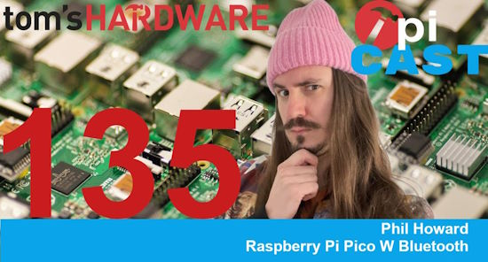](https://www.youtube.com/watch?v=BU3dnNQF2uE)

The Pi Cast Podcast talks with Pimoroni's Phil Howard about Raspberry Pi Pico W Bluetooth and MicroPython in their latest broadcast - [YouTube](https://www.youtube.com/watch?v=BU3dnNQF2uE).

## Linux 6.4 Released This Week

Linux 6.4 released – Main changes, Arm, RISC-V and MIPS architectures - [CNX Software](https://www.cnx-software.com/2023/06/26/linux-6-4-release-main-changes-arm-risc-v-and-mips-architectures/). ALso a [Changelog](https://kernelnewbies.org/Linux_6.4).

## Continuous Capacitive Touch Controller Circuit Boards

[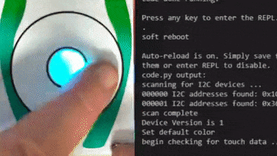](https://twitter.com/bradanlane/status/1674211302074376200)

Bradán Lane is making a set of I2C add-on board (similar to the Adafruit seesaw series). The latest one has a circular and square sensor area with multiple elements, allowing for continuous touch sensing - [Twitter](https://twitter.com/bradanlane/status/1674211302074376200).

> The circle uses 3 interwoven touch sensors to create a continuous value (0..255 or 0..359). The grid uses 12 diamond touch sensors (6 rows & 6 columns) to create a continuous X-Y pair (0..255 0..255). The actual touch controllers are driven by an ATtiny1616 and expose high level I2C client interface.

An Adafruit ESP32-S3 Feather running CircuitPython is used to read the I2C data from the board and provide output via the serial REPL. 

## This Week's Python Streams

Python on Hardware is all about building a cooperative ecosphere which allows contributions to be valued and to grow knowledge. Below are the streams within the last week focusing on the community.

### CircuitPython Deep Dive Stream

[This week](link), Tim streamed work on {subject}.

You can see the latest video and past videos on the Adafruit YouTube channel under the Deep Dive playlist - [YouTube](https://www.youtube.com/playlist?list=PLjF7R1fz_OOXBHlu9msoXq2jQN4JpCk8A).

### CircuitPython Parsec

John Park is off this week - you can still catch all the episodes of CircuitPython Parsec in the [YouTube playlist](https://www.youtube.com/playlist?list=PLjF7R1fz_OOWFqZfqW9jlvQSIUmwn9lWr).

## Project of the Week: Olga The Fortune Teller

[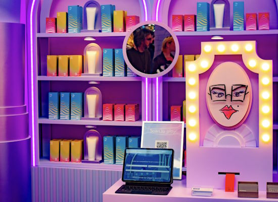](https://www.raspberrypi.com/news/olga-the-fortune-teller-the-magpi-131/)

Olga The Fortune Teller is a new Raspberry Pi project by Rosie Hattersley. It's a shiny new ChatGPT model designed to appeal to the Insta-savvy influencer keen to check out both the latest skincare options and receive reassuring messages about their future fame and follower count  - [Raspberry Pi News](https://www.raspberrypi.com/news/olga-the-fortune-teller-the-magpi-131/).

> ...mobile connectivity was vital, so they chose a (Raspberry Pi) Pico W: “simple, low-cost and small but, at the same time, [it] can run a full wireless stack which is easy to use.” With MicroPython on the Pico W, things work painlessly and the development time is short. It’s used here to communicate with a Zebra thermal printer via an RS232 connection and prompt it to print out a stand visitor’s fortune ticket. ChatGPT is instructed to: ‘Pretend you are a fortune teller and tell the person you are talking to – who is called $NAME – their fortune in a poem of three or four short lines. Make sure their fortune is vague but positive! Include a lucky item (retail related).’

## News from around the web!

[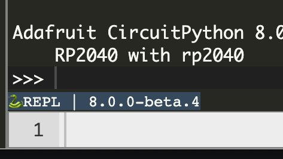](https://octodon.social/@Riverwang@fosstodon.org/110611092705558920)

New upcoming features for the [CircuitPython Online IDE](https://urfdvw.github.io/CircuitPython-online-IDE/) by River Wang include allowing web widgets to interact with CircuitPython variables and enhancing the console output by providing syntax highlighting and visual enhancements - [Mastodon](https://octodon.social/@Riverwang@fosstodon.org/110611092705558920).

[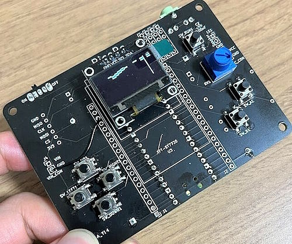](https://inajob.hatenablog.jp/entry/raspberry-pi-pico-mobile)

A portable game machine using Raspberry Pi Pico and MicroPython - [hatenablog.jp](https://inajob.hatenablog.jp/entry/raspberry-pi-pico-mobile).

[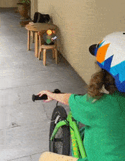](https://twitter.com/kfarr/status/1674267375829663745)

Fun with a Pimoroni Cosmic Unicorn LED matrix and Raspberry Pi Pico W propgrammed in MicroPython -- a traffic signal for the kids on bikes - [Twitter](https://twitter.com/kfarr/status/1674267375829663745) and [GitHub](https://github.com/kfarr/cosmic-unicorn-playground/blob/main/traffic-signal.py).

[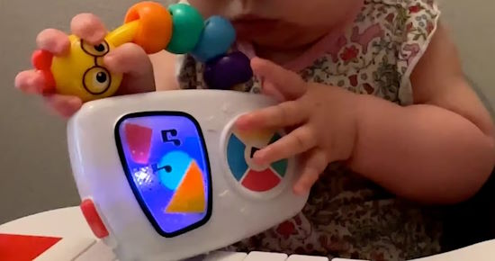](https://www.hackster.io/news/adafruit-s-new-board-upgrades-baby-einstein-toys-with-circuitpython-462bf452a74c)

hackster.io writes about Adafruit hacking the Baby Einstein toy with a custom PCB programmed in CircuitPython - [hackster.io](https://www.hackster.io/news/adafruit-s-new-board-upgrades-baby-einstein-toys-with-circuitpython-462bf452a74c).

[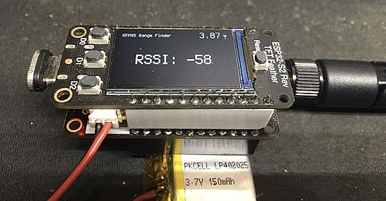](https://github.com/DJDevon3/My_Circuit_Python_Projects/tree/main/Boards/espressif/Adafruit%20Feather%20ESP32-S2%20Reverse%20TFT/LORA%20Portable%20Range%20Finder)

A LoRa/RFM95 portable range finder using Adafruit Feather and CircuitPython - [GitHub](https://github.com/DJDevon3/My_Circuit_Python_Projects/tree/main/Boards/espressif/Adafruit%20Feather%20ESP32-S2%20Reverse%20TFT/LORA%20Portable%20Range%20Finder).

text - [site](url).

text - [site](url).

text - [site](url).

text - [site](url).

text - [site](url).

text - [site](url).

text - [site](url).

text - [site](url).

[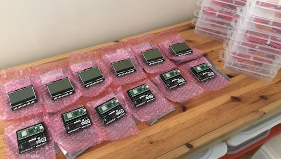](https://twitter.com/simon_prickett/status/1674784732339671040)

> Preparing for a workshop next month. That’s a dozen Pi Pico W running MicroPython connected to a dozen Pimoroni GFX Packs. Next steps - install test software and make sure WiFi etc. is good - [Twitter](https://twitter.com/simon_prickett/status/1674784732339671040).

[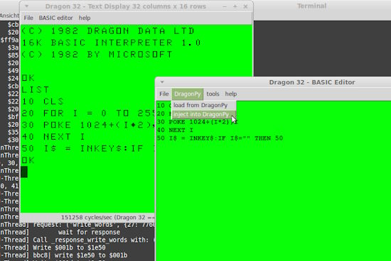](https://pypi.org/project/DragonPyEmulator/)

DragonPyEmulator is a Dragon 32/64 and Tandy Color Computer emulator written in Python. The MC6809 project is used to emulate the 6809 CPU. BASIC is included - [PyPI](https://pypi.org/project/DragonPyEmulator/).

[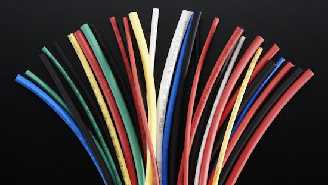](https://github.com/atomicobject/heatshrink)

heatshrink is a data compression/decompression library for embedded/real-time systems with very low memory usage - [GitHub](https://github.com/atomicobject/heatshrink).

investpy is a Python package to retrieve data from Investing.com, which provides data retrieval from up to 39952 stocks, 82221 funds, 11403 ETFs, 2029 currency crosses, 7797 indices, 688 bonds, 66 commodities, 250 certificates, and 4697 cryptocurrencies - [GitHub](https://github.com/alvarobartt/investpy).

text - [site](url).

PyDev of the Week: NAME on [Mouse vs Python]()

CircuitPython Weekly Meeting for DATE ([notes]()) [on YouTube]()

**#ICYDNCI What was the most popular, most clicked link, in [last week's newsletter](https://link)? [title](url).**

## New

[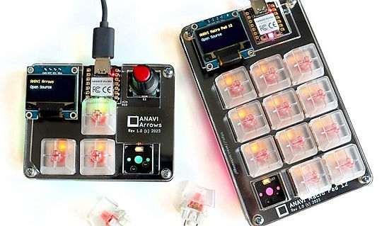](https://noc.social/@cnxsoft/110625179999308258)

Anavi Technology has launched two open-source hardware Raspberry Pi RP2040-based mechanical keyboards running KMK CircuitPython firmware - [Mastodon](https://noc.social/@cnxsoft/110625179999308258).

text - [site](url).

## New Boards Supported by CircuitPython

The number of supported microcontrollers and Single Board Computers (SBC) grows every week. This section outlines which boards have been included in CircuitPython or added to [CircuitPython.org](https://circuitpython.org/).

This week, there were (#/no) new boards added!

- [Board name](url)
- [Board name](url)
- [Board name](url)

*Note: For non-Adafruit boards, please use the support forums of the board manufacturer for assistance, as Adafruit does not have the hardware to assist in troubleshooting.*

Looking to add a new board to CircuitPython? It's highly encouraged! Adafruit has four guides to help you do so:

- [How to Add a New Board to CircuitPython](https://learn.adafruit.com/how-to-add-a-new-board-to-circuitpython/overview)
- [How to add a New Board to the circuitpython.org website](https://learn.adafruit.com/how-to-add-a-new-board-to-the-circuitpython-org-website)
- [Adding a Single Board Computer to PlatformDetect for Blinka](https://learn.adafruit.com/adding-a-single-board-computer-to-platformdetect-for-blinka)
- [Adding a Single Board Computer to Blinka](https://learn.adafruit.com/adding-a-single-board-computer-to-blinka)

## New Learn Guides!

[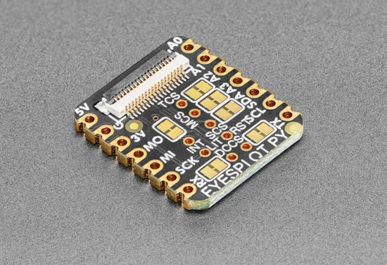](https://learn.adafruit.com/guides/latest)

[Adafruit EYESPI BFF](https://learn.adafruit.com/adafruit-eyespi-bff) from [Liz Clark](https://learn.adafruit.com/u/BlitzCityDIY)

[Adafruit Mini I2C STEMMA QT Gamepad with seesaw](https://learn.adafruit.com/gamepad-qt) from [Kattni](https://learn.adafruit.com/u/kattni)

## CircuitPython Libraries!

CircuitPython support for hardware continues to grow. We are adding support for new sensors and breakouts all the time, as well as improving on the drivers we already have. As we add more libraries and update current ones, you can keep up with all the changes right here!

For the latest libraries, download the [Adafruit CircuitPython Library Bundle](https://circuitpython.org/libraries). For the latest community contributed libraries, download the [CircuitPython Community Bundle](https://github.com/adafruit/CircuitPython_Community_Bundle/releases).

If you'd like to contribute, CircuitPython libraries are a great place to start. Have an idea for a new driver? File an issue on [CircuitPython](https://github.com/adafruit/circuitpython/issues)! Have you written a library you'd like to make available? Submit it to the [CircuitPython Community Bundle](https://github.com/adafruit/CircuitPython_Community_Bundle). Interested in helping with current libraries? Check out the [CircuitPython.org Contributing page](https://circuitpython.org/contributing). We've included open pull requests and issues from the libraries, and details about repo-level issues that need to be addressed. We have a guide on [contributing to CircuitPython with Git and GitHub](https://learn.adafruit.com/contribute-to-circuitpython-with-git-and-github) if you need help getting started. You can also find us in the #circuitpython channels on the [Adafruit Discord](https://adafru.it/discord).

You can check out this [list of all the Adafruit CircuitPython libraries and drivers available](https://github.com/adafruit/Adafruit_CircuitPython_Bundle/blob/master/circuitpython_library_list.md). 

The current number of CircuitPython libraries is **443**!

**Updated Libraries!**

Here's this week's updated CircuitPython libraries:

  * [adafruit/Adafruit_CircuitPython_MacroPad](https://github.com/adafruit/Adafruit_CircuitPython_MacroPad)
  * [adafruit/Adafruit_CircuitPython_ESP32SPI](https://github.com/adafruit/Adafruit_CircuitPython_ESP32SPI)
  * [adafruit/Adafruit_CircuitPython_HTU31D](https://github.com/adafruit/Adafruit_CircuitPython_HTU31D)
  * [adafruit/Adafruit_CircuitPython_MatrixPortal](https://github.com/adafruit/Adafruit_CircuitPython_MatrixPortal)

**Library PyPI Weekly Download Statistics**
* **Total Library Stats**
  * 68298 PyPI downloads over 310 libraries
* **Top 10 Libraries by PyPI Downloads**
  * Adafruit CircuitPython BusDevice (adafruit-circuitpython-busdevice): 6434
  * Adafruit CircuitPython Requests (adafruit-circuitpython-requests): 5552
  * Adafruit CircuitPython Register (adafruit-circuitpython-register): 1525
  * Adafruit CircuitPython NeoPixel (adafruit-circuitpython-neopixel): 1272
  * Adafruit CircuitPython Motor (adafruit-circuitpython-motor): 800
  * Adafruit CircuitPython PCA9685 (adafruit-circuitpython-pca9685): 733
  * Adafruit CircuitPython ESP32SPI (adafruit-circuitpython-esp32spi): 661
  * Adafruit CircuitPython SSD1306 (adafruit-circuitpython-ssd1306): 618
  * Adafruit CircuitPython ADS1x15 (adafruit-circuitpython-ads1x15): 611
  * Adafruit CircuitPython DHT (adafruit-circuitpython-dht): 601

## What’s the CircuitPython team up to this week?

What is the team up to this week? Let’s check in!

**Dan**

I released CircuitPython 8.2.0 Release Candidate 0 on Friday June 23, and Release Candidate 1 on Tuesday, June 27. If all goes well, we'll release 8.2.0 final shortly after the July 4 holiday.

I've been continuing on the MicroPython merge. I am getting closer to finishing my initial review of all the changes. Then I'll work on getting it to compile and start testing.

**Kattni**

This week I published the [Gamepad QT guide](https://learn.adafruit.com/gamepad-qt). If you picked up one of these nifty little STEMMA QT gamepads, check out this guide for all the details and code examples to get you started.

Next up is are guides for the STEMMA Audio Amp and Swirly Grid. Keep an eye out for those soon!

**Melissa**

This past week I worked on fixing bugs and adding features to the CircuitPython Code Editor. I also updated the 1.2" 7-Segment LED display backpack in the [Adafruit LED Backpacks](https://learn.adafruit.com/adafruit-led-backpack) Learn Guide.

**Tim**

This week I've been testing and putting finishing touches on a change for the ESP32SPI library to have a more compatible socket API as compared to CPython and other socket sources. The majority of this weeks testing was on learn guide projects that use higher level helper libraries to interact with the WiFi like PyPortal and Adafruit IO. I also tracked down an issue with `displayio.Shape` and submitted a fix for it.

**Jeff**

I improved audio output on RP2040-based boards including the Feather RP2040 Prop Maker, by working around a bug that would make a loud audio glitch each time files on the CIRCUITPY drive were updated. There's still a small glitch, but instead of being a loud noise it is a short period of silence.

During USB enumeration there is still a glitch, so adding a short delay before any program begins audio synthesis remains recommended to work around it.

**Liz**

This week I published the [EYESPI BFF guide](https://learn.adafruit.com/adafruit-eyespi-bff). This board has an EYESPI connector for connecting displays. I think folks will be able to make some fun, compact display projects with this. According to the backend stats in the Learn System, this guide was my 100th published guide, which I'm very proud of.

## Upcoming events!

The next MicroPython Meetup in Melbourne will be on June 28th – [Meetup](https://www.meetup.com/MicroPython-Meetup/). From the May 24th meeting - [Notes](https://docs.google.com/presentation/d/e/2PACX-1vQ3rvNGR3NyBkSc6t1nXMoGvNuf9Btq10ZQR-4DagW5q4cbPtGMZXOoRRRo2wWOi2u7xH-Bf_HTBjb2/pub?slide=id.p).

EuroPython 2023 will be July 17-23, 2023, in Prague, Czech Republic and Remote - [EuroPython 2023](https://ep2023.europython.eu/).

PyCon UK will be returning to Cardiff City Hall from Friday 22nd September to Monday 25th September 2023 - [PyCon UK](https://2023.pyconuk.org/).

Hackaday has announced that the Hackaday Supercon is on for 2023, and will be taking place November 3 – 5 in Pasadena, California, USA. They’d like to hear your proposals for talks and workshops! The [Call for Speakers](https://docs.google.com/forms/d/e/1FAIpQLSfYDwIzWTHZ0_7d8GUznm3Z9w3y8aDcV1MVGSUyY1nTcdJ9Jw/viewform?usp=sf_link) and [Call for Workshops](https://docs.google.com/forms/d/e/1FAIpQLSeJIm0fWcrJIN8ge1K6Mvt2tfoFYOqre3isod5vKRGr-iyvJg/viewform?usp=sf_link) forms are online now, and you have until July 18th to sign up - [Adafruit Blog](https://blog.adafruit.com/2023/05/10/hackaday-supercon-2023-is-on-supercon-hackaday/) and [Hackaday](https://hackaday.com/2023/05/10/supercon-2023-is-on-we-want-you/).

**Send Your Events In**

If you know of virtual events or upcoming events, please let us know via email to cpnews(at)adafruit(dot)com.

## Latest releases

CircuitPython's stable release is [#.#.#](https://github.com/adafruit/circuitpython/releases/latest) and its unstable release is [#.#.#-##.#](https://github.com/adafruit/circuitpython/releases). New to CircuitPython? Start with our [Welcome to CircuitPython Guide](https://learn.adafruit.com/welcome-to-circuitpython).

[2023####](https://github.com/adafruit/Adafruit_CircuitPython_Bundle/releases/latest) is the latest CircuitPython library bundle.

[v#.#.#](https://micropython.org/download) is the latest MicroPython release. Documentation for it is [here](http://docs.micropython.org/en/latest/pyboard/).

[#.#.#](https://www.python.org/downloads/) is the latest Python release. The latest pre-release version is [#.#.#](https://www.python.org/download/pre-releases/).

[#,### Stars](https://github.com/adafruit/circuitpython/stargazers) Like CircuitPython? [Star it on GitHub!](https://github.com/adafruit/circuitpython)

## Call for help -- Translating CircuitPython is now easier than ever!

One important feature of CircuitPython is translated control and error messages. With the help of fellow open source project [Weblate](https://weblate.org/), we're making it even easier to add or improve translations. 

Sign in with an existing account such as GitHub, Google or Facebook and start contributing through a simple web interface. No forks or pull requests needed! As always, if you run into trouble join us on [Discord](https://adafru.it/discord), we're here to help.

## NUMBER thanks!

The Adafruit Discord community, where we do all our CircuitPython development in the open, reached over NUMBER humans - thank you!  Adafruit believes Discord offers a unique way for Python on hardware folks to connect. Join today at [https://adafru.it/discord](https://adafru.it/discord).

## ICYMI - In case you missed it

Python on hardware is the Adafruit Python video-newsletter-podcast! The news comes from the Python community, Discord, Adafruit communities and more and is broadcast on ASK an ENGINEER Wednesdays. The complete Python on Hardware weekly videocast [playlist is here](https://www.youtube.com/playlist?list=PLjF7R1fz_OOXRMjM7Sm0J2Xt6H81TdDev). The video podcast is on [iTunes](https://itunes.apple.com/us/podcast/python-on-hardware/id1451685192?mt=2), [YouTube](http://adafru.it/pohepisodes), [IGTV (Instagram TV](https://www.instagram.com/adafruit/channel/)), and [XML](https://itunes.apple.com/us/podcast/python-on-hardware/id1451685192?mt=2).

[The weekly community chat on Adafruit Discord server CircuitPython channel - Audio / Podcast edition](https://itunes.apple.com/us/podcast/circuitpython-weekly-meeting/id1451685016) - Audio from the Discord chat space for CircuitPython, meetings are usually Mondays at 2pm ET, this is the audio version on [iTunes](https://itunes.apple.com/us/podcast/circuitpython-weekly-meeting/id1451685016), Pocket Casts, [Spotify](https://adafru.it/spotify), and [XML feed](https://adafruit-podcasts.s3.amazonaws.com/circuitpython_weekly_meeting/audio-podcast.xml).

## Contribute!

The CircuitPython Weekly Newsletter is a CircuitPython community-run newsletter emailed every Tuesday. The complete [archives are here](https://www.adafruitdaily.com/category/circuitpython/). It highlights the latest CircuitPython related news from around the web including Python and MicroPython developments. To contribute, edit next week's draft [on GitHub](https://github.com/adafruit/circuitpython-weekly-newsletter/tree/gh-pages/_drafts) and [submit a pull request](https://help.github.com/articles/editing-files-in-your-repository/) with the changes. You may also tag your information on Twitter with #CircuitPython. 

Join the Adafruit [Discord](https://adafru.it/discord) or [post to the forum](https://forums.adafruit.com/viewforum.php?f=60) if you have questions.
