- [X] Kattni updates
- [ ] change date
- [ ] update title
- [ ] Feature story
- [ ] Update  for images
- [ ] Update ICYDNCI
- [ ] All images 550w max only
- [ ] Link "View this email in your browser."

View this email in your browser. **Warning: Flashing Imagery**

Welcome to the latest Python on Microcontrollers newsletter! With the start of August, conferences and back-to-school is in full swing. We feature a number of events of interest to Python on hardware folks.  *- Ed.*

We're on [Discord](https://discord.gg/HYqvREz), [Twitter](https://twitter.com/search?q=circuitpython&src=typed_query&f=live), and for past newsletters - [view them all here](https://www.adafruitdaily.com/category/circuitpython/). If you're reading this on the web, [subscribe here](https://www.adafruitdaily.com/). Here's the news this week:

## Damien George, MicroPython Lead, on the Embedded.fm Podcast

[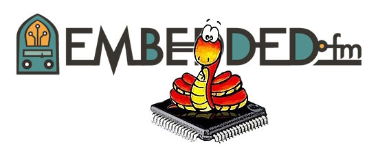](https://embedded.fm/episodes/456)

Damien George spoke with embedded.fm about developing with and for MicroPython while Elecia White tries not to spill all the secrets about her client.

To start at the beginning, you probably will want to check out [micropython.org](https://micropython.org/). Before listening to the show, you might read the [Wikipedia MicroPython entry](https://en.wikipedia.org/wiki/MicroPython) because they kind of start in the middle in the show.

You can find the code on [GitHub](github.com/micropython/micropython).

The PyBoard can be found on [store.micropython.org](https://store.micropython.org/). It is out of stock but lead time trends show parts may be available soon(ish) - [embedded.fm](https://embedded.fm/episodes/456).

## The New CircuitPython_IcePython Library Programs FPGAs

[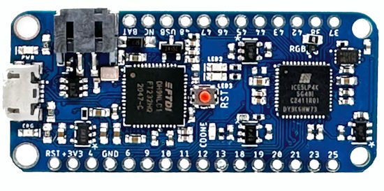](https://github.com/skerr92/Oakdevtech_CircuitPython_IcePython)

Usually to program an [iCE40 FPGA](https://www.crowdsupply.com/oak-dev-tech/icyblue-fpga-feather) from Lattice Semiconductor you need an FTDI chip or some other tool like OpenOCD and a device capable of communicating over SPI. This has changed now with IcePython, a driver library for CircuitPython which allows programming any iCE40 FPGA with a simple command.

Simply instantiate the IcePython class with a SPI object, a pin for chip select, a pin for FPGA reset, and a filename. Calling program_fpga() then programs the FPGA with the bin file provided - [GitHub](https://github.com/skerr92/Oakdevtech_CircuitPython_IcePython).

## MicroPython - Discontinuation of the In-house Library Prefix

As if in agreement, there is an [adjustment to MicroPython's naming structure](https://github.com/orgs/micropython/discussions/12078). The goal of the modification is better commonality with CPython  - [mikrocontroller.net](https://www.mikrocontroller.net/topic/557892).

- So in v1.21 (which will be released soon), all built-in modules have been renamed to match their CPython name -- os, sys, json, etc. The only exception is uctypes which is completely different to CPython's ctypes so it will keep its uctypes name. Additionally uasyncio and urequests have been renamed to asyncio and requests.
- There is a lot of existing code out there that use the u-prefix, e.g. import uos or import urequests so this will continue to work (for both C and Python modules). But please prefer to use just the non-u-prefixed name from now on.

## CircuitPython Day 2023

[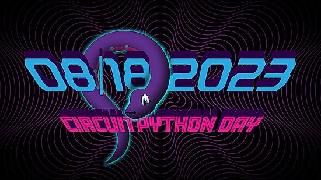](url)

CircuitPython Day 2023 is August 18th and a slate of events is being developed to celebrate the "Snakiest Day of the Year" - [Adafruit Blog](url).

## CircuitPython - A Swiss Army Knife

[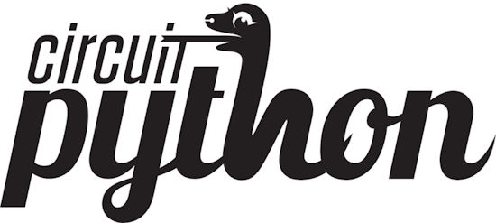](https://hackaday.com/2023/08/01/the-past-present-and-future-of-circuitpython/#comment-6668304)

The following is a comment left after last week's [Hack Chat on CircuitPython](https://hackaday.com/2023/08/01/the-past-present-and-future-of-circuitpython/#comment-6668304) - [Hackaday](https://hackaday.com/2023/08/01/the-past-present-and-future-of-circuitpython/#comment-6668304).

> "I used CircuitPython as a custom board testing framework for a fairly big multi-FPGA board (24 ASICs, 3 FPGAs, and a SAMD21 microcontroller used for overall control) used in a scientific experiment. It worked great – made board-level testing and adjustments easy, and then once things were obviously working we implemented a control packet framework, replaced the CircuitPython core with a simple Arduino framework firmware, and just… copied a ton of the CircuitPython code to Python and kept working. &nbsp;  I *love* using Python for investigative-type testing of a board, or stuff you only need to do once, like board initialization. As someone who works with FPGAs frequently, it reminds me of using soft microcontrollers in an FPGA – when the control flow/logic is complicated and speed is unimportant, readability and speed of development is key."

## Maker Faire Bay Area Announced for October 13-15 & October 20-22, 2023

Maker Faire has announced that Maker Faire Bay Area will be held October 13-15 & October 20-22, 2023 - [Eventbright](https://www.eventbrite.com/e/maker-faire-bay-area-october-13-15-october-20-22-2023-tickets-673771979127).

> Experience the ultimate showcase of creativity, innovation, and endless possibilities at Maker Faire! Immerse yourself in a world where robots come alive, art defies boundaries, drones soar through the sky, and groundbreaking technology shapes the future.

## Espressif Developer Conference - DevCon23

The supplier of popular ESP32 and ESP8266 microcontrollers, Espressif, announces their yearly Developers Conference. During the two-day online event, there will be nearly 30 talks created by Espressif technical experts and their partners, covering a wide range of topics including Thread, the low-power features of ESP32-C6 and WiFi 6, ESP-Mesh-Lite + ESP RainMaker Cloud solution, ESP-IDF, RUST, SquareLine Studio, AWS IoT, and more. September 12-13, 10:00-19:00 CEST - [devcon.espressif.com](https://devcon.espressif.com/).

## PCB Manufacturing - Don't Just Worry About Components

It’s not just semiconductors — it’s also Printed Circuit Boards (PCBs). The US and Europe aim to keep their lead against China on semiconductors. They also need to stay ahead with Printed Circuit Boards - [CEPA](https://cepa.org/article/its-not-just-semiconductors-its-also-pcb/).

## This Week's Python Streams

Python on Hardware is all about building a cooperative ecosphere which allows contributions to be valued and to grow knowledge. Below are the streams within the last week focusing on the community.

**CircuitPython Deep Dive Stream**

[Last Friday](https://www.youtube.com/watch?v=joxpe-09pTs), Scott streamed more work on USB Host.

You can see the latest video and past videos on the Adafruit YouTube channel under the Deep Dive playlist - [YouTube](https://www.youtube.com/playlist?list=PLjF7R1fz_OOXBHlu9msoXq2jQN4JpCk8A).

**CircuitPython Parsec**

John Park’s CircuitPython Parsec this week is on light detection - [Adafruit Blog](https://blog.adafruit.com/2023/08/04/john-parks-circuitpython-parsec-circuit-playground-light-detect/), [GitHub](https://github.com/jedgarpark/parsec) and [YouTube](link).

Catch all the episodes in the [YouTube playlist](https://www.youtube.com/playlist?list=PLjF7R1fz_OOWFqZfqW9jlvQSIUmwn9lWr).

## Project of the Week: TinkerMill's Electronic Access System

TinkerMill is a makerspace local to SparkFun. TinkerAccess is an electronic access control system. Every member is issued a unique RFID key fob that they then use throughout the facility to open doors to certain areas. TinkerAccess limits access to certain various equipment until members have been properly trained on their use, as well as giving all members door access system to the building itself. The hardware is based on a Raspberry Pi with a custom designed daughtercard containing an RFID reader. The main code is written in Python. There is also a Raspberry Pi based server that hosts the SQLite database and web server interface for controlling individual user access to specific equipment or doors - [SparkFun](https://www.sparkfun.com/news/7764), [YouTube](https://youtu.be/jMcvGR5ooGo) and [GitHub](https://github.com/TinkerMill/tinkerAccess) (MIT License).

## News from around the web!

[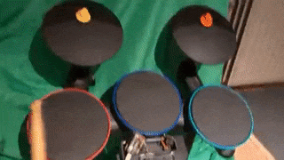](https://twitter.com/DavidGlaude/status/1684331130202337281)

> The next addition to CircuitPython WiiChuck library (community bundle) will be the Wii Drums from "Guitar Hero World Tour". Making sounds (or talking MIDI to do sounds) is the ultimate goal. Drums, cymbals and pedal are all supported - [Twitter/X](https://twitter.com/DavidGlaude/status/1684331130202337281) and [GitHub](https://github.com/jfurcean/CircuitPython_WiiChuck/blob/main/examples/drums_simpletest.py).

This years BornHacks badge will focus on NFC, sporting an NXP PN7150 on the reader badge and an NTAG I2C Plus on the tag badge. There is also a Raspberry Pi RP2040 for USB interface and application control. Programmed in CircuitPython - [Adafruit Blog](https://blog.adafruit.com/2023/08/02/bornhack-2023-makes-nfc-badges-badgelife-rp2040-bornhackbadge-raspberry_pi/) and [GitHub](https://github.com/bornhack/badge2023).

[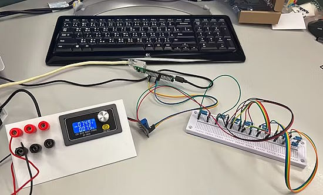](https://www.hackster.io/ron-pang/simple-power-meter-with-w5100s-evb-pico-ed44e2)

A simple power meter using a W5100S-EVB-PICO to measure voltage, current, and power with a MAX471 module. It displays on Adafruit IO via CircuitPython - [hackster.io](https://www.hackster.io/ron-pang/simple-power-meter-with-w5100s-evb-pico-ed44e2).

[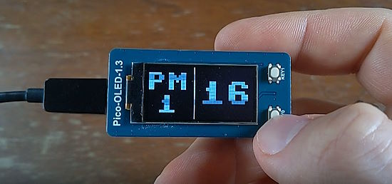](https://veronneau.org/pymonitair-air-quality-monitoring-display-with-micropython.html)

pymonitair: an air quality monitoring display with MicroPython - [veronneau.org](https://veronneau.org/pymonitair-air-quality-monitoring-display-with-micropython.html) and [GitLab](https://gitlab.com/baldurmen/pymonitair).

[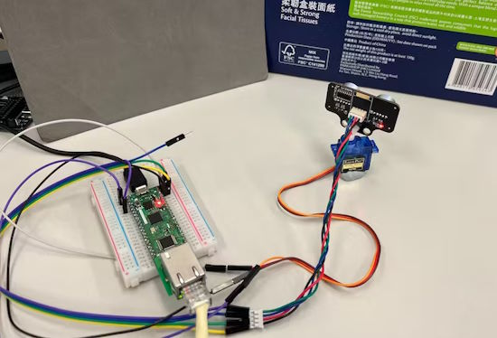](https://www.hackster.io/mark-yu/radar-application-with-thingspeak-099e8a)

A Radar appication using an ultrasonic sensor and a servo motor displayed on the Thingspeak IoT platform via CircuitPython - [hackster.io](https://www.hackster.io/mark-yu/radar-application-with-thingspeak-099e8a).

Robo Pico review – a Raspberry Pi Pico W-based motor & sensor control board tested with BocoBot robotic kit and CircuitPython - [CNX Software](https://www.cnx-software.com/2023/07/30/robo-pico-review-raspberry-pi-pico-w-motor-sensor-control-board-bocobot-robotic-kit/).

Bridging the Python [async](https://realpython.com/python-async-features/) gap from the other side - [death.andgravity](https://death.andgravity.com/asyncio-bridge).

A handheld Linux terminal which features an ortholinear keyboard and a custom character set generated in Python - [hackster.io](https://www.hackster.io/news/balazs-impressive-handheld-linux-terminal-features-an-ortholinear-keyboard-and-custom-character-set-2affc184a653).

[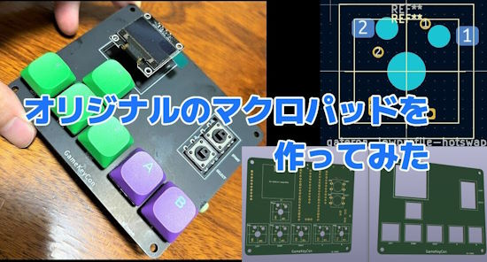](https://inajob.hatenablog.jp/entry/diy-macropad)

A custom macro pad using CircuitPython - [HatenaBlog](https://inajob.hatenablog.jp/entry/diy-macropad).

Emergency Mouse: a project born out of necessity using a Xiao RP2040 and CircuitPython - [hackster.io](https://www.hackster.io/MakerIoT2020/emergency-mouse-a-project-born-out-of-necessity-73dd29).

Use a W5100S-EVB-Pico and Arducam to deliver images to a webapp and identify work patterns through object recognition with AI with Thonny and CircuitPython - [hackster.io](https://www.hackster.io/benjm/working-assistant-with-w5100s-evb-pico-a57c6e).

[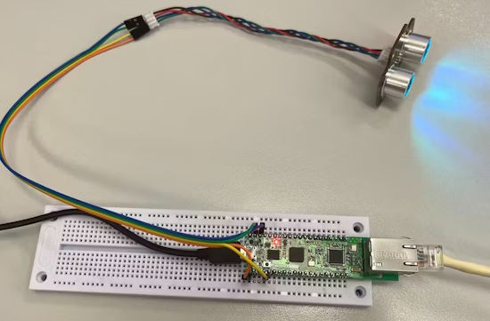](https://www.hackster.io/mark-yu/w5100s-evb-pico-rus04-adafruit-io-in-circuitpython-bb6831)

Using a W5100S-EVB-PICO with a RUS04 sensor to log via Adafruit IO in Circuitpython - [hackster.io](https://www.hackster.io/mark-yu/w5100s-evb-pico-rus04-adafruit-io-in-circuitpython-bb6831).

[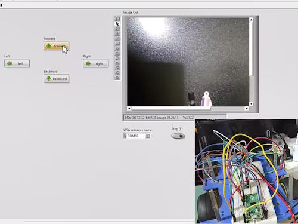](https://www.hackster.io/MohammadReza_Sharifi/control-surveillance-raspberry-pi-pico-robot-using-labview-bb8429)

A control surveillance robot using a Raspberry Pi Pico, LabVIEW and MicroPython - [hackster.io](https://www.hackster.io/MohammadReza_Sharifi/control-surveillance-raspberry-pi-pico-robot-using-labview-bb8429).

[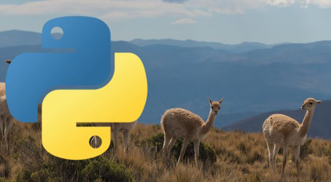](https://swharden.com/blog/2023-07-30-ai-document-qa/)

Using Llama 2 AI and Python to answer questions about local documents - [SWHarden](https://swharden.com/blog/2023-07-30-ai-document-qa/).

Now there are MicroPython bindings for emlearn.org. This makes it possible to have the familiarity and convenience of Python while deploying efficient Machine Learning onto microcontroller devices - [GitHub](https://github.com/emlearn/emlearn-micropython).

text - [site](url).

LPython, a novel, fast, retargetable Python compiler - [lpython.org](https://lpython.org/blog/2023/07/lpython-novel-fast-retargetable-python-compiler/), [EE News](https://www.eenewseurope.com/en/lpython-boosts-compilation-for-embedded-designs/) and [GitHub](https://github.com/lcompilers/lpython).

PyDev of the Week: Dr. Becky Smith on [Mouse vs Python](https://www.blog.pythonlibrary.org/2023/07/31/pydev-of-the-week-dr-becky-smith/)

CircuitPython Weekly Meeting for July 31st, 2023 ([notes](https://github.com/adafruit/adafruit-circuitpython-weekly-meeting/blob/main/2023/2023-07-31.md)) [on YouTube](https://www.youtube.com/watch?v=V0qPO9-eVMw)

#ICYDNCI What was the most popular, most clicked link, in [last week's newsletter](https://www.adafruitdaily.com/2023/07/31/python-on-microcontrollers-newsletter-circuitpython-8-2-1-out-circuitpython-day-2023-and-so-much-more-circuitpython-python-micropython-thepsf-raspberry_pi/)? [A New Python Cheat Sheet](https://gto76.github.io/python-cheatsheet/).

## New

[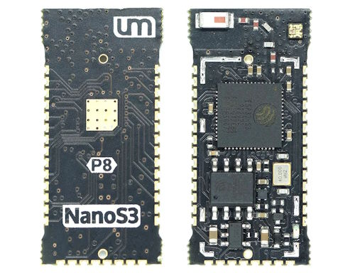](https://esp32s3.com/nanos3.html)

The Unexpected Maker NanoS3 supported by CircuitPython and MicroPython - [esp32s3](https://esp32s3.com/nanos3.html).

[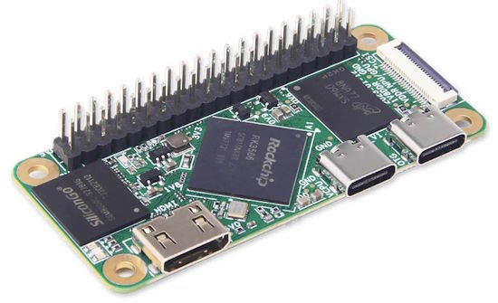](https://www.cnx-software.com/2023/08/02/geniatech-xpi-3566-zero-rockchip-rk3566-sbc-raspberry-pi-zero/)

Geniatech XPI-3566-ZERO is a Rockchip RK3566 powered single board computer (SBC) that provides an alternative to the Raspberry Pi Zero 2W with a more powerful quad-core 1.8 GHz Arm Cortex-A55 processor, support for 4Kp60 video playback and output, WiFi 5 and Bluetooth 5.0, a built-in eMMC flash and more - [CNX Software](https://www.cnx-software.com/2023/08/02/geniatech-xpi-3566-zero-rockchip-rk3566-sbc-raspberry-pi-zero/).

## New Boards Supported by CircuitPython

The number of supported microcontrollers and Single Board Computers (SBC) grows every week. This section outlines which boards have been included in CircuitPython or added to [CircuitPython.org](https://circuitpython.org/).

This week, there were no new boards added but some are in development.

*Note: For non-Adafruit boards, please use the support forums of the board manufacturer for assistance, as Adafruit does not have the hardware to assist in troubleshooting.*

Looking to add a new board to CircuitPython? It's highly encouraged! Adafruit has four guides to help you do so:

- [How to Add a New Board to CircuitPython](https://learn.adafruit.com/how-to-add-a-new-board-to-circuitpython/overview)
- [How to add a New Board to the circuitpython.org website](https://learn.adafruit.com/how-to-add-a-new-board-to-the-circuitpython-org-website)
- [Adding a Single Board Computer to PlatformDetect for Blinka](https://learn.adafruit.com/adding-a-single-board-computer-to-platformdetect-for-blinka)
- [Adding a Single Board Computer to Blinka](https://learn.adafruit.com/adding-a-single-board-computer-to-blinka)

## New Learn Guides!

[Water Drip Dress with Oozemaster 3000](https://learn.adafruit.com/water-drip-dress-with-oozemaster-3000) from [Erin St. Blaine](https://learn.adafruit.com/u/firepixie)

[Lightsaber Prop-Maker RP2040](https://learn.adafruit.com/lightsaber-rp2040) from [Noe and Pedro](https://learn.adafruit.com/u/pixil3d)

## CircuitPython Libraries!

The CircuitPython library numbers are continually increasing, while existing ones continue to be updated. Here we provide library numbers and updates!

To get the latest Adafruit libraries, download the [Adafruit CircuitPython Library Bundle](https://circuitpython.org/libraries). To get the latest community contributed libraries, download the [CircuitPython Community Bundle](https://circuitpython.org/libraries).

If you'd like to contribute to the CircuitPython project on the Python side of things, the libraries are a great place to start. Check out the [CircuitPython.org Contributing page](https://circuitpython.org/contributing). If you're interested in reviewing, check out Open Pull Requests. If you'd like to contribute code or documentation, check out Open Issues. We have a guide on [contributing to CircuitPython with Git and GitHub](https://learn.adafruit.com/contribute-to-circuitpython-with-git-and-github), and you can find us in the #help-with-circuitpython and #circuitpython-dev channels on the [Adafruit Discord](https://adafru.it/discord).

You can check out this [list of all the Adafruit CircuitPython libraries and drivers available](https://github.com/adafruit/Adafruit_CircuitPython_Bundle/blob/master/circuitpython_library_list.md). 

The current number of CircuitPython libraries is **445**!

**Updated Libraries!**

Here's this week's updated CircuitPython libraries:

  * [adafruit/Adafruit_CircuitPython_turtle](https://github.com/adafruit/Adafruit_CircuitPython_turtle)
  * [adafruit/Adafruit_CircuitPython_PIOASM](https://github.com/adafruit/Adafruit_CircuitPython_PIOASM)
  * [adafruit/Adafruit_CircuitPython_ServoKit](https://github.com/adafruit/Adafruit_CircuitPython_ServoKit)
  * [adafruit/Adafruit_CircuitPython_TinyLoRa](https://github.com/adafruit/Adafruit_CircuitPython_TinyLoRa)
  * [adafruit/Adafruit_CircuitPython_PortalBase](https://github.com/adafruit/Adafruit_CircuitPython_PortalBase)
  * [jposada202020/CircuitPython_uplot](https://github.com/jposada202020/CircuitPython_uplot)

**Library PyPI Weekly Download Stats**

**Total Library Stats**
  
  * 106195 PyPI downloads over 311 libraries
    
**Top 10 Libraries by PyPI Downloads**

  * Adafruit CircuitPython BusDevice (adafruit-circuitpython-busdevice): 7042
  * Adafruit CircuitPython Requests (adafruit-circuitpython-requests): 6659
  * Adafruit CircuitPython Register (adafruit-circuitpython-register): 1741
  * Adafruit CircuitPython ADS1x15 (adafruit-circuitpython-ads1x15): 1687
  * Adafruit CircuitPython Display Text (adafruit-circuitpython-display-text): 1201
  * Adafruit CircuitPython MiniMQTT (adafruit-circuitpython-minimqtt): 1175
  * Adafruit CircuitPython NeoPixel (adafruit-circuitpython-neopixel): 1151
  * Adafruit CircuitPython Motor (adafruit-circuitpython-motor): 1028
  * Adafruit CircuitPython ServoKit (adafruit-circuitpython-servokit): 943
  * Adafruit CircuitPython Wiznet5k (adafruit-circuitpython-wiznet5k): 856

## What’s the CircuitPython team up to this week?

What is the team up to this week? Let’s check in!

**Dan**

I released CircuitPython 8.2.2 last week. The only change was replacing an expired SSL certificate that prevented access to Adafruit IO.

The certificate also had to be updated in the NINA-FW firmware, which is used for AirLift WiFi co-processors. However, we had trouble uploading the updated  version on AirLift boards like the MatrixPortal M4 or PyPortal. I debugged the problem, and thought that the process was interesting enough that I wrote it up as a blog post: ["Why Doesn't this Upload: A Debugging Tale"](https://blog.adafruit.com/2023/08/03/why-doesnt-this-upload-a-debugging-tale/).

**Kattni**

This week I published the [ADXL343 + ADT7410 Sensor FeatherWing guide](https://learn.adafruit.com/adxl343-adt7410-sensor-featherwing). This one's a shorty because we have guides for both sensors already. If you're interested in the board details, check out the guide. If you're interested in code, check out the breakout guides linked within.

**Melissa**

This past week was a little shorter for me because I was out sick. I worked on the code for an upcoming learn guide that uses the MatrixPortal S3 to display a scrolling message board. I am impressed with the improved performance over the older MatrixPortal M4.

**Tim**

I've been continuing to follow up on older PRs and move along or wrap up any that I can. I also made a sweep through all of the library 'good first issues' to remove the label from any that have too much scope or complexity for other reasons. Lastly I did some testing for XSS vulnerability within the HTTPServer library and submitted a PR to scrub POST'd data with the default usage in order to harden against it.

**Jeff**

I've continued working on the prototype camera board, fixing up the animated GIF recorder, 'onionskin' still motion mode, image special effects, QR code scanner, and more.

I also did several other PRs in CircuitPython core, including fixes to the documentation build process to fix errors and keep up to date with changes at ReadTheDocs.

**Scott**

This week I'm continuing to debug USB host. I got a mass storage (MSC) demo working from the iMX RT but it failed on the RP2040. I've been trying to figure out why. Thach tried it and it worked just fine. So, it might have something to do with my particular setup. I've moved back to the higher level MSC support. I suspect that my usb drive isn't working due to a descriptor request in the middle of the MSC inquiry. I [streamed this work last week] (https://www.youtube.com/watch?v=lNmwbJ5EH7o).

**Liz**

This week I worked on the guide for the new [TSC2046 breakout](https://learn.adafruit.com/adafruit-tsc2046-spi-resistive-touch-screen-controller). It is a SPI touch screen controller. For now there is only an Arduino library available, but a CircuitPython library should be available soon. When it is ready, I will update the guide to include it.

I also began working on a reimagining of the [MX MIDI guitar project](https://learn.adafruit.com/mx-midi-guitar). This was one of my first collaborations with Noe and it was a huge build with a lot of really fun features. However, it went live the week that most of the US went into lockdown for COVID-19 in March 2020, so it was hard to appreciate it once it was complete with everything going on. This new version will use `synthio`, some seesaw breakouts and a few other surprises we're hoping will work out.

## Upcoming Events!

[PyCon AU](https://2023.pycon.org.au/) will be held August 18th - 22nd in Adelaide, Australia. The conference schedule was recently published and notable talks include [You can't do that in MicroPython](https://2023.pycon.org.au/program/F7JN7X/) by Matt Trentini and [10 Years of MicroPython](https://2023.pycon.org.au/program/ZDUVFF/) by Damien George - [PyCon AU](https://2023.pycon.org.au/).

The next MicroPython Meetup in Melbourne will be on August 23rd – [Meetup](https://www.meetup.com/micropython-meetup/events). 

The supplier of popular ESP32 and ESP8266 microcontrollers, Espressif, announces their yearly Developers COnference. During the two-day online event, there will be nearly 30 talks created by Espressif technical experts and its partners, covering a wide range of topics, including Thread, the low-power features of ESP32-C6 and Wi-Fi 6, ESP-Mesh-Lite + ESP RainMaker Cloud solution, ESP-IDF, RUST, SquareLine Studio, AWS IoT, and more. September 12-13, 10:00-19:00 CEST - [devcon.espressif.com](https://devcon.espressif.com/).

PyCon UK will be returning to Cardiff City Hall from Friday 22nd September to Monday 25th September 2023 - [PyCon UK](https://2023.pyconuk.org/).

Maker Faire Bay Area will be October 13-15 & October 20-22, 2023 - [Eventbright](https://www.eventbrite.com/e/maker-faire-bay-area-october-13-15-october-20-22-2023-tickets-673771979127).

Hackaday has announced that the Hackaday Supercon is on for 2023, and will be taking place November 3 – 5 in Pasadena, California, USA. They’d like to hear your proposals for talks and workshops! The [Call for Speakers](https://docs.google.com/forms/d/e/1FAIpQLSfYDwIzWTHZ0_7d8GUznm3Z9w3y8aDcV1MVGSUyY1nTcdJ9Jw/viewform?usp=sf_link) and [Call for Workshops](https://docs.google.com/forms/d/e/1FAIpQLSeJIm0fWcrJIN8ge1K6Mvt2tfoFYOqre3isod5vKRGr-iyvJg/viewform?usp=sf_link) forms are online now, and you have until July 18th to sign up - [Adafruit Blog](https://blog.adafruit.com/2023/05/10/hackaday-supercon-2023-is-on-supercon-hackaday/) and [Hackaday](https://hackaday.com/2023/05/10/supercon-2023-is-on-we-want-you/).

The Pyjamas Conference, the 24-hour online Python conference, will be returning for a fifth year. The Call for Papers will begin on September 2nd - [Twitter](https://twitter.com/PyjamasConf/status/1675278222798495745).

**Send Your Events In**

If you know of virtual events or upcoming events, please let us know via email to cpnews(at)adafruit(dot)com.

## Latest Releases

CircuitPython's stable release is [8.2.2](https://github.com/adafruit/circuitpython/releases/latest). New to CircuitPython? Start with our [Welcome to CircuitPython Guide](https://learn.adafruit.com/welcome-to-circuitpython).

[20230802](https://github.com/adafruit/Adafruit_CircuitPython_Bundle/releases/latest) is the latest Adafruit CircuitPython library bundle.

[20230724](https://github.com/adafruit/CircuitPython_Community_Bundle/releases/latest) is the latest CircuitPython Community library bundle.

[v1.20.0](https://micropython.org/download) is the latest MicroPython release. Documentation for it is [here](http://docs.micropython.org/en/latest/pyboard/).

[3.11.4](https://www.python.org/downloads/) is the latest Python release. The latest pre-release version is [Python 3.12.0b4](https://www.python.org/download/pre-releases/).

[3,611 Stars](https://github.com/adafruit/circuitpython/stargazers) Like CircuitPython? [Star it on GitHub!](https://github.com/adafruit/circuitpython)

## Call for Help -- Translating CircuitPython is now easier than ever!

[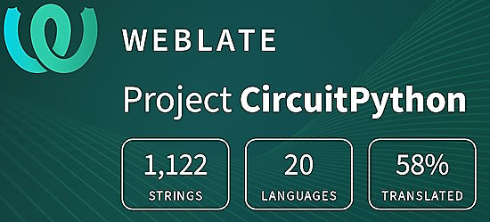](https://hosted.weblate.org/engage/circuitpython/)

One important feature of CircuitPython is translated control and error messages. With the help of fellow open source project [Weblate](https://weblate.org/), we're making it even easier to add or improve translations. 

Sign in with an existing account such as GitHub, Google or Facebook and start contributing through a simple web interface. No forks or pull requests needed! As always, if you run into trouble join us on [Discord](https://adafru.it/discord), we're here to help.

## 37,676 Thanks!

The Adafruit Discord community, where we do all our CircuitPython development in the open, reached over 37,676 humans - thank you! Adafruit believes Discord offers a unique way for Python on hardware folks to connect. Join today at [https://adafru.it/discord](https://adafru.it/discord).

## ICYMI - In case you missed it

Python on hardware is the Adafruit Python video-newsletter-podcast! The news comes from the Python community, Discord, Adafruit communities and more and is broadcast on ASK an ENGINEER Wednesdays. The complete Python on Hardware weekly videocast [playlist is here](https://www.youtube.com/playlist?list=PLjF7R1fz_OOXRMjM7Sm0J2Xt6H81TdDev). The video podcast is on [iTunes](https://itunes.apple.com/us/podcast/python-on-hardware/id1451685192?mt=2), [YouTube](http://adafru.it/pohepisodes), [IGTV (Instagram TV](https://www.instagram.com/adafruit/channel/)), and [XML](https://itunes.apple.com/us/podcast/python-on-hardware/id1451685192?mt=2).

[The weekly community chat on Adafruit Discord server CircuitPython channel - Audio / Podcast edition](https://itunes.apple.com/us/podcast/circuitpython-weekly-meeting/id1451685016) - Audio from the Discord chat space for CircuitPython, meetings are usually Mondays at 2pm ET, this is the audio version on [iTunes](https://itunes.apple.com/us/podcast/circuitpython-weekly-meeting/id1451685016), Pocket Casts, [Spotify](https://adafru.it/spotify), and [XML feed](https://adafruit-podcasts.s3.amazonaws.com/circuitpython_weekly_meeting/audio-podcast.xml).

## Contribute!

The CircuitPython Weekly Newsletter is a CircuitPython community-run newsletter emailed every Tuesday. The complete [archives are here](https://www.adafruitdaily.com/category/circuitpython/). It highlights the latest CircuitPython related news from around the web including Python and MicroPython developments. To contribute, edit next week's draft [on GitHub](https://github.com/adafruit/circuitpython-weekly-newsletter/tree/gh-pages/_drafts) and [submit a pull request](https://help.github.com/articles/editing-files-in-your-repository/) with the changes. You may also tag your information on Twitter with #CircuitPython. 

Join the Adafruit [Discord](https://adafru.it/discord) or [post to the forum](https://forums.adafruit.com/viewforum.php?f=60) if you have questions.
