- [X] Kattni updates
- [ ] change date
- [ ] update title
- [ ] Feature story
- [ ] Update  for images
- [ ] Update ICYDNCI
- [ ] All images 550w max only
- [ ] Link "View this email in your browser."

News Sources

- Twitter: [CircuitPython](https://twitter.com/search?q=circuitpython&src=typed_query&f=live), [MicroPython](https://twitter.com/search?q=micropython&src=typed_query&f=live) and [Python](https://twitter.com/search?q=python&src=typed_query)
- Mastodon [CircuitPython](https://octodon.social/tags/CircuitPython) and [MicroPython](https://octodon.social/tags/MicroPython)
- [python.org](https://www.python.org/)
- [Python Insider - dev team blog](https://pythoninsider.blogspot.com/)
- [MicroPython Meetup Blog](https://melbournemicropythonmeetup.github.io/)
- [hackaday.io newest projects MicroPython](https://hackaday.io/projects?tag=micropython&sort=date) and [CircuitPython](https://hackaday.io/projects?tag=circuitpython&sort=date)
- [hackaday CircuitPython](https://hackaday.com/blog/?s=circuitpython) and [MicroPython](https://hackaday.com/blog/?s=micropython)
- [hackster.io CircuitPython](https://www.hackster.io/search?q=circuitpython&i=projects&sort_by=most_recent) and [MicroPython](https://www.hackster.io/search?q=micropython&i=projects&sort_by=most_recent)
- [https://opensource.com/tags/python](https://opensource.com/tags/python)
- Check Issues and PRs for input

View this email in your browser. **Warning: Flashing Imagery**

Welcome to the latest Python on Microcontrollers newsletter! And the Python community roars to life again! This week we have a number of features as folks return from their summer vacations. This included some new news on CircuitPython 8 and 9, Damien's talk on MicroPython, and Microsoft's announcement of Python in Excel. - * Anne Barela, Editor.*

We're on [Discord](https://discord.gg/HYqvREz), [Twitter](https://twitter.com/search?q=circuitpython&src=typed_query&f=live), and for past newsletters - [view them all here](https://www.adafruitdaily.com/category/circuitpython/). If you're reading this on the web, [subscribe here](https://www.adafruitdaily.com/). Here's the news this week:

## Open-Source Communities and Ten Years of MicroPython - Damien George (PyCon AU 2023)

[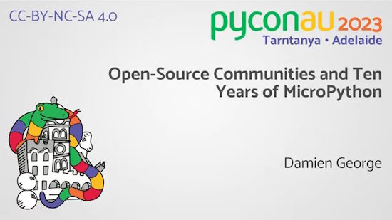](https://www.youtube.com/watch?v=iEQQWpjgFd8)

Damien George's talk "Open-Source Communities and Ten Years of MicroPython" at PyCon AU 2023 is now available online, with very interesting insights into the language and community - [YouTube](https://www.youtube.com/watch?v=iEQQWpjgFd8).

## You Can't Do That in MicroPython! - Matt Trentini (PyCon AS 2023)

[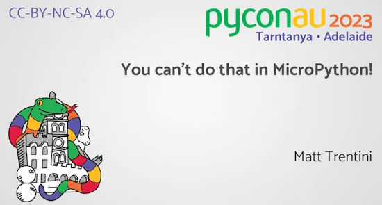](https://youtu.be/R2YnT1es9IY?feature=shared)

Matt Trentini's talk at PyCon AU 2023: MicroPython is great for hobbyists! You can control LEDs and motors, it's so easy! But you wouldn't use it for anything *serious*. Right? Surely not! It's too slow. You can't use all the features of a micro. It consumes too much power. You don't have control over memory... (*Hint: all wrong, you can do soooo much - Ed.*) - [YouTube](https://youtu.be/R2YnT1es9IY?feature=shared).

## Python in Excel: Microsoft Combines the Power of Python and the Flexibility of Excel

Microsoft has announced new analytical capabilities available within Excel with the release of a Public Preview of Python in Excel. Python in Excel makes it possible to natively combine Python and Excel analytics within the same workbook - with no setup required. With Python in Excel, you can type Python directly into a cell, the Python calculations run in the Microsoft Cloud, and results are returned to the worksheet, including plots and visualizations - [Microsoft Excel Blog](https://techcommunity.microsoft.com/t5/excel-blog/announcing-python-in-excel-combining-the-power-of-python-and-the/ba-p/3893439) and [The Verge](https://www.theverge.com/2023/8/22/23841167/microsoft-excel-python-integration-support).

Python creator Guido van Rossum states he helped the Excel team with this initiative - [Twitter/X](https://twitter.com/gvanrossum/status/1694031794306458056?t=AsdfrW3a1trrNsz_J9yd8g&s=03).

## CircuitPython 8.2.4 Released

CircuitPython 8.2.4 is the latest bugfix revision of CircuitPython, and is a new stable release. It now appears that minor changes will be going into the 8.x branch as version 9.0 is expected to take some time, as significant changes and updates from MicroPython are being incorporated - [Adafruit Blog](https://blog.adafruit.com/2023/08/22/circuitpython-8-2-4-released/).

**Notable changes to 8.2.4 since 8.2.3**

* New and fixed boards.
* Improved messages and documentation.

## Getting to Grips with Bluetooth on the Raspberry Pi Pico W

[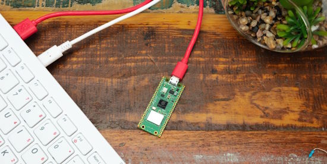](https://www.raspberrypi.com/news/getting-to-grips-with-bluetooth-on-pico-w/)

Pico W now supports Bluetooth both with MicroPython and C. But what is this, and why should you care? - [Raspberry Pi](https://www.raspberrypi.com/news/getting-to-grips-with-bluetooth-on-pico-w/).

[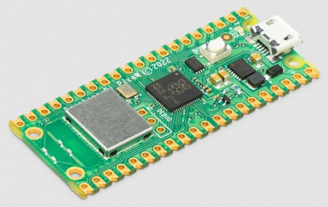](https://github.com/micropython/micropython-lib/tree/master/micropython/bluetooth/aioble)

aioble - a library providing an object-oriented, asyncio-based wrapper for MicroPython's Bluetooth API - [GitHub](https://github.com/micropython/micropython-lib/tree/master/micropython/bluetooth/aioble).

## Google Launches MediaPipe for Raspberry Pi, Offering a Python SDK for Simplified On-Device ML

[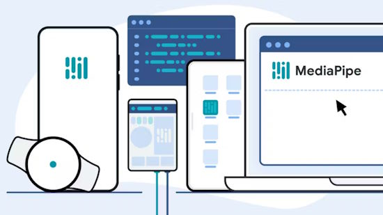](https://www.hackster.io/news/google-launches-mediapipe-for-raspberry-pi-offering-a-python-sdk-for-simplified-on-device-ml-c821f5ff57b0)

Google has announced the launch of MediaPipe for Raspberry Pi, offering a Python-based software development kit (SDK) for machine learning (ML) tasks complete with examples for audio classification, text classification, gesture recognition, and more. - [hackster.io](https://www.hackster.io/news/google-launches-mediapipe-for-raspberry-pi-offering-a-python-sdk-for-simplified-on-device-ml-c821f5ff57b0).

## Over-the-Air Software Updating for MicroPython

[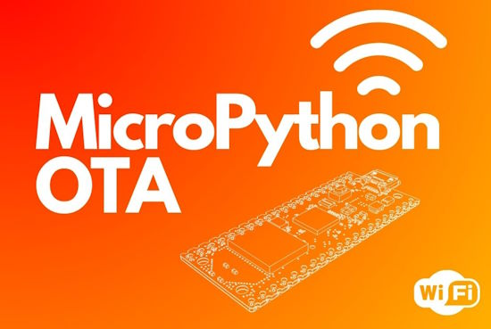](https://www.kevsrobots.com/blog/micropython-ota.html)

If you’ve ever had a software update pop up on your smartphone or smart TV, you’ve encountered an OTA update, even if you didn’t know it by name. OTA, or Over-The-Air, refers to the method of transmitting data across a network without any wired connection. Kevin McAleer has created a simple OTA module for MicroPython  so you can now add OTA to your own projects - [Kev's Robots](https://www.kevsrobots.com/blog/micropython-ota.html), [GitHub](https://github.com/kevinmcaleer/ota) and [YouTube](https://youtu.be/f1widOJYQDc).

## What to do when CircuitPython 8.2.0 or later cannot be installed properly on a board with an nRF52840

[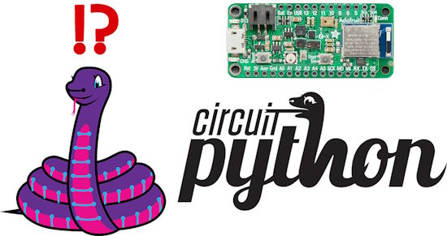](https://steam-tokyo.com/nrf52840-circuitpython-8-2/)

Starting with CircuitPython 8.2.0, UF2 bootloader version 0.4.1 or higher is required for microcontroller boards with a nRF52840. For nRF52840 boards with older UF2 bootloaders, CircuitPython 8.2.0 and above cannot be successfully installed. This guide explains the precautions and the procedure for updating the UF2 bootloader - [Styram Tokyo](https://steam-tokyo.com/nrf52840-circuitpython-8-2/).

## Python 3.11.5, 3.10.13, 3.9.18, and 3.8.18 is now available

Python 3.11.5, 3.10.13, 3.9.18, and 3.8.18 are all now available from [python.org/downloads/](https://www.python.org/downloads/). Security and bug fixes, so do upgrade if needed - [Python Insider Blog](https://pythoninsider.blogspot.com/2023/08/python-3115-31013-3918-and-3818-is-now.html).

## This Week's Python Streams

Python on Hardware is all about building a cooperative ecosphere which allows contributions to be valued and to grow knowledge. Below are the streams within the last week focusing on the community.

**CircuitPython Deep Dive Stream**

[Last Friday](https://www.youtube.com/watch?v=RoLcCLuQ5vc), Scott streamed work on {ESP Hacking.

You can see the latest video and past videos on the Adafruit YouTube channel under the Deep Dive playlist - [YouTube](https://www.youtube.com/playlist?list=PLjF7R1fz_OOXBHlu9msoXq2jQN4JpCk8A).

**CircuitPython Parsec**

John Park’s CircuitPython Parsec this week is on Circuit Playground Temperature - [Adafruit Blog](https://blog.adafruit.com/2023/08/21/john-parks-circuitpython-parsec-circuit-playground-temperature-adafruit-circuitpython/) and [YouTube](https://youtu.be/HHcIKgYHc1Q).

Catch all the episodes in the [YouTube playlist](https://www.youtube.com/playlist?list=PLjF7R1fz_OOWFqZfqW9jlvQSIUmwn9lWr).

## Project of the Week: The Smallest Possible RP2040 Development Board

[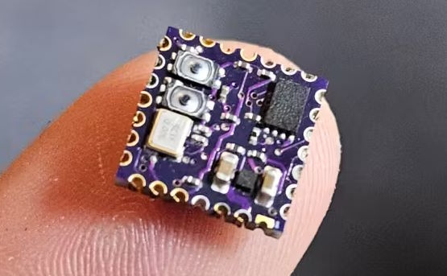](https://www.hackster.io/news/william-herr-s-rpdot-is-just-about-the-smallest-raspberry-pi-rp2040-development-board-possible-891d038594ec)

William Herr's RPDot is just about the smallest Raspberry Pi RP2040 development board possible. Measuring barely larger than the RP2040 chip itself, the RPDot makes all other development boards look like cumbersome giants - [hackster.io](https://www.hackster.io/news/william-herr-s-rpdot-is-just-about-the-smallest-raspberry-pi-rp2040-development-board-possible-891d038594ec) and [hackaday.io](https://hackaday.io/project/192519-rpdot).

## News from around the web!

Kevin demonstrates how a Raspberry Pi Pico W can host websites using the new Phew web server and templating library from Pimoroni. You can build interactive and useful sites into your projects - [YouTube](https://www.youtube.com/watch?v=0sPPxIq4hg8), [GitHub](https://github.com/kevinmcaleer/phew_demo) and Phew can be found on [GitHub](https://github.com/pimoroni/phew).

[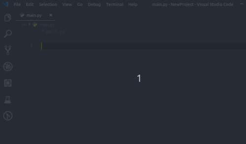](https://blog.adafruit.com/2023/08/23/writing-micropython-code-in-modern-development-environments-micropython-development-software/)

Writing MicroPython code in modern development environments with Micropy Cli - [Adafruit Blog](https://blog.adafruit.com/2023/08/23/writing-micropython-code-in-modern-development-environments-micropython-development-software/).

[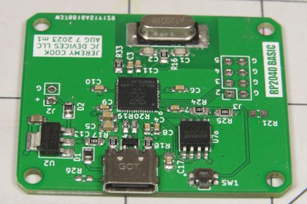](https://twitter.com/JeremySCook/status/1694402430568374586)

Jeremy Cook is bringing up a custom Paspberry Pi RP2040-based board. CircuitPython is being installed. If you have a custom board and are looking to have a board definition for CircuitPython, you can refer to [this CircuitPython team guide](https://learn.adafruit.com/how-to-add-a-new-board-to-circuitpython/overview) with details - [X, formerly known as Twitter](https://twitter.com/JeremySCook/status/1694402430568374586).

[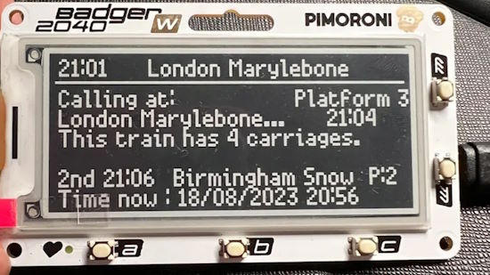](https://www.tomshardware.com/news/raspberry-pi-badger-2040-w-departure-board)

Raspberry Pi Pico and Python power a  DIY eInk train departure board - [Tom's Hardware](https://www.tomshardware.com/news/raspberry-pi-badger-2040-w-departure-board).

Make a multicore Raspberry Pi Pico computing device - [HackSpace Magazine](https://hackspace.raspberrypi.com/downloads/eyJfcmFpbHMiOnsibWVzc2FnZSI6IkJBaHBBbnNoIiwiZXhwIjpudWxsLCJwdXIiOiJibG9iX2lkIn19--c9f6ee36f22a115dddedd05bf5e4a61655b7de76/HS_69_DIGITAL.pdf) (PDF, Page 32).

> "Floppy Birb. Rendered by two Raspberry Pi RP2040s, one standalone serving as GPU and a Pico W serving as the CPU running MicroPython. Using all the tricks in the book here: scanline scrolling, sprites, PNG decoding, vector graphics... quite the spaghetti" - [X, formerly known as Twitter](https://twitter.com/Gadgetoid/status/1694374838528348296?t=FlTpxYULGDEStJXxbmvhzA&s=03).

[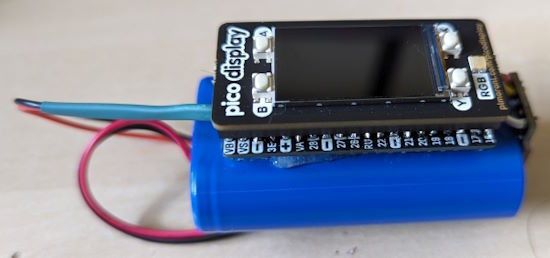](https://www.recantha.co.uk/blog/?p=21637)

Portable temperature, humidity and pressure sensor using a Raspberry Pi Pico W - [recantha.co.uk](https://www.recantha.co.uk/blog/?p=21637).

Ussing an Adafruit MatrixPortal S3 with 4 panels with CircuitPython - [Mastodon](https://octodon.social/@TreasureDev@hackaday.social/110947619994356770).

text - [site](url).

text - [site](url).

text - [site](url).

text - [site](url).

text - [site](url).

text - [site](url).

text - [site](url).

A Raspberry Pi RP2040 development platform for PlatformIO - [GitHub](https://github.com/maxgerhardt/platform-raspberrypi).

The latest Keyboard Builders' Digest - [kbd.net](https://kbd.news/Behind-the-scenes-2023-34-2100.html).

CircuitPython Weekly Meeting for August 21, 2023 ([notes](https://github.com/adafruit/adafruit-circuitpython-weekly-meeting/blob/main/2023/2023-08-21.md)) [on YouTube](https://youtu.be/Djc2nLD7uSs).

**#ICYDNCI What was the most popular, most clicked link, in [last week's newsletter](https://link)? [title](url).**

## New

[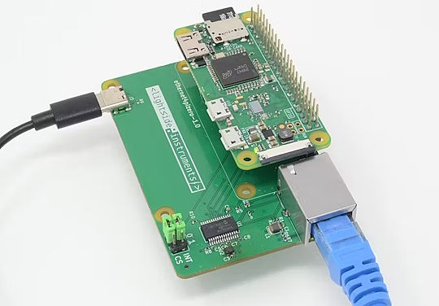](https://www.hackster.io/lightside-instruments/the-ethernet4pizero-ethernet-for-raspberry-pi-zero-hat-dd4316)

The ethernet4pizero - Ethernet for Raspberry Pi Zero hat - [hackster.io](https://www.hackster.io/lightside-instruments/the-ethernet4pizero-ethernet-for-raspberry-pi-zero-hat-dd4316) via [X, formerly known as Twitter](https://twitter.com/MicrochipMakes/status/1694700197819932967).

text - [site](url).

## New Boards Supported by CircuitPython

The number of supported microcontrollers and Single Board Computers (SBC) grows every week. This section outlines which boards have been included in CircuitPython or added to [CircuitPython.org](https://circuitpython.org/).

This week there were no new boards added, but several are in development!

*Note: For non-Adafruit boards, please use the support forums of the board manufacturer for assistance, as Adafruit does not have the hardware to assist in troubleshooting.*

Looking to add a new board to CircuitPython? It's highly encouraged! Adafruit has four guides to help you do so:

- [How to Add a New Board to CircuitPython](https://learn.adafruit.com/how-to-add-a-new-board-to-circuitpython/overview)
- [How to add a New Board to the circuitpython.org website](https://learn.adafruit.com/how-to-add-a-new-board-to-the-circuitpython-org-website)
- [Adding a Single Board Computer to PlatformDetect for Blinka](https://learn.adafruit.com/adding-a-single-board-computer-to-platformdetect-for-blinka)
- [Adding a Single Board Computer to Blinka](https://learn.adafruit.com/adding-a-single-board-computer-to-blinka)

## New Learn Guides!

[Ahsoka Lightsaber Prop-Maker RP2040 retrofit](https://learn.adafruit.com/lightsaber-retrofit) from [Noe and Pedro](https://learn.adafruit.com/u/pixil3d)

## CircuitPython Libraries!

The CircuitPython library numbers are continually increasing, while existing ones continue to be updated. Here we provide library numbers and updates!

To get the latest Adafruit libraries, download the [Adafruit CircuitPython Library Bundle](https://circuitpython.org/libraries). To get the latest community contributed libraries, download the [CircuitPython Community Bundle](https://circuitpython.org/libraries).

If you'd like to contribute to the CircuitPython project on the Python side of things, the libraries are a great place to start. Check out the [CircuitPython.org Contributing page](https://circuitpython.org/contributing). If you're interested in reviewing, check out Open Pull Requests. If you'd like to contribute code or documentation, check out Open Issues. We have a guide on [contributing to CircuitPython with Git and GitHub](https://learn.adafruit.com/contribute-to-circuitpython-with-git-and-github), and you can find us in the #help-with-circuitpython and #circuitpython-dev channels on the [Adafruit Discord](https://adafru.it/discord).

You can check out this [list of all the Adafruit CircuitPython libraries and drivers available](https://github.com/adafruit/Adafruit_CircuitPython_Bundle/blob/master/circuitpython_library_list.md). 

The current number of CircuitPython libraries is **448**!

**New Libraries!**

Here's this week's new CircuitPython libraries:

  * [todbot/CircuitPython_MicroOSC](https://github.com/todbot/CircuitPython_MicroOSC)

**Updated Libraries!**

Here's this week's updated CircuitPython libraries:

  * [adafruit/Adafruit_CircuitPython_Display_Shapes](https://github.com/adafruit/Adafruit_CircuitPython_Display_Shapes)
  * [adafruit/Adafruit_CircuitPython_HTTPServer](https://github.com/adafruit/Adafruit_CircuitPython_HTTPServer)

**Library PyPI Weekly Download Stats**

**Total Library Stats**

  * 122622 PyPI downloads over 312 libraries
    
**Top 10 Libraries by PyPI Downloads**

  * Adafruit CircuitPython BusDevice (adafruit-circuitpython-busdevice): 7835
  * Adafruit CircuitPython Requests (adafruit-circuitpython-requests): 7151
  * Adafruit CircuitPython Register (adafruit-circuitpython-register): 1743
  * Adafruit CircuitPython NeoPixel (adafruit-circuitpython-neopixel): 1424
  * Adafruit CircuitPython Motor (adafruit-circuitpython-motor): 1397
  * Adafruit CircuitPython ADS1x15 (adafruit-circuitpython-ads1x15): 1356
  * Adafruit CircuitPython Display Text (adafruit-circuitpython-display-text): 1014
  * Adafruit CircuitPython Wiznet5k (adafruit-circuitpython-wiznet5k): 970
  * Adafruit CircuitPython MiniMQTT (adafruit-circuitpython-minimqtt): 923
  * Adafruit CircuitPython PCA9685 (adafruit-circuitpython-pca9685): 882

## What’s the CircuitPython team up to this week?

What is the team up to this week? Let’s check in!

**Dan**

Jeff and I finished the MicroPython v1.19.1 merge into CircuitPython early last week. The next step is to merge MicroPython v1.20. v1.21 might be coming out relatively soon, and so we might include that when it's ready, or when significant parts are ready.

MicroPython v1.21 will include the removal of the "u" prefix on most of MicroPython's modules that correspond to CPython modules. For instance, MicroPython's `utime` will become `time`. We made this change in CircuitPython a long time ago, but there were still remnants of the "u" prefix in the code base. I finished removing most of these traces in advance of v1.21. That solved some remaining issues we were seeing with running the test suite, and will reduce the merge differences when we get to v1.21.

**Kattni**

This week I've been working on the Metro ESP32-S3 guide. It will be live by the time this newsletter is published. So if you picked up one of these boards, check out the guide.

CircuitPython Day was a complete success. Thank you to everyone who livestreamed content, and a special thank you to everyone who watched. The `synthio` panel went extremely well, and I even learned a few new things. Jeff, Dan and I chatted about CircuitPython features you may not know about but probably should, and answered questions from the folks watching. I had a lot of fun, and I hope everyone who participated did too!

**Melissa**

text - [site](url).

**Tim**

This week I streamed work on a CircuitPython implementation of Chip's Challenge on CircuitPython days and a few times over the following weekend. Working on the game has also initiated some re-writing and improvements to the Tiled map library that I wrote in order to load maps exported by Tiled into `dispalyio` `TileGrid` objects for drawing on a display. The other main item on my plate for the week was submitting OSHWA requests for the remaining products that weren't in their system yet. These are caught up and I'll be getting back into more Library work next week.

**Jeff**

As Dan mentioned, together we finished merging MicroPython 1.19.1. This version of MicroPython doesn't bring any big headline features, but it's a good way to keep up with bug fixes from upstream.

Right now there's no pre-built bundle for the "main" branch build of CircuitPython. This is because the merge of 1.19 made the mpy library module format incompatible with CircuitPython 8.x, but we know that 1.20 will create another incompatibility. Once we believe we're past any incompatible mpy file format changes, we'll update the bundle.

This means that when installing libraries, you will need to use the "py" format and not the "mpy" format; if you use cirucup to install libraries, you can use pass the `--py` flag, for example: `circup install --py nepixel`.

**Scott**

I'm just back from vacation. I believe I was working on USB host testing and the ESP-IDF 5.0 merge before I left. The rest of this week will be catch up and starting to get back into it.

**Liz**

This past week I worked on documenting using [Docker to compile Linux for an ESP32-S3](https://learn.adafruit.com/docker-esp32-s3-linux). Ladyada had been working on this during some of her [livestreams](https://youtu.be/f6ZhVPpiNzM) and created a Docker file to compile the Linux kernel. I learned a lot working on this. I'm also excited to try creating Docker files for other processes that can sometimes be tricky using WSL on Windows.

## Upcoming Events!

The next MicroPython Meetup in Melbourne will be on August 23rd – [Meetup](https://www.meetup.com/micropython-meetup/events). 

The supplier of popular ESP32 and ESP8266 microcontrollers, Espressif, announces their yearly Developers Conference. During the two-day online event, there will be nearly 30 talks created by Espressif technical experts and its partners, covering a wide range of topics, including Thread, the low-power features of ESP32-C6 and Wi-Fi 6, ESP-Mesh-Lite + ESP RainMaker Cloud solution, ESP-IDF, RUST, SquareLine Studio, AWS IoT, and more. September 12-13, 10:00-19:00 CEST - [devcon.espressif.com](https://devcon.espressif.com/).

PyCon UK will be returning to Cardiff City Hall from Friday 22nd September to Monday 25th September 2023 - [PyCon UK](https://2023.pyconuk.org/).

Maker Faire Bay Area will be October 13-15 & October 20-22, 2023 - [Eventbright](https://www.eventbrite.com/e/maker-faire-bay-area-october-13-15-october-20-22-2023-tickets-673771979127).

[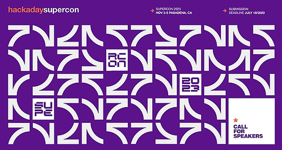](https://blog.adafruit.com/2023/05/10/hackaday-supercon-2023-is-on-supercon-hackaday/)

Hackaday has announced that the Hackaday Supercon is on for 2023, and will be taking place November 3 – 5 in Pasadena, California, USA - [Adafruit Blog](https://blog.adafruit.com/2023/05/10/hackaday-supercon-2023-is-on-supercon-hackaday/) and [Hackaday](https://hackaday.com/2023/05/10/supercon-2023-is-on-we-want-you/).

The Pyjamas Conference, the 24-hour online Python conference, will be returning for a fifth year. The Call for Papers will begin on September 2nd - [Twitter](https://twitter.com/PyjamasConf/status/1675278222798495745).

**Send Your Events In**

If you know of virtual events or upcoming events, please let us know via email to cpnews(at)adafruit(dot)com.

## Latest Releases

CircuitPython's stable release is [8.2.4](https://github.com/adafruit/circuitpython/releases/latest). New to CircuitPython? Start with our [Welcome to CircuitPython Guide](https://learn.adafruit.com/welcome-to-circuitpython).

[20230824](https://github.com/adafruit/Adafruit_CircuitPython_Bundle/releases/latest) is the latest Adafruit CircuitPython library bundle.

[20230822](https://github.com/adafruit/CircuitPython_Community_Bundle/releases/latest) is the latest CircuitPython Community library bundle.

[v#1.20.0](https://micropython.org/download) is the latest MicroPython release. Documentation for it is [here](http://docs.micropython.org/en/latest/pyboard/).

[3.11.4](https://www.python.org/downloads/) is the latest Python release. The latest pre-release version is [3.12.0rc1](https://www.python.org/download/pre-releases/).

[3,644 Stars](https://github.com/adafruit/circuitpython/stargazers) Like CircuitPython? [Star it on GitHub!](https://github.com/adafruit/circuitpython)

## Call for Help -- Translating CircuitPython is now easier than ever!

[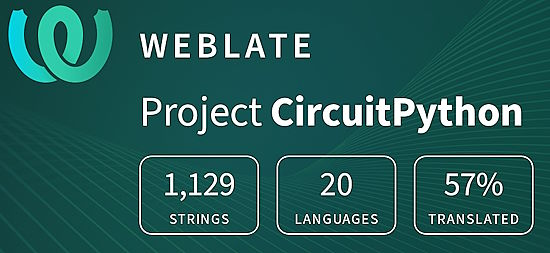](https://hosted.weblate.org/engage/circuitpython/)

One important feature of CircuitPython is translated control and error messages. With the help of fellow open source project [Weblate](https://weblate.org/), we're making it even easier to add or improve translations. 

Sign in with an existing account such as GitHub, Google or Facebook and start contributing through a simple web interface. No forks or pull requests needed! As always, if you run into trouble join us on [Discord](https://adafru.it/discord), we're here to help.

## 37,751 Thanks!

The Adafruit Discord community, where we do all our CircuitPython development in the open, reached over 37,751 humans - thank you! Adafruit believes Discord offers a unique way for Python on hardware folks to connect. Join today at [https://adafru.it/discord](https://adafru.it/discord).

## ICYMI - In case you missed it

Python on hardware is the Adafruit Python video-newsletter-podcast! The news comes from the Python community, Discord, Adafruit communities and more and is broadcast on ASK an ENGINEER Wednesdays. The complete Python on Hardware weekly videocast [playlist is here](https://www.youtube.com/playlist?list=PLjF7R1fz_OOXRMjM7Sm0J2Xt6H81TdDev). The video podcast is on [iTunes](https://itunes.apple.com/us/podcast/python-on-hardware/id1451685192?mt=2), [YouTube](http://adafru.it/pohepisodes), [Instagram Reels](https://www.instagram.com/adafruit/channel/), and [XML](https://itunes.apple.com/us/podcast/python-on-hardware/id1451685192?mt=2).

[The weekly community chat on Adafruit Discord server CircuitPython channel - Audio / Podcast edition](https://itunes.apple.com/us/podcast/circuitpython-weekly-meeting/id1451685016) - Audio from the Discord chat space for CircuitPython, meetings are usually Mondays at 2pm ET, this is the audio version on [iTunes](https://itunes.apple.com/us/podcast/circuitpython-weekly-meeting/id1451685016), Pocket Casts, [Spotify](https://adafru.it/spotify), and [XML feed](https://adafruit-podcasts.s3.amazonaws.com/circuitpython_weekly_meeting/audio-podcast.xml).

## Contribute!

The CircuitPython Weekly Newsletter is a CircuitPython community-run newsletter emailed every Tuesday. The complete [archives are here](https://www.adafruitdaily.com/category/circuitpython/). It highlights the latest CircuitPython related news from around the web including Python and MicroPython developments. To contribute, edit next week's draft [on GitHub](https://github.com/adafruit/circuitpython-weekly-newsletter/tree/gh-pages/_drafts) and [submit a pull request](https://help.github.com/articles/editing-files-in-your-repository/) with the changes. You may also tag your information on Twitter with #CircuitPython. 

Join the Adafruit [Discord](https://adafru.it/discord) or [post to the forum](https://forums.adafruit.com/viewforum.php?f=60) if you have questions.
